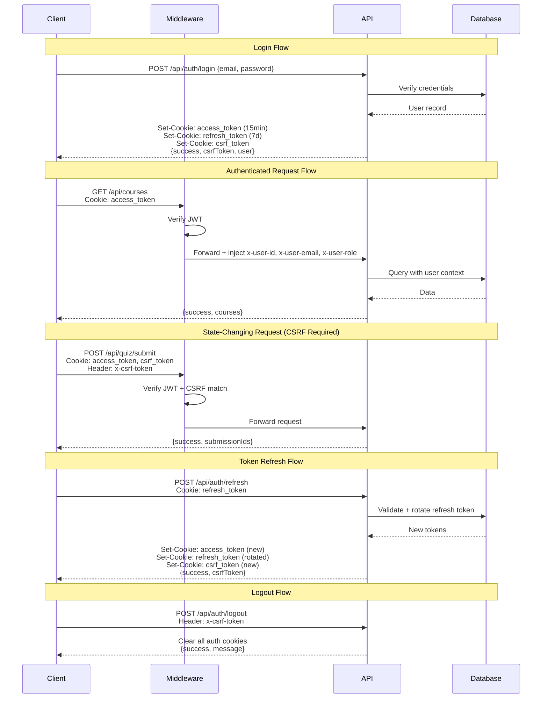

# PrincipleLearn V3 -- API Reference

Complete endpoint reference for the PrincipleLearn V3 platform.

> **Source of truth**: Each endpoint maps to a `route.ts` file under `src/app/api/`.
> All protected endpoints use `withProtection()` (JWT + CSRF validation).
> Request bodies are validated with Zod schemas via `parseBody()` -- see `src/lib/schemas.ts`.

---

## Table of Contents

- [1. Overview](#1-overview)
  - [Base URL](#base-url)
  - [Authentication Requirements](#authentication-requirements)
  - [Response Format](#response-format)
  - [Rate Limits](#rate-limits)
  - [Error Codes](#error-codes)
  - [Authentication Flow](#authentication-flow)
- [2. Authentication Endpoints](#2-authentication-endpoints)
  - [POST /api/auth/login](#post-apiauthlogin)
  - [POST /api/auth/register](#post-apiauthregister)
  - [POST /api/auth/logout](#post-apiauthlogout)
  - [POST /api/auth/refresh](#post-apiauthrefresh)
  - [GET /api/auth/me](#get-apiauthme)
- [3. Course Endpoints](#3-course-endpoints)
  - [GET /api/courses](#get-apicourses)
  - [GET /api/courses/:id](#get-apicoursesid)
  - [DELETE /api/courses/:id](#delete-apicoursesid)
  - [POST /api/generate-course](#post-apigenerate-course)
  - [POST /api/generate-subtopic](#post-apigenerate-subtopic)
- [4. AI / Generation Endpoints](#4-ai--generation-endpoints)
  - [POST /api/ask-question (Streaming)](#post-apiask-question-streaming)
  - [POST /api/challenge-thinking (Streaming)](#post-apichallenge-thinking-streaming)
  - [POST /api/challenge-feedback](#post-apichallenge-feedback)
  - [POST /api/challenge-response](#post-apichallenge-response)
  - [GET /api/challenge-response](#get-apichallenge-response)
  - [POST /api/generate-examples](#post-apigenerate-examples)
- [5. Learning Endpoints](#5-learning-endpoints)
  - [POST /api/quiz/submit](#post-apiquizsubmit)
  - [POST /api/jurnal/save](#post-apijurnalsave)
  - [POST /api/transcript/save](#post-apitranscriptsave)
  - [POST /api/feedback](#post-apifeedback)
  - [GET /api/user-progress](#get-apiuser-progress)
  - [POST /api/user-progress](#post-apiuser-progress)
  - [GET /api/learning-profile](#get-apilearning-profile)
  - [POST /api/learning-profile](#post-apilearning-profile)
  - [GET /api/prompt-journey](#get-apiprompt-journey)
- [6. Discussion Endpoints](#6-discussion-endpoints)
  - [POST /api/discussion/start](#post-apidiscussionstart)
  - [POST /api/discussion/respond](#post-apidiscussionrespond)
  - [GET /api/discussion/history](#get-apidiscussionhistory)
  - [GET /api/discussion/module-status](#get-apidiscussionmodule-status)
- [7. Admin Endpoints](#7-admin-endpoints)
  - [Admin Authentication](#admin-authentication)
  - [Dashboard and Users](#dashboard-and-users)
  - [Activity Tracking](#activity-tracking)
  - [Insights and Analytics](#insights-and-analytics)
  - [Discussion Management](#discussion-management)
  - [Research Endpoints](#research-endpoints)
  - [Monitoring](#monitoring)

---

## 1. Overview

### Base URL

| Environment  | URL                                    |
|-------------|----------------------------------------|
| Development | `http://localhost:3000/api`             |
| Production  | `https://your-domain.vercel.app/api`   |

### Authentication Requirements

PrincipleLearn uses a **cookie-based JWT authentication** system with **CSRF double-submit cookie** protection.

| Mechanism           | Description                                                                                  |
|---------------------|----------------------------------------------------------------------------------------------|
| **Access Token**    | JWT stored in `access_token` HttpOnly cookie. Lifetime: 15 minutes (user) / 2 hours (admin). |
| **Refresh Token**   | JWT stored in `refresh_token` HttpOnly cookie. Lifetime: 7 days (when `rememberMe` is set).   |
| **CSRF Token**      | Stored in `csrf_token` cookie (readable by JS). Must be sent as `x-csrf-token` header.       |
| **Middleware Headers** | After validation, middleware injects `x-user-id`, `x-user-email`, `x-user-role` into request headers. |

**Rules:**
- All **GET** endpoints require only a valid `access_token` cookie.
- All **state-changing** requests (POST, PUT, DELETE, PATCH) also require the `x-csrf-token` header matching the `csrf_token` cookie.
- All **admin** routes require `role === 'ADMIN'` in the JWT payload.

### Response Format

All endpoints return JSON with a consistent structure:

**Success response:**
```json
{
  "success": true,
  "data": { ... }
}
```

**Error response:**
```json
{
  "error": "Human-readable error message",
  "details": "Optional additional context"
}
```

**Streaming responses** (ask-question, challenge-thinking) use `Content-Type: text/event-stream` or `text/plain` with `Cache-Control: no-cache`.

### Rate Limits

Rate limiting is enforced in-memory per IP or per user ID, depending on the endpoint.

| Endpoint Category    | Limit                        | Window      | Key     |
|---------------------|------------------------------|-------------|---------|
| Login               | 5 attempts                   | 15 minutes  | IP      |
| Registration        | 3 attempts                   | 60 minutes  | IP      |
| AI / Generation     | 30 requests                  | 60 minutes  | User ID |

When a rate limit is exceeded, the API returns:
```json
HTTP 429 Too Many Requests

{
  "error": "Rate limit exceeded. Please try again later."
}
```

### Error Codes

| HTTP Status | Meaning                                                        |
|-------------|----------------------------------------------------------------|
| `200`       | Success                                                        |
| `201`       | Created successfully                                           |
| `400`       | Invalid request body or validation failure (Zod schema error)  |
| `401`       | Unauthenticated -- missing or invalid token                    |
| `403`       | Unauthorized -- CSRF mismatch, insufficient role, or forbidden |
| `404`       | Resource not found                                             |
| `405`       | Method not allowed                                             |
| `429`       | Rate limit exceeded                                            |
| `500`       | Internal server error                                          |

### Authentication Flow

The following diagram illustrates the complete authentication lifecycle, including login, token refresh, and CSRF validation:



---

## 2. Authentication Endpoints

### POST /api/auth/login

Authenticates a user and issues JWT tokens.

| Property        | Value                               |
|----------------|--------------------------------------|
| **Auth**       | Public (no token required)           |
| **Rate Limit** | 5 attempts / 15 minutes per IP       |
| **Schema**     | `LoginSchema`                        |

**Request Body:**

| Field        | Type    | Required | Description                                      |
|-------------|---------|----------|--------------------------------------------------|
| `email`     | string  | Yes      | User email address                               |
| `password`  | string  | Yes      | User password                                    |
| `rememberMe`| boolean | No       | If `true`, sets refresh token with 7-day expiry  |

**Example Request:**
```bash
curl -X POST http://localhost:3000/api/auth/login \
  -H "Content-Type: application/json" \
  -d '{
    "email": "student@example.com",
    "password": "securepassword123",
    "rememberMe": true
  }'
```

**Example Response (200):**
```json
{
  "success": true,
  "csrfToken": "a1b2c3d4-e5f6-7890-abcd-ef1234567890",
  "user": {
    "id": "uuid-here",
    "email": "student@example.com",
    "role": "USER"
  }
}
```

**Cookies Set:**

| Cookie          | HttpOnly | Secure | SameSite | Max-Age                    |
|----------------|----------|--------|----------|----------------------------|
| `access_token` | Yes      | Yes    | Strict   | 900 (15 minutes)           |
| `refresh_token`| Yes      | Yes    | Strict   | 604800 (7 days) if rememberMe |
| `csrf_token`   | No       | Yes    | Strict   | 900 (15 minutes)           |

**Error Responses:**

| Status | Condition               | Body                                         |
|--------|------------------------|----------------------------------------------|
| 400    | Validation error       | `{"error": "Invalid request", "details": ...}` |
| 401    | Invalid credentials    | `{"error": "Invalid email or password"}`      |
| 429    | Rate limited           | `{"error": "Rate limit exceeded..."}`         |

---

### POST /api/auth/register

Creates a new user account.

| Property        | Value                               |
|----------------|--------------------------------------|
| **Auth**       | Public (no token required)           |
| **Rate Limit** | 3 attempts / 60 minutes per IP       |
| **Schema**     | `RegisterSchema`                     |

**Request Body:**

| Field      | Type   | Required | Description               |
|-----------|--------|----------|---------------------------|
| `email`   | string | Yes      | Valid email address        |
| `password`| string | Yes      | Minimum 8 characters       |
| `name`    | string | Yes      | User display name          |

**Example Request:**
```bash
curl -X POST http://localhost:3000/api/auth/register \
  -H "Content-Type: application/json" \
  -d '{
    "email": "newuser@example.com",
    "password": "securepassword123",
    "name": "John Doe"
  }'
```

**Example Response (201):**
```json
{
  "success": true,
  "user": {
    "id": "uuid-here",
    "email": "newuser@example.com",
    "role": "USER"
  },
  "message": "Registration successful"
}
```

**Error Responses:**

| Status | Condition               | Body                                           |
|--------|------------------------|-------------------------------------------------|
| 400    | Validation error       | `{"error": "Invalid request", "details": ...}`  |
| 400    | Duplicate email        | `{"error": "Email already registered"}`          |
| 429    | Rate limited           | `{"error": "Rate limit exceeded..."}`            |

---

### POST /api/auth/logout

Terminates the current session by clearing all authentication cookies.

| Property        | Value                                |
|----------------|---------------------------------------|
| **Auth**       | CSRF validation required              |

**Request Headers:**

| Header          | Required | Description                       |
|----------------|----------|-----------------------------------|
| `x-csrf-token` | Yes      | Must match `csrf_token` cookie    |

**Example Request:**
```bash
curl -X POST http://localhost:3000/api/auth/logout \
  -H "x-csrf-token: a1b2c3d4-e5f6-7890-abcd-ef1234567890" \
  -b "access_token=...; csrf_token=a1b2c3d4-e5f6-7890-abcd-ef1234567890"
```

**Example Response (200):**
```json
{
  "success": true,
  "message": "Logged out successfully"
}
```

**Side Effects:** Clears `access_token`, `refresh_token`, and `csrf_token` cookies.

---

### POST /api/auth/refresh

Rotates tokens using the refresh token. The old refresh token is invalidated upon use (token rotation).

| Property        | Value                                |
|----------------|---------------------------------------|
| **Auth**       | Valid `refresh_token` cookie required |

**Example Request:**
```bash
curl -X POST http://localhost:3000/api/auth/refresh \
  -b "refresh_token=eyJhbGciOiJIUzI1NiIs..."
```

**Example Response (200):**
```json
{
  "success": true,
  "csrfToken": "new-csrf-token-value"
}
```

**Side Effects:** Sets new `access_token`, `refresh_token`, and `csrf_token` cookies. The previous refresh token is invalidated (one-time use).

**Error Responses:**

| Status | Condition                | Body                                   |
|--------|-------------------------|----------------------------------------|
| 401    | Missing/invalid refresh  | `{"error": "Invalid refresh token"}`   |
| 401    | Token already used       | `{"error": "Refresh token reused"}`    |

---

### GET /api/auth/me

Returns the profile of the currently authenticated user.

| Property        | Value                                |
|----------------|---------------------------------------|
| **Auth**       | Valid `access_token` cookie required  |

**Example Request:**
```bash
curl http://localhost:3000/api/auth/me \
  -b "access_token=eyJhbGciOiJIUzI1NiIs..."
```

**Example Response (200):**
```json
{
  "user": {
    "id": "uuid-here",
    "email": "student@example.com",
    "role": "USER",
    "name": "John Doe"
  }
}
```

---

## 3. Course Endpoints

### GET /api/courses

Retrieves all courses accessible to the authenticated user.

| Property        | Value                                               |
|----------------|------------------------------------------------------|
| **Auth**       | Cookie, header, or query parameter authentication    |

**Example Request:**
```bash
curl http://localhost:3000/api/courses \
  -b "access_token=..."
```

**Example Response (200):**
```json
{
  "success": true,
  "courses": [
    {
      "id": "course-uuid",
      "topic": "Introduction to Machine Learning",
      "goal": "Understand fundamental ML concepts",
      "level": "beginner",
      "created_at": "2026-01-15T10:30:00Z",
      "user_id": "user-uuid"
    }
  ]
}
```

---

### GET /api/courses/:id

Retrieves a single course with its subtopics. Enforces access control via `canAccessCourse()`.

| Property        | Value                                |
|----------------|---------------------------------------|
| **Auth**       | Valid token required                  |
| **Permission** | `canAccessCourse()` check            |

**Path Parameters:**

| Parameter | Type   | Description          |
|-----------|--------|----------------------|
| `id`      | string | Course UUID          |

**Example Request:**
```bash
curl http://localhost:3000/api/courses/abc-123-def \
  -b "access_token=..."
```

**Example Response (200):**
```json
{
  "success": true,
  "course": {
    "id": "abc-123-def",
    "topic": "Introduction to Machine Learning",
    "goal": "Understand fundamental ML concepts",
    "level": "beginner",
    "outline": [...],
    "subtopics": [
      {
        "id": "subtopic-uuid",
        "title": "What is Machine Learning?",
        "module_index": 0,
        "subtopic_index": 0,
        "content": { ... }
      }
    ]
  }
}
```

**Error Responses:**

| Status | Condition           | Body                                     |
|--------|--------------------|--------------------------------------------|
| 403    | No access          | `{"error": "Access denied"}`               |
| 404    | Course not found   | `{"error": "Course not found"}`            |

---

### DELETE /api/courses/:id

Deletes a course and its associated data. Only the course owner or an admin can delete.

| Property        | Value                                |
|----------------|---------------------------------------|
| **Auth**       | Token + CSRF required                |
| **Permission** | Owner or admin                       |

**Path Parameters:**

| Parameter | Type   | Description          |
|-----------|--------|----------------------|
| `id`      | string | Course UUID          |

**Example Request:**
```bash
curl -X DELETE http://localhost:3000/api/courses/abc-123-def \
  -H "x-csrf-token: csrf-token-value" \
  -b "access_token=...; csrf_token=..."
```

**Example Response (200):**
```json
{
  "success": true,
  "message": "Course deleted successfully"
}
```

---

### POST /api/generate-course

Generates a new course outline using OpenAI. This is the entry point for the multi-step course creation flow.

| Property        | Value                                                 |
|----------------|--------------------------------------------------------|
| **Auth**       | `x-user-id` header (injected by middleware)            |
| **Rate Limit** | 30 requests / 60 minutes per user                      |
| **Schema**     | `GenerateCourseSchema`                                 |
| **CORS**       | Restricted origins                                     |
| **Retry**      | Up to 3 attempts with 90-second timeout                |
| **Logging**    | Logged via `withApiLogging()` to `api_logs` table      |

**Request Body:**

| Field          | Type     | Required | Description                                      |
|---------------|----------|----------|--------------------------------------------------|
| `topic`       | string   | Yes      | Main topic for the course                        |
| `goal`        | string   | Yes      | Learning objective                               |
| `level`       | string   | Yes      | Difficulty level (e.g., "beginner", "intermediate", "advanced") |
| `extraTopics` | string[] | No       | Additional topics to include                     |
| `problem`     | string   | No       | Specific problem the learner wants to solve      |
| `assumption`  | string   | No       | Prior knowledge assumptions                      |

**Example Request:**
```bash
curl -X POST http://localhost:3000/api/generate-course \
  -H "Content-Type: application/json" \
  -H "x-csrf-token: csrf-token-value" \
  -b "access_token=...; csrf_token=..." \
  -d '{
    "topic": "Introduction to Machine Learning",
    "goal": "Build a foundation in ML concepts and algorithms",
    "level": "beginner",
    "extraTopics": ["neural networks", "data preprocessing"],
    "problem": "I want to understand how recommendation systems work",
    "assumption": "Basic Python and statistics knowledge"
  }'
```

**Example Response (200):**
```json
{
  "outline": [
    {
      "module": "Module 1: Foundations of Machine Learning",
      "subtopics": [
        "What is Machine Learning?",
        "Types of Machine Learning",
        "The ML Pipeline"
      ]
    },
    {
      "module": "Module 2: Supervised Learning",
      "subtopics": [
        "Linear Regression",
        "Classification Algorithms",
        "Model Evaluation"
      ]
    }
  ],
  "courseId": "generated-course-uuid"
}
```

---

### POST /api/generate-subtopic

Generates detailed content for a specific subtopic, including learning objectives, pages, key takeaways, and quiz questions. Results are cached in the `subtopic_cache` table. Also triggers background generation of discussion templates.

| Property        | Value                                            |
|----------------|---------------------------------------------------|
| **Auth**       | `x-user-id` header (injected by middleware)       |
| **Rate Limit** | 30 requests / 60 minutes per user                 |
| **Schema**     | `GenerateSubtopicSchema`                          |
| **Caching**    | Cached in `subtopic_cache` database table         |

**Request Body:**

| Field       | Type   | Required | Description                               |
|------------|--------|----------|-------------------------------------------|
| `module`   | string | Yes      | Parent module title                       |
| `subtopic` | string | Yes      | Subtopic title to generate content for    |
| `courseId`  | string | Yes      | Parent course UUID                        |

**Example Request:**
```bash
curl -X POST http://localhost:3000/api/generate-subtopic \
  -H "Content-Type: application/json" \
  -H "x-csrf-token: csrf-token-value" \
  -b "access_token=...; csrf_token=..." \
  -d '{
    "module": "Module 1: Foundations of Machine Learning",
    "subtopic": "What is Machine Learning?",
    "courseId": "course-uuid"
  }'
```

**Example Response (200):**
```json
{
  "objectives": [
    "Define machine learning and its core principles",
    "Distinguish between ML and traditional programming",
    "Identify real-world ML applications"
  ],
  "pages": [
    {
      "title": "Understanding Machine Learning",
      "content": "Machine learning is a subset of artificial intelligence..."
    }
  ],
  "keyTakeaways": [
    "ML enables computers to learn from data without explicit programming",
    "Three main types: supervised, unsupervised, and reinforcement learning"
  ],
  "quiz": [
    {
      "question": "What distinguishes ML from traditional programming?",
      "options": ["A) Speed", "B) Learning from data", "C) Cost", "D) Language"],
      "correctAnswer": 1
    }
  ],
  "whatNext": "In the next section, we will explore the different types of ML..."
}
```

---

## 4. AI / Generation Endpoints

### POST /api/ask-question (Streaming)

Submits a question about the current learning content and receives a streamed AI response. The question and response are saved to `ask_question_history` for research tracking. Includes IDOR (Insecure Direct Object Reference) prevention.

| Property        | Value                                           |
|----------------|--------------------------------------------------|
| **Auth**       | JWT cookie required                              |
| **Rate Limit** | 30 requests / 60 minutes per user                |
| **Schema**     | `AskQuestionSchema`                              |
| **Response**   | `text/event-stream` (streaming)                  |

**Request Body:**

| Field              | Type   | Required | Description                                   |
|-------------------|--------|----------|-----------------------------------------------|
| `question`        | string | Yes      | The user's question                           |
| `context`         | string | Yes      | Current page/subtopic context                 |
| `userId`          | string | Yes      | User UUID (validated against JWT)             |
| `courseId`        | string | Yes      | Current course UUID                           |
| `subtopic`        | string | Yes      | Current subtopic title                        |
| `moduleIndex`    | number | Yes      | Index of the current module                   |
| `subtopicIndex`  | number | Yes      | Index of the current subtopic                 |
| `pageNumber`     | number | Yes      | Current page number                           |
| `promptComponents`| object | No       | Structured prompt components for research     |
| `reasoningNote`  | string | No       | User's reasoning/reflection note              |
| `promptVersion`  | string | No       | Version identifier for prompt tracking        |
| `sessionNumber`  | number | No       | Learning session number                       |

**Example Request:**
```bash
curl -X POST http://localhost:3000/api/ask-question \
  -H "Content-Type: application/json" \
  -H "x-csrf-token: csrf-token-value" \
  -b "access_token=...; csrf_token=..." \
  -d '{
    "question": "Can you explain gradient descent in simpler terms?",
    "context": "This page covers optimization algorithms used in ML training...",
    "userId": "user-uuid",
    "courseId": "course-uuid",
    "subtopic": "Optimization in ML",
    "moduleIndex": 2,
    "subtopicIndex": 1,
    "pageNumber": 3
  }'
```

**Response:** Streamed text via `text/event-stream`. The client receives chunks of the AI response in real time.

```
data: Gradient descent is like walking downhill in fog...
data: You can't see the bottom, but you can feel which
data: direction goes down, so you take small steps...
data: [DONE]
```

---

### POST /api/challenge-thinking (Streaming)

Generates a critical thinking challenge based on the current learning context. The challenge difficulty adapts based on the specified level.

| Property        | Value                                           |
|----------------|--------------------------------------------------|
| **Auth**       | `withProtection()` (JWT + CSRF)                  |
| **Rate Limit** | 30 requests / 60 minutes per user                |
| **Schema**     | `ChallengeThinkingSchema`                        |
| **Response**   | `text/event-stream` (streaming)                  |

**Request Body:**

| Field     | Type   | Required | Description                                         |
|----------|--------|----------|-----------------------------------------------------|
| `context`| string | Yes      | Current learning context                            |
| `level`  | string | Yes      | Challenge difficulty (adapts prompt complexity)      |

**Example Request:**
```bash
curl -X POST http://localhost:3000/api/challenge-thinking \
  -H "Content-Type: application/json" \
  -H "x-csrf-token: csrf-token-value" \
  -b "access_token=...; csrf_token=..." \
  -d '{
    "context": "The student just learned about supervised vs unsupervised learning...",
    "level": "intermediate"
  }'
```

**Response:** Streamed critical thinking challenge question.

---

### POST /api/challenge-feedback

Evaluates the user's answer to a challenge question and returns structured feedback in Markdown format.

| Property        | Value                                           |
|----------------|--------------------------------------------------|
| **Auth**       | `withProtection()` (JWT + CSRF)                  |
| **Rate Limit** | 30 requests / 60 minutes per user                |
| **Schema**     | `ChallengeFeedbackSchema`                        |

**Request Body:**

| Field     | Type   | Required | Description                                |
|----------|--------|----------|--------------------------------------------|
| `question`| string | Yes      | The challenge question that was asked      |
| `answer` | string | Yes      | The user's answer to evaluate              |
| `context`| string | Yes      | Learning context for evaluation            |
| `level`  | string | Yes      | Challenge difficulty level                 |

**Example Request:**
```bash
curl -X POST http://localhost:3000/api/challenge-feedback \
  -H "Content-Type: application/json" \
  -H "x-csrf-token: csrf-token-value" \
  -b "access_token=...; csrf_token=..." \
  -d '{
    "question": "How would you design a system to classify emails as spam?",
    "answer": "I would use supervised learning with labeled email data...",
    "context": "Classification algorithms in supervised learning",
    "level": "intermediate"
  }'
```

**Example Response (200):**
```json
{
  "feedback": "## Evaluation\n\n**Strengths:**\n- Correctly identified supervised learning as the approach...\n\n**Areas for Improvement:**\n- Consider discussing feature engineering...\n\n**Score: 7/10**"
}
```

---

### POST /api/challenge-response

Saves a user's challenge response (question, answer, and feedback) to the database for tracking.

| Property        | Value                                           |
|----------------|--------------------------------------------------|
| **Auth**       | JWT cookie required                              |
| **Schema**     | Custom (not a named Zod schema)                  |

**Request Body:**

| Field            | Type   | Required | Description                          |
|-----------------|--------|----------|--------------------------------------|
| `userId`        | string | Yes      | User UUID                            |
| `courseId`       | string | Yes      | Course UUID                          |
| `moduleIndex`   | number | Yes      | Module index                         |
| `subtopicIndex` | number | Yes      | Subtopic index                       |
| `pageNumber`    | number | Yes      | Page number                          |
| `question`      | string | Yes      | The challenge question               |
| `answer`        | string | Yes      | User's answer                        |
| `feedback`      | string | Yes      | AI-generated feedback                |
| `reasoningNote` | string | No       | User's reasoning note                |

**Example Response (200):**
```json
{
  "success": true,
  "challengeId": "challenge-response-uuid"
}
```

---

### GET /api/challenge-response

Retrieves saved challenge responses for a specific user and location in the course.

| Property        | Value                                           |
|----------------|--------------------------------------------------|
| **Auth**       | Token required                                   |

**Query Parameters:**

| Parameter        | Type   | Required | Description               |
|-----------------|--------|----------|---------------------------|
| `userId`        | string | Yes      | User UUID                 |
| `courseId`       | string | Yes      | Course UUID               |
| `moduleIndex`   | number | Yes      | Module index              |
| `subtopicIndex` | number | Yes      | Subtopic index            |
| `pageNumber`    | number | Yes      | Page number               |

**Example Request:**
```bash
curl "http://localhost:3000/api/challenge-response?userId=...&courseId=...&moduleIndex=0&subtopicIndex=1&pageNumber=2" \
  -b "access_token=..."
```

**Example Response (200):**
```json
{
  "success": true,
  "responses": [
    {
      "id": "response-uuid",
      "question": "How would you design...",
      "answer": "I would use...",
      "feedback": "## Evaluation...",
      "created_at": "2026-03-10T14:30:00Z"
    }
  ]
}
```

---

### POST /api/generate-examples

Generates contextual examples for the current learning material.

| Property        | Value                                           |
|----------------|--------------------------------------------------|
| **Auth**       | `withProtection()` (JWT + CSRF)                  |
| **Rate Limit** | 30 requests / 60 minutes per user                |
| **Schema**     | `GenerateExamplesSchema`                         |

**Request Body:**

| Field     | Type   | Required | Description                                |
|----------|--------|----------|--------------------------------------------|
| `context`| string | Yes      | Learning context to generate examples for  |

**Example Request:**
```bash
curl -X POST http://localhost:3000/api/generate-examples \
  -H "Content-Type: application/json" \
  -H "x-csrf-token: csrf-token-value" \
  -b "access_token=...; csrf_token=..." \
  -d '{
    "context": "Binary search algorithm: how it works and when to use it"
  }'
```

**Example Response (200):**
```json
{
  "examples": [
    {
      "title": "Finding a Word in a Dictionary",
      "description": "Imagine looking up 'Python' in a physical dictionary...",
      "code": "def binary_search(arr, target):\n    low, high = 0, len(arr) - 1\n    ..."
    }
  ]
}
```

---

## 5. Learning Endpoints

### POST /api/quiz/submit

Submits quiz answers for a subtopic. Uses 4 matching strategies to find or create the quiz record: exact match, fuzzy match, title match, or insert.

| Property        | Value                                           |
|----------------|--------------------------------------------------|
| **Auth**       | `x-user-id` header (injected by middleware)      |
| **Schema**     | `QuizSubmitSchema`                               |

**Request Body:**

| Field            | Type     | Required | Description                              |
|-----------------|----------|----------|------------------------------------------|
| `courseId`       | string   | Yes      | Course UUID                              |
| `subtopicTitle` | string   | Yes      | Subtopic title for matching              |
| `answers`       | object[] | Yes      | Array of answer objects                  |
| `moduleTitle`   | string   | Yes      | Parent module title                      |
| `moduleIndex`   | number   | Yes      | Module index                             |
| `subtopicIndex` | number   | Yes      | Subtopic index                           |
| `score`         | number   | Yes      | Calculated score                         |

**Example Request:**
```bash
curl -X POST http://localhost:3000/api/quiz/submit \
  -H "Content-Type: application/json" \
  -H "x-csrf-token: csrf-token-value" \
  -b "access_token=...; csrf_token=..." \
  -d '{
    "courseId": "course-uuid",
    "subtopicTitle": "What is Machine Learning?",
    "answers": [
      {"questionIndex": 0, "selectedAnswer": 1, "isCorrect": true},
      {"questionIndex": 1, "selectedAnswer": 2, "isCorrect": false}
    ],
    "moduleTitle": "Module 1: Foundations",
    "moduleIndex": 0,
    "subtopicIndex": 0,
    "score": 50
  }'
```

**Example Response (200):**
```json
{
  "success": true,
  "submissionIds": ["submission-uuid-1"],
  "matchingResults": [
    {
      "strategy": "exact",
      "quizId": "quiz-uuid"
    }
  ],
  "message": "Quiz submitted successfully"
}
```

---

### POST /api/jurnal/save

Saves a learning journal entry. Supports structured reflection with optional fields for understanding, confusion, strategy, and content feedback.

| Property        | Value                                           |
|----------------|--------------------------------------------------|
| **Auth**       | `x-user-id` header (injected by middleware)      |
| **Schema**     | `JurnalSchema`                                   |

**Request Body:**

| Field              | Type   | Required | Description                                |
|-------------------|--------|----------|--------------------------------------------|
| `userId`          | string | Yes      | User UUID                                  |
| `courseId`         | string | Yes      | Course UUID                                |
| `content`         | string | Yes      | Journal entry content                      |
| `type`            | string | Yes      | Entry type (e.g., "reflection")            |
| `subtopic`        | string | Yes      | Current subtopic title                     |
| `moduleIndex`    | number | Yes      | Module index                               |
| `subtopicIndex`  | number | Yes      | Subtopic index                             |
| `understood`      | string | No       | What the user understood                   |
| `confused`        | string | No       | What the user found confusing              |
| `strategy`        | string | No       | User's learning strategy                   |
| `promptEvolution` | string | No       | How user's prompting has evolved           |
| `contentRating`   | number | No       | Rating of the content                      |
| `contentFeedback` | string | No       | Feedback about the content                 |

**Example Request:**
```bash
curl -X POST http://localhost:3000/api/jurnal/save \
  -H "Content-Type: application/json" \
  -H "x-csrf-token: csrf-token-value" \
  -b "access_token=...; csrf_token=..." \
  -d '{
    "userId": "user-uuid",
    "courseId": "course-uuid",
    "content": "Today I learned about gradient descent...",
    "type": "reflection",
    "subtopic": "Optimization in ML",
    "moduleIndex": 2,
    "subtopicIndex": 1,
    "understood": "How the learning rate affects convergence",
    "confused": "The difference between batch and stochastic GD"
  }'
```

**Example Response (200):**
```json
{
  "success": true,
  "id": "journal-entry-uuid"
}
```

---

### POST /api/transcript/save

Saves a Q&A transcript (question and answer pair) from the learning session.

| Property        | Value                                           |
|----------------|--------------------------------------------------|
| **Auth**       | `x-user-id` header (injected by middleware)      |

**Request Body:**

| Field      | Type   | Required | Description                  |
|-----------|--------|----------|------------------------------|
| `userId`  | string | Yes      | User UUID                    |
| `courseId` | string | Yes      | Course UUID                  |
| `subtopic`| string | Yes      | Current subtopic title       |
| `question`| string | Yes      | The question asked           |
| `answer`  | string | Yes      | The AI's response            |

**Example Response (200):**
```json
{
  "success": true,
  "id": "transcript-uuid"
}
```

---

### POST /api/feedback

Submits user feedback (rating and comment) for a subtopic.

| Property        | Value                                           |
|----------------|--------------------------------------------------|
| **Auth**       | `x-user-id` header (injected by middleware)      |
| **Schema**     | `FeedbackSchema`                                 |

**Request Body:**

| Field            | Type   | Required | Description                         |
|-----------------|--------|----------|-------------------------------------|
| `courseId`       | string | Yes      | Course UUID                         |
| `subtopicId`    | string | Yes      | Subtopic UUID                       |
| `feedback`      | string | Yes      | Feedback text / comment             |
| `comment`       | string | No       | Additional comment                  |
| `rating`        | number | Yes      | Rating from 1 to 5                  |
| `moduleIndex`   | number | Yes      | Module index                        |
| `subtopicIndex` | number | Yes      | Subtopic index                      |
| `subtopic`      | string | Yes      | Subtopic title                      |

**Example Response (200):**
```json
{
  "success": true
}
```

---

### GET /api/user-progress

Retrieves the user's progress for a specific course.

| Property        | Value                                           |
|----------------|--------------------------------------------------|
| **Auth**       | Token required                                   |

**Query Parameters:**

| Parameter  | Type   | Required | Description    |
|-----------|--------|----------|----------------|
| `courseId` | string | Yes      | Course UUID    |

**Example Request:**
```bash
curl "http://localhost:3000/api/user-progress?courseId=course-uuid" \
  -b "access_token=..."
```

**Example Response (200):**
```json
{
  "success": true,
  "progress": [
    {
      "subtopic_id": "subtopic-uuid",
      "is_completed": true,
      "completed_at": "2026-03-10T14:30:00Z"
    }
  ],
  "statistics": {
    "total": 12,
    "completed": 5,
    "percentage": 41.67
  }
}
```

---

### POST /api/user-progress

Marks a subtopic as completed or not completed.

| Property        | Value                                           |
|----------------|--------------------------------------------------|
| **Auth**       | Token + CSRF required                            |

**Request Body:**

| Field          | Type    | Required | Description                    |
|---------------|---------|----------|--------------------------------|
| `courseId`     | string  | Yes      | Course UUID                    |
| `subtopicId`  | string  | Yes      | Subtopic UUID                  |
| `isCompleted` | boolean | Yes      | Whether the subtopic is done   |

**Example Response (200):**
```json
{
  "success": true
}
```

---

### GET /api/learning-profile

Retrieves the user's learning profile if it exists.

| Property        | Value                                           |
|----------------|--------------------------------------------------|
| **Auth**       | Token required                                   |

**Example Response (200):**
```json
{
  "exists": true,
  "profile": {
    "user_id": "user-uuid",
    "display_name": "John Doe",
    "programming_experience": "intermediate",
    "learning_style": "visual",
    "learning_goals": "Master ML fundamentals",
    "challenges": "Math-heavy concepts"
  }
}
```

---

### POST /api/learning-profile

Creates or updates the user's learning profile.

| Property        | Value                                           |
|----------------|--------------------------------------------------|
| **Auth**       | Token + CSRF required                            |

**Request Body:**

| Field                    | Type   | Required | Description                                 |
|-------------------------|--------|----------|---------------------------------------------|
| `userId`                | string | Yes      | User UUID                                   |
| `displayName`           | string | No       | Preferred display name                      |
| `programmingExperience` | string | No       | Experience level (e.g., "beginner")         |
| `learningStyle`         | string | No       | Preferred learning style                    |
| `learningGoals`         | string | No       | Learning objectives                         |
| `challenges`            | string | No       | Known challenges or difficulties            |

**Example Response (200):**
```json
{
  "success": true
}
```

---

### GET /api/prompt-journey

Retrieves the user's prompt evolution journey for a specific course, tracking how their question quality has changed over time.

| Property        | Value                                           |
|----------------|--------------------------------------------------|
| **Auth**       | Token required                                   |

**Query Parameters:**

| Parameter  | Type   | Required | Description    |
|-----------|--------|----------|----------------|
| `userId`  | string | Yes      | User UUID      |
| `courseId` | string | Yes      | Course UUID    |

**Example Response (200):**
```json
{
  "success": true,
  "entries": [
    {
      "question": "What is ML?",
      "prompt_version": "v1",
      "session_number": 1,
      "created_at": "2026-03-01T10:00:00Z"
    },
    {
      "question": "How does the learning rate affect convergence in gradient descent specifically for non-convex loss surfaces?",
      "prompt_version": "v3",
      "session_number": 5,
      "created_at": "2026-03-15T14:00:00Z"
    }
  ],
  "count": 2
}
```

---

## 6. Discussion Endpoints

The discussion system provides structured, AI-guided discussions for each subtopic. Sessions follow a multi-step template with goal tracking and automatic completion.

### POST /api/discussion/start

Starts a new discussion session for a subtopic, or resumes an existing one.

| Property        | Value                                           |
|----------------|--------------------------------------------------|
| **Auth**       | JWT cookie required                              |

**Request Body:**

| Field            | Type   | Required | Description                        |
|-----------------|--------|----------|------------------------------------|
| `courseId`       | string | Yes      | Course UUID                        |
| `subtopicId`    | string | Yes*     | Subtopic UUID (one of these required) |
| `subtopicTitle` | string | Yes*     | Subtopic title (one of these required) |
| `moduleTitle`   | string | Yes      | Parent module title                |

**Example Request:**
```bash
curl -X POST http://localhost:3000/api/discussion/start \
  -H "Content-Type: application/json" \
  -H "x-csrf-token: csrf-token-value" \
  -b "access_token=...; csrf_token=..." \
  -d '{
    "courseId": "course-uuid",
    "subtopicTitle": "What is Machine Learning?",
    "moduleTitle": "Module 1: Foundations"
  }'
```

**Example Response (200):**
```json
{
  "session": {
    "id": "session-uuid",
    "status": "active",
    "current_step": 1,
    "total_steps": 5,
    "goals_completed": 0
  },
  "messages": [
    {
      "role": "assistant",
      "content": "Welcome! Let's discuss what machine learning is...",
      "step": 1
    }
  ],
  "currentStep": 1
}
```

---

### POST /api/discussion/respond

Submits a user's message in an active discussion session. The AI evaluates the response, tracks goal completion, and may auto-complete the session.

| Property        | Value                                           |
|----------------|--------------------------------------------------|
| **Auth**       | JWT cookie required                              |

**Request Body:**

| Field       | Type   | Required | Description               |
|------------|--------|----------|---------------------------|
| `sessionId`| string | Yes      | Discussion session UUID   |
| `message`  | string | Yes      | User's response message   |

**Example Request:**
```bash
curl -X POST http://localhost:3000/api/discussion/respond \
  -H "Content-Type: application/json" \
  -H "x-csrf-token: csrf-token-value" \
  -b "access_token=...; csrf_token=..." \
  -d '{
    "sessionId": "session-uuid",
    "message": "I think machine learning is when computers learn patterns from data..."
  }'
```

**Example Response (200):**
```json
{
  "session": {
    "id": "session-uuid",
    "status": "active",
    "current_step": 2,
    "goals_completed": 1
  },
  "messages": [
    {
      "role": "assistant",
      "content": "Great observation! You're right that pattern recognition is central...",
      "step": 2
    }
  ],
  "nextStep": 2
}
```

---

### GET /api/discussion/history

Retrieves the full history of a discussion session.

| Property        | Value                                           |
|----------------|--------------------------------------------------|
| **Auth**       | Token required                                   |

**Query Parameters (one of these approaches):**

| Parameter          | Type   | Description                    |
|-------------------|--------|--------------------------------|
| `sessionId`       | string | Direct session lookup          |
| `courseId`         | string | Combined with subtopicContext  |
| `subtopicContext`  | string | Combined with courseId         |

**Example Response (200):**
```json
{
  "session": {
    "id": "session-uuid",
    "status": "completed",
    "current_step": 5,
    "total_steps": 5
  },
  "messages": [
    {"role": "assistant", "content": "...", "step": 1},
    {"role": "user", "content": "...", "step": 1},
    {"role": "assistant", "content": "...", "step": 2}
  ],
  "currentStep": 5,
  "templateVersion": "v2"
}
```

---

### GET /api/discussion/module-status

Checks the discussion readiness and completion status for all subtopics in a module.

| Property        | Value                                           |
|----------------|--------------------------------------------------|
| **Auth**       | Token required                                   |

**Query Parameters:**

| Parameter  | Type   | Required | Description    |
|-----------|--------|----------|----------------|
| `courseId` | string | Yes      | Course UUID    |
| `moduleId` | string | Yes      | Module identifier |

**Example Response (200):**
```json
{
  "ready": true,
  "summary": {
    "total": 3,
    "completed": 1,
    "in_progress": 1,
    "not_started": 1
  },
  "subtopics": [
    {
      "title": "What is Machine Learning?",
      "status": "completed",
      "hasTemplate": true
    },
    {
      "title": "Types of Machine Learning",
      "status": "in_progress",
      "hasTemplate": true
    },
    {
      "title": "The ML Pipeline",
      "status": "not_started",
      "hasTemplate": true
    }
  ]
}
```

---

## 7. Admin Endpoints

All admin endpoints require `role === 'ADMIN'` in the JWT payload. Admin routes are protected by middleware that checks the role claim before forwarding the request.

### Admin Authentication

#### POST /api/admin/login

Authenticates an admin user. Uses a separate login flow from regular users with a longer token lifetime.

| Property        | Value                                |
|----------------|---------------------------------------|
| **Auth**       | Public                               |
| **Schema**     | `AdminLoginSchema`                   |

**Request Body:**

| Field      | Type   | Required | Description          |
|-----------|--------|----------|----------------------|
| `email`   | string | Yes      | Admin email address  |
| `password`| string | Yes      | Admin password       |

**Example Response (200):**
```json
{
  "user": {
    "id": "admin-uuid",
    "email": "admin@example.com",
    "name": "Admin User",
    "role": "ADMIN"
  }
}
```

**Cookies Set:** `access_token` with 2-hour expiry.

---

#### POST /api/admin/logout

Logs out the admin user.

| Property        | Value                                |
|----------------|---------------------------------------|
| **Auth**       | Admin token                          |

**Example Response (200):**
```json
{
  "ok": true
}
```

**Side Effects:** Clears `access_token` cookie.

---

#### POST /api/admin/register

Creates a new admin account. Only existing admins can register new admins.

| Property        | Value                                |
|----------------|---------------------------------------|
| **Auth**       | Admin role required                  |
| **Schema**     | `AdminRegisterSchema`                |

**Request Body:**

| Field      | Type   | Required | Description          |
|-----------|--------|----------|----------------------|
| `email`   | string | Yes      | New admin email      |
| `password`| string | Yes      | New admin password   |

**Example Response (201):**
```json
{
  "message": "Admin registered successfully",
  "data": {
    "id": "new-admin-uuid",
    "email": "newadmin@example.com",
    "role": "ADMIN",
    "created_at": "2026-04-01T10:00:00Z"
  }
}
```

---

#### GET /api/admin/me

Returns the current admin's profile.

| Property        | Value                                |
|----------------|---------------------------------------|
| **Auth**       | Admin role required                  |

**Example Response (200):**
```json
{
  "user": {
    "id": "admin-uuid",
    "email": "admin@example.com",
    "name": "Admin User",
    "role": "ADMIN"
  }
}
```

---

### Dashboard and Users

#### GET /api/admin/dashboard

Returns a comprehensive dashboard with KPIs, research metrics, student summaries, and recent activity. Executes 12 parallel database queries and caches results for 30 seconds.

| Property        | Value                                |
|----------------|---------------------------------------|
| **Auth**       | Admin role required                  |
| **Cache**      | 30-second in-memory cache            |

**Query Parameters:**

| Parameter | Type   | Required | Default | Description                          |
|----------|--------|----------|---------|--------------------------------------|
| `range`  | string | No       | `all`   | Time range: `all`, `7d`, `30d`, `90d` |

**Example Request:**
```bash
curl "http://localhost:3000/api/admin/dashboard?range=30d" \
  -b "access_token=..."
```

**Example Response (200):**
```json
{
  "kpi": {
    "totalUsers": 45,
    "totalCourses": 120,
    "totalQuizSubmissions": 890,
    "totalJournalEntries": 340,
    "averageQuizScore": 78.5,
    "activeUsersToday": 12
  },
  "rm2": {
    "promptEvolutionData": [...],
    "questionQualityTrend": [...]
  },
  "rm3": {
    "discussionEngagement": [...],
    "challengeCompletionRate": 0.65
  },
  "studentSummary": [
    {
      "id": "user-uuid",
      "name": "John Doe",
      "email": "john@example.com",
      "coursesCreated": 3,
      "quizzesTaken": 15,
      "lastActive": "2026-04-07T18:00:00Z"
    }
  ],
  "recentActivity": [...],
  "meta": {
    "range": "30d",
    "cachedAt": "2026-04-08T10:00:00Z",
    "queryTimeMs": 245
  }
}
```

---

#### GET /api/admin/users

Returns a list of all students with engagement scores and prompt evolution stages.

| Property        | Value                                |
|----------------|---------------------------------------|
| **Auth**       | Admin role required                  |

**Example Response (200):**
```json
[
  {
    "id": "user-uuid",
    "email": "student@example.com",
    "name": "John Doe",
    "created_at": "2026-01-10T08:00:00Z",
    "engagement_score": 85,
    "prompt_stage": "advanced",
    "courses_count": 3,
    "last_active": "2026-04-07T18:00:00Z"
  }
]
```

---

#### DELETE /api/admin/users/:id

Deletes a user and cascades the deletion across 17 related tables.

| Property        | Value                                |
|----------------|---------------------------------------|
| **Auth**       | Admin role required                  |

**Path Parameters:**

| Parameter | Type   | Description    |
|-----------|--------|----------------|
| `id`      | string | User UUID      |

**Example Response (200):**
```json
{
  "success": true,
  "message": "User and all associated data deleted successfully",
  "warnings": ["Some transcript records could not be deleted"]
}
```

> **Note:** The `warnings` field is optional and only present if some cascade operations encountered non-critical errors.

---

#### GET /api/admin/users/:id/detail

Returns detailed information about a specific user.

| Property        | Value                                |
|----------------|---------------------------------------|
| **Auth**       | Admin role required                  |

---

#### GET /api/admin/users/:id/activity-summary

Returns an activity summary for a specific user.

| Property        | Value                                |
|----------------|---------------------------------------|
| **Auth**       | Admin role required                  |

---

#### GET /api/admin/users/:id/subtopics

Returns all subtopics accessed by a specific user.

| Property        | Value                                |
|----------------|---------------------------------------|
| **Auth**       | Admin role required                  |

---

#### GET /api/admin/users/export

Exports user data in CSV or JSON format.

| Property        | Value                                |
|----------------|---------------------------------------|
| **Auth**       | Admin role required                  |

**Query Parameters:**

| Parameter | Type   | Required | Default | Description               |
|----------|--------|----------|---------|---------------------------|
| `format` | string | No       | `json`  | Export format: `csv`, `json` |

---

### Activity Tracking

All activity endpoints require admin role authentication. These endpoints provide read access to student learning activities.

| Endpoint                                    | Method | Description                                    |
|---------------------------------------------|--------|------------------------------------------------|
| `/api/admin/activity/courses`               | GET    | View all generated courses                     |
| `/api/admin/activity/topics`                | GET    | View course topics                             |
| `/api/admin/activity/feedback`              | GET    | View student feedback submissions              |
| `/api/admin/activity/actions`               | GET    | View user actions/events                       |
| `/api/admin/activity/analytics`             | GET    | View activity analytics                        |
| `/api/admin/activity/ask-question`          | GET    | View ask-question history                      |
| `/api/admin/activity/challenge`             | GET    | View challenge responses                       |
| `/api/admin/activity/discussion`            | GET    | View discussion sessions                       |
| `/api/admin/activity/export`                | GET    | Export activity data                           |
| `/api/admin/activity/generate-course`       | GET    | View course generation logs                    |
| `/api/admin/activity/jurnal`                | GET    | View all journal entries                       |
| `/api/admin/activity/jurnal/:id`            | GET    | View a specific journal entry                  |
| `/api/admin/activity/learning-profile`      | GET    | View learning profiles                         |
| `/api/admin/activity/quiz`                  | GET    | View all quiz submissions                      |
| `/api/admin/activity/quiz/:id`              | GET    | View a specific quiz submission                |
| `/api/admin/activity/search`                | GET    | Search across activity types                   |
| `/api/admin/activity/transcript`            | GET    | View all transcripts                           |
| `/api/admin/activity/transcript/:id`        | GET    | View a specific transcript                     |

---

### Insights and Analytics

#### GET /api/admin/insights

Returns analytical insights including prompt evolution charts, student summaries, and learning patterns. Results are cached for 60 seconds.

| Property        | Value                                |
|----------------|---------------------------------------|
| **Auth**       | Admin role required                  |
| **Cache**      | 60-second in-memory cache            |

**Query Parameters:**

| Parameter | Type   | Required | Description                           |
|----------|--------|----------|---------------------------------------|
| `userId` | string | No       | Filter by specific user               |
| `courseId`| string | No       | Filter by specific course             |
| `range`  | string | No       | Time range: `all`, `7d`, `30d`, `90d` |

**Example Response (200):**
```json
{
  "summary": {
    "totalStudents": 45,
    "activeStudents": 30,
    "averageEngagement": 72.5
  },
  "promptEvolutionChart": {
    "labels": ["Week 1", "Week 2", "Week 3", "Week 4"],
    "datasets": [
      {
        "label": "Average Prompt Quality",
        "data": [3.2, 4.1, 5.5, 6.8]
      }
    ]
  },
  "studentSummary": [...]
}
```

---

#### GET /api/admin/insights/export

Exports insights data for research purposes.

| Property        | Value                                |
|----------------|---------------------------------------|
| **Auth**       | Admin role required                  |

---

### Discussion Management

#### GET /api/admin/discussions

Lists all discussion sessions with filtering, sorting, and health score calculation.

| Property        | Value                                |
|----------------|---------------------------------------|
| **Auth**       | Admin role required                  |

**Query Parameters:**

| Parameter    | Type   | Required | Description                                     |
|-------------|--------|----------|-------------------------------------------------|
| `status`    | string | No       | Filter: `active`, `completed`, `abandoned`      |
| `courseId`   | string | No       | Filter by course                                |
| `subtopicId`| string | No       | Filter by subtopic                              |
| `userId`    | string | No       | Filter by user                                  |
| `sortBy`    | string | No       | Sort field (e.g., `created_at`, `health_score`) |
| `limit`     | number | No       | Maximum results to return                       |

---

#### POST /api/admin/discussions

Creates or manages discussion-related admin operations.

| Property        | Value                                |
|----------------|---------------------------------------|
| **Auth**       | Admin role required                  |

---

#### GET /api/admin/discussions/:sessionId

Returns detailed information about a specific discussion session.

| Property        | Value                                |
|----------------|---------------------------------------|
| **Auth**       | Admin role required                  |

---

#### POST /api/admin/discussions/:sessionId/feedback

Allows an admin to add feedback/notes to a discussion session.

| Property        | Value                                |
|----------------|---------------------------------------|
| **Auth**       | Admin role required                  |

---

#### GET /api/admin/discussions/analytics

Returns analytics across all discussion sessions.

| Property        | Value                                |
|----------------|---------------------------------------|
| **Auth**       | Admin role required                  |

---

#### POST /api/admin/discussions/bulk

Performs bulk operations on discussion sessions (e.g., bulk status update, bulk export).

| Property        | Value                                |
|----------------|---------------------------------------|
| **Auth**       | Admin role required                  |

---

#### GET /api/admin/discussions/module-status

Returns discussion readiness status for modules (admin view with cross-user visibility).

| Property        | Value                                |
|----------------|---------------------------------------|
| **Auth**       | Admin role required                  |

---

### Research Endpoints

These endpoints support educational research data collection and analysis.

| Endpoint                                    | Method | Description                                         |
|---------------------------------------------|--------|-----------------------------------------------------|
| `/api/admin/research/analytics`             | GET    | Research-oriented analytics data                    |
| `/api/admin/research/bulk`                  | GET    | Bulk data retrieval for research                    |
| `/api/admin/research/classifications`       | GET    | View prompt/response classifications                |
| `/api/admin/research/classify`              | POST   | Classify a prompt or response                       |
| `/api/admin/research/export`                | GET    | Export research data (CSV/JSON)                     |
| `/api/admin/research/indicators`            | GET    | View learning indicators and metrics                |
| `/api/admin/research/sessions`              | GET    | View research session data                          |

---

### Monitoring

#### GET /api/admin/monitoring/logging

Retrieves API access logs from the `api_logs` table. Useful for monitoring API usage patterns, debugging, and auditing.

| Property        | Value                                |
|----------------|---------------------------------------|
| **Auth**       | Admin role required                  |

**Example Response (200):**
```json
{
  "logs": [
    {
      "id": "log-uuid",
      "endpoint": "/api/generate-course",
      "method": "POST",
      "user_id": "user-uuid",
      "status_code": 200,
      "response_time_ms": 3420,
      "created_at": "2026-04-08T09:30:00Z"
    }
  ]
}
```

---

## Appendix

### CSRF Token Usage

For all state-changing requests, the CSRF token must be included:

```javascript
// Example using the built-in apiFetch() client
import { apiFetch } from '@/lib/api-client';

// apiFetch automatically reads csrf_token cookie and attaches it
const response = await apiFetch('/api/quiz/submit', {
  method: 'POST',
  body: JSON.stringify({
    courseId: 'course-uuid',
    subtopicTitle: 'Topic Name',
    answers: [...],
    score: 80
  })
});
```

Manual CSRF handling:

```javascript
// Read CSRF token from cookie
const csrfToken = document.cookie
  .split('; ')
  .find(row => row.startsWith('csrf_token='))
  ?.split('=')[1];

// Include in request header
fetch('/api/quiz/submit', {
  method: 'POST',
  headers: {
    'Content-Type': 'application/json',
    'x-csrf-token': csrfToken
  },
  credentials: 'include',
  body: JSON.stringify({ ... })
});
```

### Streaming Response Handling

For streaming endpoints (`ask-question`, `challenge-thinking`):

```javascript
const response = await fetch('/api/ask-question', {
  method: 'POST',
  headers: {
    'Content-Type': 'application/json',
    'x-csrf-token': csrfToken
  },
  credentials: 'include',
  body: JSON.stringify({
    question: 'How does gradient descent work?',
    context: '...',
    userId: '...',
    courseId: '...',
    subtopic: '...',
    moduleIndex: 0,
    subtopicIndex: 0,
    pageNumber: 1
  })
});

const reader = response.body.getReader();
const decoder = new TextDecoder();

while (true) {
  const { done, value } = await reader.read();
  if (done) break;
  const chunk = decoder.decode(value, { stream: true });
  // Append chunk to UI
  console.log(chunk);
}
```

### Zod Schema Reference

All request validation schemas are defined in `src/lib/schemas.ts`. The `parseBody()` helper function validates and parses the request body against the specified schema, returning a typed result or throwing a 400 error with validation details.

| Schema Name                | Used By                          |
|---------------------------|----------------------------------|
| `LoginSchema`             | POST /api/auth/login             |
| `RegisterSchema`          | POST /api/auth/register          |
| `AdminLoginSchema`        | POST /api/admin/login            |
| `AdminRegisterSchema`     | POST /api/admin/register         |
| `GenerateCourseSchema`    | POST /api/generate-course        |
| `GenerateSubtopicSchema`  | POST /api/generate-subtopic      |
| `GenerateExamplesSchema`  | POST /api/generate-examples      |
| `AskQuestionSchema`       | POST /api/ask-question           |
| `ChallengeThinkingSchema` | POST /api/challenge-thinking     |
| `ChallengeFeedbackSchema` | POST /api/challenge-feedback     |
| `QuizSubmitSchema`        | POST /api/quiz/submit            |
| `JurnalSchema`            | POST /api/jurnal/save            |
| `FeedbackSchema`          | POST /api/feedback               |

---

*This documentation was generated for PrincipleLearn V3. For the most up-to-date schema definitions, refer to `src/lib/schemas.ts`. For route implementations, see the corresponding `route.ts` files under `src/app/api/`.*
