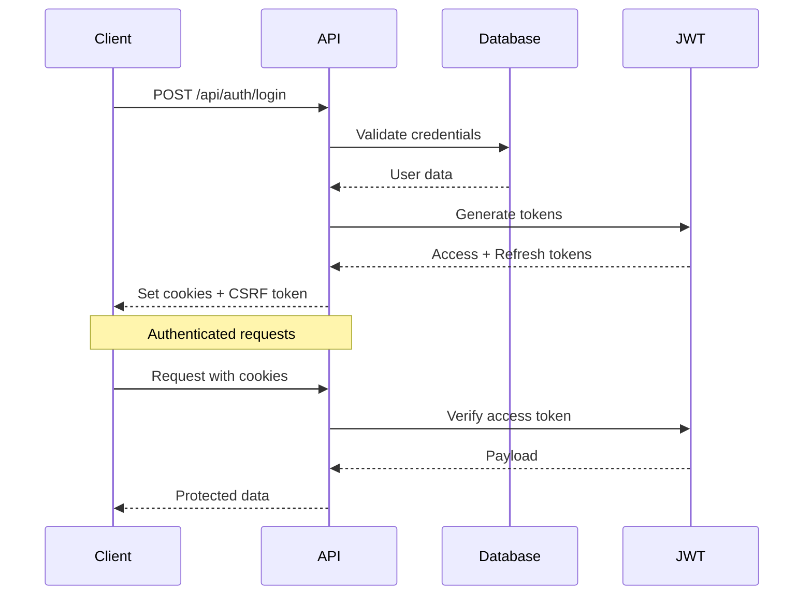
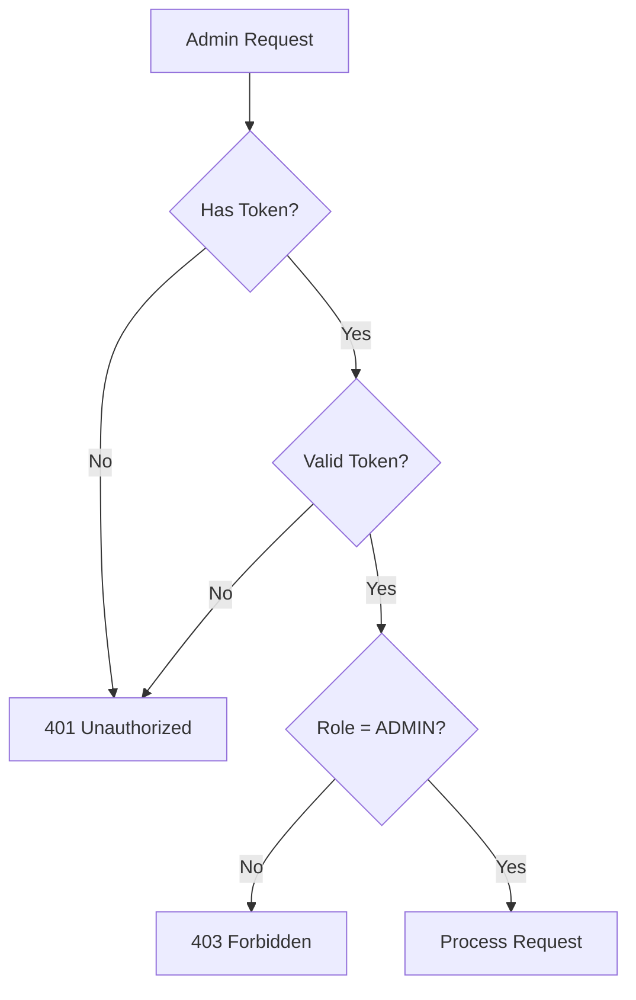
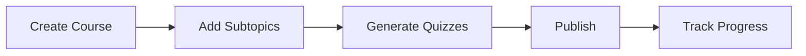
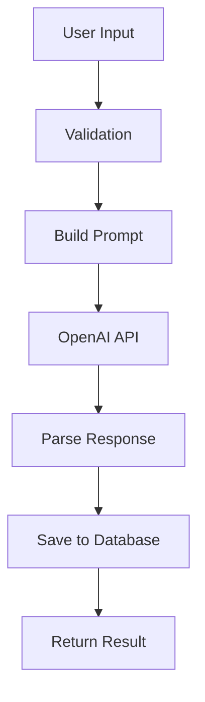
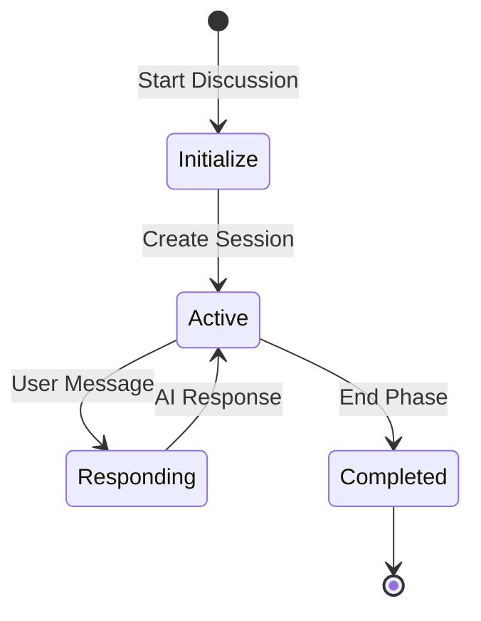

# API Reference

Dokumentasi lengkap semua API endpoints PrincipleLearn V3.

---

## 📋 Overview

### Base URL
- **Development**: `http://localhost:3000/api`
- **Production**: `https://your-domain.com/api`

### Authentication
Sebagian besar endpoint memerlukan autentikasi via JWT token yang disimpan di HttpOnly cookie.

### Response Format
Semua response dalam format JSON:

```json
{
  "success": true,
  "data": { ... },
  "message": "Optional message"
}
```

Error response:
```json
{
  "success": false,
  "error": "Error message",
  "code": "ERROR_CODE"
}
```

---

## 🔐 Authentication Endpoints

### Authentication Flow



---

### POST /api/auth/login

User login endpoint.

**Request Body**:
```json
{
  "email": "user@example.com",
  "password": "password123",
  "rememberMe": false
}
```

**Response** (200 OK):
```json
{
  "success": true,
  "user": {
    "id": "uuid",
    "email": "user@example.com",
    "role": "user",
    "isVerified": true
  },
  "csrfToken": "csrf-token-string"
}
```

**Cookies Set**:
- `access_token`: JWT access token (HttpOnly)
- `refresh_token`: JWT refresh token (HttpOnly)

**Errors**:
| Status | Code | Description |
|--------|------|-------------|
| 400 | INVALID_INPUT | Missing email or password |
| 401 | INVALID_CREDENTIALS | Wrong email/password |

---

### POST /api/auth/register

User registration endpoint.

**Request Body**:
```json
{
  "email": "newuser@example.com",
  "password": "securePassword123",
  "name": "John Doe"
}
```

**Response** (201 Created):
```json
{
  "success": true,
  "user": {
    "id": "uuid",
    "email": "newuser@example.com",
    "name": "John Doe",
    "role": "user"
  }
}
```

**Errors**:
| Status | Code | Description |
|--------|------|-------------|
| 400 | INVALID_INPUT | Invalid email or weak password |
| 409 | EMAIL_EXISTS | Email already registered |

---

### POST /api/auth/logout

Logout dan clear session.

**Headers**:
```
x-csrf-token: csrf-token-from-login
```

**Response** (200 OK):
```json
{
  "success": true,
  "message": "Logged out successfully"
}
```

**Cookies Cleared**:
- `access_token`
- `refresh_token`

---

### POST /api/auth/refresh

Refresh access token menggunakan refresh token.

**Response** (200 OK):
```json
{
  "success": true,
  "csrfToken": "new-csrf-token"
}
```

**Cookies Set**:
- `access_token`: New JWT access token

---

### GET /api/auth/me

Get current authenticated user.

**Response** (200 OK):
```json
{
  "user": {
    "id": "uuid",
    "email": "user@example.com",
    "role": "user",
    "isVerified": true
  }
}
```

---

## 👨‍💼 Admin Endpoints

> ⚠️ **Semua admin endpoints memerlukan role ADMIN**

### Admin Authentication Flow



---

### POST /api/admin/login

Admin-specific login.

**Request Body**:
```json
{
  "email": "admin@principlelearn.com",
  "password": "Admin123!"
}
```

**Response**: Same as `/api/auth/login` but validates ADMIN role.

---

### GET /api/admin/dashboard

Get admin dashboard statistics.

**Response** (200 OK):
```json
{
  "success": true,
  "data": {
    "totalUsers": 150,
    "totalCourses": 45,
    "totalQuizSubmissions": 1200,
    "recentActivity": [
      {
        "type": "course_created",
        "userId": "uuid",
        "timestamp": "2026-02-04T10:00:00Z"
      }
    ]
  }
}
```

---

### GET /api/admin/users

Get all users with pagination.

**Query Parameters**:
| Param | Type | Default | Description |
|-------|------|---------|-------------|
| page | number | 1 | Page number |
| limit | number | 20 | Items per page |
| search | string | - | Search by name/email |
| role | string | - | Filter by role |

**Response** (200 OK):
```json
{
  "success": true,
  "data": {
    "users": [
      {
        "id": "uuid",
        "email": "user@example.com",
        "name": "John Doe",
        "role": "user",
        "createdAt": "2026-01-15T08:00:00Z"
      }
    ],
    "pagination": {
      "page": 1,
      "limit": 20,
      "total": 150,
      "totalPages": 8
    }
  }
}
```

---

### GET /api/admin/users/[userId]

Get specific user details.

**Response** (200 OK):
```json
{
  "success": true,
  "data": {
    "user": {
      "id": "uuid",
      "email": "user@example.com",
      "name": "John Doe",
      "role": "user",
      "createdAt": "2026-01-15T08:00:00Z"
    },
    "stats": {
      "coursesCreated": 5,
      "quizzesCompleted": 25,
      "journalEntries": 10
    }
  }
}
```

---

### Activity Monitoring Endpoints

#### GET /api/admin/activity/quiz

Get quiz submission activity.

**Query Parameters**:
| Param | Type | Description |
|-------|------|-------------|
| userId | string | Filter by user |
| courseId | string | Filter by course |
| startDate | string | Start date filter |
| endDate | string | End date filter |

---

#### GET /api/admin/activity/jurnal

Get journal entries.

---

#### GET /api/admin/activity/transcript

Get transcript records.

---

#### GET /api/admin/activity/ask-question

Get Q&A history.

---

#### GET /api/admin/activity/generate-course

Get course generation logs.

---

## 📚 Course Endpoints

### Course CRUD Flow



---

### GET /api/courses

Get all courses.

**Query Parameters**:
| Param | Type | Description |
|-------|------|-------------|
| userId | string | Filter by creator |
| subject | string | Filter by subject |
| level | string | Filter by difficulty |

**Response** (200 OK):
```json
{
  "success": true,
  "data": [
    {
      "id": "uuid",
      "title": "Machine Learning Basics",
      "description": "Introduction to ML concepts",
      "subject": "Technology",
      "difficultyLevel": "Beginner",
      "estimatedDuration": 120,
      "createdBy": "uuid",
      "createdAt": "2026-01-20T10:00:00Z"
    }
  ]
}
```

---

### GET /api/courses/[courseId]

Get specific course with subtopics.

**Response** (200 OK):
```json
{
  "success": true,
  "data": {
    "course": {
      "id": "uuid",
      "title": "Machine Learning Basics",
      "description": "...",
      "subtopics": [
        {
          "id": "uuid",
          "title": "Introduction",
          "orderIndex": 0
        }
      ]
    }
  }
}
```

---

### POST /api/courses

Create new course.

**Request Body**:
```json
{
  "title": "New Course",
  "description": "Course description",
  "subject": "Technology",
  "difficultyLevel": "Intermediate"
}
```

---

## 🤖 AI Generation Endpoints

### AI Generation Flow



---

### POST /api/generate-course

Generate complete course using AI.

**Request Body**:
```json
{
  "topic": "Machine Learning",
  "goal": "Understand basic concepts",
  "level": "Beginner",
  "problem": "Career transition to data science",
  "assumption": "Basic programming knowledge",
  "extraTopics": "Python, Statistics"
}
```

**Response** (200 OK):
```json
{
  "success": true,
  "data": {
    "courseId": "uuid",
    "title": "Machine Learning for Beginners",
    "outline": {
      "modules": [
        {
          "title": "Introduction to ML",
          "subtopics": [
            "What is Machine Learning?",
            "Types of ML"
          ]
        }
      ]
    }
  }
}
```

---

### POST /api/generate-subtopic

Generate content for a subtopic.

**Request Body**:
```json
{
  "courseId": "uuid",
  "subtopicId": "uuid",
  "title": "What is Machine Learning?",
  "context": {
    "courseTitle": "ML Basics",
    "level": "Beginner"
  }
}
```

**Response** (200 OK):
```json
{
  "success": true,
  "data": {
    "content": "## What is Machine Learning?\n\nMachine Learning is..."
  }
}
```

---

### POST /api/generate-examples

Generate examples for a topic.

**Request Body**:
```json
{
  "topic": "Supervised Learning",
  "context": "Machine Learning course",
  "level": "Beginner"
}
```

---

### POST /api/ask-question

Ask AI about course content.

**Request Body**:
```json
{
  "courseId": "uuid",
  "moduleIndex": 0,
  "subtopicIndex": 1,
  "question": "Can you explain this in simpler terms?",
  "context": "Current subtopic content..."
}
```

**Response** (200 OK):
```json
{
  "success": true,
  "data": {
    "answer": "Of course! Let me explain...",
    "savedId": "uuid"
  }
}
```

---

### POST /api/challenge-thinking

Generate critical thinking challenge.

**Request Body**:
```json
{
  "courseId": "uuid",
  "subtopicContent": "Current content...",
  "userProgress": {
    "completedSubtopics": 5
  }
}
```

---

### POST /api/challenge-feedback

Get AI feedback on challenge response.

**Request Body**:
```json
{
  "challengeId": "uuid",
  "userResponse": "My answer to the challenge...",
  "originalQuestion": "The challenge question"
}
```

---

## 📝 Quiz Endpoints

### POST /api/quiz/submit

Submit quiz answer.

**Request Body**:
```json
{
  "quizId": "uuid",
  "answer": "B"
}
```

**Response** (200 OK):
```json
{
  "success": true,
  "data": {
    "isCorrect": true,
    "correctAnswer": "B",
    "explanation": "This is correct because..."
  }
}
```

---

## 💬 Discussion Endpoints

### Discussion Flow



---

### POST /api/discussion/start

Start new discussion session.

**Request Body**:
```json
{
  "courseId": "uuid",
  "subtopicId": "uuid"
}
```

---

### POST /api/discussion/message

Send message in discussion.

**Request Body**:
```json
{
  "sessionId": "uuid",
  "message": "User's response..."
}
```

---

### GET /api/discussion/session/[sessionId]

Get discussion session with messages.

---

## 📓 Learning Tools Endpoints

### POST /api/jurnal/save

Save journal entry.

**Request Body**:
```json
{
  "courseId": "uuid",
  "content": "Today I learned...",
  "reflection": "I found it interesting that..."
}
```

---

### POST /api/transcript/save

Save transcript/notes.

**Request Body**:
```json
{
  "courseId": "uuid",
  "subtopicId": "uuid",
  "content": "Key points from this section...",
  "notes": "My personal notes..."
}
```

---

### POST /api/feedback

Submit course feedback.

**Request Body**:
```json
{
  "courseId": "uuid",
  "subtopicId": "uuid",
  "rating": 5,
  "comment": "Great content!"
}
```

---

### POST /api/user-progress

Update learning progress.

**Request Body**:
```json
{
  "courseId": "uuid",
  "subtopicId": "uuid",
  "isCompleted": true
}
```

---

## 🔧 Debug/Testing Endpoints

> ⚠️ **Only available in development mode**

### GET /api/test-db

Test database connection.

**Response**:
```json
{
  "status": "connected",
  "database": "notion",
  "timestamp": "2026-02-04T10:00:00Z"
}
```

---

### GET /api/test-data

Get test data for development.

---

## ❌ Error Codes

| Code | Status | Description |
|------|--------|-------------|
| `INVALID_INPUT` | 400 | Request validation failed |
| `UNAUTHORIZED` | 401 | No valid authentication |
| `FORBIDDEN` | 403 | Insufficient permissions |
| `NOT_FOUND` | 404 | Resource not found |
| `CONFLICT` | 409 | Resource conflict (e.g., duplicate) |
| `RATE_LIMITED` | 429 | Too many requests |
| `INTERNAL_ERROR` | 500 | Server error |
| `AI_ERROR` | 500 | OpenAI API error |
| `DATABASE_ERROR` | 500 | Database operation failed |

---

## ⏱️ Rate Limiting

| Endpoint Category | Limit | Window |
|-------------------|-------|--------|
| Authentication | 10 requests | 15 minutes |
| AI Generation | 20 requests | 1 hour |
| General API | 100 requests | 1 minute |
| Admin API | 200 requests | 1 minute |

**Rate Limit Headers**:
```
X-RateLimit-Limit: 100
X-RateLimit-Remaining: 95
X-RateLimit-Reset: 1707040800
```

---

## 🔒 Security Headers

Semua API responses menyertakan security headers:

```
Content-Type: application/json
X-Content-Type-Options: nosniff
X-Frame-Options: DENY
X-XSS-Protection: 1; mode=block
```

---

*Dokumentasi ini terakhir diperbarui: Februari 2026*
