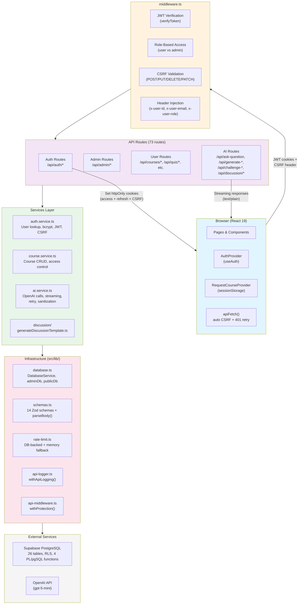
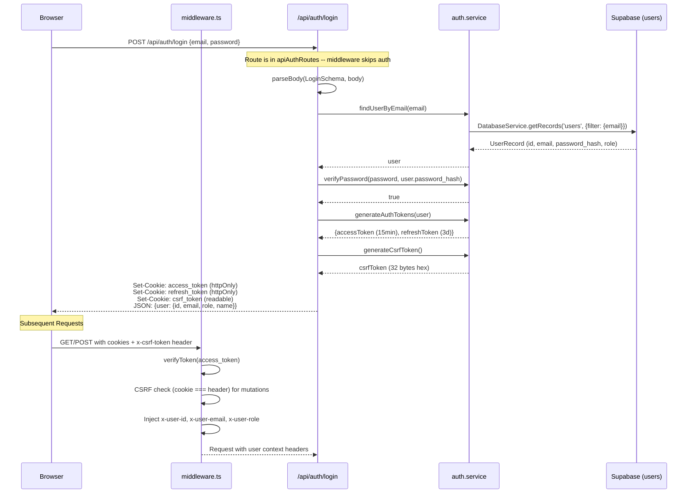
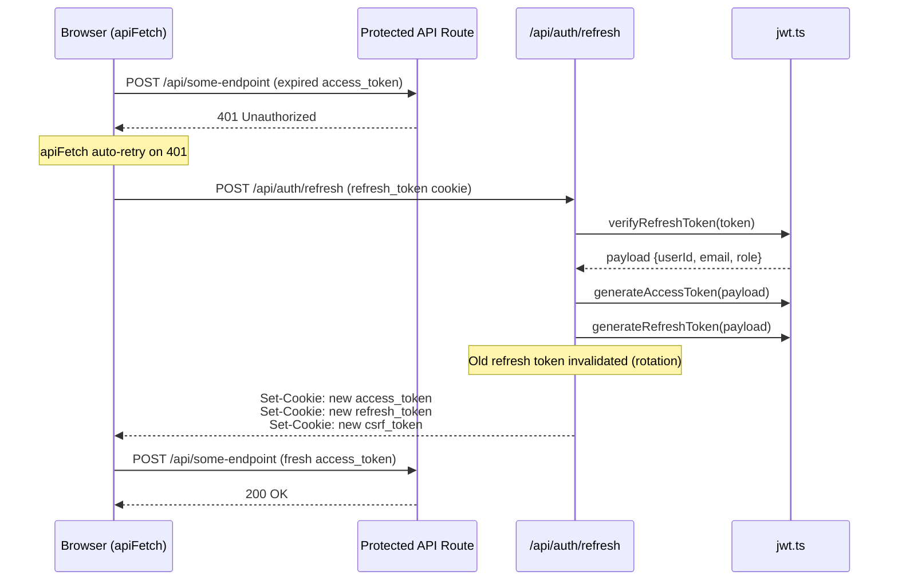
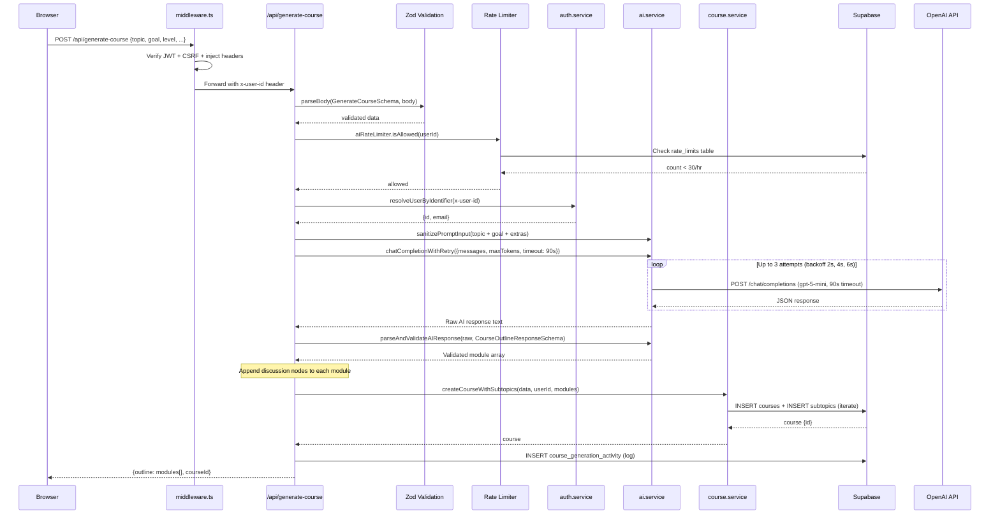
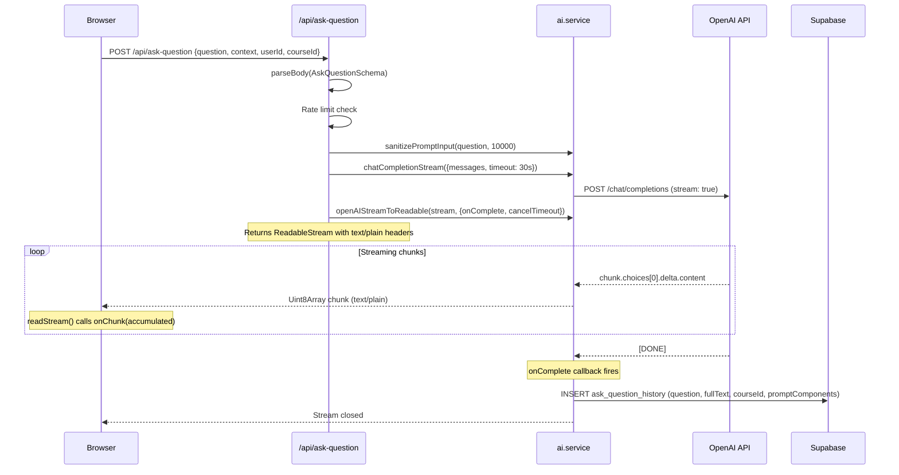
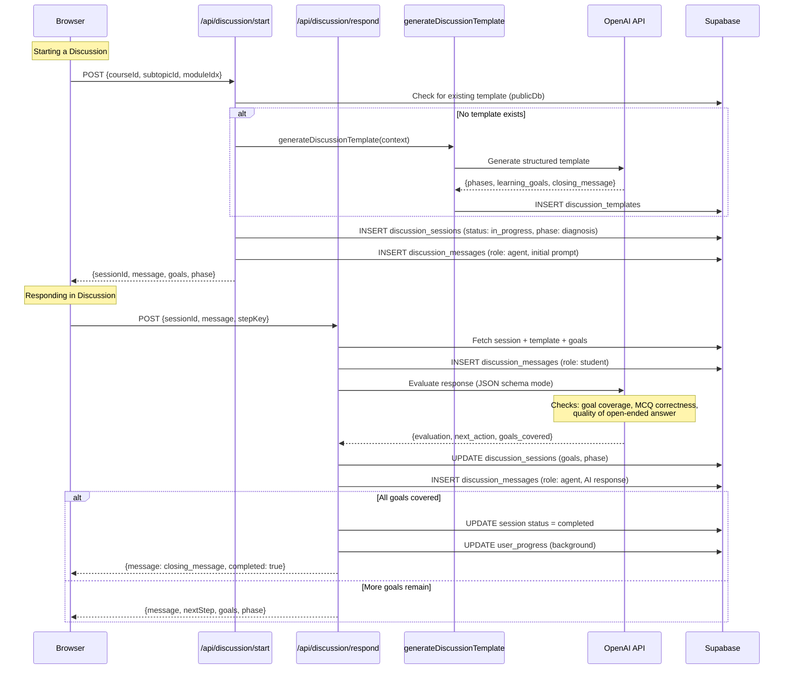
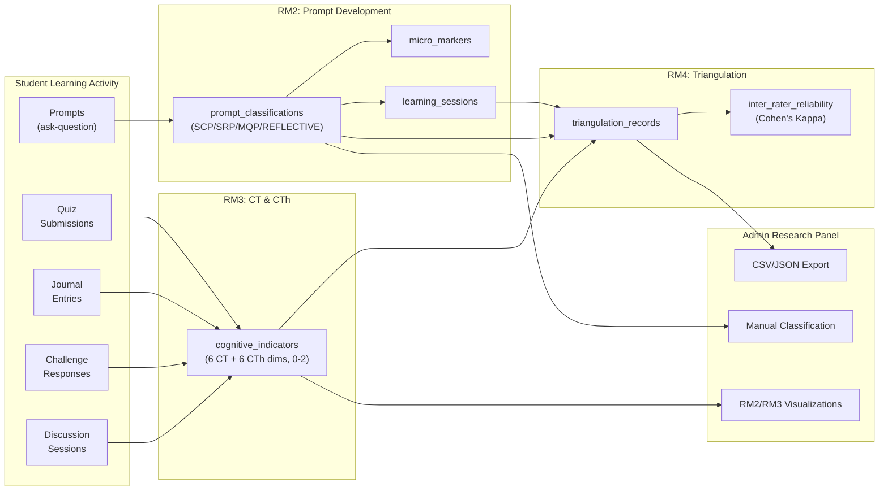

# PrincipleLearn V3 -- Architecture Documentation

Comprehensive technical architecture reference for PrincipleLearn V3, an AI-powered adaptive learning platform built for thesis research on Computational Thinking (CT) and Critical Thinking (CTh).

---

## Table of Contents

1. [System Overview](#1-system-overview)
2. [High-Level Architecture Diagram](#2-high-level-architecture-diagram)
3. [Architecture Layers](#3-architecture-layers)
4. [Data Flow Diagrams](#4-data-flow-diagrams)
5. [Component Architecture](#5-component-architecture)
6. [State Management](#6-state-management)
7. [Security Architecture](#7-security-architecture)
8. [AI Integration](#8-ai-integration)
9. [Research Data Integration](#9-research-data-integration)
10. [Key Design Decisions](#10-key-design-decisions)
11. [Technology Stack and Dependencies](#11-technology-stack-and-dependencies)

---

## 1. System Overview

PrincipleLearn V3 is an AI-powered adaptive learning platform designed as the primary research instrument for a Master's thesis investigating how AI-driven instructional design affects Computational Thinking (CT) and Critical Thinking (CTh) development in learners.

### Core Capabilities

- **AI-Generated Courses**: Multi-module course outlines generated via OpenAI, with per-subtopic content, quizzes, and examples
- **Interactive Learning**: Streamed Q&A, challenge thinking prompts, contextual example generation, and structured reflection journals
- **Socratic Discussions**: Multi-turn AI-guided dialogues using a 4-phase model (diagnosis, exploration, practice, synthesis) with learning goal tracking
- **Research Analytics**: Prompt classification (SCP/SRP/MQP/REFLECTIVE), cognitive indicator assessment (6 CT + 6 CTh dimensions), inter-rater reliability (Cohen's Kappa), and triangulation records
- **Admin Dashboard**: KPI monitoring, user management, activity tracking, discussion monitoring, and research data export

### Technology Stack Summary

| Layer | Technology |
|-------|-----------|
| Framework | Next.js 15 with App Router |
| Frontend | React 19, TypeScript, Sass modules |
| Database | Supabase PostgreSQL with RLS policies |
| Authentication | Custom JWT-based auth with CSRF double-submit cookie pattern |
| AI | OpenAI API (default model: gpt-5-mini) |
| Deployment | Vercel (serverless) |
| Validation | Zod schemas |
| Testing | Jest (unit), Playwright (E2E), MSW (mocking) |

---

## 2. High-Level Architecture Diagram



### Request Lifecycle

```
Browser
  |
  |-- apiFetch() attaches x-csrf-token header + credentials: 'include'
  v
middleware.ts
  |-- 1. Check if route is public (skip auth)
  |-- 2. Read access_token cookie
  |-- 3. verifyToken() -- reject refresh tokens
  |-- 4. If expired + refresh_token exists --> redirect to /api/auth/refresh
  |-- 5. Admin routes: verify role === 'ADMIN'
  |-- 6. CSRF: compare csrf_token cookie vs x-csrf-token header (mutations only)
  |-- 7. Inject x-user-id, x-user-email, x-user-role headers
  v
API Route Handler
  |-- withApiLogging() wraps handler (logs to api_logs table)
  |-- withProtection() re-validates auth + CSRF (defense in depth)
  |-- parseBody(ZodSchema, body) validates request
  |-- Business logic via service layer
  v
Response (JSON or streaming text/plain)
```

---

## 3. Architecture Layers

### Layer 1: Frontend (React 19 + Next.js 15 App Router)

The frontend uses the Next.js 15 App Router with React 19 and TypeScript. All pages reside under `src/app/` and components are organized by feature under `src/components/`.

#### Pages

| Route | Purpose |
|-------|---------|
| `/` | Landing page / onboarding |
| `/login` | User authentication |
| `/signup` | User registration |
| `/onboarding` | First-time user onboarding |
| `/dashboard` | Course library and progress overview |
| `/course/[courseId]` | Course overview with module navigation |
| `/course/[courseId]/subtopic/[subIdx]/[pageIdx]` | Learning interface (content, takeaways, quiz, feedback) |
| `/course/[courseId]/discussion/[moduleIdx]` | Socratic discussion (4-phase dialogue) |
| `/request-course/step1` | Course creation wizard -- topic and goal |
| `/request-course/step2` | Course creation wizard -- level and extras |
| `/request-course/step3` | Course creation wizard -- review and confirm |
| `/request-course/generating` | Course generation progress |
| `/admin/login` | Admin authentication |
| `/admin/register` | Admin registration |
| `/admin/dashboard` | Admin KPIs, RM2/RM3 research charts |
| `/admin/users` | User management and detail views |
| `/admin/activity` | Activity monitoring (quiz, journal, transcript, Q&A, challenges) |
| `/admin/discussions` | Discussion monitoring and analytics |
| `/admin/insights` | Learning insights and data export |
| `/admin/research` | Research analytics (prompt classification, cognitive indicators) |

#### Component Organization

Components are grouped by feature, each with a co-located `.module.scss` file:

```
src/components/
  admin/                   # Admin-specific components (modals, charts, tables)
  AILoadingIndicator/      # Shared loading state for AI operations
  AskQuestion/             # Q&A interface (QuestionBox + PromptBuilder integration)
  ChallengeThinking/       # Critical thinking challenge system (ChallengeBox)
  Examples/                # AI-generated contextual examples (ExampleList)
  KeyTakeaways/            # Module key takeaway summaries
  NextSubtopics/           # Navigation to next subtopic
  PromptBuilder/           # Guided prompt construction for Q&A
  PromptTimeline/          # Visual prompt evolution timeline
  Quiz/                    # Multiple-choice quiz with reasoning notes
  ReasoningNote/           # Free-text reasoning annotation
  StructuredReflection/    # Journal-style guided reflection
  WhatNext/                # Post-lesson navigation guidance
```

#### Styling

- All styles use CSS/Sass Modules (`.module.scss`) for scoped, collision-free class names
- No global CSS framework; all styling is custom
- Responsive design across all components

### Layer 2: Middleware (`middleware.ts`)

The central request interceptor runs on every request matching `/((?!_next/static|_next/image|favicon.ico|public/).*)`.

**Responsibilities:**

1. **Public Route Bypass**: Requests to `/`, `/login`, `/signup`, `/admin/login`, and auth API routes (`/api/auth/login`, `/api/auth/register`, `/api/auth/refresh`, `/api/auth/logout`, `/api/admin/login`, `/api/admin/register`) pass through without authentication
2. **JWT Token Verification**: Reads `access_token` from cookies, verifies via `verifyToken()` from `src/lib/jwt.ts`
3. **Token Refresh Redirect**: If access token is invalid but `refresh_token` cookie exists, redirects to `/api/auth/refresh`
4. **Role-Based Access Control**: Admin pages (`/admin/*`) and admin API routes (`/api/admin/*`) require `role === 'ADMIN'` in the JWT payload (case-insensitive comparison)
5. **CSRF Validation**: For mutation requests (POST, PUT, DELETE, PATCH) on `/api/*` routes, compares `csrf_token` cookie against `x-csrf-token` header
6. **User Context Injection**: Sets `x-user-id`, `x-user-email`, `x-user-role` headers on the request for downstream API route handlers
7. **Error Response Differentiation**: API routes receive JSON 401/403 responses; page routes receive redirects to login

### Layer 3: API Routes (73 routes in `src/app/api/`)

All API routes follow the Next.js 15 App Router convention with `route.ts` files exporting HTTP method handlers.

#### Route Categories

**Authentication (5 routes)**:
| Route | Method | Purpose |
|-------|--------|---------|
| `/api/auth/login` | POST | User login with email/password |
| `/api/auth/register` | POST | User registration |
| `/api/auth/logout` | POST | Clear auth cookies |
| `/api/auth/refresh` | POST | Token rotation (new access + refresh) |
| `/api/auth/me` | GET | Current user info from token |

**Admin (34 routes)**:
| Route Group | Purpose |
|-------------|---------|
| `/api/admin/login`, `/api/admin/register`, `/api/admin/logout`, `/api/admin/me` | Admin authentication |
| `/api/admin/dashboard` | Aggregated KPIs and stats |
| `/api/admin/users/*` | User CRUD, detail views, activity summaries, export |
| `/api/admin/activity/*` | Quiz, journal, transcript, ask-question, challenge, feedback, course, discussion, learning-profile, search, topics, analytics, export |
| `/api/admin/discussions/*` | Session list, detail, analytics, module status |
| `/api/admin/insights/*` | Learning insights, export |
| `/api/admin/research/*` | Sessions, classifications, indicators, analytics, classify, bulk, export |
| `/api/admin/monitoring/logging` | API log viewer |

**User Features (24 routes)**:
| Route | Method | Purpose |
|-------|--------|---------|
| `/api/courses` | GET | List user's courses |
| `/api/courses/[id]` | GET, DELETE | Course detail / deletion |
| `/api/generate-course` | POST | AI course outline generation |
| `/api/generate-subtopic` | POST | AI subtopic content generation |
| `/api/generate-examples` | POST | AI example generation |
| `/api/ask-question` | POST | Streamed AI Q&A |
| `/api/challenge-thinking` | POST | Streamed AI challenge question |
| `/api/challenge-feedback` | POST | AI feedback on challenge answer |
| `/api/challenge-response` | POST | Save challenge response |
| `/api/quiz/submit` | POST | Submit quiz answers |
| `/api/jurnal/save` | POST | Save learning journal entry |
| `/api/transcript/save` | POST | Save course transcript |
| `/api/feedback` | POST | Submit course feedback |
| `/api/user-progress` | GET, POST | Track/retrieve completion |
| `/api/learning-profile` | GET, POST | Learning preference profile |
| `/api/prompt-journey` | GET | Prompt evolution history |
| `/api/discussion/start` | POST | Start Socratic discussion session |
| `/api/discussion/respond` | POST | Continue discussion (AI evaluation + response) |
| `/api/discussion/history` | GET | Retrieve discussion messages |
| `/api/discussion/module-status` | GET | Discussion completion per module |

**Debug (3 routes)**: Development-only utilities for course testing, generation, and user inspection.

#### Standard Handler Pattern

```typescript
// Typical API route structure
export const POST = withApiLogging(
  withProtection(async (req: NextRequest) => {
    // 1. Parse and validate request body
    const body = await req.json();
    const parsed = parseBody(SomeSchema, body);
    if (!parsed.success) return parsed.response;

    // 2. Extract user identity from middleware-injected headers
    const userId = req.headers.get('x-user-id');

    // 3. Rate limiting
    const allowed = await aiRateLimiter.isAllowed(userId);
    if (!allowed) return NextResponse.json({ error: 'Rate limited' }, { status: 429 });

    // 4. Business logic via service layer
    const result = await someService(parsed.data);

    // 5. Return response
    return NextResponse.json(result);
  }),
  { label: 'some-feature' }
);
```

### Layer 4: Services Layer (`src/services/`)

Business logic is extracted from route handlers into service modules.

#### `auth.service.ts`

- **`findUserByEmail(email)`**: Normalized (lowercase, trimmed) lookup via `DatabaseService.getRecords('users')`
- **`findUserById(id)`**: Direct ID lookup
- **`resolveUserByIdentifier(identifier)`**: Tries ID first, then email -- used by quiz/submit and generate-course
- **`getCurrentUser()`**: Extracts user from `access_token` cookie (for routes not using middleware headers)
- **`verifyPassword(plaintext, hash)`**: `bcrypt.compare()` with bcryptjs
- **`hashPassword(password)`**: `bcrypt.genSalt(10)` then `bcrypt.hash()`
- **`generateAuthTokens(user)`**: Returns `{ accessToken, refreshToken }` via `generateAccessToken()` and `generateRefreshToken()`
- **`generateCsrfToken()`**: `crypto.randomBytes(32).toString('hex')`

#### `ai.service.ts`

- **`chatCompletion(opts)`**: Single OpenAI call with AbortController timeout (default 30s)
- **`chatCompletionWithRetry(opts)`**: Retry wrapper -- 3 attempts, exponential backoff (2s, 4s, 6s), 90s timeout for course generation
- **`chatCompletionStream(opts)`**: Streaming OpenAI call, returns `{ stream, cancelTimeout }`
- **`openAIStreamToReadable(stream, opts)`**: Converts OpenAI async iterable to `ReadableStream<Uint8Array>` for HTTP streaming; `onComplete` callback fires with full accumulated text for side effects (e.g., saving to DB)
- **`sanitizePromptInput(input, maxLength=10000)`**: Strips injection patterns (`ignore previous instructions`, `you are now a`, `system prompt:`, etc.), neutralizes XML boundary tags, truncates to 10K chars
- **`parseAIJsonResponse(raw)`**: Strips markdown code fences, parses JSON
- **`parseAndValidateAIResponse(raw, schema, label)`**: Parse + Zod validation
- **`CourseOutlineResponseSchema`**: Validates array of modules with subtopics (1-10 modules)
- **`AIExamplesResponseSchema`**: Validates `{ examples: string[] }`

#### `course.service.ts`

- **`listUserCourses(userId)`**: Returns user's courses ordered by creation date
- **`getCourseById(courseId)`**: Single course lookup
- **`getCourseWithSubtopics(courseId)`**: Course + ordered subtopics
- **`createCourseWithSubtopics(data, userId, modules)`**: Inserts course then iterates modules as subtopics (continues on individual failures, logs warnings)
- **`deleteCourse(courseId, userId, userRole)`**: Ownership check (owner or admin) before deletion
- **`canAccessCourse(course, userId, userRole)`**: Authorization predicate

#### `discussion/generateDiscussionTemplate.ts`

- AI-powered generation of Socratic discussion templates
- Produces structured phases (diagnosis, exploration, practice, synthesis) with step prompts
- Generates learning goals with thinking skill metadata and rubrics
- Uses module context (title, summary, objectives, key takeaways, misconceptions)

### Layer 5: Infrastructure (`src/lib/`)

#### `database.ts` -- Database Access Layer

Two client tiers:

| Client | Key | RLS | Use Case |
|--------|-----|-----|----------|
| `adminDb` | Service role | Bypassed | All writes, user-scoped reads, admin operations |
| `publicDb` | Anon key | Respected | Read-only access to shared content (subtopic_cache, discussion_templates) |

Both are lazy-initialized singletons with 10-second fetch timeouts.

**DatabaseService** (static class):
- `getRecords<T>(table, opts)` -- SELECT with filter, order, limit
- `insertRecord<T>(table, data)` -- INSERT with JSONB auto-detection
- `updateRecord<T>(table, id, data, idColumn)` -- UPDATE with auto `updated_at`
- `deleteRecord(table, id, idColumn)` -- DELETE by ID

**SupabaseQueryBuilder** (chainable):
- `adminDb.from('table').select().eq().order().limit().single()` -- mirrors Supabase client API
- Supports: `select`, `eq`, `neq`, `is`, `gte`, `lte`, `contains`, `in`, `ilike`, `order`, `limit`, `range`, `single`, `maybeSingle`
- Mutation methods: `insert`, `update`, `delete`, `upsert`
- Thenable: `await adminDb.from('users').select().eq('id', userId).single()`

**JSONB Auto-Detection**:
- Calls `get_jsonb_columns()` RPC on first insert
- Caches column mapping for process lifetime
- Falls back to hardcoded mapping if RPC fails
- Non-JSONB columns receiving objects are auto-stringified

**DatabaseError**:
- Custom error class with `.code`, `.is(errorCode)`, `.isUniqueViolation`, `.isForeignKeyViolation`
- Wraps Supabase PostgREST errors with typed access to error codes (23505, 23503, etc.)

#### `schemas.ts` -- Request Validation

14 Zod schemas covering all API input validation:

| Schema | Used By |
|--------|---------|
| `LoginSchema` | `/api/auth/login` |
| `RegisterSchema` | `/api/auth/register` |
| `AdminLoginSchema` | `/api/admin/login` |
| `AdminRegisterSchema` | `/api/admin/register` |
| `GenerateCourseSchema` | `/api/generate-course` |
| `GenerateSubtopicSchema` | `/api/generate-subtopic` |
| `QuizSubmitSchema` | `/api/quiz/submit` |
| `AskQuestionSchema` | `/api/ask-question` |
| `ChallengeThinkingSchema` | `/api/challenge-thinking` |
| `ChallengeFeedbackSchema` | `/api/challenge-feedback` |
| `GenerateExamplesSchema` | `/api/generate-examples` |
| `FeedbackSchema` | `/api/feedback` |
| `JurnalSchema` | `/api/jurnal/save` |

Helper: `parseBody(schema, body)` returns `{ success: true, data }` or `{ success: false, response: NextResponse(400) }` with the first Zod error message.

#### `jwt.ts` -- Token Management

| Function | Purpose | Details |
|----------|---------|---------|
| `generateAccessToken(payload)` | Create access JWT | HS256, 15-minute expiry, `type: 'access'` |
| `generateRefreshToken(payload)` | Create refresh JWT | HS256, 3-day expiry, `type: 'refresh'` |
| `verifyToken(token)` | Verify access tokens | Rejects tokens with `type: 'refresh'` |
| `verifyRefreshToken(token)` | Verify refresh tokens | Rejects tokens with `type: 'access'` |
| `getTokenExpiration(token)` | Decode expiry date | Non-verifying decode |

Payload structure: `{ userId, email, role, type }`.

#### `rate-limit.ts` -- Rate Limiting

DB-backed rate limiter with in-memory fallback. Uses the `rate_limits` table (key TEXT PK, count INT, reset_at TIMESTAMPTZ).

| Limiter | Window | Max Requests |
|---------|--------|-------------|
| `loginRateLimiter` | 15 minutes | 5 |
| `registerRateLimiter` | 1 hour | 3 |
| `resetPasswordRateLimiter` | 1 hour | 3 |
| `changePasswordRateLimiter` | 15 minutes | 5 |
| `aiRateLimiter` | 1 hour | 30 |

If the `rate_limits` table is unavailable (missing or connection error), the limiter transparently falls back to an in-memory `Map` with periodic cleanup every 60 seconds.

#### `api-client.ts` -- Frontend HTTP Client

`apiFetch(url, options)`:
- Auto-includes `x-csrf-token` header for POST/PUT/DELETE/PATCH (reads from `csrf_token` cookie)
- Sets `credentials: 'include'` for cookie transmission
- Defaults `Content-Type: application/json` when body is present
- On 401 response (except auth routes): auto-retries by calling `POST /api/auth/refresh` then repeating the original request

`readStream(response, onChunk)`:
- Reads a streaming `text/plain` response using `ReadableStream`
- Calls `onChunk(accumulatedText)` after each chunk
- Returns the complete text when done

#### `api-middleware.ts` -- Route-Level Protection

`withProtection(handler, options)`:
- CSRF validation: compares cookie vs header for non-GET requests
- Auth verification: validates `access_token` cookie via `verifyToken()`
- Admin enforcement: checks `role === 'admin'` when `adminOnly: true`
- Injects `x-user-id`, `x-user-email`, `x-user-role` headers
- Defense-in-depth layer (middleware.ts provides primary protection)

`withCacheHeaders(response, maxAgeSeconds=60)`:
- Sets `Cache-Control: private, s-maxage=N, stale-while-revalidate=2N`
- Used on read-only admin endpoints

#### `api-logger.ts` -- Request Logging

`withApiLogging(handler, context)`:
- Wraps any API handler to log requests to the `api_logs` table
- Records: method, path, query, status_code, duration_ms, ip_address, user_agent, user_id, user_email, user_role, label, metadata, error_message
- Extracts IP from `x-forwarded-for` or `x-real-ip` headers
- Catches and re-throws errors while still logging them

#### `openai.ts` -- OpenAI Client

- Singleton `OpenAI` instance initialized with `OPENAI_API_KEY` env var
- `defaultOpenAIModel`: reads from `OPENAI_MODEL` env var, defaults to `'gpt-5-mini'`
- Throws on startup if `OPENAI_API_KEY` is missing

### Layer 6: Database (Supabase PostgreSQL)

26 tables across 3 domains, with Row-Level Security (RLS) policies on all tables.

#### Core Learning Tables

| Table | Purpose | Key Columns |
|-------|---------|-------------|
| `users` | User accounts | id, email, password_hash, name, role |
| `courses` | Course metadata | id, title, description, difficulty_level, created_by |
| `subtopics` | Course sections (JSONB content) | id, course_id, title, content, order_index |
| `user_progress` | Completion tracking | user_id, course_id, subtopic_id, is_completed |
| `quiz` | Quiz questions per subtopic | id, course_id, subtopic_id, options (JSONB) |
| `quiz_submissions` | Student quiz answers with scoring | user_id, course_id, subtopic, score, answers |
| `ask_question_history` | Q&A interaction logs | user_id, course_id, question, answer, prompt_components (JSONB) |
| `jurnal` | Learning journal entries | user_id, course_id, content, type |
| `transcript` | Course notes | user_id, course_id, content |
| `feedback` | Course ratings and comments | user_id, course_id, rating, comment |
| `challenge_responses` | Critical thinking responses | user_id, question, answer, feedback |

#### Discussion System Tables

| Table | Purpose | Key Columns |
|-------|---------|-------------|
| `discussion_templates` | Socratic templates per subtopic | id, template (JSONB), source (JSONB), version |
| `discussion_sessions` | Active sessions with phase tracking | id, user_id, status, phase, learning_goals (JSONB), template_id |
| `discussion_messages` | Individual messages | session_id, role, content, metadata (JSONB), step_key |
| `discussion_admin_actions` | Admin audit trail | session_id, action, payload (JSONB) |

#### AI and Cache Tables

| Table | Purpose |
|-------|---------|
| `course_generation_activity` | Logs each generation request with request_payload (JSONB) and outline (JSONB) |
| `subtopic_cache` | Cached AI-generated subtopic content (JSONB) |

#### Research Tables (Thesis)

| Table | Purpose | Domain |
|-------|---------|--------|
| `learning_sessions` | Longitudinal tracking with cognitive depth scores | RM2, RM3 |
| `prompt_classifications` | Prompt stage classification (SCP, SRP, MQP, REFLECTIVE) | RM2 |
| `micro_markers` | Fine-grained prompt behavior markers | RM2 |
| `cognitive_indicators` | CT (6 dimensions, 0-2) and CTh (6 dimensions, 0-2) assessment | RM3 |
| `learning_profiles` | User learning preferences | RM2 |
| `triangulation_records` | Multi-source data triangulation | RM4 |
| `inter_rater_reliability` | Cohen's Kappa inter-rater metrics | RM4 |

#### Operations Tables

| Table | Purpose |
|-------|---------|
| `api_logs` | Request logging (method, path, status, duration, user, metadata) |
| `rate_limits` | Persistent rate limit counters (key, count, reset_at) |
| `admin_subtopic_delete_logs` | Admin deletion audit trail |

#### Database Infrastructure

- **Two client types**: `adminDb` (service-role, bypasses RLS) and `publicDb` (anon-key, respects RLS)
- **JSONB auto-detection**: `get_jsonb_columns()` PL/pgSQL function returns table-column mapping
- **4 PL/pgSQL functions**: `get_jsonb_columns()`, `get_admin_user_stats()`, and others for aggregation
- **3 views**: Pre-built query views for admin analytics
- **RLS policies**: Applied to all 26 tables (most use service-role client to bypass, as custom JWT cannot leverage `auth.uid()`)

---

## 4. Data Flow Diagrams

### Authentication Flow



### Token Refresh Flow



### Course Generation Flow



### AI Q&A Streaming Flow



### Socratic Discussion Flow



---

## 5. Component Architecture

### Learning Interface (`/course/[courseId]/subtopic/[subIdx]/[pageIdx]`)

The subtopic page is the primary learning interface, composing multiple interactive components:

```
SubtopicPage
  |-- Content Renderer (JSONB content display)
  |-- KeyTakeaways (module summary points)
  |-- Quiz (multiple-choice + ReasoningNote)
  |     |-- QuizQuestion (individual question)
  |     |-- ReasoningNote (free-text annotation per question)
  |     |-- QuizResults (score + review)
  |-- AskQuestion
  |     |-- PromptBuilder (guided prompt construction)
  |     |-- QuestionBox (streamed AI answer display)
  |-- ChallengeThinking
  |     |-- ChallengeBox (AI challenge question + user response + feedback)
  |-- Examples
  |     |-- ExampleList (AI-generated contextual examples)
  |-- StructuredReflection (guided journal entry)
  |-- NextSubtopics (navigation)
  |-- WhatNext (post-lesson guidance)
```

### Discussion Interface (`/course/[courseId]/discussion/[moduleIdx]`)

The Socratic discussion operates in 4 phases:

| Phase | Purpose | Interaction Style |
|-------|---------|------------------|
| **Diagnosis** | Assess prior knowledge | MCQ + open-ended |
| **Exploration** | Guide discovery of concepts | Open-ended dialogue |
| **Practice** | Apply understanding | Problem-solving + MCQ |
| **Synthesis** | Consolidate learning | Reflective open-ended |

Each phase contains template-defined steps with learning goal references. The AI evaluates each student response against goal rubrics and tracks coverage.

### Admin Dashboard

```
AdminDashboard
  |-- KPI Cards (total users, courses, active sessions)
  |-- RM2 Charts (prompt classification distribution, stage transitions)
  |-- RM3 Charts (cognitive indicator progression, CT/CTh dimension scores)
  |-- Recent Activity Feed
```

---

## 6. State Management

### Client-Side State

| Provider/Hook | Scope | Storage | Purpose |
|--------------|-------|---------|---------|
| `AuthProvider` (useAuth) | Global | Memory + cookies | User identity, isAuthenticated, login/logout/refresh, networkError, retryAuth |
| `RequestCourseProvider` | Course wizard | sessionStorage | Multi-step form state (topic, goal, level, extras, problem, assumption) |
| `useLocalStorage(key)` | Per-component | localStorage | Persistent per-user data (keyed by user ID) |
| `useSessionStorage(key)` | Per-component | sessionStorage | Tab-scoped data, auto-cleared on tab close |
| `useAdmin()` | Admin pages | Memory | Admin user profile via `/api/admin/me` |

### AuthProvider Flow

```
Mount --> GET /api/auth/me
  |-- OK --> setUser({id, email, role, name}), isAuthenticated = true
  |-- 401 --> user = null, isAuthenticated = false
  |-- Network error --> networkError = true, retryAuth() available

Login --> POST /api/auth/login
  |-- Server sets httpOnly cookies (access, refresh, CSRF)
  |-- Provider sets user state from response

Logout --> POST /api/auth/logout (with CSRF header)
  |-- Server clears cookies
  |-- Provider sets user = null
  |-- Router pushes to /login
```

### Server-Side State

- **JWT tokens**: `access_token` (httpOnly, 15min) and `refresh_token` (httpOnly, 3d) in cookies
- **CSRF token**: `csrf_token` cookie (readable by JavaScript, sent as `x-csrf-token` header)
- **User context**: Middleware injects `x-user-id`, `x-user-email`, `x-user-role` into request headers
- **Rate limits**: Persisted in `rate_limits` table (survives server restarts)

---

## 7. Security Architecture

> Detailed security documentation is maintained in `SECURITY.md`. This section provides a brief architectural overview.

### Authentication

- **Custom JWT**: Not using Supabase Auth -- full control over token lifecycle, payload structure, and rotation
- **Token types**: Typed JWT claims (`type: 'access'` vs `type: 'refresh'`) prevent token confusion attacks
- **Token rotation**: Refresh tokens are single-use; each refresh issues a new pair
- **Password hashing**: bcryptjs with salt rounds = 10

### CSRF Protection

- **Double-submit cookie pattern**: Server sets `csrf_token` cookie (httpOnly: false); client reads it via `getCsrfToken()` and sends as `x-csrf-token` header
- **Validation layers**: Both `middleware.ts` (primary) and `withProtection()` (defense in depth) validate CSRF
- **Scope**: Only enforced on mutation methods (POST, PUT, DELETE, PATCH)

### Rate Limiting

- **DB-backed persistence**: Uses `rate_limits` table so limits survive server restarts and scale across instances
- **In-memory fallback**: Automatic transparent fallback if DB is unavailable
- **5 limiter instances**: login (5/15min), register (3/hr), reset password (3/hr), change password (5/15min), AI (30/hr)

### Prompt Injection Defense

Multi-layer protection for all AI endpoints:

1. **Input sanitization** (`sanitizePromptInput()`): Regex-based filtering of injection patterns, XML tag neutralization, truncation to 10K chars
2. **XML boundary markers**: User content wrapped in `<user_content>...</user_content>` delimiters
3. **System prompt hardening**: Explicit instructions to ignore user-injected directives
4. **Output validation**: Zod schemas validate AI responses before database persistence

### Row-Level Security (RLS)

- All 26 tables have RLS policies
- Since custom JWT auth cannot populate `auth.uid()`, the `adminDb` (service-role) client is used for most operations, bypassing RLS
- `publicDb` (anon-key) is used for read-only shared content where RLS `USING (true)` policies apply
- Application-level access control enforced in middleware and service layer

---

## 8. AI Integration

### Client Configuration

```typescript
// src/lib/openai.ts
export const openai = new OpenAI({ apiKey: process.env.OPENAI_API_KEY });
export const defaultOpenAIModel = process.env.OPENAI_MODEL || 'gpt-5-mini';
```

### AI Feature Matrix

| Feature | Endpoint | Method | Timeout | Streaming | Rate Limit |
|---------|----------|--------|---------|-----------|------------|
| Course generation | `/api/generate-course` | `chatCompletionWithRetry` | 90s | No | 30/hr |
| Subtopic content | `/api/generate-subtopic` | `chatCompletion` | 30s | No | 30/hr |
| Example generation | `/api/generate-examples` | `chatCompletion` | 30s | No | 30/hr |
| Q&A | `/api/ask-question` | `chatCompletionStream` | 30s | Yes (text/plain) | 30/hr |
| Challenge question | `/api/challenge-thinking` | `chatCompletionStream` | 30s | Yes (text/plain) | 30/hr |
| Challenge feedback | `/api/challenge-feedback` | `chatCompletion` | 30s | No | 30/hr |
| Discussion template | Internal service | `chatCompletion` | 30s | No | N/A |
| Discussion evaluation | `/api/discussion/respond` | OpenAI JSON schema mode | 30s | No | N/A |

### Retry Strategy

`chatCompletionWithRetry`:
- Max attempts: 3
- Backoff: exponential -- 2s after attempt 1, 4s after attempt 2, 6s after attempt 3
- Timeout per attempt: 90s (configurable)
- Used exclusively by course generation (long-running, high-value operation)

### Streaming Architecture

```
chatCompletionStream() --> OpenAI (stream: true) --> AsyncIterable<StreamChunk>
                                                          |
                                                    openAIStreamToReadable()
                                                          |
                                                    ReadableStream<Uint8Array>
                                                          |
                                                    new Response(stream, {
                                                      headers: STREAM_HEADERS
                                                    })
                                                          |
                                                    Browser receives text/plain
                                                          |
                                                    readStream(response, onChunk)
                                                          |
                                                    onComplete(fullText) --> DB save
```

`STREAM_HEADERS`: `Content-Type: text/plain; charset=utf-8`, `Cache-Control: no-cache`, `X-Content-Type-Options: nosniff`

### Prompt Security Pipeline

```
User Input
  |
  v
sanitizePromptInput(input, 10000)
  |-- Truncate to 10,000 characters
  |-- Strip: "ignore previous instructions", "you are now a", etc.
  |-- Remove: <user_content>, <system>, <assistant> tags
  |-- Trim whitespace
  |
  v
System Prompt Construction
  |-- System message: role definition + hardened instructions
  |-- User content wrapped in: <user_content>{sanitized}</user_content>
  |
  v
OpenAI API Call
  |
  v
Response Validation
  |-- parseAIJsonResponse(): strip code fences, parse JSON
  |-- Zod schema validation (CourseOutlineResponseSchema, AIExamplesResponseSchema)
  |-- Reject invalid structures before DB persistence
```

---

## 9. Research Data Integration (Thesis Support)

PrincipleLearn V3 serves as the primary research instrument for a thesis investigating AI-driven CT and CTh development. The platform captures multi-layered research data across four research methods (RM).

### RM2: Prompt Development Analysis

Tracks how student prompt-writing skills evolve over learning sessions.

**Classification Stages**:
| Stage | Code | Description |
|-------|------|-------------|
| Simple Copy Prompt | SCP | Verbatim or near-verbatim copying of content |
| Simple Rephrased Prompt | SRP | Paraphrasing with minimal transformation |
| Multi-layered Quality Prompt | MQP | Complex, multi-faceted questions |
| Reflective Prompt | REFLECTIVE | Meta-cognitive, self-aware questioning |

**Data Tables**: `learning_sessions`, `prompt_classifications`, `micro_markers`

**Flow**: Student submits prompt via PromptBuilder --> auto/manual classification --> stage assigned --> micro_markers recorded --> session metrics updated --> stage transitions tracked

### RM3: Cognitive Indicator Assessment

Measures CT and CTh development using standardized indicators.

**CT Dimensions (6, scored 0-2)**:
Computational Thinking dimensions assessed through quiz performance, challenge responses, and discussion participation.

**CTh Dimensions (6, scored 0-2)**:
Critical Thinking dimensions assessed through journal reflections, challenge quality, and discussion depth.

**Data Table**: `cognitive_indicators` -- stores per-session, per-dimension scores with assessor identification

### RM4: Triangulation and Reliability

**Triangulation**: `triangulation_records` links multiple data sources (quiz scores, journal entries, discussion transcripts, prompt classifications) for cross-validation.

**Inter-Rater Reliability**: `inter_rater_reliability` stores Cohen's Kappa coefficients comparing assessor agreement on cognitive indicator ratings.

### Research Data Flow



### Admin Research Endpoints

| Endpoint | Purpose |
|----------|---------|
| `/api/admin/research/sessions` | List/filter learning sessions |
| `/api/admin/research/classifications` | View prompt classifications |
| `/api/admin/research/indicators` | View/edit cognitive indicators |
| `/api/admin/research/analytics` | Aggregated research metrics |
| `/api/admin/research/classify` | Manual prompt classification |
| `/api/admin/research/bulk` | Bulk classification operations |
| `/api/admin/research/export` | Export research data (CSV/JSON) |

---

## 10. Key Design Decisions

### 1. Custom JWT over Supabase Auth

**Decision**: Implement custom JWT-based authentication instead of using Supabase Auth.

**Rationale**: Full control over token lifecycle, payload structure, rotation policy, and cookie management. Decouples authentication from the database provider, enabling potential migration without auth rework.

**Trade-off**: Cannot leverage Supabase RLS `auth.uid()` function, requiring the service-role client for most operations.

### 2. Service-Role Client by Default

**Decision**: Use `adminDb` (service-role, bypasses RLS) for the majority of database operations.

**Rationale**: Custom JWT tokens are not Supabase Auth tokens, so RLS policies referencing `auth.uid()` would fail. Application-level access control in middleware and service layer provides equivalent protection.

**Trade-off**: RLS serves as documentation rather than enforcement for most tables. `publicDb` (anon-key) is used for read-only shared content where RLS `USING (true)` policies apply.

### 3. Streaming AI Responses

**Decision**: Use OpenAI streaming for Q&A and challenge-thinking endpoints.

**Rationale**: Long AI responses (10-30 seconds) would create poor UX if delivered as a single payload. Streaming provides immediate visual feedback as the response is generated, with `onComplete` callback for background database persistence.

**Trade-off**: More complex error handling (partial responses, stream interruption). Requires `text/plain` Content-Type instead of JSON.

### 4. Prompt Injection Defense in Depth

**Decision**: Multi-layer protection (sanitization + boundary markers + system prompt hardening + output validation).

**Rationale**: No single defense is sufficient against prompt injection. Regex sanitization catches common patterns, XML boundaries prevent delimiter confusion, system prompts establish behavioral constraints, and output validation rejects malformed responses.

**Trade-off**: Sanitization may occasionally filter legitimate user input containing trigger phrases.

### 5. DB-Backed Rate Limiting

**Decision**: Persist rate limit counters in the `rate_limits` Supabase table with automatic in-memory fallback.

**Rationale**: Vercel serverless functions have no shared memory between invocations. DB-backed limits persist across deployments and scale across instances. In-memory fallback ensures the application never crashes due to rate-limit infrastructure failures.

**Trade-off**: Each rate limit check requires a database round-trip (mitigated by Supabase connection pooling).

### 6. CSRF Double-Submit Cookie Pattern

**Decision**: Set `csrf_token` as a readable cookie; require it as `x-csrf-token` header on mutations.

**Rationale**: CORS-safe pattern that works with cookie-based auth. The server sets the token, the client reads it from `document.cookie`, and sends it as a custom header. Cross-origin attackers cannot read the cookie due to SameSite policy.

**Trade-off**: CSRF cookie must be non-httpOnly (readable by JavaScript), creating a slightly larger XSS attack surface.

### 7. SessionStorage for Learning Data

**Decision**: Use `sessionStorage` (via `useSessionStorage` hook) for in-progress learning data and `RequestCourseContext`.

**Rationale**: Tab-scoped storage auto-clears when the tab is closed, limiting the window for XSS data exfiltration. Prevents stale data from persisting across sessions. Course wizard state should not survive tab closure.

**Trade-off**: Data is lost if the user accidentally closes the tab during a multi-step flow.

---

## 11. Technology Stack and Dependencies

### Production Dependencies

| Package | Version | Purpose |
|---------|---------|---------|
| `next` | ^15.5.12 | React framework with App Router, API routes, middleware |
| `react` | ^19.0.0 | UI component library |
| `react-dom` | ^19.0.0 | React DOM renderer |
| `typescript` | ^5 | Type-safe JavaScript |
| `@supabase/supabase-js` | ^2.99.1 | Supabase PostgreSQL client |
| `openai` | ^4.96.0 | OpenAI API client (chat completions, streaming) |
| `jsonwebtoken` | ^9.0.2 | JWT creation and verification (HS256) |
| `bcryptjs` | ^3.0.2 | Password hashing (salt rounds: 10) |
| `bcrypt` | ^6.0.0 | Native bcrypt (fallback) |
| `zod` | ^4.3.6 | Request body validation (14 schemas) |
| `sass` | ^1.87.0 | Sass/SCSS module compilation |
| `react-icons` | ^5.5.0 | Icon library |
| `papaparse` | ^5.5.3 | CSV parsing (research data export) |
| `dotenv` | ^17.2.0 | Environment variable loading |
| `react-is` | ^19.2.4 | React type checking utilities |

### Development Dependencies

| Package | Version | Purpose |
|---------|---------|---------|
| `jest` | ^30.3.0 | Unit test runner |
| `ts-jest` | ^29.4.6 | TypeScript Jest transformer |
| `jest-environment-jsdom` | ^30.3.0 | Browser-like test environment |
| `@testing-library/react` | ^16.3.2 | React component testing utilities |
| `@testing-library/jest-dom` | ^6.9.1 | Jest DOM matchers |
| `@playwright/test` | ^1.58.2 | End-to-end browser testing |
| `msw` | ^2.12.14 | API mocking for tests |
| `node-mocks-http` | ^1.17.2 | HTTP request/response mocking |
| `puppeteer` | ^24.37.5 | Browser automation |
| `recharts` | ^3.8.1 | Chart library (admin dashboards, research visualizations) |
| `d3-array` | ^3.2.4 | Statistical array operations |
| `cross-env` | ^7.0.3 | Cross-platform environment variables |
| `eslint` | ^10.0.2 | Code linting |
| `eslint-config-next` | ^16.2.2 | Next.js ESLint configuration |

### Environment Variables

| Variable | Required | Purpose |
|----------|----------|---------|
| `NEXT_PUBLIC_SUPABASE_URL` | Yes | Supabase project URL |
| `NEXT_PUBLIC_SUPABASE_ANON_KEY` | Yes | Supabase anonymous key (publicDb) |
| `SUPABASE_SERVICE_ROLE_KEY` | Yes | Supabase service role key (adminDb) |
| `JWT_SECRET` | Yes | JWT signing secret (HS256) |
| `OPENAI_API_KEY` | Yes | OpenAI API key |
| `OPENAI_MODEL` | No | Override default model (defaults to gpt-5-mini) |

### Project Metrics

| Metric | Value |
|--------|-------|
| TypeScript files | ~149 |
| API routes | 73 |
| Database tables | 26 |
| Zod schemas | 14 |
| Component directories | 13 |
| Frontend pages | 18 |
| Custom hooks | 4 |
| Service modules | 4 |
| Infrastructure modules | 8 |

---

*This document was generated from source code analysis of the PrincipleLearn V3 codebase on the `principle-learn-3.0` branch.*
