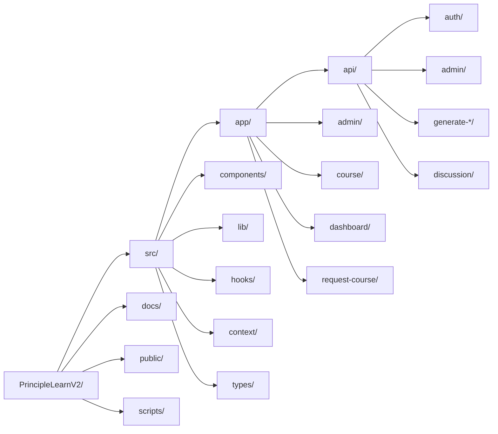
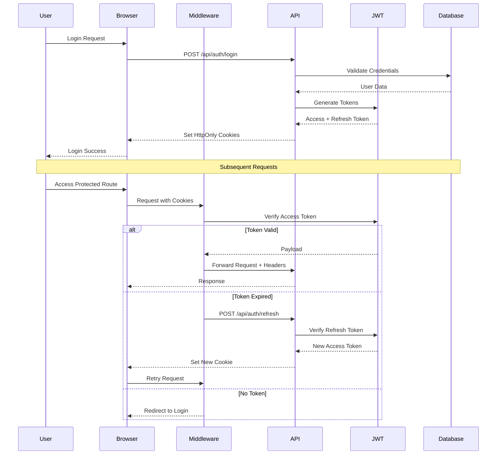
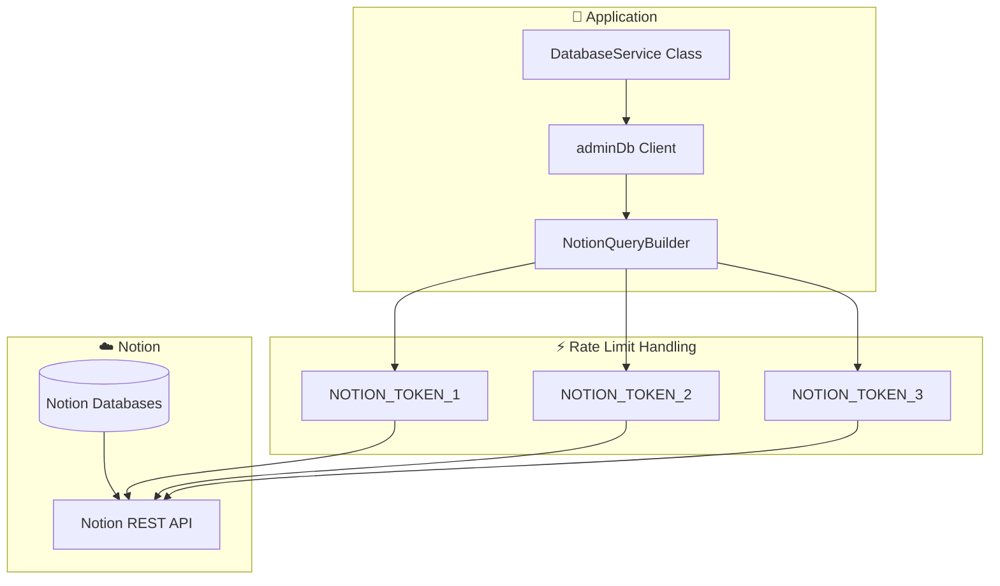
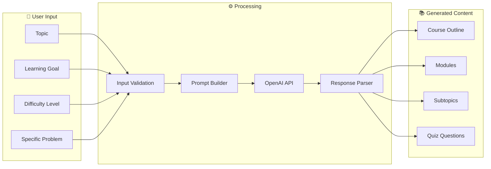
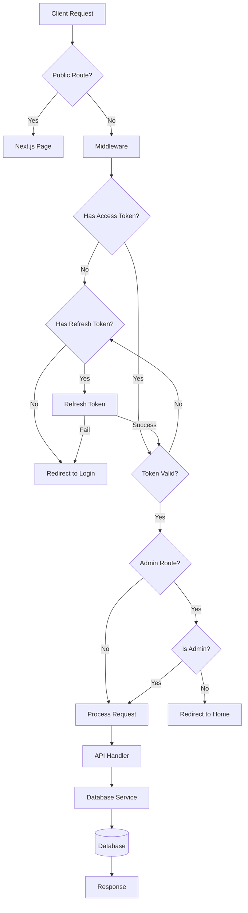
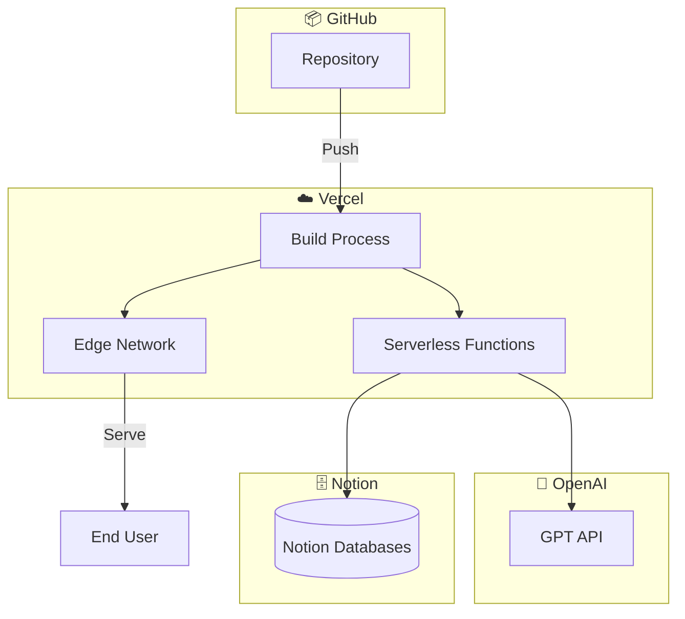
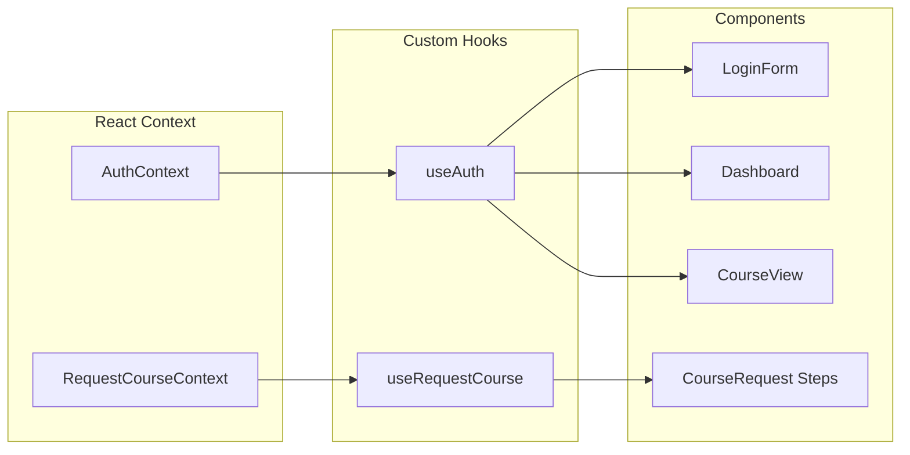
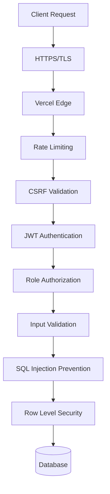

# System Architecture

Dokumentasi arsitektur sistem PrincipleLearn V3 dengan diagram detail.

---

## 🏗️ High-Level Architecture

```mermaid
graph TB
    subgraph Users["👥 Users"]
        Learner[Learner]
        Admin[Administrator]
    end

    subgraph Frontend["🖥️ Frontend Layer"]
        Browser[Web Browser]
        NextApp[Next.js 15 App]
        
        subgraph Pages["Pages"]
            PublicPages[Public Pages]
            UserPages[User Pages]
            AdminPages[Admin Pages]
        end
        
        subgraph Components["React Components"]
            Quiz[Quiz System]
            Discussion[Discussion]
            Journal[Learning Journal]
            CourseView[Course View]
        end
    end

    subgraph Backend["⚙️ Backend Layer"]
        subgraph Middleware["Middleware"]
            AuthMiddleware[Auth Middleware]
            RateLimit[Rate Limiter]
        end
        
        subgraph APIRoutes["API Routes"]
            AuthAPI[/api/auth/*]
            AdminAPI[/api/admin/*]
            CourseAPI[/api/courses/*]
            AIAPI[/api/generate-*]
            DiscussionAPI[/api/discussion/*]
        end
        
        subgraph Services["Services"]
            DatabaseService[DatabaseService]
            JWTService[JWT Service]
            CSRFService[CSRF Protection]
        end
    end

    subgraph External["🌐 External Services"]
        OpenAI[OpenAI API]
    end

    subgraph Database["🗄️ Database Layer"]
        Notion[(Notion Databases)]
    end

    subgraph Deployment["☁️ Deployment"]
        Vercel[Vercel Platform]
    end

    Learner --> Browser
    Admin --> Browser
    Browser --> NextApp
    NextApp --> Pages
    Pages --> Components
    
    NextApp --> Middleware
    Middleware --> APIRoutes
    APIRoutes --> Services
    APIRoutes --> OpenAI
    Services --> Notion
    
    NextApp --> Vercel
```

---

## 🛠️ Technology Stack Detail

### Frontend Stack

| Technology | Version | Purpose |
|------------|---------|---------|
| Next.js | 15.3.1 | React framework dengan App Router |
| React | 19.0.0 | UI library |
| TypeScript | 5.x | Type safety |
| Sass | 1.87.0 | CSS preprocessing |
| React Icons | 5.5.0 | Icon library |
| Recharts | 2.15.3 | Data visualization |

### Backend Stack

| Technology | Version | Purpose |
|------------|---------|---------|
| Next.js API Routes | 15.x | Backend API |
| JWT | 9.0.2 | Token authentication |
| bcrypt/bcryptjs | 5.1.1/3.0.2 | Password hashing |
| Notion API | REST | Database client via `@/lib/database.ts` |
| OpenAI | 4.96.0 | AI integration |

---

## 📁 Directory Structure



### Detailed Structure

```
src/
├── app/                         # Next.js 15 App Router
│   ├── api/                     # Backend API routes
│   │   ├── auth/               # Authentication endpoints
│   │   │   ├── login/          # POST /api/auth/login
│   │   │   ├── logout/         # POST /api/auth/logout
│   │   │   ├── register/       # POST /api/auth/register
│   │   │   ├── refresh/        # POST /api/auth/refresh
│   │   │   └── me/             # GET /api/auth/me
│   │   ├── admin/              # Admin operations
│   │   │   ├── dashboard/      # Admin dashboard data
│   │   │   ├── users/          # User management
│   │   │   ├── activity/       # Activity monitoring
│   │   │   ├── discussions/    # Discussion management
│   │   │   └── [login,logout]  # Admin auth
│   │   ├── courses/            # Course CRUD
│   │   ├── quiz/               # Quiz operations
│   │   ├── generate-course/    # AI course generation
│   │   ├── generate-examples/  # AI example generation
│   │   ├── generate-subtopic/  # AI subtopic generation
│   │   ├── discussion/         # Discussion system
│   │   ├── jurnal/             # Learning journal
│   │   ├── transcript/         # Transcript management
│   │   ├── feedback/           # Course feedback
│   │   └── debug/              # Development utilities
│   ├── admin/                   # Admin pages
│   │   ├── dashboard/          # Admin dashboard UI
│   │   ├── users/              # User management UI
│   │   ├── activity/           # Activity monitoring UI
│   │   ├── discussions/        # Discussion management UI
│   │   ├── login/              # Admin login page
│   │   └── register/           # Admin registration
│   ├── course/[courseId]/       # Dynamic course pages
│   ├── dashboard/               # User dashboard
│   ├── request-course/          # Multi-step course creation
│   │   ├── step1/              # Topic & goal input
│   │   ├── step2/              # Level & details
│   │   ├── step3/              # Review & confirm
│   │   └── result/             # Generated course result
│   ├── login/                   # User login
│   └── signup/                  # User registration
├── components/                  # React components
│   ├── admin/                  # Admin-specific components
│   ├── Quiz/                   # Quiz system
│   ├── ChallengeThinking/      # Challenge components
│   ├── AskQuestion/            # Q&A components
│   ├── Examples/               # Example display
│   ├── FeedbackForm/           # Feedback components
│   ├── KeyTakeaways/           # Summary components
│   └── NextSubtopics/          # Navigation components
├── context/                     # React Context
│   └── RequestCourseContext.tsx # Multi-step form state
├── hooks/                       # Custom hooks
│   └── useAuth.tsx             # Authentication hook
├── lib/                         # Utilities & services
│   ├── database.ts             # Notion DatabaseService class
│   ├── notion-database.ts      # Notion API utilities
│   ├── jwt.ts                  # JWT utilities
│   ├── csrf.ts                 # CSRF protection
│   ├── openai.ts               # OpenAI client
│   ├── api-error.ts            # Error handling
│   ├── api-logger.ts           # API logging
│   ├── api-middleware.ts       # API middleware
│   ├── rate-limit.ts           # Rate limiting
│   └── validation.ts           # Input validation
└── types/                       # TypeScript definitions
    └── database.ts             # Database types
```

---

## 🔐 Authentication Architecture



### Token Configuration

| Token Type | Storage | Expiry | Purpose |
|------------|---------|--------|---------|
| Access Token | HttpOnly Cookie | 15 min | API authentication |
| Refresh Token | HttpOnly Cookie | 7 days | Token renewal |
| CSRF Token | localStorage | Session | State-changing protection |

---

## 🗄️ Database Architecture



### Database Strategy

| Component | Purpose |
|-----------|--------|
| `DatabaseService` | Singleton service for database operations |
| `adminDb` | Pre-configured instance with admin privileges |
| `NotionQueryBuilder` | Supabase-like query syntax for Notion |
| Multi-token | 3 tokens for 9 req/s effective rate limit |

---

## 🤖 AI Integration Architecture



### AI Endpoints

| Endpoint | Purpose | Model |
|----------|---------|-------|
| `/api/generate-course` | Generate complete course | GPT-5-mini |
| `/api/generate-subtopic` | Generate subtopic content | GPT-5-mini |
| `/api/generate-examples` | Generate examples | GPT-5-mini |
| `/api/ask-question` | Answer user questions | GPT-5-mini |
| `/api/challenge-thinking` | Critical thinking prompts | GPT-5-mini |
| `/api/challenge-feedback` | Evaluate user responses | GPT-5-mini |

---

## 🔄 Request Flow



---

## ☁️ Deployment Architecture



### Environment Configuration

| Environment | Purpose | URL |
|-------------|---------|-----|
| Development | Local testing | `localhost:3000` |
| Preview | PR review | `*.vercel.app` |
| Production | Live application | `your-domain.com` |

---

## 📡 Component Communication



---

## 🔒 Security Layers



### Security Measures

| Layer | Implementation |
|-------|----------------|
| Transport | HTTPS enforced by Vercel |
| Rate Limiting | Custom rate-limit.ts + multi-token Notion |
| CSRF | Token validation for state changes |
| Authentication | JWT with HttpOnly cookies |
| Authorization | Role-based middleware |
| Input Validation | Zod/custom validation |
| Database | Notion access via integration tokens |

---

*Dokumentasi ini terakhir diperbarui: Februari 2026*
