# PrincipleLearn V3 - Database Schema Documentation

> **Database Engine:** Supabase PostgreSQL with Row-Level Security (RLS)  
> **Total Tables:** 26  
> **Total Views:** 3  
> **Total Functions:** 4  
> **Last Updated:** 2026-04-08

---

## Table of Contents

1. [Overview](#1-overview)
2. [Entity Relationship Diagram](#2-entity-relationship-diagram)
3. [Core Learning Tables](#3-core-learning-tables)
4. [Student Output Tables](#4-student-output-tables)
5. [Discussion & Content Tables](#5-discussion--content-tables)
6. [Research Tables](#6-research-tables)
7. [System Tables](#7-system-tables)
8. [Row-Level Security (RLS) Policies](#8-row-level-security-rls-policies)
9. [Database Functions](#9-database-functions)
10. [Views](#10-views)
11. [Access Patterns](#11-access-patterns)
12. [JSONB Column Map](#12-jsonb-column-map)

---

## 1. Overview

PrincipleLearn V3 uses **Supabase PostgreSQL** as its primary data store. The schema is organized into three logical domains:

| Domain | Tables | Purpose |
|--------|--------|---------|
| **Learning Platform** | 18 tables | Core application data: users, courses, quizzes, discussions, journals, transcripts, and AI interaction history |
| **Research & Analysis** | 7 tables | Academic research instrumentation: prompt classification, cognitive indicators, longitudinal tracking, inter-rater reliability |
| **System** | 1 table | Operational infrastructure: rate limiting |

### Key Design Decisions

- **Custom JWT Authentication**: The application uses its own JWT-based auth rather than Supabase Auth. Consequently, RLS policies that rely on `auth.uid()` cannot identify users, so most write operations go through the **service-role client** (`adminDb`) which bypasses RLS entirely.
- **Two-Tier Client Access**: `adminDb` (service-role key, bypasses RLS) for all writes and privileged reads; `publicDb` (anon key, respects RLS) for shared/public content.
- **JSONB for Flexible Content**: Course subtopic content, quiz options, AI prompt components, discussion metadata, and research payloads are stored as JSONB columns, enabling schema-flexible nested data.
- **Polymorphic References**: `prompt_classifications` uses a `prompt_source` discriminator (`ask_question`, `discussion`, `challenge`) combined with `prompt_id` to reference rows across multiple source tables without a direct foreign key.
- **Generated Columns**: `cognitive_indicators` uses PostgreSQL generated columns for `ct_total_score` and `cth_total_score`, automatically summing sub-dimension scores.

---

## 2. Entity Relationship Diagram

```mermaid
erDiagram
    %% ════════════════════════════════════════════════════════════════
    %% CORE LEARNING DOMAIN
    %% ════════════════════════════════════════════════════════════════

    users {
        uuid id PK
        text email UK
        text name
        text role
        timestamptz created_at
        timestamptz updated_at
    }

    courses {
        uuid id PK
        uuid created_by FK
        text title
        text description
        timestamptz created_at
        timestamptz updated_at
    }

    subtopics {
        uuid id PK
        uuid course_id FK
        text title
        jsonb content
        integer order_index
        timestamptz created_at
        timestamptz updated_at
    }

    quiz {
        uuid id PK
        uuid course_id FK
        uuid subtopic_id FK
        text question
        jsonb options
        text correct_answer
        text explanation
        text subtopic_label
        uuid leaf_subtopic_id
        timestamptz created_at
    }

    quiz_submissions {
        uuid id PK
        uuid user_id FK
        uuid quiz_id FK
        uuid course_id FK
        uuid subtopic_id FK
        text answer
        boolean is_correct
        text reasoning_note
        integer module_index
        integer subtopic_index
        integer attempt_number
        uuid quiz_attempt_id
        text subtopic_label
        uuid leaf_subtopic_id
        timestamptz created_at
    }

    ask_question_history {
        uuid id PK
        uuid user_id FK
        uuid course_id FK
        text question
        text answer
        jsonb prompt_components
        uuid learning_session_id FK
        boolean is_follow_up
        uuid follow_up_of FK
        integer response_time_ms
        timestamptz created_at
    }

    learning_profiles {
        uuid id PK
        uuid user_id FK
        text displayName
        text programmingExperience
        text learningStyle
        text learningGoals
        text challenges
        timestamptz created_at
        timestamptz updated_at
    }

    user_progress {
        uuid id PK
        uuid user_id FK
        uuid course_id FK
        uuid subtopic_id FK
        boolean is_completed
        timestamptz completed_at
        timestamptz created_at
        timestamptz updated_at
    }

    %% ════════════════════════════════════════════════════════════════
    %% STUDENT OUTPUT DOMAIN
    %% ════════════════════════════════════════════════════════════════

    jurnal {
        uuid id PK
        uuid user_id FK
        uuid course_id FK
        text content
        text reflection
        varchar type
        uuid subtopic_id FK
        integer module_index
        integer subtopic_index
        text subtopic_label
        timestamptz created_at
        timestamptz updated_at
    }

    transcript {
        uuid id PK
        uuid user_id FK
        uuid course_id FK
        uuid subtopic_id FK
        text content
        text notes
        timestamptz created_at
        timestamptz updated_at
    }

    feedback {
        uuid id PK
        uuid user_id FK
        uuid course_id FK
        uuid subtopic_id FK
        integer module_index
        integer subtopic_index
        text subtopic_label
        integer rating
        text comment
        uuid origin_jurnal_id FK
        timestamptz created_at
    }

    challenge_responses {
        uuid id PK
        text user_id
        uuid challenge_id
        text response
        uuid learning_session_id FK
        timestamptz created_at
    }

    course_generation_activity {
        uuid id PK
        uuid user_id FK
        uuid course_id FK
        jsonb request_payload
        jsonb outline
        text status
        timestamptz created_at
        timestamptz updated_at
    }

    %% ════════════════════════════════════════════════════════════════
    %% DISCUSSION & CONTENT DOMAIN
    %% ════════════════════════════════════════════════════════════════

    discussion_sessions {
        uuid id PK
        uuid user_id FK
        uuid course_id FK
        uuid subtopic_id FK
        uuid template_id FK
        text status
        text phase
        jsonb learning_goals
        timestamptz created_at
        timestamptz updated_at
    }

    discussion_messages {
        uuid id PK
        uuid session_id FK
        text role
        text content
        jsonb metadata
        text step_key
        uuid learning_session_id FK
        boolean is_prompt_revision
        uuid revision_of_message_id FK
        timestamptz created_at
    }

    discussion_templates {
        uuid id PK
        uuid course_id FK
        uuid subtopic_id FK
        text version
        jsonb source
        jsonb template
        text generated_by
        text status
        timestamptz created_at
    }

    discussion_admin_actions {
        uuid id PK
        uuid session_id FK
        text admin_id
        text admin_email
        text action
        jsonb payload
        timestamptz created_at
    }

    subtopic_cache {
        uuid id PK
        uuid course_id FK
        jsonb content
        timestamptz generated_at
        timestamptz expires_at
        timestamptz created_at
    }

    api_logs {
        uuid id PK
        text endpoint
        text method
        integer statusCode
        integer duration
        jsonb metadata
        timestamptz created_at
    }

    %% ════════════════════════════════════════════════════════════════
    %% RESEARCH DOMAIN
    %% ════════════════════════════════════════════════════════════════

    learning_sessions {
        uuid id PK
        uuid user_id FK
        uuid course_id FK
        integer session_number
        date session_date
        timestamptz session_start
        timestamptz session_end
        integer total_prompts
        integer total_revisions
        varchar dominant_stage
        integer dominant_stage_score
        numeric avg_cognitive_depth
        numeric avg_ct_score
        numeric avg_cth_score
        integer stage_transition
        varchar transition_status
        text topic_focus
        integer duration_minutes
        varchar status
        boolean is_valid_for_analysis
        text validity_note
        text researcher_notes
        timestamptz created_at
        timestamptz updated_at
    }

    prompt_classifications {
        uuid id PK
        varchar prompt_source
        uuid prompt_id
        uuid learning_session_id FK
        uuid user_id FK
        uuid course_id FK
        text prompt_text
        integer prompt_sequence
        varchar prompt_stage
        integer prompt_stage_score
        text_array micro_markers
        varchar primary_marker
        varchar classified_by
        varchar classification_method
        numeric confidence_score
        text classification_evidence
        text researcher_notes
        timestamptz created_at
        timestamptz updated_at
    }

    cognitive_indicators {
        uuid id PK
        uuid prompt_classification_id FK
        uuid prompt_id
        uuid user_id FK
        integer ct_decomposition
        integer ct_pattern_recognition
        integer ct_abstraction
        integer ct_algorithm_design
        integer ct_evaluation_debugging
        integer ct_generalization
        integer ct_total_score "GENERATED"
        integer cth_interpretation
        integer cth_analysis
        integer cth_evaluation
        integer cth_inference
        integer cth_explanation
        integer cth_self_regulation
        integer cth_total_score "GENERATED"
        integer cognitive_depth_level
        text evidence_text
        varchar assessed_by
        timestamptz created_at
        timestamptz updated_at
    }

    prompt_revisions {
        uuid id PK
        uuid user_id FK
        uuid learning_session_id FK
        uuid episode_id
        text episode_topic
        uuid original_prompt_id
        uuid current_prompt_id
        uuid previous_prompt_id
        integer revision_sequence
        varchar revision_type
        varchar quality_change
        varchar previous_stage
        varchar current_stage
        boolean stage_improved
        text revision_notes
        timestamptz created_at
    }

    research_artifacts {
        uuid id PK
        uuid user_id FK
        uuid course_id FK
        uuid learning_session_id FK
        varchar artifact_type
        text artifact_title
        text artifact_content
        uuid_array related_prompt_ids
        integer total_artifact_score "GENERATED"
        timestamptz created_at
        timestamptz updated_at
    }

    triangulation_records {
        uuid id PK
        uuid user_id FK
        uuid learning_session_id FK
        varchar finding_type
        varchar convergence_status
        integer convergence_score
        varchar final_decision
        text decision_rationale
        timestamptz created_at
        timestamptz updated_at
    }

    inter_rater_reliability {
        uuid id PK
        varchar coding_round
        varchar coding_type
        integer total_units_coded
        integer sample_size
        numeric observed_agreement
        numeric expected_agreement
        numeric cohens_kappa
        boolean meets_po_threshold
        boolean meets_kappa_threshold
        boolean overall_acceptable
        timestamptz created_at
    }

    rate_limits {
        uuid id PK
        text key
        integer count
        timestamptz window_start
        timestamptz created_at
    }

    %% ════════════════════════════════════════════════════════════════
    %% RELATIONSHIPS
    %% ════════════════════════════════════════════════════════════════

    users ||--o{ courses : "creates"
    users ||--o{ quiz_submissions : "submits"
    users ||--o{ ask_question_history : "asks"
    users ||--o{ learning_profiles : "has"
    users ||--o{ user_progress : "tracks"
    users ||--o{ jurnal : "writes"
    users ||--o{ transcript : "saves"
    users ||--o{ feedback : "gives"
    users ||--o{ course_generation_activity : "generates"
    users ||--o{ discussion_sessions : "participates"
    users ||--o{ learning_sessions : "attends"
    users ||--o{ prompt_classifications : "classified for"
    users ||--o{ cognitive_indicators : "assessed for"
    users ||--o{ prompt_revisions : "revises"
    users ||--o{ research_artifacts : "produces"
    users ||--o{ triangulation_records : "analyzed in"

    courses ||--o{ subtopics : "contains"
    courses ||--o{ quiz : "has"
    courses ||--o{ quiz_submissions : "receives"
    courses ||--o{ ask_question_history : "context for"
    courses ||--o{ user_progress : "tracked in"
    courses ||--o{ transcript : "documented in"
    courses ||--o{ feedback : "rated in"
    courses ||--o{ course_generation_activity : "generated as"
    courses ||--o{ discussion_sessions : "discussed in"
    courses ||--o{ learning_sessions : "studied in"
    courses ||--o{ prompt_classifications : "classified in"
    courses ||--o{ research_artifacts : "produced in"
    courses ||--o{ subtopic_cache : "cached in"

    subtopics ||--o{ quiz : "tests"
    subtopics ||--o{ quiz_submissions : "answered in"
    subtopics ||--o{ transcript : "noted in"
    subtopics ||--o{ user_progress : "completed in"
    subtopics ||--o{ discussion_sessions : "discussed in"

    quiz ||--o{ quiz_submissions : "answered by"

    discussion_sessions ||--o{ discussion_messages : "contains"
    discussion_sessions ||--o{ discussion_admin_actions : "audited by"

    learning_sessions ||--o{ ask_question_history : "records"
    learning_sessions ||--o{ discussion_messages : "captures"
    learning_sessions ||--o{ prompt_classifications : "classified in"
    learning_sessions ||--o{ research_artifacts : "produces"
    learning_sessions ||--o{ prompt_revisions : "tracks"
    learning_sessions ||--o{ triangulation_records : "triangulated in"

    prompt_classifications ||--o{ cognitive_indicators : "scored by"

    ask_question_history ||--o{ ask_question_history : "follow_up_of"
    discussion_messages ||--o{ discussion_messages : "revision_of"
```



---

## 3. Core Learning Tables

These tables form the foundation of the learning platform, managing users, courses, content structure, assessments, and progress tracking.

### 3.1 `users`

Central user identity table for both students and administrators.

| Column | Type | Constraints | Description |
|--------|------|-------------|-------------|
| `id` | `uuid` | **PK**, default `gen_random_uuid()` | Unique user identifier |
| `email` | `text` | **UNIQUE**, NOT NULL | User email address (login credential) |
| `name` | `text` | | Display name |
| `role` | `text` | | User role: `USER` or `ADMIN` |
| `created_at` | `timestamptz` | default `now()` | Account creation timestamp |
| `updated_at` | `timestamptz` | default `now()` | Last update timestamp |

**RLS Policies:**
- `users_read_own` -- Users can read their own row: `USING (id = auth.uid())`
- `service_role_full_access` -- Service role has unrestricted access

**Notes:** Password hashes are stored in a separate mechanism managed by the auth service. The `role` field governs access to admin routes via middleware JWT payload inspection.

---

### 3.2 `courses`

Stores course metadata. Each course is owned by a single user.

| Column | Type | Constraints | Description |
|--------|------|-------------|-------------|
| `id` | `uuid` | **PK**, default `gen_random_uuid()` | Unique course identifier |
| `created_by` | `uuid` | **FK** -> `users(id)` ON DELETE CASCADE | Course owner/creator |
| `title` | `text` | NOT NULL | Course title |
| `description` | `text` | | Course description |
| `created_at` | `timestamptz` | default `now()` | Creation timestamp |
| `updated_at` | `timestamptz` | default `now()` | Last update timestamp |

**RLS Policies:**
- `courses_read_own` -- `USING (created_by = auth.uid())`
- `courses_insert_own` -- `WITH CHECK (created_by = auth.uid())`
- `courses_delete_own` -- `USING (created_by = auth.uid())`
- `service_role_full_access`

**Cascade Behavior:** Deleting a user cascades to delete all their courses, which in turn cascades to subtopics, quizzes, and related data.

---

### 3.3 `subtopics`

Course content units. Each subtopic belongs to a course and stores its learning content as JSONB.

| Column | Type | Constraints | Description |
|--------|------|-------------|-------------|
| `id` | `uuid` | **PK** | Unique subtopic identifier |
| `course_id` | `uuid` | **FK** -> `courses(id)` ON DELETE CASCADE | Parent course |
| `title` | `text` | NOT NULL | Subtopic title |
| `content` | `jsonb` | | Structured learning content (generated by AI) |
| `order_index` | `integer` | NOT NULL | Module order within the course outline |
| `created_at` | `timestamptz` | default `now()` | Creation timestamp |
| `updated_at` | `timestamptz` | default `now()` | Last update timestamp |

**Indexes:**
- `idx_subtopics_course_id` on `course_id` -- Optimizes course content loading

---

### 3.4 `quiz`

Assessment questions associated with courses and subtopics.

| Column | Type | Constraints | Description |
|--------|------|-------------|-------------|
| `id` | `uuid` | **PK** | Unique quiz question identifier |
| `course_id` | `uuid` | **FK** -> `courses(id)` | Parent course |
| `subtopic_id` | `uuid` | **FK** -> `subtopics(id)` | Parent subtopic |
| `question` | `text` | NOT NULL | Quiz question text |
| `options` | `jsonb` | | Answer options (array of `{text, isCorrect}` objects) |
| `correct_answer` | `text` | | Correct answer label/text |
| `explanation` | `text` | | Optional explanation |
| `created_at` | `timestamptz` | default `now()` | Creation timestamp |
| `subtopic_label` | `text` | nullable | Leaf subtopic title within the module |
| `leaf_subtopic_id` | `uuid` | nullable | Optional normalized leaf-subtopic identifier |

**Indexes:**
- `idx_quiz_course_id` on `course_id`
- `idx_quiz_subtopic_id` on `subtopic_id`

---

### 3.5 `quiz_submissions`

Records individual quiz answer submissions by users.

| Column | Type | Constraints | Description |
|--------|------|-------------|-------------|
| `id` | `uuid` | **PK** | Unique submission identifier |
| `user_id` | `uuid` | **FK** -> `users(id)` | Submitting user |
| `quiz_id` | `uuid` | **FK** -> `quiz(id)` | Answered quiz question |
| `course_id` | `uuid` | **FK** | Course context |
| `subtopic_id` | `uuid` | **FK** | Subtopic context |
| `answer` | `text` | | Submitted answer |
| `is_correct` | `boolean` | | Whether the answer was correct |
| `reasoning_note` | `text` | nullable | Optional learner reasoning / justification note |
| `module_index` | `integer` | nullable | Module position when submitted |
| `subtopic_index` | `integer` | nullable | Leaf subtopic position when submitted |
| `attempt_number` | `integer` | NOT NULL | Attempt number within the quiz attempt scope |
| `quiz_attempt_id` | `uuid` | NOT NULL | Groups the five answers from one quiz submission |
| `subtopic_label` | `text` | nullable | Leaf subtopic title when submitted |
| `leaf_subtopic_id` | `uuid` | nullable | Optional normalized leaf-subtopic identifier |
| `created_at` | `timestamptz` | default `now()` | Submission timestamp |

**Indexes:** 5 indexes covering `user_id`, `quiz_id`, `course_id`, `subtopic_id`, and composite lookups.

---

### 3.6 `ask_question_history`

Stores the complete Q&A interaction history between users and the AI within course contexts.

| Column | Type | Constraints | Description |
|--------|------|-------------|-------------|
| `id` | `uuid` | **PK** | Unique question identifier |
| `user_id` | `uuid` | **FK** -> `users(id)` | Asking user |
| `course_id` | `uuid` | **FK** -> `courses(id)` | Course context |
| `question` | `text` | | User's question text |
| `answer` | `text` | | AI-generated answer |
| `prompt_components` | `jsonb` | | Structured prompt data sent to OpenAI |
| `learning_session_id` | `uuid` | **FK** -> `learning_sessions(id)` | Research session link |
| `is_follow_up` | `boolean` | | Whether this is a follow-up question |
| `follow_up_of` | `uuid` | **FK (self)** -> `ask_question_history(id)` | Parent question for follow-ups |
| `response_time_ms` | `integer` | | AI response latency in milliseconds |
| `created_at` | `timestamptz` | default `now()` | Interaction timestamp |

**Self-Referential FK:** `follow_up_of` creates a linked chain of conversational follow-up questions, enabling thread reconstruction for research analysis.

---

### 3.7 `learning_profiles`

Stores student learning preference profiles used to personalize AI interactions.

| Column | Type | Constraints | Description |
|--------|------|-------------|-------------|
| `id` | `uuid` | **PK** | Profile identifier |
| `user_id` | `uuid` | **FK** -> `users(id)` | Profile owner |
| `displayName` | `text` | | Preferred display name |
| `programmingExperience` | `text` | | Self-reported programming experience level |
| `learningStyle` | `text` | | Preferred learning style |
| `learningGoals` | `text` | | Personal learning objectives |
| `challenges` | `text` | | Self-identified learning challenges |
| `created_at` | `timestamptz` | default `now()` | Creation timestamp |
| `updated_at` | `timestamptz` | default `now()` | Last update timestamp |

---

### 3.8 `user_progress`

Tracks subtopic completion status per user per course.

| Column | Type | Constraints | Description |
|--------|------|-------------|-------------|
| `id` | `uuid` | **PK** | Progress record identifier |
| `user_id` | `uuid` | **FK** -> `users(id)` | Tracked user |
| `course_id` | `uuid` | **FK** -> `courses(id)` | Course being tracked |
| `subtopic_id` | `uuid` | **FK** -> `subtopics(id)` | Specific subtopic |
| `is_completed` | `boolean` | default `false` | Completion flag |
| `completed_at` | `timestamptz` | nullable | Timestamp when the progress item was marked completed |
| `created_at` | `timestamptz` | default `now()` | Record creation timestamp |
| `updated_at` | `timestamptz` | default `now()` | Last update timestamp |

---

## 4. Student Output Tables

These tables capture student-generated content: reflective journals, notes, feedback, challenge responses, and course generation logs.

### 4.1 `jurnal`

Student reflective learning journal entries.

| Column | Type | Constraints | Description |
|--------|------|-------------|-------------|
| `id` | `uuid` | **PK** | Journal entry identifier |
| `user_id` | `uuid` | **FK** -> `users(id)` | Journal author |
| `course_id` | `uuid` | **FK** -> `courses(id)` | Course context |
| `content` | `text` | | Journal content (student reflection) |
| `reflection` | `text` | nullable | Legacy reflection text |
| `type` | `varchar` | nullable | Journal type, e.g. `structured_reflection` |
| `subtopic_id` | `uuid` | **FK** -> `subtopics(id)` | Module row associated with the reflection |
| `module_index` | `integer` | nullable | Module position when saved |
| `subtopic_index` | `integer` | nullable | Leaf subtopic position when saved |
| `subtopic_label` | `text` | nullable | Leaf subtopic title when saved |
| `created_at` | `timestamptz` | default `now()` | Entry timestamp |
| `updated_at` | `timestamptz` | default `now()` | Last update timestamp |

**Notes:** Named `jurnal` (Indonesian spelling) rather than `journal`. Viewable by admins via `/api/admin/activity/jurnal`.

---

### 4.2 `transcript`

Student course notes and transcripts per subtopic.

| Column | Type | Constraints | Description |
|--------|------|-------------|-------------|
| `id` | `uuid` | **PK** | Transcript identifier |
| `user_id` | `uuid` | **FK** -> `users(id)` | Note author |
| `course_id` | `uuid` | **FK** -> `courses(id)` | Course context |
| `subtopic_id` | `uuid` | **FK** -> `subtopics(id)` | Subtopic context |
| `content` | `text` | | Primary transcript content |
| `notes` | `text` | | Additional student notes |
| `created_at` | `timestamptz` | default `now()` | Creation timestamp |
| `updated_at` | `timestamptz` | default `now()` | Last update timestamp |

---

### 4.3 `feedback`

User feedback and ratings for courses.

| Column | Type | Constraints | Description |
|--------|------|-------------|-------------|
| `id` | `uuid` | **PK** | Feedback identifier |
| `user_id` | `uuid` | **FK** -> `users(id)` | Feedback author |
| `course_id` | `uuid` | **FK** -> `courses(id)` | Rated course |
| `subtopic_id` | `uuid` | **FK** -> `subtopics(id)` | Rated module/subtopic context |
| `module_index` | `integer` | nullable | Module position when saved |
| `subtopic_index` | `integer` | nullable | Leaf subtopic position when saved |
| `subtopic_label` | `text` | nullable | Leaf subtopic title when saved |
| `rating` | `integer` | | Numeric rating |
| `comment` | `text` | | Written feedback |
| `created_at` | `timestamptz` | default `now()` | Submission timestamp |
| `origin_jurnal_id` | `uuid` | **FK** -> `jurnal(id)` | Structured reflection mirrored into feedback |

---

### 4.4 `challenge_responses`

Records student responses to critical thinking challenges with AI-powered feedback.

| Column | Type | Constraints | Description |
|--------|------|-------------|-------------|
| `id` | `uuid` | **PK** | Response identifier |
| `user_id` | `text` | Legacy type; app treats as string | User identifier |
| `course_id` | `uuid` | **FK** -> `courses(id)` | Course context |
| `module_index` | `integer` | | Module position within the course |
| `subtopic_index` | `integer` | | Subtopic position within the module |
| `page_number` | `integer` | | Page position within the subtopic |
| `question` | `text` | | Challenge question shown to the learner |
| `answer` | `text` | | Student answer |
| `feedback` | `text` | nullable | AI-generated feedback saved alongside the answer |
| `reasoning_note` | `text` | nullable | Optional learner reasoning / justification note |
| `learning_session_id` | `uuid` | **FK** -> `learning_sessions(id)` | Research session link |
| `created_at` | `timestamptz` | default `now()` | Submission timestamp |
| `updated_at` | `timestamptz` | default `now()` | Last update timestamp |

**Known Issue -- Type Mismatch:** `user_id` is still stored as `text` on this table, unlike most user-linked tables. RLS policies compensate with explicit casting such as `user_id::text = auth.uid()::text`. The primary key `id` is a real UUID and the save API must generate a UUID-compatible value.

---

### 4.5 `course_generation_activity`

Logs AI course generation requests and their outcomes.

| Column | Type | Constraints | Description |
|--------|------|-------------|-------------|
| `id` | `uuid` | **PK** | Activity log identifier |
| `user_id` | `uuid` | **FK** -> `users(id)` | Requesting user |
| `course_id` | `uuid` | **FK** -> `courses(id)` | Generated course |
| `request_payload` | `jsonb` | | Original generation request parameters |
| `outline` | `jsonb` | | Generated course outline/structure |
| `status` | `text` | | Generation status (e.g., `completed`, `failed`) |
| `created_at` | `timestamptz` | default `now()` | Request timestamp |
| `updated_at` | `timestamptz` | default `now()` | Last update timestamp |

---

## 5. Discussion & Content Tables

Tables supporting the guided discussion system, content caching, administrative moderation, and API observability.

### 5.1 `discussion_sessions`

Tracks guided discussion sessions between students and the AI agent.

| Column | Type | Constraints | Description |
|--------|------|-------------|-------------|
| `id` | `uuid` | **PK** | Session identifier |
| `user_id` | `uuid` | **FK** -> `users(id)` | Participating student |
| `course_id` | `uuid` | **FK** -> `courses(id)` | Course context |
| `subtopic_id` | `uuid` | **FK** -> `subtopics(id)` | Subtopic being discussed |
| `template_id` | `uuid` | **FK** -> `discussion_templates(id)` | Template used to start the session |
| `status` | `text` | | Session status (e.g., `in_progress`, `completed`, `failed`) |
| `phase` | `text` | | Current discussion phase |
| `learning_goals` | `jsonb` | | Session learning objectives |
| `created_at` | `timestamptz` | default `now()` | Session start |
| `updated_at` | `timestamptz` | default `now()` | Last activity |

---

### 5.2 `discussion_messages`

Individual messages within a discussion session, from both the AI agent and the student.

| Column | Type | Constraints | Description |
|--------|------|-------------|-------------|
| `id` | `uuid` | **PK** | Message identifier |
| `session_id` | `uuid` | **FK** -> `discussion_sessions(id)` | Parent session |
| `role` | `text` | enum: `agent`, `student` | Message sender role |
| `content` | `text` | | Message body |
| `metadata` | `jsonb` | | Additional structured data (e.g., prompt context) |
| `step_key` | `text` | | Discussion flow step identifier |
| `learning_session_id` | `uuid` | **FK** -> `learning_sessions(id)` | Research session link |
| `is_prompt_revision` | `boolean` | | Whether this message is a revised version of a prior prompt |
| `revision_of_message_id` | `uuid` | **FK (self)** -> `discussion_messages(id)` | Original message being revised |
| `created_at` | `timestamptz` | default `now()` | Message timestamp |

**Self-Referential FK:** `revision_of_message_id` links revised prompts back to their originals, enabling prompt revision tracking for research analysis.

---

### 5.3 `discussion_templates`

Predefined discussion flow templates for each course and subtopic.

| Column | Type | Constraints | Description |
|--------|------|-------------|-------------|
| `id` | `uuid` | **PK** | Template identifier |
| `course_id` | `uuid` | **FK** -> `courses(id)` | Course context |
| `subtopic_id` | `uuid` | **FK** -> `subtopics(id)` | Subtopic context |
| `version` | `text` | | Template version string |
| `source` | `jsonb` | | Template source/origin metadata. Runtime stores `source.generation` for research provenance: `mode` (`ai_initial` or `ai_regenerated`), `scope`, `trigger`, `provider`, `model`, `promptVersion`, `attempts`, and `generatedAt`. |
| `template` | `jsonb` | | Discussion flow structure and steps |
| `generated_by` | `text` | | Runtime compatibility marker (`auto` for subtopic templates, `auto-module` for module templates). Research labels should read `source.generation.mode` instead of overloading this column. |
| `created_at` | `timestamptz` | default `now()` | Creation timestamp |

**RLS Policies:**
- Public read: `USING (true)` -- All authenticated users can read templates
- `service_role_full_access`

---

### 5.4 `discussion_admin_actions`

Audit log of admin monitoring notes and legacy discussion actions.

| Column | Type | Constraints | Description |
|--------|------|-------------|-------------|
| `id` | `uuid` | **PK** | Action log identifier |
| `session_id` | `uuid` | **FK** -> `discussion_sessions(id)` ON DELETE CASCADE | Target session |
| `admin_id` | `text` | | Acting administrator ID |
| `admin_email` | `text` | | Administrator email |
| `action` | `text` | | Action type performed |
| `payload` | `jsonb` | | Action details/parameters |
| `created_at` | `timestamptz` | default `now()` | Action timestamp |

**RLS Policies:**
- `service_role_full_access` only -- No public or user-level access

**Notes:** This table is listed in `OPTIONAL_SUPABASE_TABLES` in `database.ts`, meaning the application gracefully handles its absence (PostgREST error `PGRST205` is suppressed).

---

### 5.5 `subtopic_cache`

Caches generated subtopic content to reduce AI generation costs and latency.

| Column | Type | Constraints | Description |
|--------|------|-------------|-------------|
| `id` | `uuid` | **PK** | Cache entry identifier |
| `course_id` | `uuid` | **FK** -> `courses(id)` | Cached course |
| `content` | `jsonb` | | Cached subtopic content |
| `generated_at` | `timestamptz` | | Content generation timestamp |
| `expires_at` | `timestamptz` | | Cache expiration time |
| `created_at` | `timestamptz` | default `now()` | Cache entry creation |

**RLS Policies:**
- Public read: `USING (true)` -- Accessible via `publicDb` (anon key)
- `service_role_full_access`

---

### 5.6 `api_logs`

API request/response logging for observability and debugging.

| Column | Type | Constraints | Description |
|--------|------|-------------|-------------|
| `id` | `uuid` | **PK** | Log entry identifier |
| `endpoint` | `text` | | API route path |
| `method` | `text` | | HTTP method (GET, POST, etc.) |
| `statusCode` | `integer` | | HTTP response status code |
| `duration` | `integer` | | Request duration in milliseconds |
| `metadata` | `jsonb` | | Additional request/response metadata |
| `created_at` | `timestamptz` | default `now()` | Log timestamp |

**RLS Policies:**
- `service_role_full_access` only -- No public access (sensitive operational data)

**Usage:** Populated by the `withApiLogging()` middleware in `src/lib/api-logger.ts`.

---

## 6. Research Tables

These tables form the research instrumentation layer, designed for academic study of student prompt engineering behavior, cognitive development, and longitudinal analysis. They support mixed-methods research with quantitative scoring and qualitative evidence.

### 6.1 `learning_sessions`

The central research unit of analysis. Each session represents a bounded learning interaction period for a student within a course.

| Column | Type | Constraints | Description |
|--------|------|-------------|-------------|
| `id` | `uuid` | **PK** | Session identifier |
| `user_id` | `uuid` | **FK** -> `users(id)` | Participating student |
| `course_id` | `uuid` | **FK** -> `courses(id)` | Course context |
| `session_number` | `integer` | **UNIQUE** with `(user_id, course_id)` | Sequential session number |
| `session_date` | `date` | | Session calendar date |
| `session_start` | `timestamptz` | | Session start time |
| `session_end` | `timestamptz` | | Session end time |
| `total_prompts` | `integer` | | Count of prompts in this session |
| `total_revisions` | `integer` | | Count of prompt revisions |
| `dominant_stage` | `varchar` | enum: `SCP`, `SRP`, `MQP`, `REFLECTIVE` | Most frequent prompt stage |
| `dominant_stage_score` | `integer` | range: 1-4 | Numeric score of dominant stage |
| `avg_cognitive_depth` | `numeric` | range: 1.0-4.0 | Average cognitive depth across prompts |
| `avg_ct_score` | `numeric` | range: 0.0-12.0 | Average Computational Thinking score |
| `avg_cth_score` | `numeric` | range: 0.0-12.0 | Average Critical Thinking score |
| `stage_transition` | `integer` | range: -3 to +3 | Stage change from previous session |
| `transition_status` | `varchar` | | Human-readable transition descriptor |
| `topic_focus` | `text` | | Primary topic of the session |
| `duration_minutes` | `integer` | | Session duration |
| `status` | `varchar` | | Session status (e.g., `completed`) |
| `is_valid_for_analysis` | `boolean` | | Researcher flag for data quality |
| `validity_note` | `text` | | Explanation if marked invalid |
| `researcher_notes` | `text` | | Free-form researcher annotations |
| `created_at` | `timestamptz` | default `now()` | Record creation |
| `updated_at` | `timestamptz` | default `now()` | Last update |

**Unique Constraint:** `UNIQUE(user_id, course_id, session_number)` -- Ensures sequential session numbering per student per course.

**Prompt Stage Taxonomy:**
| Stage Code | Name | Score | Description |
|------------|------|-------|-------------|
| `SCP` | Simple Copy Prompt | 1 | Direct copying or minimal modification of given prompts |
| `SRP` | Structured Refined Prompt | 2 | Structured prompts with clear parameters and constraints |
| `MQP` | Multi-layered Quality Prompt | 3 | Complex, multi-faceted prompts showing deep understanding |
| `REFLECTIVE` | Reflective Prompt | 4 | Meta-cognitive prompts demonstrating self-awareness |

---

### 6.2 `prompt_classifications`

Per-prompt research coding of student prompts across all interaction sources (Q&A, discussion, challenge).

| Column | Type | Constraints | Description |
|--------|------|-------------|-------------|
| `id` | `uuid` | **PK** | Classification identifier |
| `prompt_source` | `varchar` | enum: `ask_question`, `discussion`, `challenge` | Source interaction type |
| `prompt_id` | `uuid` | | ID of the source prompt (polymorphic) |
| `learning_session_id` | `uuid` | **FK** -> `learning_sessions(id)` | Research session |
| `user_id` | `uuid` | **FK** -> `users(id)` | Classified student |
| `course_id` | `uuid` | **FK** -> `courses(id)` | Course context |
| `prompt_text` | `text` | | Denormalized prompt text for analysis |
| `prompt_sequence` | `integer` | | Order within session |
| `prompt_stage` | `varchar` | enum: `SCP`, `SRP`, `MQP`, `REFLECTIVE` | Classified prompt engineering stage |
| `prompt_stage_score` | `integer` | range: 1-4 | Numeric stage score |
| `micro_markers` | `text[]` | | Array of observed micro-markers |
| `primary_marker` | `varchar` | enum: `GCP`, `PP`, `ARP` | Primary prompt quality marker |
| `classified_by` | `varchar` | | Classifier identity (researcher name or `system`) |
| `classification_method` | `varchar` | | Method used (e.g., `manual`, `rubric_v2`) |
| `confidence_score` | `numeric` | range: 0.0-1.0 | Classification confidence |
| `classification_evidence` | `text` | | Textual evidence supporting the classification |
| `researcher_notes` | `text` | | Additional researcher annotations |
| `created_at` | `timestamptz` | default `now()` | Classification timestamp |
| `updated_at` | `timestamptz` | default `now()` | Last update |

**Unique Constraint:** `UNIQUE(prompt_source, prompt_id, classified_by)` -- Prevents duplicate classifications by the same rater.

**Polymorphic Reference Pattern:** The `prompt_source` + `prompt_id` pair references different tables depending on the source:
- `ask_question` -> `ask_question_history.id`
- `discussion` -> `discussion_messages.id`
- `challenge` -> `challenge_responses.id`

No database-level FK enforces this; application logic maintains referential integrity.

**Primary Marker Codes:**
| Code | Name | Description |
|------|------|-------------|
| `GCP` | General Copy Prompt | Generic, unrefined prompt pattern |
| `PP` | Patterned Prompt | Shows structural awareness |
| `ARP` | Adaptive Refined Prompt | Context-aware, sophisticated prompt design |

---

### 6.3 `cognitive_indicators`

Detailed cognitive assessment scores per classified prompt, covering Computational Thinking (CT) and Critical Thinking (CTh) dimensions.

| Column | Type | Constraints | Description |
|--------|------|-------------|-------------|
| `id` | `uuid` | **PK** | Indicator record identifier |
| `prompt_classification_id` | `uuid` | **FK** -> `prompt_classifications(id)` ON DELETE CASCADE | Parent classification |
| `prompt_id` | `uuid` | | Source prompt ID (denormalized) |
| `user_id` | `uuid` | **FK** -> `users(id)` | Assessed student |
| **CT Dimensions** | | | |
| `ct_decomposition` | `integer` | range: 0-2 | Breaking problems into sub-problems |
| `ct_pattern_recognition` | `integer` | range: 0-2 | Identifying patterns and similarities |
| `ct_abstraction` | `integer` | range: 0-2 | Focusing on essential information |
| `ct_algorithm_design` | `integer` | range: 0-2 | Designing step-by-step solutions |
| `ct_evaluation_debugging` | `integer` | range: 0-2 | Testing and correcting solutions |
| `ct_generalization` | `integer` | range: 0-2 | Applying solutions to new contexts |
| `ct_total_score` | `integer` | **GENERATED ALWAYS AS** sum of CT fields, range: 0-12 | Total CT score |
| **CTh Dimensions** | | | |
| `cth_interpretation` | `integer` | range: 0-2 | Understanding meaning and significance |
| `cth_analysis` | `integer` | range: 0-2 | Examining ideas and arguments |
| `cth_evaluation` | `integer` | range: 0-2 | Assessing credibility and strength |
| `cth_inference` | `integer` | range: 0-2 | Drawing reasonable conclusions |
| `cth_explanation` | `integer` | range: 0-2 | Justifying reasoning processes |
| `cth_self_regulation` | `integer` | range: 0-2 | Monitoring own thinking |
| `cth_total_score` | `integer` | **GENERATED ALWAYS AS** sum of CTh fields, range: 0-12 | Total CTh score |
| **General** | | | |
| `cognitive_depth_level` | `integer` | range: 1-4 | Overall cognitive depth |
| `evidence_text` | `text` | | Textual evidence for the assessment |
| `assessed_by` | `varchar` | | Assessor identity |
| `created_at` | `timestamptz` | default `now()` | Assessment timestamp |
| `updated_at` | `timestamptz` | default `now()` | Last update |

**Generated Columns:**
- `ct_total_score = ct_decomposition + ct_pattern_recognition + ct_abstraction + ct_algorithm_design + ct_evaluation_debugging + ct_generalization`
- `cth_total_score = cth_interpretation + cth_analysis + cth_evaluation + cth_inference + cth_explanation + cth_self_regulation`

These are computed automatically by PostgreSQL and cannot be manually set.

---

### 6.4 `prompt_revisions`

Tracks how students revise their prompts over time within learning sessions, capturing the evolution of prompt engineering skill.

| Column | Type | Constraints | Description |
|--------|------|-------------|-------------|
| `id` | `uuid` | **PK** | Revision record identifier |
| `user_id` | `uuid` | **FK** -> `users(id)` | Revising student |
| `learning_session_id` | `uuid` | **FK** -> `learning_sessions(id)` | Session context |
| `episode_id` | `uuid` | | Revision episode grouping ID |
| `episode_topic` | `text` | | Topic being discussed during revision |
| `original_prompt_id` | `uuid` | | First prompt in the revision chain |
| `current_prompt_id` | `uuid` | | Current (revised) prompt |
| `previous_prompt_id` | `uuid` | | Immediately preceding prompt version |
| `revision_sequence` | `integer` | | Order within revision episode |
| `revision_type` | `varchar` | | Type of revision (e.g., `refinement`, `restructure`) |
| `quality_change` | `varchar` | | Quality delta (e.g., `improved`, `degraded`, `neutral`) |
| `previous_stage` | `varchar` | | Stage before revision |
| `current_stage` | `varchar` | | Stage after revision |
| `stage_improved` | `boolean` | | Whether the revision improved the stage |
| `revision_notes` | `text` | | Researcher annotations |
| `created_at` | `timestamptz` | default `now()` | Record creation |

---

### 6.5 `research_artifacts`

Captures student-produced artifacts (pseudocode, flowcharts, algorithms, solutions) linked to learning sessions.

| Column | Type | Constraints | Description |
|--------|------|-------------|-------------|
| `id` | `uuid` | **PK** | Artifact identifier |
| `user_id` | `uuid` | **FK** -> `users(id)` | Producing student |
| `course_id` | `uuid` | **FK** -> `courses(id)` | Course context |
| `learning_session_id` | `uuid` | **FK** -> `learning_sessions(id)` | Session context |
| `artifact_type` | `varchar` | enum: `pseudocode`, `flowchart`, `algorithm`, `solution` | Artifact category |
| `artifact_title` | `text` | | Artifact title |
| `artifact_content` | `text` | | Artifact body content |
| `related_prompt_ids` | `uuid[]` | | Array of related prompt IDs |
| Quality scores | `integer` | range: 0-2 each | Individual quality dimension scores |
| `total_artifact_score` | `integer` | **GENERATED**, range: 0-10 | Total quality score |
| `created_at` | `timestamptz` | default `now()` | Creation timestamp |
| `updated_at` | `timestamptz` | default `now()` | Last update |

---

### 6.6 `triangulation_records`

Supports methodological triangulation by recording how multiple evidence sources converge or diverge for research findings.

| Column | Type | Constraints | Description |
|--------|------|-------------|-------------|
| `id` | `uuid` | **PK** | Record identifier |
| `user_id` | `uuid` | **FK** -> `users(id)` | Subject student |
| `learning_session_id` | `uuid` | **FK** -> `learning_sessions(id)` | Session context |
| `finding_type` | `varchar` | | Type of research finding |
| 4 evidence sources | `varchar` each | status: `supports`, `neutral`, `contradicts` | Four evidence source assessments |
| `convergence_status` | `varchar` | enum: `convergent`, `partial`, `contradictory` | Overall convergence |
| `convergence_score` | `integer` | | Numeric convergence metric |
| `final_decision` | `varchar` | | Researcher's final determination |
| `decision_rationale` | `text` | | Justification for the decision |
| `created_at` | `timestamptz` | default `now()` | Record creation |
| `updated_at` | `timestamptz` | default `now()` | Last update |

---

### 6.7 `inter_rater_reliability`

Records inter-rater reliability statistics for research coding quality assurance.

| Column | Type | Constraints | Description |
|--------|------|-------------|-------------|
| `id` | `uuid` | **PK** | Record identifier |
| `coding_round` | `varchar` | | Coding round identifier |
| `coding_type` | `varchar` | | What is being coded |
| `total_units_coded` | `integer` | | Total items in the dataset |
| `sample_size` | `integer` | | Items coded by multiple raters |
| Rater IDs | `varchar` | | Identifiers for each rater |
| `observed_agreement` | `numeric` | | Percentage observed agreement (Po) |
| `expected_agreement` | `numeric` | | Expected chance agreement (Pe) |
| `cohens_kappa` | `numeric` | | Cohen's Kappa statistic (kappa) |
| `meets_po_threshold` | `boolean` | | Whether Po >= 0.80 |
| `meets_kappa_threshold` | `boolean` | | Whether kappa >= 0.70 |
| `overall_acceptable` | `boolean` | | Whether reliability is acceptable |
| `created_at` | `timestamptz` | default `now()` | Record creation |

**RLS Policies:**
- `service_role_full_access` only -- Research data restricted to service role

**Thresholds:** The standard reliability thresholds used are Po >= 0.80 (80% observed agreement) and Cohen's Kappa >= 0.70 (substantial agreement), following established social science research conventions.

---

## 7. System Tables

### 7.1 `rate_limits`

In-memory rate limiting state persisted to the database. Used by the rate limiter in `src/lib/rate-limit.ts`.

| Column | Type | Constraints | Description |
|--------|------|-------------|-------------|
| `id` | `uuid` | **PK** | Record identifier |
| `key` | `text` | | Rate limit key (typically IP or user ID + endpoint) |
| `count` | `integer` | | Request count within the current window |
| `window_start` | `timestamptz` | | Start of the current rate limit window |
| `created_at` | `timestamptz` | default `now()` | Record creation |

---

## 8. Row-Level Security (RLS) Policies

All 26 tables have RLS enabled. The policies follow a consistent pattern:

### 8.1 Universal Policy

Every table has a `service_role_full_access` policy:

```sql
CREATE POLICY service_role_full_access ON <table>
  FOR ALL
  USING (true)
  WITH CHECK (true);
```

This grants the service-role client (`adminDb`) unrestricted access to all tables, bypassing all other RLS rules.

### 8.2 User-Scoped Policies

Tables containing user data typically have policies restricting access to the owning user:

| Table | Policy Name | Rule |
|-------|------------|------|
| `users` | `users_read_own` | `USING (id = auth.uid())` |
| `courses` | `courses_read_own` | `USING (created_by = auth.uid())` |
| `courses` | `courses_insert_own` | `WITH CHECK (created_by = auth.uid())` |
| `courses` | `courses_delete_own` | `USING (created_by = auth.uid())` |
| `challenge_responses` | *(casting policy)* | `USING (user_id::text = auth.uid()::text)` |

### 8.3 Public Read Policies

Some tables allow unauthenticated or any-authenticated reads:

| Table | Policy | Rule |
|-------|--------|------|
| `discussion_templates` | public read | `USING (true)` |
| `subtopic_cache` | public read | `USING (true)` |

### 8.4 System-Only Tables

These tables are accessible only through the service-role client:

- `api_logs`
- `discussion_admin_actions`
- `inter_rater_reliability`

### 8.5 Practical Impact

Because the application uses **custom JWT authentication** (not Supabase Auth), `auth.uid()` in RLS policies does not resolve to the application user. As a result:

- **All write operations** go through `adminDb` (service-role), which bypasses RLS entirely.
- **Most read operations** also use `adminDb` for the same reason.
- **`publicDb`** (anon key) is used for shared reads when the live Supabase policy allows it; discussion template and cache reads may fall back to `adminDb` if the anon client is blocked by RLS.

---

## 9. Database Functions

### 9.1 `get_jsonb_columns()`

Returns a list of all JSONB columns across all tables. Used by `detectJsonbColumns()` in `database.ts` to auto-detect JSONB columns for proper serialization/deserialization.

```sql
CREATE OR REPLACE FUNCTION get_jsonb_columns()
RETURNS TABLE(table_name text, column_name text)
AS $$
  SELECT table_name::text, column_name::text
  FROM information_schema.columns
  WHERE table_schema = 'public'
    AND data_type = 'jsonb';
$$ LANGUAGE sql STABLE;
```

**Called by:** `DatabaseService` during JSONB column detection for automatic JSON parsing.

---

### 9.2 `get_admin_user_stats()`

Returns aggregated user activity statistics across 10 tables using `LATERAL` joins. Used by the admin dashboard to display per-user activity summaries.

```sql
CREATE OR REPLACE FUNCTION get_admin_user_stats()
RETURNS TABLE(...)
```

**Aggregates from:** `courses`, `quiz_submissions`, `ask_question_history`, `jurnal`, `transcript`, `feedback`, `challenge_responses`, `course_generation_activity`, `discussion_sessions`, `user_progress`

**Called by:** `/api/admin/dashboard` endpoint

---

### 9.3 `update_session_metrics(p_session_id UUID)`

Recalculates derived metrics for a learning session based on its linked prompt classifications and cognitive indicators.

**Computes:**
- `total_prompts` -- Count of linked prompt classifications
- `total_revisions` -- Count of prompt revisions in the session
- `dominant_stage` -- Most frequent prompt stage (`SCP`, `SRP`, `MQP`, `REFLECTIVE`)
- `dominant_stage_score` -- Numeric score of the dominant stage
- `avg_cognitive_depth` -- Mean cognitive depth across classified prompts
- `avg_ct_score` -- Mean CT total score from cognitive indicators
- `avg_cth_score` -- Mean CTh total score from cognitive indicators

**Called by:** Research data entry workflows after classifications are added or updated.

---

### 9.4 `calculate_stage_transition(p_user_id UUID, p_course_id UUID)`

Calculates the prompt engineering stage transition between a student's most recent two sessions in a course.

**Computes:**
- `stage_transition` -- Integer difference in dominant stage scores between sessions (range: -3 to +3)
- `transition_status` -- Human-readable label (e.g., `progressed`, `regressed`, `maintained`)

**Logic:** Compares `dominant_stage_score` of the latest session with the immediately preceding session. Positive values indicate improvement; negative values indicate regression.

---

## 10. Views

### 10.1 `v_longitudinal_prompt_development`

Provides a per-session longitudinal view of each student's prompt engineering development. Used for time-series analysis of student growth.

**Key Columns:**
- User and course identifiers
- Session number and date
- Total prompts and revisions
- Dominant stage and score
- Average cognitive depth, CT score, CTh score
- Stage transition from previous session

**Joins:** `learning_sessions` with `users` and `courses`

---

### 10.2 `v_prompt_classification_summary`

Aggregates prompt classification counts per session, showing the distribution of prompt stages.

**Key Columns:**
- Session identifiers
- Count of prompts per stage (`SCP`, `SRP`, `MQP`, `REFLECTIVE`)
- Total classified prompts
- Percentage distribution across stages

**Joins:** `prompt_classifications` grouped by `learning_session_id`

---

### 10.3 `v_cognitive_indicators_summary`

Aggregates cognitive indicator scores per session, providing mean CT and CTh dimension scores.

**Key Columns:**
- Session identifiers
- Average score for each CT dimension (decomposition, pattern recognition, abstraction, algorithm design, evaluation/debugging, generalization)
- Average score for each CTh dimension (interpretation, analysis, evaluation, inference, explanation, self-regulation)
- Average total CT and CTh scores

**Joins:** `cognitive_indicators` with `prompt_classifications` grouped by `learning_session_id`

---

## 11. Access Patterns

### 11.1 `adminDb` (Service-Role Client)

**Key:** `SUPABASE_SERVICE_ROLE_KEY`  
**RLS:** Bypassed entirely  
**Timeout:** 10 seconds per request  
**Session:** No auto-refresh, no persistence

Used for:
- All INSERT, UPDATE, DELETE operations
- All user-specific reads (since `auth.uid()` does not resolve)
- Admin dashboard queries
- Research data operations
- API logging

```typescript
// Usage in API routes
import { adminDb } from '@/lib/database';

const { data, error } = await adminDb
  .from('courses')
  .select('*')
  .eq('created_by', userId)
  .order('created_at', { ascending: false });
```

### 11.2 `publicDb` (Anon-Key Client)

**Key:** `NEXT_PUBLIC_SUPABASE_ANON_KEY`  
**RLS:** Fully enforced  
**Timeout:** 10 seconds per request  
**Fallback:** Falls back to service-role client if anon key is not configured

Used for:
- Reading `discussion_templates` (public `USING (true)` policy)
- Reading `subtopic_cache` (public `USING (true)` policy)

```typescript
// Usage for public reads
import { publicDb } from '@/lib/database';

const { data, error } = await publicDb
  .from('discussion_templates')
  .select('*');
```

### 11.3 `DatabaseService` (Static Methods)

A higher-level abstraction over `adminDb` providing generic CRUD operations:

| Method | Description |
|--------|-------------|
| `getRecords<T>()` | SELECT with filtering, ordering, limiting |
| `getRecordById<T>()` | SELECT single record by ID |
| `createRecord<T>()` | INSERT single record |
| `updateRecord<T>()` | UPDATE by ID with partial data |
| `deleteRecord()` | DELETE by ID |

All methods use the service-role client internally and include automatic JSONB column detection via `get_jsonb_columns()`.

---

## 12. JSONB Column Map

The following columns store structured JSON data. The `get_jsonb_columns()` database function detects these automatically for proper serialization.

| Table | Column | Typical Structure |
|-------|--------|-------------------|
| `subtopics` | `content` | Structured learning content (sections, explanations, examples) |
| `quiz` | `options` | `[{text: string, isCorrect: boolean}, ...]` |
| `ask_question_history` | `prompt_components` | Structured prompt parts sent to OpenAI |
| `course_generation_activity` | `request_payload` | Original course generation request parameters |
| `course_generation_activity` | `outline` | Generated course outline structure |
| `discussion_sessions` | `learning_goals` | Array of learning objective objects |
| `discussion_messages` | `metadata` | Message context (prompt info, step data) |
| `discussion_templates` | `source` | Template origin metadata |
| `discussion_templates` | `template` | Discussion flow steps and structure |
| `discussion_admin_actions` | `payload` | Action-specific parameters |
| `subtopic_cache` | `content` | Cached subtopic content (mirrors `subtopics.content`) |
| `api_logs` | `metadata` | Request/response metadata (headers, body snippets, user info) |

---

## Appendix: Foreign Key Relationship Summary

The following table summarizes all foreign key relationships across the schema, organized by parent table.

| Parent Table | Child Table | FK Column | On Delete |
|-------------|-------------|-----------|-----------|
| `users` | `courses` | `created_by` | CASCADE |
| `users` | `quiz_submissions` | `user_id` | -- |
| `users` | `ask_question_history` | `user_id` | -- |
| `users` | `learning_profiles` | `user_id` | -- |
| `users` | `user_progress` | `user_id` | -- |
| `users` | `jurnal` | `user_id` | -- |
| `users` | `transcript` | `user_id` | -- |
| `users` | `feedback` | `user_id` | -- |
| `users` | `course_generation_activity` | `user_id` | -- |
| `users` | `discussion_sessions` | `user_id` | -- |
| `users` | `learning_sessions` | `user_id` | -- |
| `users` | `prompt_classifications` | `user_id` | -- |
| `users` | `cognitive_indicators` | `user_id` | -- |
| `users` | `prompt_revisions` | `user_id` | -- |
| `users` | `research_artifacts` | `user_id` | -- |
| `users` | `triangulation_records` | `user_id` | -- |
| `courses` | `subtopics` | `course_id` | CASCADE |
| `courses` | `quiz` | `course_id` | -- |
| `courses` | `quiz_submissions` | `course_id` | -- |
| `courses` | `ask_question_history` | `course_id` | -- |
| `courses` | `user_progress` | `course_id` | -- |
| `courses` | `transcript` | `course_id` | -- |
| `courses` | `feedback` | `course_id` | -- |
| `courses` | `course_generation_activity` | `course_id` | -- |
| `courses` | `discussion_sessions` | `course_id` | -- |
| `courses` | `learning_sessions` | `course_id` | -- |
| `courses` | `prompt_classifications` | `course_id` | -- |
| `courses` | `research_artifacts` | `course_id` | -- |
| `courses` | `subtopic_cache` | `course_id` | -- |
| `subtopics` | `quiz` | `subtopic_id` | -- |
| `subtopics` | `quiz_submissions` | `subtopic_id` | -- |
| `subtopics` | `transcript` | `subtopic_id` | -- |
| `subtopics` | `user_progress` | `subtopic_id` | -- |
| `subtopics` | `discussion_sessions` | `subtopic_id` | -- |
| `discussion_templates` | `discussion_sessions` | `template_id` | -- |
| `quiz` | `quiz_submissions` | `quiz_id` | -- |
| `jurnal` | `feedback` | `origin_jurnal_id` | -- |
| `learning_sessions` | `ask_question_history` | `learning_session_id` | -- |
| `learning_sessions` | `discussion_messages` | `learning_session_id` | -- |
| `learning_sessions` | `challenge_responses` | `learning_session_id` | -- |
| `learning_sessions` | `prompt_classifications` | `learning_session_id` | -- |
| `learning_sessions` | `research_artifacts` | `learning_session_id` | -- |
| `learning_sessions` | `prompt_revisions` | `learning_session_id` | -- |
| `learning_sessions` | `triangulation_records` | `learning_session_id` | -- |
| `discussion_sessions` | `discussion_messages` | `session_id` | -- |
| `discussion_sessions` | `discussion_admin_actions` | `session_id` | CASCADE |
| `prompt_classifications` | `cognitive_indicators` | `prompt_classification_id` | CASCADE |
| `ask_question_history` | `ask_question_history` | `follow_up_of` | -- (self) |
| `discussion_messages` | `discussion_messages` | `revision_of_message_id` | -- (self) |
