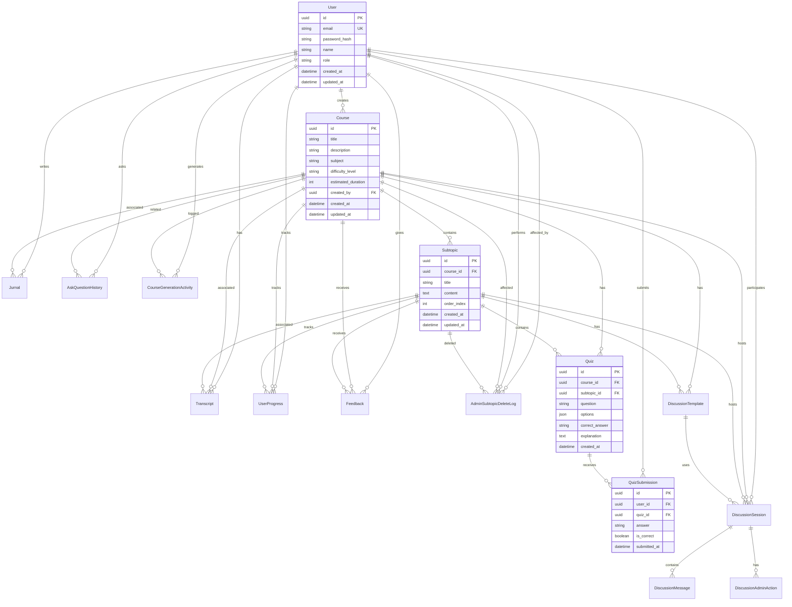
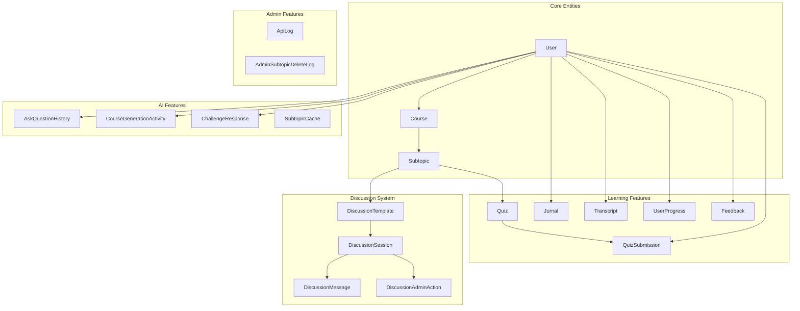

# Database Schema

Dokumentasi lengkap database PrincipleLearn V3 dengan Entity Relationship Diagram dan penjelasan setiap tabel.

---

## 🗄️ Database Overview

PrincipleLearn V3 saat ini menggunakan **Supabase PostgreSQL** sebagai database backend:

| Database | Purpose | Client |
|----------|---------|--------|
| **Supabase PostgreSQL** | Production & Development | `@/lib/database.ts` via `@supabase/supabase-js` |

> **Status update (Maret 2026)**: sumber kebenaran operasional adalah query pada route API dan endpoint admin activity. Dokumen ini mengikuti implementasi aktif tersebut.

---

## ✅ Operational Evidence Schema (Source of Truth)

Bagian ini adalah ringkasan tabel input user yang dipakai checklist implementasi, diselaraskan dengan route simpan + endpoint admin saat ini.

### `course_generation_activity`
- Writer: `src/app/api/generate-course/route.ts`
- Reader Admin: `src/app/api/admin/activity/generate-course/route.ts`
- Field inti: `id`, `user_id`, `course_id`, `request_payload (jsonb)`, `outline (jsonb)`, `created_at`

### `ask_question_history`
- Writer: `src/app/api/ask-question/route.ts`
- Reader Admin: `src/app/api/admin/activity/ask-question/route.ts`
- Field inti: `id`, `user_id`, `course_id`, `module_index`, `subtopic_index`, `page_number`, `subtopic_label`, `question`, `answer`, `reasoning_note`, `prompt_components (jsonb)`, `prompt_version`, `session_number`, `created_at`, `updated_at`

### `challenge_responses`
- Writer: `src/app/api/challenge-response/route.ts`
- Reader Admin: `src/app/api/admin/activity/challenge/route.ts`
- Field inti: `id`, `user_id`, `course_id`, `module_index`, `subtopic_index`, `page_number`, `question`, `answer`, `feedback`, `reasoning_note`, `created_at`, `updated_at`

### `quiz_submissions`
- Writer: `src/app/api/quiz/submit/route.ts`
- Reader Admin: `src/app/api/admin/activity/quiz/route.ts`, `src/app/api/admin/activity/quiz/[id]/route.ts`
- Field inti: `id`, `user_id`, `quiz_id`, `course_id`, `subtopic_id`, `module_index`, `subtopic_index`, `answer`, `is_correct`, `reasoning_note`, `created_at` (opsional kompatibilitas: `submitted_at`)
- Migrasi terkait: `docs/sql/add_quiz_submission_context_columns.sql`

### `feedback`
- Writer: `src/app/api/feedback/route.ts`
- Reader Admin: `src/app/api/admin/activity/feedback/route.ts`, fallback agregat `src/app/api/admin/evidence/route.ts`
- Field inti: `id`, `user_id`, `course_id`, `subtopic_id`, `module_index`, `subtopic_index`, `subtopic_label`, `rating`, `comment`, `created_at`

### `jurnal`
- Writer: `src/app/api/jurnal/save/route.ts`
- Reader Admin: `src/app/api/admin/activity/jurnal/route.ts`
- Field inti: `id`, `user_id`, `course_id`, `content`, `type`, `reflection`, `created_at`, `updated_at`

### `transcript`
- Writer: `src/app/api/transcript/save/route.ts`
- Reader Admin: `src/app/api/admin/activity/transcript/route.ts`
- Field inti: `id`, `user_id`, `course_id`, `subtopic_id`, `content`, `notes`, `created_at`, `updated_at`

### `discussion_sessions` + `discussion_messages`
- Writer: `src/app/api/discussion/start/route.ts`, `src/app/api/discussion/respond/route.ts`
- Reader Admin: `src/app/api/admin/discussions/route.ts`, `src/app/api/admin/discussions/[sessionId]/route.ts`, `src/app/api/admin/activity/discussion/route.ts`
- `discussion_sessions` field inti: `id`, `user_id`, `course_id`, `subtopic_id`, `status`, `phase`, `learning_goals (jsonb)`, `created_at`, `updated_at`
- `discussion_messages` field inti: `id`, `session_id`, `role`, `content`, `step_key`, `metadata (jsonb)`, `created_at`

### `learning_profiles`
- Writer: `src/app/api/learning-profile/route.ts`
- Reader Admin: `src/app/api/admin/activity/learning-profile/route.ts`
- Field inti: `id`, `user_id`, `display_name`, `programming_experience`, `learning_style`, `learning_goals`, `challenges`, `created_at`, `updated_at`

---

## 📊 Entity Relationship Diagram (ERD)



---

## 📋 Table Descriptions

### 1. User (users)

Tabel utama untuk menyimpan data pengguna.

| Column | Type | Constraints | Description |
|--------|------|-------------|-------------|
| `id` | UUID | PK, Auto-generated | Unique identifier |
| `email` | VARCHAR | UNIQUE, NOT NULL | Email address |
| `password_hash` | VARCHAR | NOT NULL | Bcrypt hashed password |
| `name` | VARCHAR | NULL | Display name |
| `role` | VARCHAR | DEFAULT 'user' | Role: 'user' atau 'ADMIN' |
| `created_at` | TIMESTAMP | DEFAULT NOW() | Creation timestamp |
| `updated_at` | TIMESTAMP | Auto-update | Last update timestamp |

**Relationships**:
- One-to-Many → Course (created courses)
- One-to-Many → Jurnal, Transcript, QuizSubmission, etc.

---

### 2. Course (courses)

Menyimpan informasi kursus yang di-generate oleh AI.

| Column | Type | Constraints | Description |
|--------|------|-------------|-------------|
| `id` | UUID | PK | Unique identifier |
| `title` | VARCHAR | NOT NULL | Course title |
| `description` | TEXT | NULL | Course description |
| `subject` | VARCHAR | NULL | Subject category |
| `difficulty_level` | VARCHAR | NULL | Beginner/Intermediate/Advanced |
| `estimated_duration` | INT | NULL | Minutes to complete |
| `created_by` | UUID | FK → users.id | Creator user |
| `created_at` | TIMESTAMP | DEFAULT NOW() | Creation timestamp |
| `updated_at` | TIMESTAMP | Auto-update | Last update |

---

### 3. Subtopic (subtopics)

Unit pembelajaran dalam sebuah course.

| Column | Type | Constraints | Description |
|--------|------|-------------|-------------|
| `id` | UUID | PK | Unique identifier |
| `course_id` | UUID | FK → courses.id | Parent course |
| `title` | VARCHAR | NOT NULL | Subtopic title |
| `content` | TEXT | NULL | AI-generated content |
| `order_index` | INT | NOT NULL | Display order |
| `created_at` | TIMESTAMP | DEFAULT NOW() | Creation timestamp |
| `updated_at` | TIMESTAMP | Auto-update | Last update |

---

### 4. Quiz (quiz)

Pertanyaan quiz untuk assessment.

| Column | Type | Constraints | Description |
|--------|------|-------------|-------------|
| `id` | UUID | PK | Unique identifier |
| `course_id` | UUID | FK → courses.id | Associated course |
| `subtopic_id` | UUID | FK → subtopics.id | Associated subtopic |
| `question` | TEXT | NOT NULL | Quiz question |
| `options` | JSON | NULL | Answer options array |
| `correct_answer` | VARCHAR | NULL | Correct answer |
| `explanation` | TEXT | NULL | Answer explanation |
| `created_at` | TIMESTAMP | DEFAULT NOW() | Creation timestamp |

**Options JSON Structure**:
```json
["Option A", "Option B", "Option C", "Option D"]
```

---

### 5. QuizSubmission (quiz_submissions)

Rekaman jawaban quiz dari user.

| Column | Type | Constraints | Description |
|--------|------|-------------|-------------|
| `id` | UUID | PK | Unique identifier |
| `user_id` | UUID | FK → users.id | User who submitted |
| `quiz_id` | UUID | FK → quiz.id | Answered quiz |
| `answer` | VARCHAR | NULL | User's answer |
| `is_correct` | BOOLEAN | NULL | Correctness flag |
| `submitted_at` | TIMESTAMP | DEFAULT NOW() | Submission time |

---

### 6. Jurnal (jurnal)

Learning journal untuk refleksi user.

| Column | Type | Constraints | Description |
|--------|------|-------------|-------------|
| `id` | UUID | PK | Unique identifier |
| `user_id` | UUID | FK → users.id | Journal owner |
| `course_id` | UUID | FK → courses.id | Related course |
| `content` | TEXT | NOT NULL | Journal content |
| `reflection` | TEXT | NULL | Reflection notes |
| `created_at` | TIMESTAMP | DEFAULT NOW() | Creation timestamp |
| `updated_at` | TIMESTAMP | Auto-update | Last update |

---

### 7. Transcript (transcript)

Catatan dan transkrip pembelajaran.

| Column | Type | Constraints | Description |
|--------|------|-------------|-------------|
| `id` | UUID | PK | Unique identifier |
| `user_id` | UUID | FK → users.id | Owner |
| `course_id` | UUID | FK → courses.id | Related course |
| `subtopic_id` | UUID | FK → subtopics.id | Related subtopic |
| `content` | TEXT | NOT NULL | Transcript content |
| `notes` | TEXT | NULL | Personal notes |
| `created_at` | TIMESTAMP | DEFAULT NOW() | Creation timestamp |
| `updated_at` | TIMESTAMP | Auto-update | Last update |

---

### 8. AskQuestionHistory (ask_question_history)

Riwayat pertanyaan Q&A dengan AI.

| Column | Type | Constraints | Description |
|--------|------|-------------|-------------|
| `id` | UUID | PK | Unique identifier |
| `user_id` | UUID | FK, INDEXED | User who asked |
| `course_id` | UUID | FK, INDEXED | Related course |
| `module_index` | INT | NULL | Module position |
| `subtopic_index` | INT | NULL | Subtopic position |
| `page_number` | INT | NULL | Page reference |
| `subtopic_label` | VARCHAR | NULL | Subtopic title |
| `question` | TEXT | NOT NULL | User's question |
| `answer` | TEXT | NOT NULL | AI's answer |
| `created_at` | TIMESTAMP | INDEXED | Timestamp |
| `updated_at` | TIMESTAMP | Auto-update | Last update |

**Indexes**:
- `idx_ask_question_history_user_id`
- `idx_ask_question_history_course_id`
- `idx_ask_question_history_created_at`
- `idx_ask_question_history_user_course`

---

### 9. UserProgress (user_progress)

Tracking progress pembelajaran user.

| Column | Type | Constraints | Description |
|--------|------|-------------|-------------|
| `id` | UUID | PK | Unique identifier |
| `user_id` | UUID | FK, INDEXED | User |
| `course_id` | UUID | FK | Course |
| `subtopic_id` | UUID | FK | Completed subtopic |
| `is_completed` | BOOLEAN | DEFAULT FALSE | Completion status |
| `completion_date` | TIMESTAMP | NULL | When completed |
| `created_at` | TIMESTAMP | DEFAULT NOW() | Creation timestamp |
| `updated_at` | TIMESTAMP | Auto-update | Last update |

---

### 10. Feedback (feedback)

Feedback dan rating dari user.

| Column | Type | Constraints | Description |
|--------|------|-------------|-------------|
| `id` | UUID | PK | Unique identifier |
| `user_id` | UUID | FK, INDEXED | Feedback giver |
| `course_id` | UUID | FK | Course |
| `subtopic_id` | UUID | FK, INDEXED | Subtopic |
| `module_index` | INT | NULL | Module position |
| `subtopic_index` | INT | NULL | Subtopic position |
| `subtopic_label` | VARCHAR | NULL | Subtopic title |
| `rating` | INT | NOT NULL | 1-5 rating |
| `comment` | TEXT | NULL | Feedback text |
| `created_at` | TIMESTAMP | DEFAULT NOW() | Creation timestamp |

---

### 11. ApiLog (api_logs)

Logging API requests untuk monitoring.

| Column | Type | Constraints | Description |
|--------|------|-------------|-------------|
| `id` | UUID | PK | Unique identifier |
| `method` | VARCHAR | NULL | HTTP method |
| `path` | VARCHAR | INDEXED | Request path |
| `query` | VARCHAR | NULL | Query string |
| `status_code` | INT | NULL | Response status |
| `duration_ms` | INT | NULL | Response time |
| `ip_address` | VARCHAR | NULL | Client IP |
| `user_agent` | VARCHAR | NULL | Browser info |
| `user_id` | VARCHAR | NULL | Authenticated user |
| `user_email` | VARCHAR | NULL | User email |
| `user_role` | VARCHAR | NULL | User role |
| `label` | VARCHAR | NULL | Custom label |
| `metadata` | JSON | NULL | Additional data |
| `error_message` | TEXT | NULL | Error details |
| `created_at` | TIMESTAMP | INDEXED | Log timestamp |

---

### 12. CourseGenerationActivity (course_generation_activity)

Log aktivitas pembuatan course AI.

| Column | Type | Constraints | Description |
|--------|------|-------------|-------------|
| `id` | UUID | PK | Unique identifier |
| `user_id` | UUID | FK, INDEXED | User who generated |
| `course_id` | UUID | FK | Generated course |
| `request_payload` | JSON | NOT NULL | Input parameters |
| `outline` | JSON | NOT NULL | Generated outline |
| `created_at` | TIMESTAMP | INDEXED | Generation time |

**Request Payload Structure**:
```json
{
  "topic": "Machine Learning",
  "goal": "Understanding basics",
  "level": "Beginner",
  "problem": "Career transition",
  "assumption": "Basic programming"
}
```

---

### 13. AdminSubtopicDeleteLog (admin_subtopic_delete_logs)

Audit log untuk penghapusan subtopic oleh admin.

| Column | Type | Constraints | Description |
|--------|------|-------------|-------------|
| `id` | UUID | PK | Unique identifier |
| `admin_id` | UUID | FK → users.id | Admin who deleted |
| `admin_email` | VARCHAR | NULL | Admin email |
| `user_id` | UUID | FK, INDEXED | Affected user |
| `course_id` | UUID | FK | Affected course |
| `subtopic_id` | UUID | FK, INDEXED | Deleted subtopic |
| `subtopic_title` | VARCHAR | NOT NULL | Deleted title |
| `note` | TEXT | NULL | Deletion reason |
| `created_at` | TIMESTAMP | DEFAULT NOW() | Deletion time |

---

### 14. DiscussionTemplate (discussion_templates)

Template untuk Socratic discussion.

| Column | Type | Constraints | Description |
|--------|------|-------------|-------------|
| `id` | UUID | PK | Unique identifier |
| `course_id` | UUID | FK, NOT NULL | Parent course |
| `subtopic_id` | UUID | FK, NOT NULL | Parent subtopic |
| `version` | VARCHAR | NOT NULL | Template version |
| `source` | JSON | NOT NULL | Source material |
| `template` | JSON | NOT NULL | Discussion structure |
| `generated_by` | VARCHAR | DEFAULT 'auto' | Generation method |
| `status` | VARCHAR | DEFAULT 'ready' | Template status |
| `created_at` | TIMESTAMP | DEFAULT NOW() | Creation time |

**Unique Constraint**: `(subtopic_id, version)`

---

### 15. DiscussionSession (discussion_sessions)

Sesi diskusi aktif user.

| Column | Type | Constraints | Description |
|--------|------|-------------|-------------|
| `id` | UUID | PK | Unique identifier |
| `user_id` | UUID | FK, NOT NULL | Participant |
| `course_id` | UUID | FK, NOT NULL | Course context |
| `subtopic_id` | UUID | FK, NOT NULL | Subtopic context |
| `template_id` | UUID | FK, NOT NULL | Used template |
| `status` | VARCHAR | NOT NULL | active/completed |
| `phase` | VARCHAR | NOT NULL | Current phase |
| `learning_goals` | JSON | NOT NULL | Session goals |
| `created_at` | TIMESTAMP | DEFAULT NOW() | Start time |
| `updated_at` | TIMESTAMP | Auto-update | Last activity |

**Unique Constraint**: `(user_id, subtopic_id)`

---

### 16. DiscussionMessage (discussion_messages)

Pesan dalam sesi diskusi.

| Column | Type | Constraints | Description |
|--------|------|-------------|-------------|
| `id` | UUID | PK | Unique identifier |
| `session_id` | UUID | FK, INDEXED | Parent session |
| `role` | VARCHAR | NOT NULL | 'user' atau 'assistant' |
| `content` | TEXT | NOT NULL | Message content |
| `step_key` | VARCHAR | NULL | Discussion step |
| `metadata` | JSON | NOT NULL | Additional data |
| `created_at` | TIMESTAMP | INDEXED | Message time |

---

### 17. DiscussionAdminAction (discussion_admin_actions)

Audit log untuk aksi admin pada diskusi.

| Column | Type | Constraints | Description |
|--------|------|-------------|-------------|
| `id` | UUID | PK | Unique identifier |
| `session_id` | UUID | FK, INDEXED | Affected session |
| `admin_id` | VARCHAR | NULL | Admin identifier |
| `admin_email` | VARCHAR | NULL | Admin email |
| `action` | VARCHAR | NULL | Action type |
| `payload` | JSON | NULL | Action details |
| `created_at` | TIMESTAMP | DEFAULT NOW() | Action time |

---

### 18. SubtopicCache (subtopic_cache)

Cache untuk konten subtopic AI-generated.

| Column | Type | Constraints | Description |
|--------|------|-------------|-------------|
| `id` | UUID | PK | Unique identifier |
| `cache_key` | VARCHAR | UNIQUE | Cache identifier |
| `content` | JSON | NOT NULL | Cached content |
| `created_at` | TIMESTAMP | INDEXED | Cache time |
| `updated_at` | TIMESTAMP | Auto-update | Last update |

---

### 19. ChallengeResponse (challenge_responses)

Respons user terhadap challenge questions.

| Column | Type | Constraints | Description |
|--------|------|-------------|-------------|
| `id` | VARCHAR | PK | Unique identifier |
| `user_id` | VARCHAR | INDEXED | Responder |
| `course_id` | VARCHAR | INDEXED | Course context |
| `module_index` | INT | NULL | Module position |
| `subtopic_index` | INT | NULL | Subtopic position |
| `page_number` | INT | NULL | Page reference |
| `question` | TEXT | NOT NULL | Challenge question |
| `answer` | TEXT | NOT NULL | User's answer |
| `feedback` | TEXT | NULL | AI feedback |
| `created_at` | TIMESTAMP | INDEXED | Response time |
| `updated_at` | TIMESTAMP | Auto-update | Last update |

---

## 🔗 Relationship Summary



---

## 📈 Indexing Strategy

| Table | Index | Columns | Purpose |
|-------|-------|---------|---------|
| ask_question_history | idx_user_id | user_id | User queries |
| ask_question_history | idx_course_id | course_id | Course queries |
| ask_question_history | idx_user_course | user_id, course_id | Combined queries |
| user_progress | idx_user_id | user_id | Progress lookup |
| feedback | idx_user_id | user_id | User feedback |
| feedback | idx_subtopic_id | subtopic_id | Subtopic feedback |
| api_logs | idx_path | path | API analytics |
| api_logs | idx_created_at | created_at | Time queries |
| course_generation_activity | idx_user_id | user_id | User history |
| discussion_messages | idx_session_created | session_id, created_at | Message order |

---

## 🔄 Database Access

### Using adminDb

Setiap operasi database menggunakan wrapper `adminDb` yang menyediakan Supabase-like API:

```typescript
import { adminDb } from '@/lib/database';

// Query records
const { data, error } = await adminDb
  .from('users')
  .select('*')
  .eq('role', 'user')
  .limit(10);

// Insert record
const { data, error } = await adminDb
  .from('courses')
  .insert({ title: 'New Course', created_by: userId });

// Update record
const { error } = await adminDb
  .from('users')
  .eq('id', userId)
  .update({ name: 'New Name' });

// Delete record
const { error } = await adminDb
  .from('feedback')
  .eq('id', feedbackId)
  .delete();
```

### Notion Database IDs

Database IDs dikonfigurasi di `src/lib/database.ts`:

| Table | Environment Variable |
|-------|---------------------|
| users | `NOTION_USERS_DB_ID` |
| courses | `NOTION_COURSES_DB_ID` |
| subtopics | `NOTION_SUBTOPICS_DB_ID` |
| quiz | `NOTION_QUIZ_DB_ID` |
| discussion_sessions | `NOTION_DISCUSSION_SESSIONS_DB_ID` |
| ... | ... |

---

*Dokumentasi ini terakhir diperbarui: Februari 2026*
