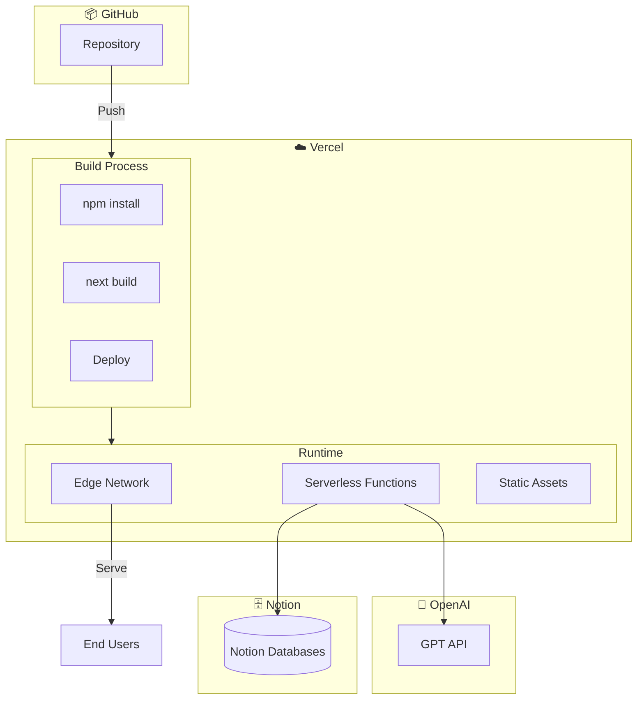
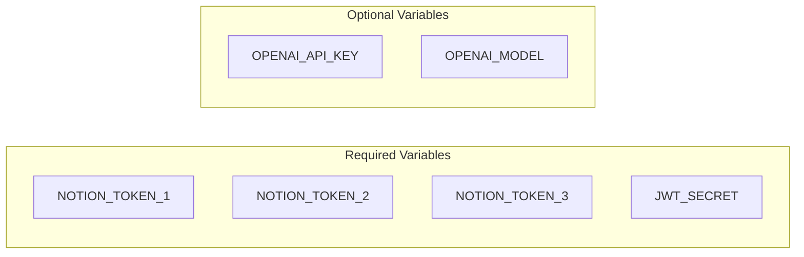
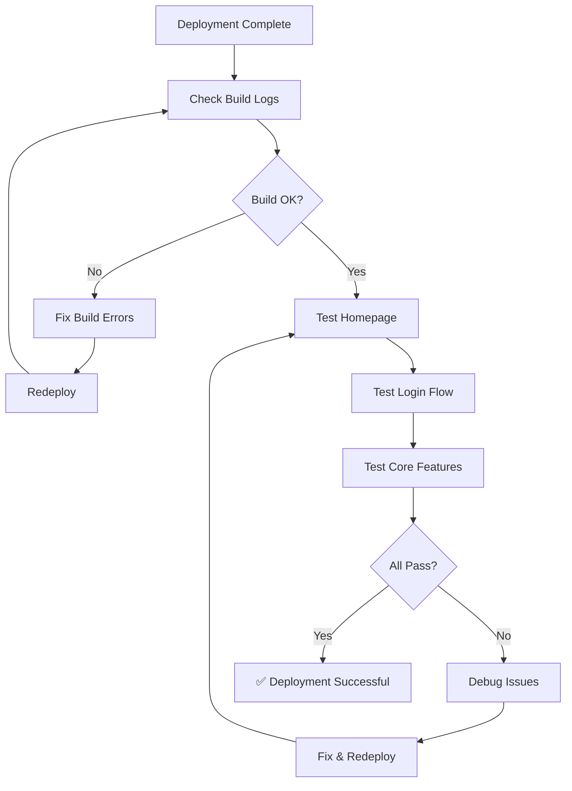
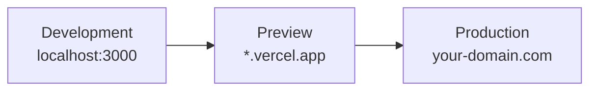
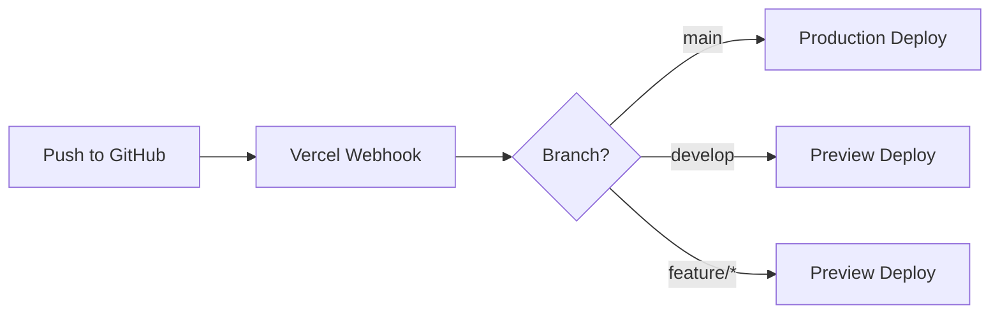
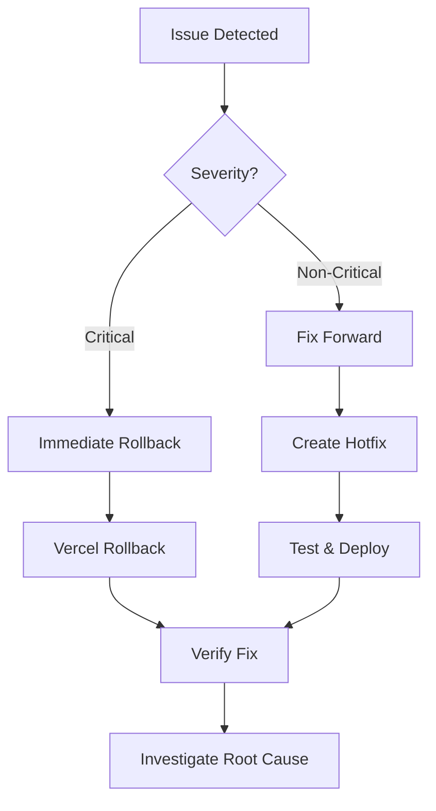

# Deployment Guide

Panduan lengkap untuk deployment PrincipleLearn V3 ke production.

---

## 📋 Pre-Deployment Checklist

### Build Verification

- [ ] `npm run build` completes without errors
- [ ] All TypeScript errors resolved
- [ ] No ESLint warnings/errors
- [ ] SSR compatibility checked (no `window` access without guards)

### Environment Variables

- [ ] All required environment variables documented
- [ ] Production values prepared (not committed)
- [ ] Secrets are secure and unique for production

### Database

- [ ] Notion integration tokens configured
- [ ] All Notion databases created and shared
- [ ] Admin user seeded

### Testing

- [ ] All API endpoints tested
- [ ] Authentication flow verified
- [ ] Key user flows tested
- [ ] Mobile responsiveness checked

---

## 🏗️ Deployment Architecture



---

## 🚀 Vercel Deployment

### Step 1: Prepare Repository

```bash
# Ensure all changes are committed
git status
git add .
git commit -m "chore: prepare for deployment"

# Push to GitHub
git push origin main
```

### Step 2: Connect to Vercel

1. Go to [vercel.com](https://vercel.com)
2. Click "New Project"
3. Import from GitHub: `GlennAyden/PrincipleLearnV2`
4. Framework Preset: **Next.js** (auto-detected)

### Step 3: Configure Environment Variables

Add these in Vercel Dashboard → Settings → Environment Variables:



#### Required Variables

| Variable | Description | Example |
|----------|-------------|---------|
| `NOTION_TOKEN_1` | Notion integration token #1 | `ntn_xxxx...` |
| `NOTION_TOKEN_2` | Notion integration token #2 | `ntn_xxxx...` |
| `NOTION_TOKEN_3` | Notion integration token #3 | `ntn_xxxx...` |
| `JWT_SECRET` | JWT signing secret | `random-64-char-string` |

#### Optional Variables

| Variable | Description | Default |
|----------|-------------|---------|
| `OPENAI_API_KEY` | OpenAI API key | - |
| `OPENAI_MODEL` | OpenAI model to use | `gpt-5-mini` |

### Step 4: Generate Secure Secrets

```bash
# Generate JWT secret
node -e "console.log(require('crypto').randomBytes(64).toString('hex'))"
```

### Step 5: Deploy

Click **Deploy** and wait for the build to complete.

---

## 🔧 Build Configuration

### vercel.json

```json
{
  "functions": {
    "src/app/api/**/*.ts": {
      "maxDuration": 60
    }
  }
}
```

### next.config.ts

```typescript
import type { NextConfig } from 'next';

const nextConfig: NextConfig = {
  reactStrictMode: true,
  // Add any production-specific config here
};

export default nextConfig;
```

---

## 🗄️ Database Setup

### Notion Production Setup

1. **Create Notion Integration**
   - Go to [notion.so/my-integrations](https://www.notion.so/my-integrations)
   - Create 3 integrations for rate limit handling
   - Note the integration tokens

2. **Setup Notion Databases**
   ```bash
   npx ts-node scripts/setup-notion-databases.ts
   ```

3. **Share Databases**
   - Ensure all databases are shared with your integration

---

## 📊 Post-Deployment Verification

### Health Check Endpoints

```bash
# Test database connection
curl https://your-app.vercel.app/api/test-db

# Test API health
curl https://your-app.vercel.app/api/auth/me
```

### Verification Checklist



### Page Testing

| Page | URL | Expected |
|------|-----|----------|
| Homepage | `/` | Landing page loads |
| Login | `/login` | Login form displays |
| Signup | `/signup` | Registration works |
| Dashboard | `/dashboard` | Redirects if not logged in |
| Admin | `/admin/login` | Admin login works |

---

## 🔄 Environment Management

### Environment Tiers



### Environment Variables per Tier

| Variable | Development | Preview | Production |
|----------|-------------|---------|------------|
| `NOTION_TOKEN_*` | Test tokens | Staging tokens | Production tokens |
| `JWT_SECRET` | Simple secret | Staging secret | Strong unique secret |
| `OPENAI_API_KEY` | Test key | Test key | Production key |

### Vercel Environment Scopes

When adding environment variables in Vercel:
- **Production**: Only production deployments
- **Preview**: Preview/staging deployments
- **Development**: Local development (via `vercel env pull`)

---

## 📈 Monitoring & Logging

### Vercel Analytics

1. Enable Vercel Analytics in project settings
2. Monitor:
   - Page load times
   - Web Vitals
   - Visitor metrics

### API Logs

PrincipleLearn logs API requests to `api_logs` table:

```sql
-- View recent API logs
SELECT * FROM api_logs 
ORDER BY created_at DESC 
LIMIT 100;

-- Check error rates
SELECT 
  DATE(created_at) as date,
  COUNT(*) as total,
  SUM(CASE WHEN status_code >= 400 THEN 1 ELSE 0 END) as errors
FROM api_logs
GROUP BY DATE(created_at)
ORDER BY date DESC;
```

### Error Tracking

Consider adding error tracking services:
- Sentry
- LogRocket
- Vercel Error Tracking

---

## 🔐 Security Hardening

### Production Security Checklist

- [ ] JWT secret is unique and complex (64+ chars)
- [ ] All API keys are production-only
- [ ] RLS policies are enabled and tested
- [ ] Admin accounts use strong passwords
- [ ] CORS is properly configured
- [ ] Rate limiting is enabled
- [ ] HTTPS enforced (automatic on Vercel)

### Security Headers

Vercel adds security headers automatically. Additional headers can be configured:

```javascript
// next.config.ts
const nextConfig = {
  async headers() {
    return [
      {
        source: '/:path*',
        headers: [
          { key: 'X-Frame-Options', value: 'DENY' },
          { key: 'X-Content-Type-Options', value: 'nosniff' },
          { key: 'Referrer-Policy', value: 'origin-when-cross-origin' },
        ],
      },
    ];
  },
};
```

---

## 🔄 CI/CD Pipeline

### Automatic Deployments



### Deployment Triggers

| Action | Result |
|--------|--------|
| Push to `main` | Production deployment |
| Push to other branches | Preview deployment |
| Pull request | Preview deployment with comment |

---

## 🔙 Rollback Procedures

### Via Vercel Dashboard

1. Go to Deployments tab
2. Find previous working deployment
3. Click "..." → "Promote to Production"

### Via Git

```bash
# Revert to previous commit
git revert HEAD
git push origin main

# Or reset to specific commit
git reset --hard <commit-hash>
git push origin main --force
# ⚠️ Force push with caution!
```

### Emergency Rollback



---

## 📋 Deployment Checklist Summary

```markdown
## Pre-Deployment
- [ ] Code reviewed and merged to main
- [ ] All tests passing
- [ ] Build completes locally
- [ ] Environment variables prepared
- [ ] Database migrations applied

## Deployment
- [ ] Push to main branch
- [ ] Monitor Vercel build
- [ ] Check deployment logs

## Post-Deployment
- [ ] Verify homepage loads
- [ ] Test authentication
- [ ] Test core user flows
- [ ] Check admin panel
- [ ] Verify AI features work
- [ ] Monitor error logs

## Documentation
- [ ] Update changelog
- [ ] Tag release version
- [ ] Notify stakeholders
```

---

## 🆘 Troubleshooting

### Common Issues

| Issue | Solution |
|-------|----------|
| Build fails | Check build logs, fix TypeScript/ESLint errors |
| Environment variables not found | Verify spelling and scopes in Vercel |
| Database connection fails | Check Notion tokens and database sharing |
| 500 errors in production | Check function logs in Vercel |
| Authentication not working | Verify JWT_SECRET matches |

### Debug Commands

```bash
# Check Vercel deployment status
vercel ls

# Pull environment variables
vercel env pull

# View production logs
vercel logs

# Redeploy
vercel --prod
```

---

*Dokumentasi ini terakhir diperbarui: Februari 2026*
