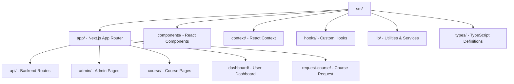
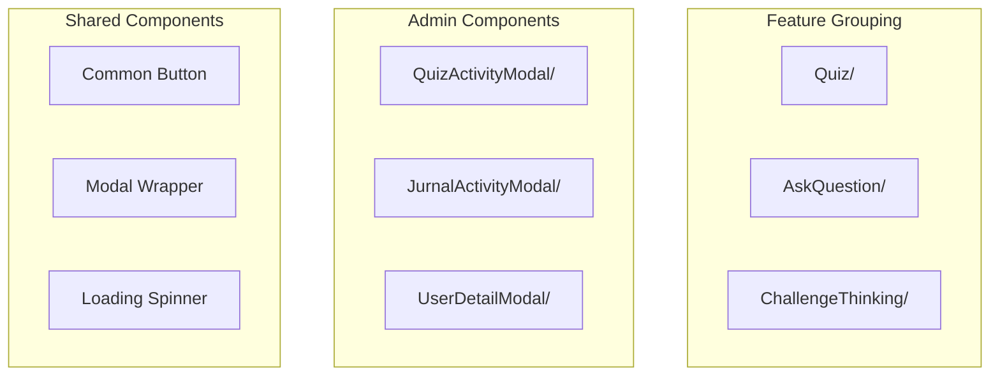
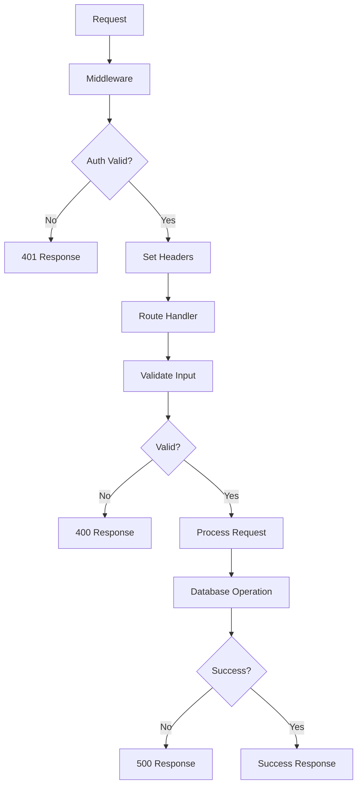
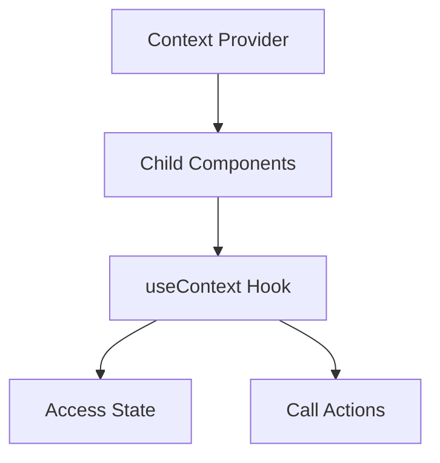
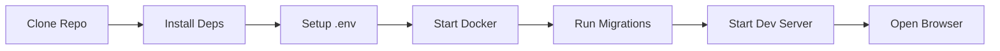

# Development Guide

Panduan lengkap untuk pengembangan PrincipleLearn V3.

---

## 📋 Table of Contents

1. [Project Structure](#project-structure)
2. [Coding Standards](#coding-standards)
3. [Component Patterns](#component-patterns)
4. [API Route Patterns](#api-route-patterns)
5. [Database Patterns](#database-patterns)
6. [State Management](#state-management)
7. [Error Handling](#error-handling)
8. [Testing Guidelines](#testing-guidelines)

---

## 📁 Project Structure

### Root Directory

```
PrincipleLearnV2/
├── .claude/               # Claude AI configuration
├── .next/                 # Next.js build output (gitignored)
├── docs/                  # 📖 Documentation
├── node_modules/          # Dependencies (gitignored)
├── public/                # 📂 Static assets
├── scripts/               # 📜 Utility scripts
├── src/                   # 📱 Source code
├── .env.local             # Environment variables (gitignored)
├── middleware.ts          # 🔐 Auth middleware
├── next.config.ts         # Next.js configuration
├── package.json           # Dependencies
└── tsconfig.json          # TypeScript configuration
```

### Source Directory (`src/`)



---

## ✨ Coding Standards

### TypeScript

1. **Use strict mode** - Enabled by default in `tsconfig.json`
2. **Explicit types** - Avoid `any`, use proper typing

```typescript
// ❌ Bad
const handleClick = (data: any) => { ... }

// ✅ Good
interface UserData {
  id: string;
  email: string;
  name?: string;
}
const handleClick = (data: UserData) => { ... }
```

3. **Interface vs Type**
   - Use `interface` for objects that can be extended
   - Use `type` for unions, primitives, or complex types

```typescript
// Interface for extensible objects
interface User {
  id: string;
  email: string;
}

interface AdminUser extends User {
  permissions: string[];
}

// Type for unions
type Level = 'Beginner' | 'Intermediate' | 'Advanced';
```

### Naming Conventions

| Type | Convention | Example |
|------|------------|---------|
| Components | PascalCase | `QuizComponent.tsx` |
| Functions | camelCase | `handleSubmit()` |
| Constants | UPPER_SNAKE_CASE | `API_BASE_URL` |
| Files (components) | PascalCase | `Quiz.tsx` |
| Files (utilities) | camelCase | `database.ts` |
| Directories | lowercase | `components/` |
| CSS Modules | kebab-case | `.quiz-container` |

### Path Aliases

Use `@/` alias untuk imports dari `src/`:

```typescript
// ❌ Bad
import { DatabaseService } from '../../../lib/database';

// ✅ Good
import { DatabaseService } from '@/lib/database';
```

---

## 🧩 Component Patterns

### Component Structure

Setiap komponen memiliki file `.tsx` dan `.module.scss`:

```
components/
└── Quiz/
    ├── Quiz.tsx           # Component logic
    └── Quiz.module.scss   # Scoped styles
```

### Component Template

```tsx
// Quiz.tsx
'use client';

import { useState } from 'react';
import styles from './Quiz.module.scss';

interface QuizProps {
  question: string;
  options: string[];
  onSubmit: (answer: string) => void;
}

export default function Quiz({ question, options, onSubmit }: QuizProps) {
  const [selectedOption, setSelectedOption] = useState<string | null>(null);

  const handleSubmit = () => {
    if (selectedOption) {
      onSubmit(selectedOption);
    }
  };

  return (
    <div className={styles.container}>
      <h3 className={styles.question}>{question}</h3>
      <div className={styles.options}>
        {options.map((option, index) => (
          <button
            key={index}
            className={`${styles.option} ${
              selectedOption === option ? styles.selected : ''
            }`}
            onClick={() => setSelectedOption(option)}
          >
            {option}
          </button>
        ))}
      </div>
      <button 
        className={styles.submitButton} 
        onClick={handleSubmit}
        disabled={!selectedOption}
      >
        Submit
      </button>
    </div>
  );
}
```

### Sass Module Template

```scss
// Quiz.module.scss
.container {
  padding: 1.5rem;
  border-radius: 8px;
  background: var(--card-background);
}

.question {
  font-size: 1.25rem;
  margin-bottom: 1rem;
}

.options {
  display: flex;
  flex-direction: column;
  gap: 0.5rem;
}

.option {
  padding: 1rem;
  border: 2px solid var(--border-color);
  border-radius: 4px;
  background: transparent;
  cursor: pointer;
  transition: all 0.2s ease;

  &:hover {
    border-color: var(--primary-color);
  }

  &.selected {
    border-color: var(--primary-color);
    background: var(--primary-light);
  }
}

.submitButton {
  margin-top: 1rem;
  padding: 1rem 2rem;
  background: var(--primary-color);
  color: white;
  border: none;
  border-radius: 4px;
  cursor: pointer;

  &:disabled {
    opacity: 0.5;
    cursor: not-allowed;
  }
}
```

### Component Organization



---

## 🔌 API Route Patterns

### Route Handler Template

```typescript
// src/app/api/example/route.ts
import { NextRequest, NextResponse } from 'next/server';
import { DatabaseService } from '@/lib/database';

export async function GET(request: NextRequest) {
  try {
    // Get user from middleware headers
    const userId = request.headers.get('x-user-id');
    
    if (!userId) {
      return NextResponse.json(
        { error: 'Unauthorized' },
        { status: 401 }
      );
    }

    // Fetch data
    const data = await DatabaseService.getRecords('table_name', {
      filter: { user_id: userId }
    });

    return NextResponse.json({
      success: true,
      data
    });

  } catch (error) {
    console.error('API Error:', error);
    return NextResponse.json(
      { error: 'Internal server error' },
      { status: 500 }
    );
  }
}

export async function POST(request: NextRequest) {
  try {
    const userId = request.headers.get('x-user-id');
    const body = await request.json();

    // Validate input
    if (!body.requiredField) {
      return NextResponse.json(
        { error: 'Missing required field' },
        { status: 400 }
      );
    }

    // Process request
    const result = await DatabaseService.insertRecord('table_name', {
      user_id: userId,
      ...body
    });

    return NextResponse.json({
      success: true,
      data: result
    }, { status: 201 });

  } catch (error) {
    console.error('API Error:', error);
    return NextResponse.json(
      { error: 'Internal server error' },
      { status: 500 }
    );
  }
}
```

### Admin Route Pattern

```typescript
// src/app/api/admin/example/route.ts
import { NextRequest, NextResponse } from 'next/server';
import { adminDb } from '@/lib/database';

export async function GET(request: NextRequest) {
  try {
    // Verify admin role (also checked in middleware)
    const userRole = request.headers.get('x-user-role');
    
    if (userRole !== 'ADMIN') {
      return NextResponse.json(
        { error: 'Forbidden' },
        { status: 403 }
      );
    }

    // Use adminDb for elevated access
    const { data, error } = await adminDb
      .from('users')
      .select('*')
      .order('created_at', { ascending: false });

    if (error) throw error;

    return NextResponse.json({
      success: true,
      data
    });

  } catch (error) {
    console.error('Admin API Error:', error);
    return NextResponse.json(
      { error: 'Internal server error' },
      { status: 500 }
    );
  }
}
```

### API Route Flow



---

## 🗄️ Database Patterns

### DatabaseService Usage

```typescript
import { DatabaseService, DatabaseError } from '@/lib/database';

// Get records
const users = await DatabaseService.getRecords<User>('users', {
  select: 'id, email, name',
  filter: { role: 'user' },
  orderBy: { column: 'created_at', ascending: false },
  limit: 10,
  useServiceRole: true  // default: true
});

// Insert record
const newUser = await DatabaseService.insertRecord<User>('users', {
  email: 'user@example.com',
  password_hash: hashedPassword,
  name: 'John Doe'
});

// Update record
const updated = await DatabaseService.updateRecord<User>(
  'users',
  userId,
  { name: 'New Name' },
  'id'  // id column name
);

// Delete record
await DatabaseService.deleteRecord('users', userId);
```

### Error Handling

```typescript
try {
  const result = await DatabaseService.getRecords('table');
} catch (error) {
  if (error instanceof DatabaseError) {
    console.error('Database error:', error.message);
    console.error('Original error:', error.originalError);
  }
}
```

### adminDb Usage (Notion Backend)

```typescript
import { adminDb } from '@/lib/database';

// Query (Supabase-like chaining syntax)
const { data: users, error } = await adminDb
  .from('users')
  .select('*')
  .eq('role', 'user')
  .order('created_at', { ascending: false })
  .limit(10);

// Insert
const { data: user } = await adminDb
  .from('users')
  .insert({
    email: 'user@example.com',
    password_hash: hashedPassword,
    name: 'John Doe'
  });

// Update
await adminDb
  .from('users')
  .eq('id', userId)
  .update({ name: 'New Name' });

// Delete
await adminDb
  .from('users')
  .eq('id', userId)
  .delete();
```

---

## 🔄 State Management

### Context Pattern



### Creating Context

```typescript
// src/context/ExampleContext.tsx
'use client';

import { createContext, useContext, useState, ReactNode } from 'react';

interface ExampleState {
  value: string;
  count: number;
}

interface ExampleContextType {
  state: ExampleState;
  setValue: (value: string) => void;
  increment: () => void;
  reset: () => void;
}

const ExampleContext = createContext<ExampleContextType | null>(null);

export function ExampleProvider({ children }: { children: ReactNode }) {
  const [state, setState] = useState<ExampleState>({
    value: '',
    count: 0
  });

  const setValue = (value: string) => {
    setState(prev => ({ ...prev, value }));
  };

  const increment = () => {
    setState(prev => ({ ...prev, count: prev.count + 1 }));
  };

  const reset = () => {
    setState({ value: '', count: 0 });
  };

  return (
    <ExampleContext.Provider value={{ state, setValue, increment, reset }}>
      {children}
    </ExampleContext.Provider>
  );
}

export function useExample() {
  const context = useContext(ExampleContext);
  if (!context) {
    throw new Error('useExample must be used within ExampleProvider');
  }
  return context;
}
```

### Using Context

```tsx
// In component
import { useExample } from '@/context/ExampleContext';

export default function MyComponent() {
  const { state, setValue, increment } = useExample();

  return (
    <div>
      <p>Value: {state.value}</p>
      <p>Count: {state.count}</p>
      <button onClick={() => setValue('new value')}>Set Value</button>
      <button onClick={increment}>Increment</button>
    </div>
  );
}
```

---

## ❌ Error Handling

### API Error Response Pattern

```typescript
// src/lib/api-error.ts
export class ApiError extends Error {
  constructor(
    message: string,
    public statusCode: number,
    public code?: string
  ) {
    super(message);
    this.name = 'ApiError';
  }
}

export function handleApiError(error: unknown) {
  console.error('API Error:', error);

  if (error instanceof ApiError) {
    return NextResponse.json(
      { error: error.message, code: error.code },
      { status: error.statusCode }
    );
  }

  if (error instanceof DatabaseError) {
    return NextResponse.json(
      { error: 'Database error', code: 'DATABASE_ERROR' },
      { status: 500 }
    );
  }

  return NextResponse.json(
    { error: 'Internal server error', code: 'INTERNAL_ERROR' },
    { status: 500 }
  );
}
```

### Client-Side Error Handling

```typescript
async function fetchData() {
  try {
    const response = await fetch('/api/example');
    
    if (!response.ok) {
      const error = await response.json();
      throw new Error(error.message || 'Request failed');
    }
    
    return await response.json();
  } catch (error) {
    if (error instanceof Error) {
      // Handle specific error types
      console.error('Fetch error:', error.message);
      showToast('error', error.message);
    }
    throw error;
  }
}
```

### Error Boundary Pattern

```tsx
// src/components/ErrorBoundary.tsx
'use client';

import { Component, ReactNode } from 'react';

interface Props {
  children: ReactNode;
  fallback?: ReactNode;
}

interface State {
  hasError: boolean;
  error?: Error;
}

export class ErrorBoundary extends Component<Props, State> {
  state: State = { hasError: false };

  static getDerivedStateFromError(error: Error): State {
    return { hasError: true, error };
  }

  componentDidCatch(error: Error, errorInfo: React.ErrorInfo) {
    console.error('Error caught:', error, errorInfo);
  }

  render() {
    if (this.state.hasError) {
      return this.props.fallback || (
        <div>
          <h2>Something went wrong</h2>
          <button onClick={() => this.setState({ hasError: false })}>
            Try again
          </button>
        </div>
      );
    }

    return this.props.children;
  }
}
```

---

## 🧪 Testing Guidelines

### Running Tests

```bash
# Test database connection
curl http://localhost:3000/api/test-db

# Test CRUD operations
node test-crud-operations.js
```

### API Testing Pattern

```bash
# Test API endpoint
curl -X GET http://localhost:3000/api/test-db

# Test with authentication
curl -X GET http://localhost:3000/api/courses \
  -H "Cookie: access_token=jwt-token-here"

# Test POST request
curl -X POST http://localhost:3000/api/example \
  -H "Content-Type: application/json" \
  -H "Cookie: access_token=jwt-token-here" \
  -d '{"field": "value"}'
```

### Component Testing Checklist

- [ ] Component renders without errors
- [ ] Props are correctly typed
- [ ] Event handlers work correctly
- [ ] Loading states display properly
- [ ] Error states handle gracefully
- [ ] Accessibility requirements met

---

## 🔧 Development Workflow

### Starting Development



```bash
# 1. Install dependencies
npm install

# 2. Setup environment
cp env.example .env.local
# Edit .env.local

# 3. Start development
npm run dev
```

### Adding New Feature

1. **Create component files**
   ```
   src/components/NewFeature/
   ├── NewFeature.tsx
   └── NewFeature.module.scss
   ```

2. **Create API route** (if needed)
   ```
   src/app/api/new-feature/route.ts
   ```

3. **Add types** (if needed)
   ```
   src/types/new-feature.ts
   ```

4. **Update documentation**

---

## 📝 Code Review Checklist

- [ ] TypeScript types are properly defined
- [ ] No `any` types without justification
- [ ] Components follow established patterns
- [ ] API routes have proper error handling
- [ ] Database operations use DatabaseService
- [ ] Styles use Sass modules
- [ ] Code is properly formatted
- [ ] No console.log in production code
- [ ] Tests pass
- [ ] Documentation updated if needed

---

*Dokumentasi ini terakhir diperbarui: Februari 2026*
