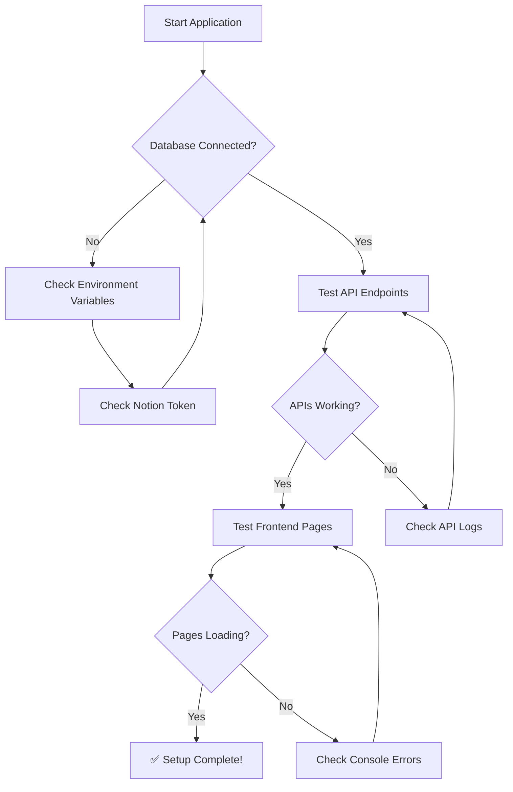

# Getting Started

Panduan lengkap untuk instalasi dan setup PrincipleLearn V3.

---

## 📋 Prerequisites

Sebelum memulai, pastikan Anda memiliki:

| Requirement | Version | Keterangan |
|-------------|---------|------------|
| **Node.js** | 18+ | Runtime JavaScript |
| **npm** | 9+ | Package manager |
| **Git** | Latest | Version control |
| **Code Editor** | - | VS Code recommended |

---

## 🚀 Installation Steps

### 1. Clone Repository

```bash
git clone https://github.com/GlennAyden/PrincipleLearnV2.git
cd PrincipleLearnV2
```

### 2. Install Dependencies

```bash
npm install
```

### 3. Setup Environment Variables

Copy file environment example:

```bash
cp env.example .env.local
```

Edit `.env.local` dengan nilai yang sesuai:

```env
# ====================================
# NOTION CONFIGURATION (Required)
# ====================================
# Multi-token untuk rate limit handling (3 tokens = 9 req/s)
NOTION_TOKEN_1=ntn_xxxxxxxxxxxxxxxxxxxxxxxxxxxxxxxxxx
NOTION_TOKEN_2=ntn_xxxxxxxxxxxxxxxxxxxxxxxxxxxxxxxxxx
NOTION_TOKEN_3=ntn_xxxxxxxxxxxxxxxxxxxxxxxxxxxxxxxxxx

# ====================================
# JWT CONFIGURATION
# ====================================
JWT_SECRET=your-jwt-secret-key-here

# ====================================
# OPENAI (Required for AI features)
# ====================================
OPENAI_API_KEY=your-openai-api-key-here
OPENAI_MODEL=gpt-5-mini
```

---

## 🗄️ Database Setup (Notion)

PrincipleLearn V3 menggunakan **Notion** sebagai database backend.

### 1. Buat Notion Integration

1. Kunjungi [notion.so/my-integrations](https://www.notion.so/my-integrations)
2. Klik "New integration"
3. Beri nama (contoh: "PrincipleLearn")
4. Copy "Internal Integration Token" → ini adalah `NOTION_TOKEN`
5. Ulangi untuk membuat 2 token lagi (untuk rate limit handling)

### 2. Setup Notion Databases

Jalankan script setup untuk membuat databases:

```bash
npx ts-node scripts/setup-notion-databases.ts
```

> **Note**: Pastikan tokens sudah dikonfigurasi di `.env.local` sebelum menjalankan script.

### 3. Share Databases dengan Integration

Setelah databases dibuat, pastikan setiap database di-share dengan integration:
1. Buka database di Notion
2. Klik "..." → "Connections" → Tambahkan integration Anda

---

## 🏃 Running the Application

### Development Mode

```bash
npm run dev
```

Buka [http://localhost:3000](http://localhost:3000) di browser.

### Production Build

```bash
npm run build
npm run start
```

---

## 🔧 Available Scripts

| Script | Command | Deskripsi |
|--------|---------|-----------|
| `dev` | `npm run dev` | Start development server |
| `dev:no-lint` | `npm run dev:no-lint` | Dev server tanpa linting |
| `build` | `npm run build` | Build untuk production |
| `start` | `npm run start` | Start production server |
| `lint` | `npm run lint` | Run ESLint |

---

## 🔍 Verification Steps

Setelah setup selesai, verifikasi dengan langkah berikut:

### 1. Test Database Connection

```bash
curl http://localhost:3000/api/test-db
```

Expected response:
```json
{
  "status": "connected",
  "message": "Database connection successful"
}
```

### 2. Test Application Pages

| Page | URL | Expected |
|------|-----|----------|
| Homepage | `http://localhost:3000` | Landing page |
| Login | `http://localhost:3000/login` | Login form |
| Admin Login | `http://localhost:3000/admin/login` | Admin login form |

### 3. Verification Flowchart



---

## 🆘 Common Issues

### "Module not found" errors
```bash
rm -rf node_modules
npm install
```

### Database connection failed
- Pastikan Notion tokens sudah benar di `.env.local`
- Verify databases sudah di-share dengan integration

### Port already in use
```bash
# Kill process on port 3000
npx kill-port 3000
```

### Rate limit errors
- Gunakan 3 Notion tokens untuk distributed rate limiting
- Lihat [Notion Rate Limit Handling](../docs/notion-rate-limits.md)

Untuk masalah lainnya, lihat [Troubleshooting](./TROUBLESHOOTING.md).

---

## 📚 Next Steps

Setelah setup berhasil:

1. 📖 Pelajari [Architecture](./ARCHITECTURE.md) untuk memahami struktur sistem
2. 🗄️ Review [Database Schema](./DATABASE_SCHEMA.md) untuk memahami data model
3. 🔌 Eksplorasi [API Reference](./API_REFERENCE.md) untuk endpoint yang tersedia
4. 👨‍💻 Baca [Development Guide](./DEVELOPMENT_GUIDE.md) untuk coding standards

---

*Dokumentasi ini terakhir diperbarui: Februari 2026*
