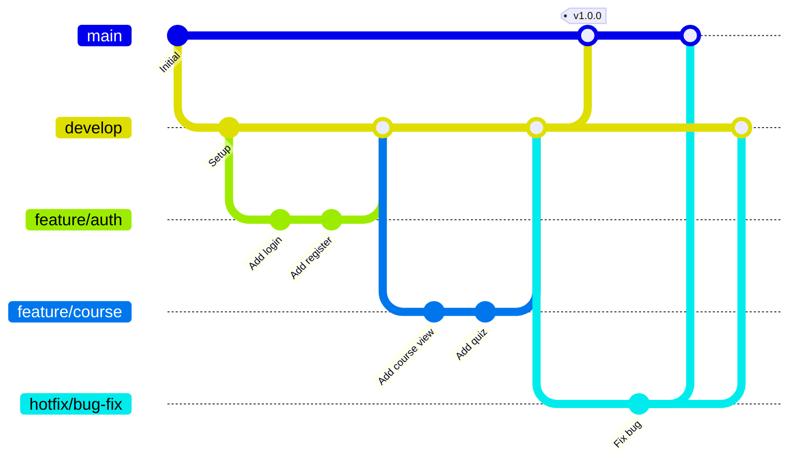
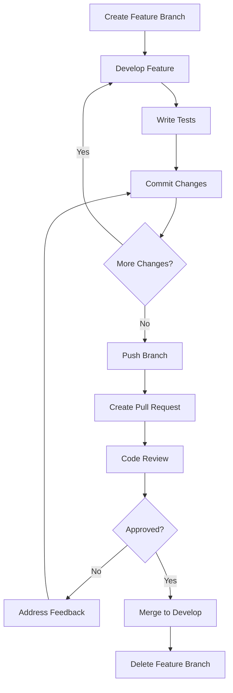
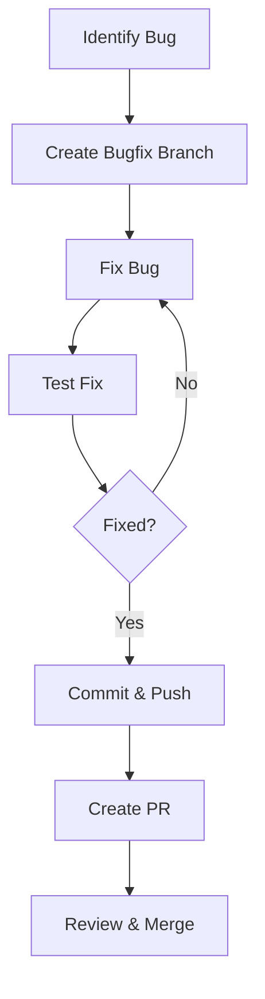
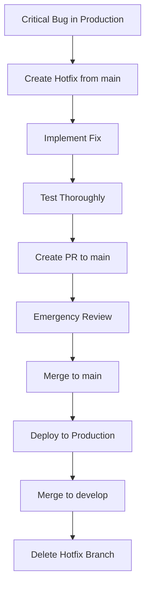
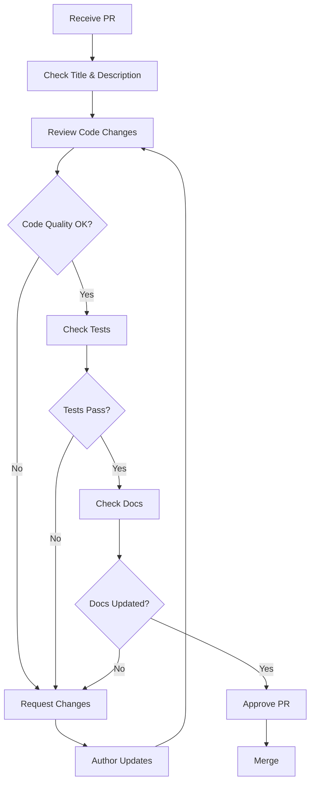
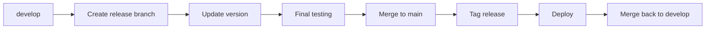
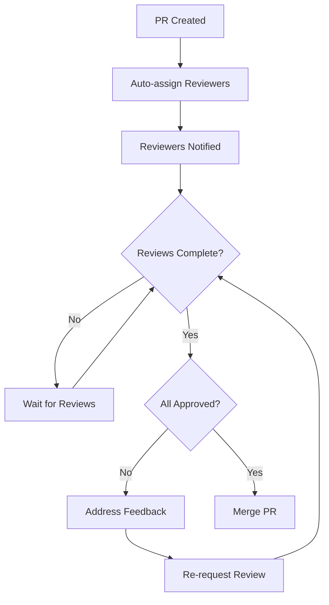

# Git Workflow

Panduan penggunaan Git dan konvensi workflow untuk PrincipleLearn V3.

---

## 🌿 Branching Strategy

PrincipleLearn V3 menggunakan **Git Flow** yang disederhanakan:



### Branch Types

| Branch | Purpose | Naming | Source |
|--------|---------|--------|--------|
| `main` | Production code | `main` | - |
| `develop` | Integration branch | `develop` | `main` |
| `feature/*` | New features | `feature/feature-name` | `develop` |
| `bugfix/*` | Bug fixes | `bugfix/bug-description` | `develop` |
| `hotfix/*` | Production fixes | `hotfix/issue-description` | `main` |
| `release/*` | Release preparation | `release/v1.0.0` | `develop` |

---

## 📝 Commit Messages

### Commit Message Format

```
<type>(<scope>): <subject>

<body>

<footer>
```

### Types

| Type | Description | Example |
|------|-------------|---------|
| `feat` | New feature | `feat(auth): add login with remember me` |
| `fix` | Bug fix | `fix(quiz): correct score calculation` |
| `docs` | Documentation | `docs(readme): update installation steps` |
| `style` | Code style | `style(components): format with prettier` |
| `refactor` | Refactoring | `refactor(api): simplify error handling` |
| `test` | Testing | `test(quiz): add unit tests` |
| `chore` | Maintenance | `chore(deps): update dependencies` |
| `perf` | Performance | `perf(db): add index for user queries` |

### Scope Examples

| Scope | Area |
|-------|------|
| `auth` | Authentication |
| `course` | Course management |
| `quiz` | Quiz system |
| `admin` | Admin features |
| `api` | API routes |
| `db` | Database |
| `ui` | User interface |
| `docs` | Documentation |

### Subject Guidelines

- Use imperative mood: "add" not "added"
- Don't capitalize first letter
- No period at end
- Max 50 characters

### Examples

```bash
# Good commits
feat(auth): add JWT refresh token mechanism
fix(course): resolve subtopic ordering bug
docs(api): document quiz submission endpoint
refactor(components): extract Quiz into separate file
chore(deps): upgrade next.js to 15.3.1

# With body
feat(discussion): implement socratic discussion system

- Add discussion template model
- Create session management
- Implement AI response generation
- Add message history tracking

Closes #42
```

---

## 🔄 Workflow Diagrams

### Feature Development



### Bug Fix Flow



### Hotfix Flow



---

## 📋 Pull Request Guidelines

### PR Title Format

```
[TYPE] Brief description

Examples:
[FEATURE] Add user profile page
[BUGFIX] Fix quiz score calculation
[HOTFIX] Resolve authentication crash
[DOCS] Update API documentation
```

### PR Template

```markdown
## Description
Brief description of changes

## Type of Change
- [ ] Feature
- [ ] Bug fix
- [ ] Documentation
- [ ] Refactoring
- [ ] Performance improvement

## Changes Made
- Change 1
- Change 2
- Change 3

## Testing
- [ ] Unit tests pass
- [ ] Integration tests pass
- [ ] Manual testing completed

## Screenshots (if UI changes)
[Add screenshots here]

## Checklist
- [ ] Code follows project style guidelines
- [ ] Self-review completed
- [ ] Comments added for complex code
- [ ] Documentation updated
- [ ] No breaking changes
```

### Review Checklist



---

## 🏷️ Versioning

### Semantic Versioning

Format: `MAJOR.MINOR.PATCH`

| Component | When to Bump | Example |
|-----------|--------------|---------|
| MAJOR | Breaking changes | `1.0.0` → `2.0.0` |
| MINOR | New features (backward compatible) | `1.0.0` → `1.1.0` |
| PATCH | Bug fixes (backward compatible) | `1.0.0` → `1.0.1` |

### Release Process



### Creating a Release

```bash
# 1. Create release branch
git checkout develop
git checkout -b release/v1.2.0

# 2. Update version in package.json
# Edit package.json: "version": "1.2.0"

# 3. Commit version bump
git add package.json
git commit -m "chore(release): bump version to v1.2.0"

# 4. Merge to main
git checkout main
git merge release/v1.2.0

# 5. Tag release
git tag -a v1.2.0 -m "Release v1.2.0"
git push origin v1.2.0

# 6. Merge back to develop
git checkout develop
git merge release/v1.2.0

# 7. Delete release branch
git branch -d release/v1.2.0
```

---

## 🔧 Git Commands Cheatsheet

### Daily Commands

```bash
# Start new feature
git checkout develop
git pull origin develop
git checkout -b feature/my-feature

# Save work
git add .
git commit -m "feat(scope): description"

# Push changes
git push -u origin feature/my-feature

# Update from develop
git checkout develop
git pull origin develop
git checkout feature/my-feature
git rebase develop
```

### Branch Management

```bash
# List branches
git branch -a

# Delete local branch
git branch -d feature/old-feature

# Delete remote branch
git push origin --delete feature/old-feature

# Rename branch
git branch -m old-name new-name
```

### Undoing Changes

```bash
# Undo uncommitted changes
git checkout -- filename

# Undo last commit (keep changes)
git reset --soft HEAD~1

# Undo last commit (discard changes)
git reset --hard HEAD~1

# Revert a specific commit
git revert commit-hash
```

### Stashing

```bash
# Save work temporarily
git stash

# Save with message
git stash save "work in progress"

# List stashes
git stash list

# Apply latest stash
git stash pop

# Apply specific stash
git stash apply stash@{2}
```

---

## 🚫 Git Best Practices

### Do's ✅

1. **Write meaningful commit messages**
2. **Keep commits small and focused**
3. **Pull before pushing**
4. **Review your changes before committing**
5. **Use `.gitignore` properly**
6. **Create feature branches for all changes**
7. **Delete merged branches**

### Don'ts ❌

1. **Don't commit directly to main**
2. **Don't force push to shared branches**
3. **Don't commit secrets or credentials**
4. **Don't commit large binary files**
5. **Don't use vague commit messages**
6. **Don't include node_modules**
7. **Don't leave untracked files**

---

## 📁 .gitignore

```gitignore
# Dependencies
node_modules/

# Build
.next/
out/
build/

# Environment
.env
.env.local
.env.*.local

# IDE
.idea/
.vscode/
*.swp
*.swo

# OS
.DS_Store
Thumbs.db

# Debug
npm-debug.log*
yarn-debug.log*
yarn-error.log*

# Cache
.cache/
*.tsbuildinfo

# Vercel
.vercel
```

---

## 🔐 Protecting Secrets

### Never Commit

- `.env` files with real credentials
- API keys
- Database passwords
- JWT secrets
- Service account keys

### Use Environment Variables

```bash
# Copy example file
cp env.example .env.local

# Edit with your values
# .env.local is in .gitignore
```

### If Secrets Are Committed

```bash
# Remove from history (use with caution!)
git filter-branch --force --index-filter \
  "git rm --cached --ignore-unmatch .env" \
  --prune-empty --tag-name-filter cat -- --all

# Force push (coordinate with team!)
git push origin --force --all
```

---

## 👥 Team Collaboration

### Branch Protection Rules

1. **main branch**:
   - Require pull request reviews
   - Require status checks to pass
   - No direct pushes

2. **develop branch**:
   - Require pull request reviews
   - Allow admin bypass for emergencies

### Code Review Process



---

*Dokumentasi ini terakhir diperbarui: Februari 2026*
