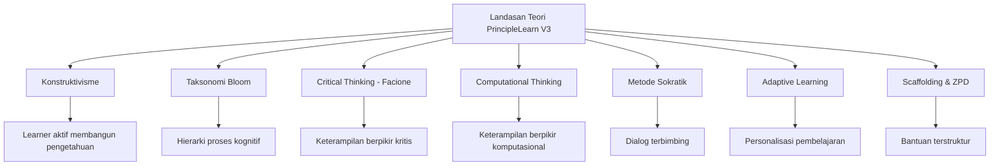
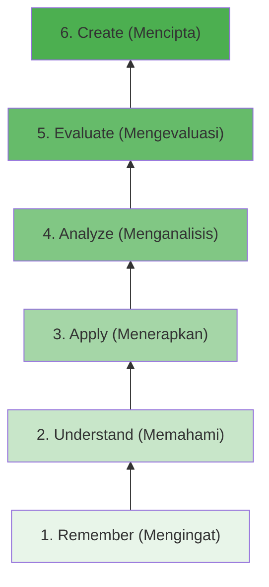
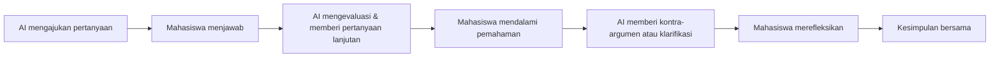
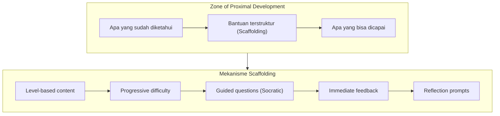
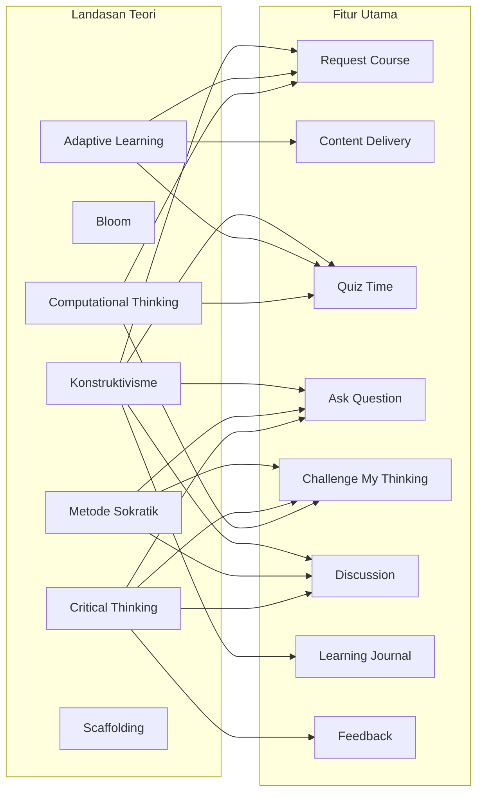

# Landasan Teori Pembelajaran

Dokumentasi landasan teori yang mendasari desain dan pengembangan media pembelajaran PrincipleLearn V3.

---

## 📋 Daftar Isi
1. [Pendahuluan](#pendahuluan)
2. [Teori Belajar Konstruktivisme](#teori-belajar-konstruktivisme)
3. [Taksonomi Bloom (Revisi)](#taksonomi-bloom-revisi)
4. [Critical Thinking (Facione)](#critical-thinking-facione)
5. [Computational Thinking](#computational-thinking)
6. [Metode Sokratik](#metode-sokratik)
7. [Adaptive Learning](#adaptive-learning)
8. [Scaffolding & Zone of Proximal Development](#scaffolding--zone-of-proximal-development)
9. [Pemetaan Teori ke Fitur Aplikasi](#pemetaan-teori-ke-fitur-aplikasi)

---

## 📖 Pendahuluan

PrincipleLearn V3 dibangun atas fondasi beberapa teori belajar yang saling melengkapi. Setiap fitur dalam aplikasi dirancang bukan hanya berdasarkan pertimbangan teknis, tetapi juga memiliki **justifikasi pedagogis** yang kuat. Dokumen ini menjelaskan teori-teori yang menjadi dasar perancangan media pembelajaran ini.

### Kerangka Teori Utama

---

## 🧱 Teori Belajar Konstruktivisme

### Definisi

Konstruktivisme (Piaget, 1971; Vygotsky, 1978) memandang bahwa pengetahuan **tidak ditransfer** secara pasif dari guru ke siswa, tetapi **dikonstruksi secara aktif** oleh pelajar melalui pengalaman dan interaksi.

### Prinsip Utama

| No | Prinsip | Deskripsi | Implementasi di PrincipleLearn |
|----|---------|-----------|-------------------------------|
| 1 | **Active Learning** | Learner harus aktif berpartisipasi dalam proses belajar | Fitur Ask Question, Challenge My Thinking, Discussion |
| 2 | **Prior Knowledge** | Pengetahuan baru dibangun di atas pengetahuan yang sudah ada | Request Course (assumption & problem statement) |
| 3 | **Social Construction** | Pembelajaran terjadi melalui interaksi sosial dan dialog | Socratic Discussion dengan AI |
| 4 | **Authentic Context** | Pembelajaran lebih bermakna jika dikaitkan dengan konteks nyata | Course generation berbasis problem & goal user |
| 5 | **Reflection** | Refleksi membantu konsolidasi pemahaman | Learning Journal, Feedback |

### Justifikasi

PrincipleLearn V3 menerapkan konstruktivisme melalui pendekatan **learner-centered**, di mana:

- User menentukan sendiri **apa** yang ingin dipelajari (topic), **mengapa** (goal), dan **dari mana** mereka memulai (level & assumption)
- AI berperan sebagai **fasilitator**, bukan sumber kebenaran tunggal
- Pengetahuan dibangun melalui **dialog interaktif**, bukan transfer informasi satu arah

---

## 🔺 Taksonomi Bloom (Revisi)

### Definisi

Taksonomi Bloom (Anderson & Krathwohl, 2001) mengklasifikasikan proses kognitif ke dalam 6 level hierarkis, dari yang paling sederhana hingga paling kompleks.

### Hierarki Proses Kognitif

### Pemetaan ke Fitur Aplikasi

| Level Bloom | Aktivitas dalam PrincipleLearn | Fitur Terkait |
|-------------|-------------------------------|---------------|
| **Remember** | Membaca materi, mengingat konsep dasar | Content delivery (subtopics) |
| **Understand** | Menjelaskan ulang konsep, menjawab pertanyaan pemahaman | Ask Question, Discussion |
| **Apply** | Menggunakan konsep untuk menyelesaikan soal | Quiz Time |
| **Analyze** | Memecah masalah, mengidentifikasi pola | Challenge My Thinking, Discussion |
| **Evaluate** | Menilai jawaban, memberi feedback | Challenge Feedback, Course Feedback |
| **Create** | Merumuskan pertanyaan baru, menyusun pemahaman | Request Course, Learning Journal |

---

## 🧠 Critical Thinking (Facione)

### Definisi

Peter Facione (1990) mendefinisikan critical thinking sebagai proses **purposeful, self-regulatory judgment** yang melibatkan interpretasi, analisis, evaluasi, inferensi, penjelasan, dan regulasi diri.

### 5 Indikator yang Diadopsi

| No | Indikator | Deskripsi | Aktivitas Learner |
|----|-----------|-----------|-------------------|
| 1 | **Analysis** | Mengidentifikasi hubungan antar konsep | Memecah permasalahan, meminta klarifikasi atas jawaban AI |
| 2 | **Evaluation** | Menilai argumen dan bukti | Menilai efektivitas solusi dari AI |
| 3 | **Inference** | Menarik kesimpulan logis | Membuat prediksi dari hasil pembelajaran |
| 4 | **Explanation** | Menjelaskan pemahaman secara jelas | Menjelaskan ulang konsep dengan kata sendiri |
| 5 | **Self-Regulation** | Memonitor dan mengoreksi proses berpikir sendiri | Merefleksikan pemahaman dan keterbatasan diri |

### Relevansi dengan Media Pembelajaran

Critical thinking dipilih karena merupakan **keterampilan abad 21** yang esensial bagi mahasiswa. PrincipleLearn V3 menstimulasi CT melalui:

- **Dialog Sokratik** yang mendorong mahasiswa berpikir kritis, bukan sekadar menerima informasi
- **Challenge My Thinking** yang menguji asumsi dan pemahaman
- **Feedback loop** yang mendorong evaluasi dan perbaikan diri

---

## 💻 Computational Thinking

### Definisi

Computational Thinking (Wing, 2006) adalah proses pemecahan masalah yang melibatkan pemikiran secara komputasional — mengformulasikan masalah dan solusi sedemikian rupa sehingga dapat diproses secara efektif.

### 5 Indikator yang Diadopsi

| No | Indikator | Deskripsi | Aktivitas Learner |
|----|-----------|-----------|-------------------|
| 1 | **Decomposition** | Memecah masalah kompleks menjadi bagian-bagian kecil | Membagi masalah dalam discussion dan request course |
| 2 | **Pattern Recognition** | Mengenali pola dan kesamaan | Mengenali pola jawaban benar/salah pada quiz |
| 3 | **Abstraction** | Fokus pada inti masalah | Merumuskan pertanyaan yang terfokus |
| 4 | **Algorithmic Thinking** | Menyusun langkah penyelesaian secara logis | Menyusun urutan solusi dalam challenge |
| 5 | **Debugging** | Menemukan dan memperbaiki kesalahan | Memperbaiki pemahaman setelah quiz feedback |

### Penekanan khusus

Meskipun CPT tradisional dikaitkan dengan Computer Science, PrincipleLearn V3 mengadopsinya sebagai **keterampilan berpikir umum** yang relevan untuk semua disiplin ilmu. Pendekatan ini sejalan dengan Wing (2006) yang menyatakan: *"Computational thinking is a fundamental skill for everyone, not just for computer scientists."*

---

## 💬 Metode Sokratik

### Definisi

Metode Sokratik (Socrates, ~400 SM; Paul & Elder, 2007) adalah metodologi pengajaran berbasis **pertanyaan terbimbing** yang mendorong pelajar untuk berpikir kritis, mengeksplorasi asumsi, dan menemukan jawaban sendiri melalui dialog.

### Prinsip dalam PrincipleLearn V3

### Mengapa Metode Sokratik?

| Aspek | Pendekatan Tradisional | Pendekatan Sokratik (PrincipleLearn) |
|-------|----------------------|--------------------------------------|
| Peran Pengajar | Sumber informasi utama | Fasilitator dialog |
| Peran Pelajar | Penerima pasif | Pemikir aktif |
| Proses Belajar | Transfer informasi | Konstruksi pemahaman |
| Evaluasi | Menghafal jawaban benar | Proses berpikir & penalaran |
| Hasil | Pengetahuan deklaratif | Keterampilan berpikir kritis |

### Implementasi dalam Fitur

- **Discussion Engine**: AI menggunakan prompt Sokratik untuk memandu diskusi, bukan memberikan jawaban langsung
- **Challenge My Thinking**: AI menantang asumsi mahasiswa melalui pertanyaan kontra
- **Ask Question**: Respons AI dirancang untuk memandu pemahaman, bukan sekadar menjawab

---

## 🎯 Adaptive Learning

### Definisi

Adaptive Learning (Brusilovsky, 2001) adalah pendekatan yang **menyesuaikan pengalaman belajar** secara otomatis berdasarkan kebutuhan, kemampuan, dan preferensi individu pelajar.

### Dimensi Adaptasi dalam PrincipleLearn V3

| Dimensi | Mekanisme | Implementasi |
|---------|-----------|--------------|
| **Konten** | Materi disesuaikan dengan level keahlian | Level selection (beginner/intermediate/advanced) |
| **Konteks** | Pembelajaran dikaitkan dengan masalah nyata user | Problem statement & goal dalam course request |
| **Kecepatan** | User menentukan tempo belajar sendiri | Self-paced learning, progress tracking |
| **Feedback** | Umpan balik dipersonalisasi | AI-generated feedback pada quiz dan challenge |
| **Jalur** | Learning path disesuaikan kebutuhan | Custom course generation per individu |

### Justifikasi

Setiap mahasiswa memiliki latar belakang, kemampuan, dan tujuan yang berbeda. PrincipleLearn V3 mengakomodasi keragaman ini melalui **AI-powered course generation** yang menghasilkan materi unik untuk setiap permintaan — bukan template yang seragam.

---

## 🏗️ Scaffolding & Zone of Proximal Development

### Definisi

Zone of Proximal Development / ZPD (Vygotsky, 1978) adalah jarak antara apa yang bisa dilakukan pelajar secara mandiri dan apa yang bisa dilakukan dengan bantuan. **Scaffolding** (Wood, Bruner, & Ross, 1976) adalah bantuan terstruktur yang diberikan dalam ZPD untuk membantu pelajar mencapai level yang lebih tinggi.

### Model Scaffolding dalam PrincipleLearn V3

### Jenis Scaffolding yang Diterapkan

| Jenis | Deskripsi | Fitur |
|-------|-----------|-------|
| **Conceptual** | Membantu memahami konsep baru | AI-generated content dengan contoh bertahap |
| **Procedural** | Memandu langkah-langkah pengerjaan | Quiz dengan penjelasan, Challenge step-by-step |
| **Metacognitive** | Mendorong refleksi dan kesadaran diri | Journal, Self-regulation prompts |
| **Strategic** | Membantu strategi pemecahan masalah | Discussion engine, Challenge My Thinking |

---

## 🔗 Pemetaan Teori ke Fitur Aplikasi

### Matriks Lengkap

| Fitur | Konstruktivisme | Bloom | CT | CPT | Sokratik | Adaptive | Scaffolding |
|-------|:-:|:-:|:-:|:-:|:-:|:-:|:-:|
| **Request Course** | ✅ | Create | Self-Regulation, Analysis | Decomposition, Abstraction | - | ✅ | Conceptual |
| **Content Delivery** | ✅ | Remember, Understand | - | - | - | ✅ | Conceptual |
| **Quiz Time** | ✅ | Apply, Analyze | Evaluation | Pattern Recognition, Debugging | - | ✅ | Procedural |
| **Ask Question** | ✅ | Understand | Analysis, Explanation | Abstraction | ✅ | ✅ | Strategic |
| **Challenge My Thinking** | ✅ | Analyze, Evaluate | Evaluation, Inference | Abstraction, Algorithmic | ✅ | ✅ | Strategic |
| **Discussion** | ✅ | Analyze, Evaluate | Analysis, Explanation, Inference | Decomposition | ✅ | ✅ | Metacognitive |
| **Learning Journal** | ✅ | Create | Self-Regulation | - | - | - | Metacognitive |
| **Feedback** | ✅ | Evaluate | Evaluation, Self-Regulation | Debugging | - | - | Metacognitive |

### Visualisasi Hubungan Teori-Fitur

---

## 📚 Daftar Pustaka

| No | Referensi |
|----|-----------|
| 1 | Anderson, L. W., & Krathwohl, D. R. (2001). *A Taxonomy for Learning, Teaching, and Assessing*. Longman. |
| 2 | Brusilovsky, P. (2001). Adaptive hypermedia. *User Modeling and User-Adapted Interaction*, 11(1-2), 87–110. |
| 3 | Facione, P. A. (1990). *Critical Thinking: A Statement of Expert Consensus for Purposes of Educational Assessment and Instruction*. The California Academic Press. |
| 4 | Paul, R., & Elder, L. (2007). *Critical Thinking: The Art of Socratic Questioning*. Foundation for Critical Thinking. |
| 5 | Piaget, J. (1971). *Biology and Knowledge*. University of Chicago Press. |
| 6 | Vygotsky, L. S. (1978). *Mind in Society: The Development of Higher Psychological Processes*. Harvard University Press. |
| 7 | Wing, J. M. (2006). Computational thinking. *Communications of the ACM*, 49(3), 33–35. |
| 8 | Wood, D., Bruner, J. S., & Ross, G. (1976). The role of tutoring in problem solving. *Journal of Child Psychology and Psychiatry*, 17(2), 89–100. |

---

*Dokumentasi ini terakhir diperbarui: Februari 2026*
