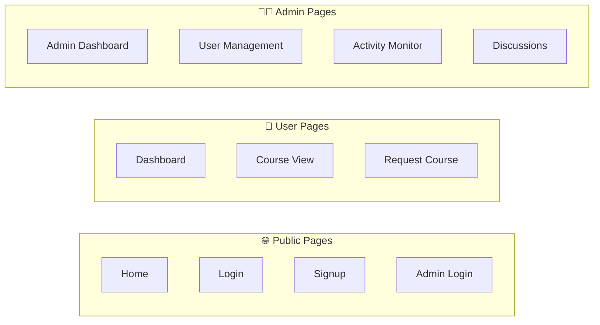
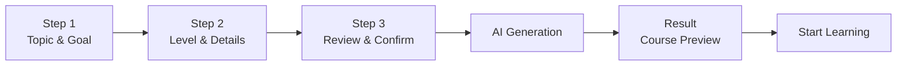
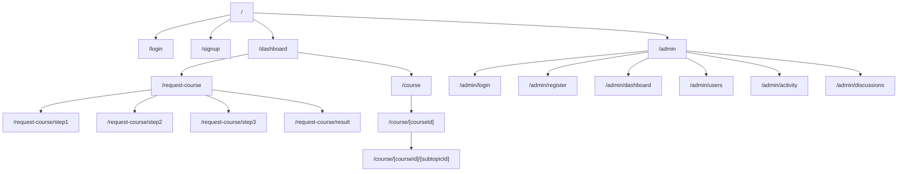

# Page Catalog

Katalog lengkap semua halaman dan fitur di PrincipleLearn V3.

---

## 📋 Overview

PrincipleLearn V3 memiliki **3 kategori halaman** utama:



---

## 🌐 Public Pages

### Home (`/`)

| Property | Value |
|----------|-------|
| **Path** | `/` |
| **Auth Required** | No |
| **Component** | `src/app/page.tsx` |
| **Styles** | `src/app/page.module.scss` |

**Features**:
- Landing page dengan hero section
- Feature highlights
- Call-to-action buttons
- Navigation ke Login/Signup

---

### Login (`/login`)

| Property | Value |
|----------|-------|
| **Path** | `/login` |
| **Auth Required** | No (redirect if authenticated) |
| **Component** | `src/app/login/page.tsx` |
| **Styles** | `src/app/login/page.module.scss` |

**Features**:
- Email/password form
- Remember me option
- Link ke signup
- Error handling
- Redirect ke dashboard setelah login

---

### Signup (`/signup`)

| Property | Value |
|----------|-------|
| **Path** | `/signup` |
| **Auth Required** | No |
| **Component** | `src/app/signup/page.tsx` |
| **Styles** | `src/app/signup/page.module.scss` |

**Features**:
- Registration form (name, email, password)
- Password strength indicator
- Terms acceptance
- Email validation
- Link ke login

---

### Admin Login (`/admin/login`)

| Property | Value |
|----------|-------|
| **Path** | `/admin/login` |
| **Auth Required** | No |
| **Component** | `src/app/admin/login/page.tsx` |
| **Styles** | `src/app/admin/login/page.module.scss` |

**Features**:
- Admin-specific login form
- Role validation (ADMIN only)
- Redirect ke admin dashboard

---

## 👤 User Pages

### Dashboard (`/dashboard`)

| Property | Value |
|----------|-------|
| **Path** | `/dashboard` |
| **Auth Required** | Yes (User) |
| **Component** | `src/app/dashboard/page.tsx` |
| **Styles** | `src/app/dashboard/page.module.scss` |

**Features**:
- Personal statistics overview
- Recent courses list
- Learning progress summary
- Quick actions (Request Course, Continue Learning)
- Activity timeline

**Components Used**:
- Progress charts
- Course cards
- Activity feed

---

### Course View (`/course/[courseId]`)

| Property | Value |
|----------|-------|
| **Path** | `/course/[courseId]` |
| **Auth Required** | Yes (User) |
| **Component** | `src/app/course/[courseId]/page.tsx` |
| **Styles** | `src/app/course/[courseId]/page.module.scss` |

**Dynamic Routes**:
- `/course/[courseId]` - Course overview
- `/course/[courseId]/[subtopicId]` - Subtopic content

**Features**:
- Course content display
- Subtopic navigation sidebar
- Progress tracking
- Interactive components

**Components Used**:
| Component | Purpose |
|-----------|---------|
| `Quiz` | Interactive quiz questions |
| `Examples` | AI-generated examples |
| `AskQuestion` | Q&A dengan AI |
| `ChallengeThinking` | Critical thinking prompts |
| `FeedbackForm` | Course feedback |
| `KeyTakeaways` | Summary points |
| `NextSubtopics` | Navigation suggestions |
| `WhatNext` | Next steps guidance |

---

### Request Course - Step 1 (`/request-course/step1`)

| Property | Value |
|----------|-------|
| **Path** | `/request-course/step1` |
| **Auth Required** | Yes (User) |
| **Component** | `src/app/request-course/step1/page.tsx` |

**Features**:
- Topic input field
- Goal specification
- Form validation
- Next step navigation

---

### Request Course - Step 2 (`/request-course/step2`)

| Property | Value |
|----------|-------|
| **Path** | `/request-course/step2` |
| **Auth Required** | Yes (User) |
| **Component** | `src/app/request-course/step2/page.tsx` |

**Features**:
- Difficulty level selection (Beginner/Intermediate/Advanced)
- Extra topics input
- Problem description
- Assumptions input
- Back/Next navigation

---

### Request Course - Step 3 (`/request-course/step3`)

| Property | Value |
|----------|-------|
| **Path** | `/request-course/step3` |
| **Auth Required** | Yes (User) |
| **Component** | `src/app/request-course/step3/page.tsx` |

**Features**:
- Summary of all inputs
- Edit option per section
- Generate course button
- Loading state

---

### Request Course - Result (`/request-course/result`)

| Property | Value |
|----------|-------|
| **Path** | `/request-course/result` |
| **Auth Required** | Yes (User) |
| **Component** | `src/app/request-course/result/page.tsx` |

**Features**:
- Generated course preview
- Course outline display
- Start learning button
- Regenerate option

---

## 🧭 Request Course Flow



---

## 👨‍💼 Admin Pages

### Admin Dashboard (`/admin/dashboard`)

| Property | Value |
|----------|-------|
| **Path** | `/admin/dashboard` |
| **Auth Required** | Yes (Admin) |
| **Component** | `src/app/admin/dashboard/page.tsx` |
| **Styles** | `src/app/admin/dashboard/page.module.scss` |

**Features**:
- Platform statistics overview
- User count & growth
- Course statistics
- Recent activity across all users
- Quick action buttons
- System health indicators

**Statistics Displayed**:
| Metric | Description |
|--------|-------------|
| Total Users | All registered users |
| Active Users | Users active in 30 days |
| Total Courses | All generated courses |
| Quiz Submissions | Total quiz attempts |
| Avg. Completion Rate | Course completion % |

---

### User Management (`/admin/users`)

| Property | Value |
|----------|-------|
| **Path** | `/admin/users` |
| **Auth Required** | Yes (Admin) |
| **Component** | `src/app/admin/users/page.tsx` |
| **Styles** | `src/app/admin/users/page.module.scss` |

**Features**:
- User list with pagination
- Search by name/email
- Filter by role
- User detail view
- Activity per user
- Role management

**Table Columns**:
| Column | Description |
|--------|-------------|
| Name | User display name |
| Email | User email |
| Role | user/ADMIN |
| Courses | Count of courses |
| Joined | Registration date |
| Last Active | Last login |
| Actions | View/Edit buttons |

---

### Activity Monitor (`/admin/activity`)

| Property | Value |
|----------|-------|
| **Path** | `/admin/activity` |
| **Auth Required** | Yes (Admin) |
| **Component** | `src/app/admin/activity/page.tsx` |
| **Styles** | `src/app/admin/activity/page.module.scss` |

**Sub-sections**:

#### Quiz Activity (`/admin/activity/quiz`)
- All quiz submissions
- Filter by user, course, date
- Correct/incorrect stats

#### Journal Activity (`/admin/activity/jurnal`)
- All journal entries
- User reflections
- Filter by course, user

#### Transcript Activity (`/admin/activity/transcript`)
- All saved transcripts
- Notes management

#### Ask Question History (`/admin/activity/ask-question`)
- Q&A history
- AI response review

#### Course Generation (`/admin/activity/generate-course`)
- Course generation logs
- Input parameters
- Generated outlines

#### Challenge Responses (`/admin/activity/challenge`)
- User challenge answers
- AI feedback review

---

### Discussion Management (`/admin/discussions`)

| Property | Value |
|----------|-------|
| **Path** | `/admin/discussions` |
| **Auth Required** | Yes (Admin) |
| **Component** | `src/app/admin/discussions/page.tsx` |
| **Styles** | `src/app/admin/discussions/page.module.scss` |

**Features**:
- All discussion sessions
- Session status overview
- Message history view
- Intervention capabilities
- Template management

---

## 🧩 Shared Components

### Components Directory Structure

```
src/components/
├── admin/                  # Admin-specific components
│   ├── QuizActivityModal/
│   ├── JurnalActivityModal/
│   ├── TranscriptActivityModal/
│   └── UserDetailModal/
├── Quiz/                   # Quiz system
│   ├── Quiz.tsx
│   └── Quiz.module.scss
├── AskQuestion/            # Q&A feature
│   ├── AskQuestion.tsx
│   └── AskQuestion.module.scss
├── Examples/               # AI examples
│   ├── Examples.tsx
│   └── Examples.module.scss
├── ChallengeThinking/      # Critical thinking
│   ├── ChallengeThinking.tsx
│   └── ChallengeThinking.module.scss
├── FeedbackForm/           # Feedback collection
│   ├── FeedbackForm.tsx
│   └── FeedbackForm.module.scss
├── KeyTakeaways/           # Summary display
│   ├── KeyTakeaways.tsx
│   └── KeyTakeaways.module.scss
├── NextSubtopics/          # Navigation
│   ├── NextSubtopics.tsx
│   └── NextSubtopics.module.scss
└── WhatNext/               # Guidance
    ├── WhatNext.tsx
    └── WhatNext.module.scss
```

---

## 📊 Page Hierarchy Diagram



---

## 🎨 Layout Structure

### Root Layout (`src/app/layout.tsx`)
- Global styles
- Font configuration
- Auth provider wrapper
- Metadata configuration

### Admin Layout (`src/app/admin/layout.tsx`)
- Admin-specific navigation
- Sidebar menu
- Admin header
- Role verification

---

## 📱 Responsive Breakpoints

| Breakpoint | Width | Target |
|------------|-------|--------|
| Mobile | < 768px | Phones |
| Tablet | 768px - 1024px | Tablets |
| Desktop | > 1024px | Desktop |

Semua halaman responsive dan mobile-friendly.

---

*Dokumentasi ini terakhir diperbarui: Februari 2026*
