# Page Flow

Dokumentasi alur navigasi dan user journey di PrincipleLearn V3.

---

## 🔄 User Journey Overview

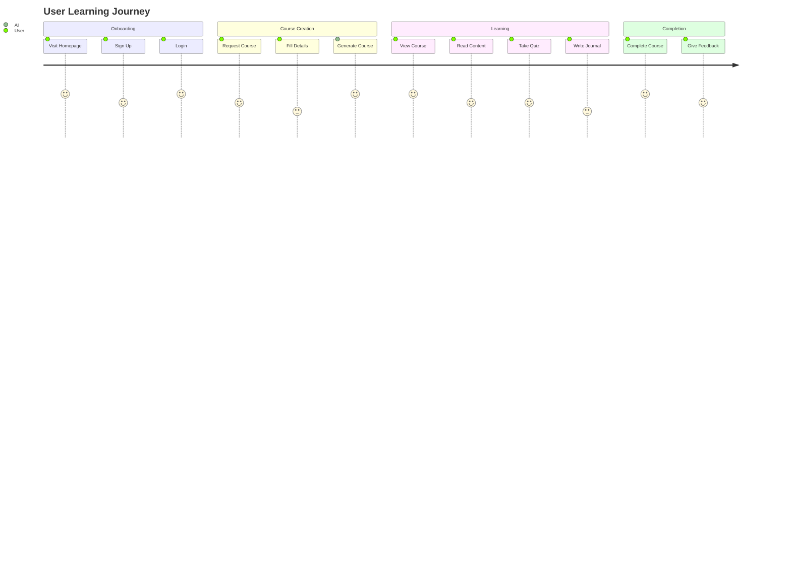
```mermaid
journey
    title User Learning Journey
    section Onboarding
      Visit Homepage: 5: User
      Sign Up: 4: User
      Login: 5: User
    section Course Creation
      Request Course: 4: User
      Fill Details: 3: User
      Generate Course: 5: AI
    section Learning
      View Course: 5: User
      Read Content: 4: User
      Take Quiz: 4: User
      Write Journal: 3: User
    section Completion
      Complete Course: 5: User
      Give Feedback: 4: User
```

---

## 🚪 Authentication Flow

### New User Registration

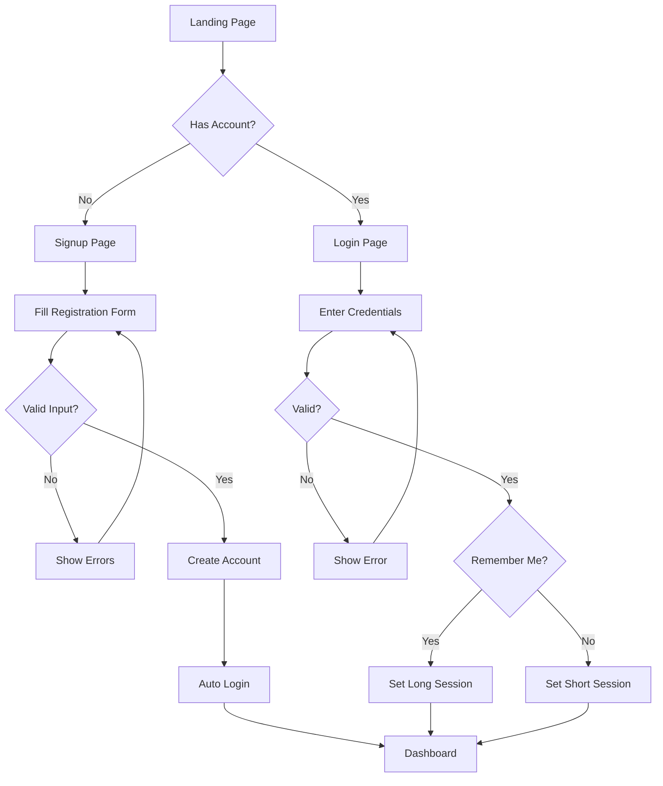
```mermaid
flowchart TD
    A[Landing Page] --> B{Has Account?}
    B -->|No| C[Signup Page]
    B -->|Yes| D[Login Page]
    
    C --> E[Fill Registration Form]
    E --> F{Valid Input?}
    F -->|No| G[Show Errors]
    G --> E
    F -->|Yes| H[Create Account]
    H --> I[Auto Login]
    I --> J[Dashboard]
    
    D --> K[Enter Credentials]
    K --> L{Valid?}
    L -->|No| M[Show Error]
    M --> K
    L -->|Yes| N{Remember Me?}
    N -->|Yes| O[Set Long Session]
    N -->|No| P[Set Short Session]
    O --> J
    P --> J
```

### Session Management

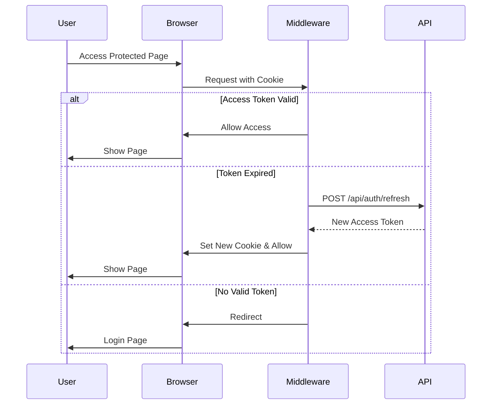
```mermaid
sequenceDiagram
    participant U as User
    participant B as Browser
    participant M as Middleware
    participant A as API

    U->>B: Access Protected Page
    B->>M: Request with Cookie
    
    alt Access Token Valid
        M->>B: Allow Access
        B->>U: Show Page
    else Token Expired
        M->>A: POST /api/auth/refresh
        A-->>M: New Access Token
        M->>B: Set New Cookie & Allow
        B->>U: Show Page
    else No Valid Token
        M->>B: Redirect
        B->>U: Login Page
    end
```

---

## 📚 Course Request Flow

### Multi-Step Form Flow

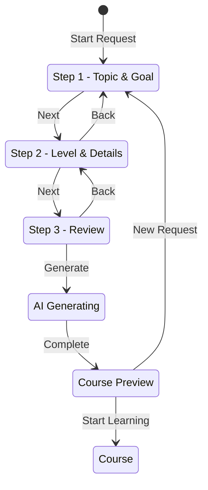
```mermaid
stateDiagram-v2
    [*] --> Step1: Start Request

    Step1: Step 1 - Topic & Goal
    Step2: Step 2 - Level & Details
    Step3: Step 3 - Review
    Generating: AI Generating
    Result: Course Preview

    Step1 --> Step2: Next
    Step2 --> Step1: Back
    Step2 --> Step3: Next
    Step3 --> Step2: Back
    Step3 --> Generating: Generate
    Generating --> Result: Complete
    Result --> Course: Start Learning
    Result --> Step1: New Request
```

### Detailed Step Flow

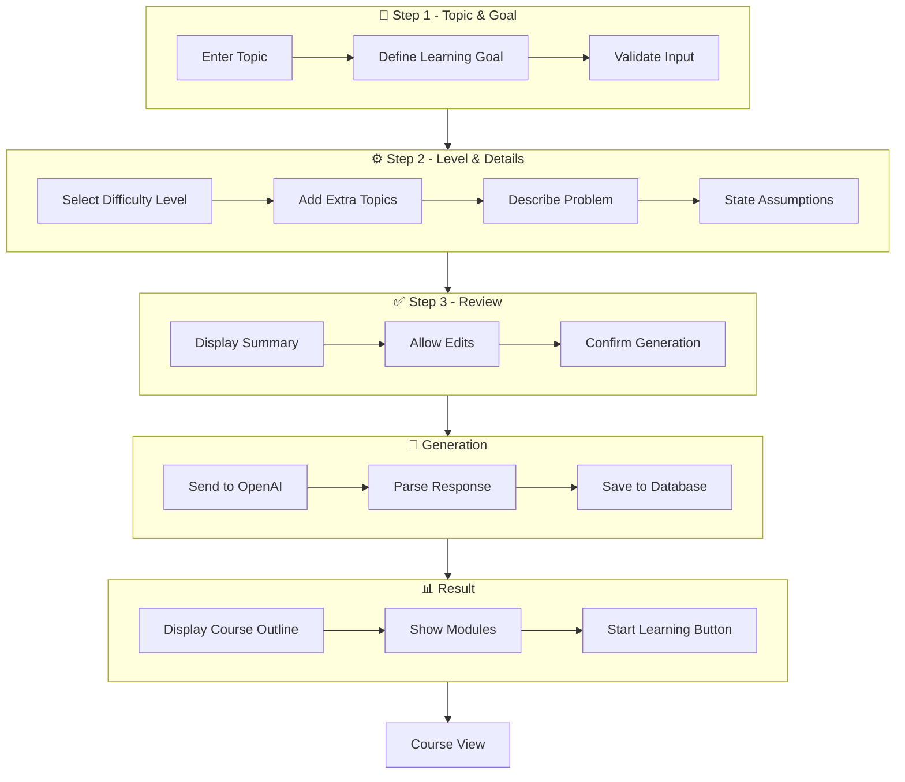
```mermaid
flowchart TD
    subgraph Step1["📝 Step 1 - Topic & Goal"]
        S1A[Enter Topic]
        S1B[Define Learning Goal]
        S1C[Validate Input]
        S1A --> S1B --> S1C
    end

    subgraph Step2["⚙️ Step 2 - Level & Details"]
        S2A[Select Difficulty Level]
        S2B[Add Extra Topics]
        S2C[Describe Problem]
        S2D[State Assumptions]
        S2A --> S2B --> S2C --> S2D
    end

    subgraph Step3["✅ Step 3 - Review"]
        S3A[Display Summary]
        S3B[Allow Edits]
        S3C[Confirm Generation]
        S3A --> S3B --> S3C
    end

    subgraph Generate["🤖 Generation"]
        G1[Send to OpenAI]
        G2[Parse Response]
        G3[Save to Database]
        G1 --> G2 --> G3
    end

    subgraph Result["📊 Result"]
        R1[Display Course Outline]
        R2[Show Modules]
        R3[Start Learning Button]
        R1 --> R2 --> R3
    end

    Step1 --> Step2
    Step2 --> Step3
    Step3 --> Generate
    Generate --> Result
    Result --> Course[Course View]
```

### Context State Management

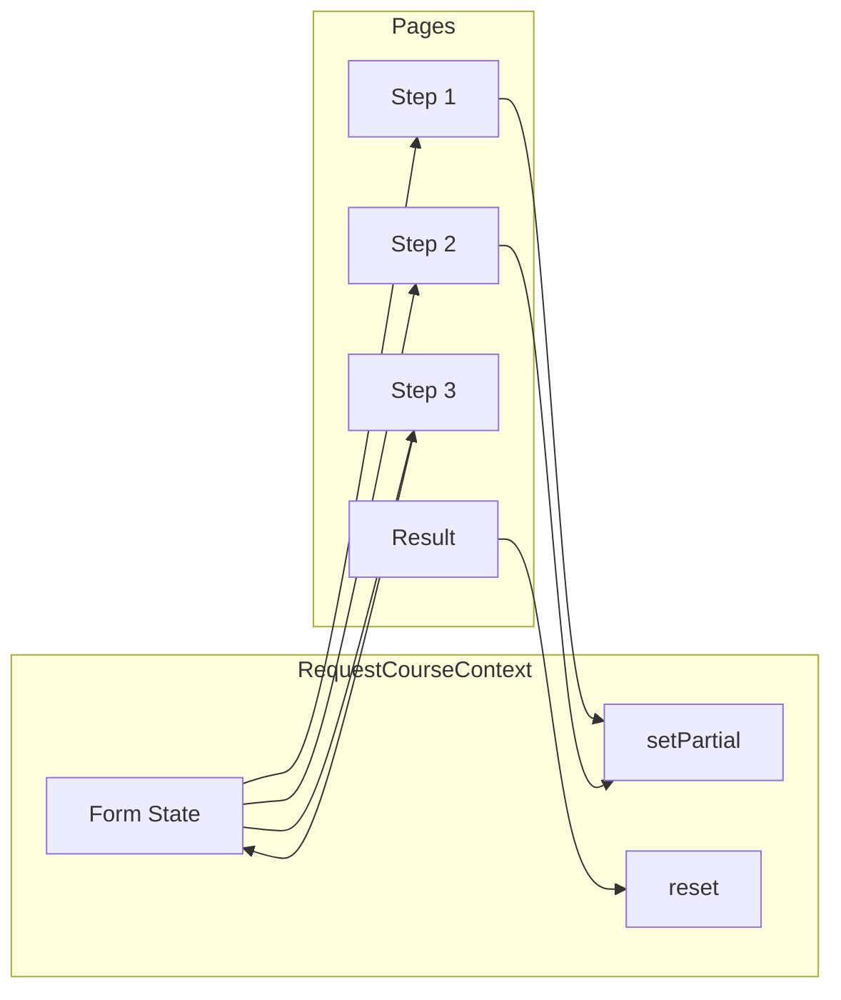
```mermaid
graph LR
    subgraph Context["RequestCourseContext"]
        State[Form State]
        SetPartial[setPartial]
        Reset[reset]
    end

    subgraph Pages["Pages"]
        S1[Step 1]
        S2[Step 2]
        S3[Step 3]
        Res[Result]
    end

    State --> S1
    State --> S2
    State --> S3
    S1 --> SetPartial
    S2 --> SetPartial
    S3 --> State
    Res --> Reset
```

---

## 📖 Learning Flow

### Course Navigation

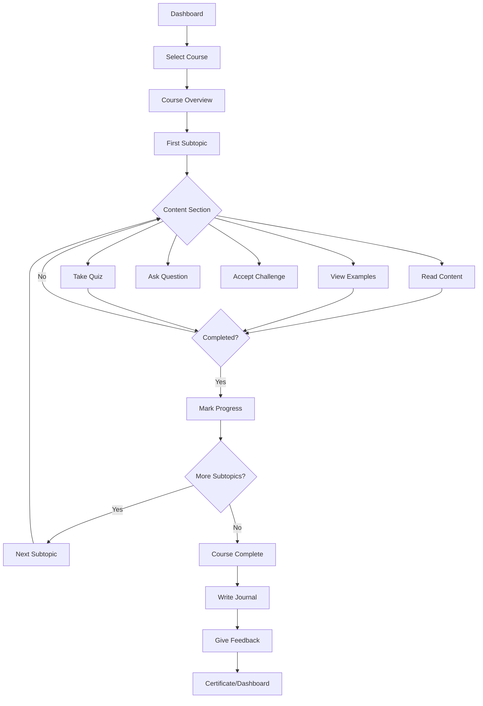
```mermaid
flowchart TD
    A[Dashboard] --> B[Select Course]
    B --> C[Course Overview]
    C --> D[First Subtopic]
    
    D --> E{Content Section}
    E --> F[Read Content]
    E --> G[View Examples]
    E --> H[Take Quiz]
    E --> I[Ask Question]
    E --> J[Accept Challenge]
    
    F --> K{Completed?}
    G --> K
    H --> K
    
    K -->|No| E
    K -->|Yes| L[Mark Progress]
    L --> M{More Subtopics?}
    
    M -->|Yes| N[Next Subtopic]
    N --> E
    
    M -->|No| O[Course Complete]
    O --> P[Write Journal]
    P --> Q[Give Feedback]
    Q --> R[Certificate/Dashboard]
```

### Subtopic Interaction Flow

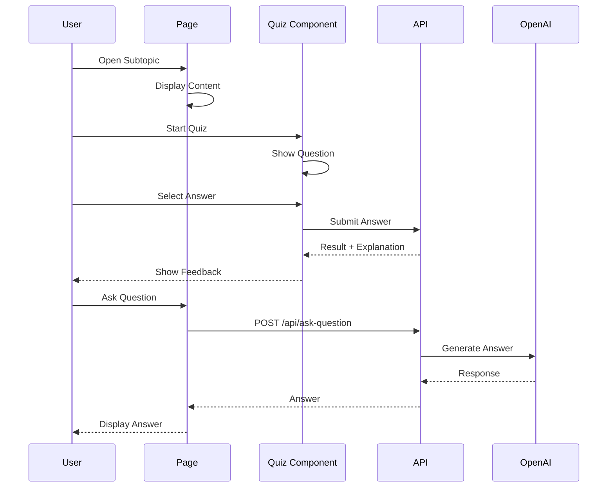
```mermaid
sequenceDiagram
    participant U as User
    participant P as Page
    participant Q as Quiz Component
    participant A as API
    participant AI as OpenAI

    U->>P: Open Subtopic
    P->>P: Display Content
    
    U->>Q: Start Quiz
    Q->>Q: Show Question
    U->>Q: Select Answer
    Q->>A: Submit Answer
    A-->>Q: Result + Explanation
    Q-->>U: Show Feedback
    
    U->>P: Ask Question
    P->>A: POST /api/ask-question
    A->>AI: Generate Answer
    AI-->>A: Response
    A-->>P: Answer
    P-->>U: Display Answer
```

### Quiz Submission Flow

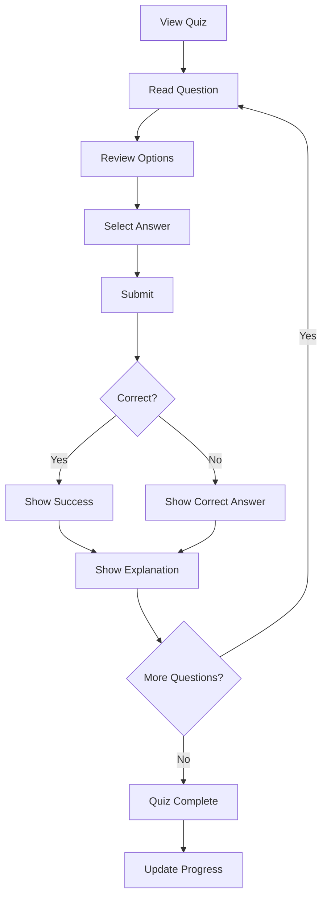
```mermaid
flowchart TD
    A[View Quiz] --> B[Read Question]
    B --> C[Review Options]
    C --> D[Select Answer]
    D --> E[Submit]
    
    E --> F{Correct?}
    F -->|Yes| G[Show Success]
    F -->|No| H[Show Correct Answer]
    
    G --> I[Show Explanation]
    H --> I
    
    I --> J{More Questions?}
    J -->|Yes| B
    J -->|No| K[Quiz Complete]
    K --> L[Update Progress]
```

---

## 💬 Discussion Flow

### Socratic Discussion Session

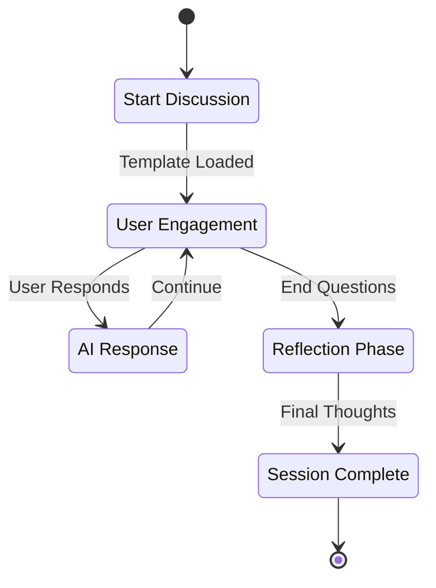
```mermaid
stateDiagram-v2
    [*] --> Initialize
    
    Initialize: Start Discussion
    Engagement: User Engagement
    AIResponse: AI Response
    Reflection: Reflection Phase
    Completed: Session Complete

    Initialize --> Engagement: Template Loaded
    Engagement --> AIResponse: User Responds
    AIResponse --> Engagement: Continue
    Engagement --> Reflection: End Questions
    Reflection --> Completed: Final Thoughts
    Completed --> [*]
```

### Discussion Message Flow

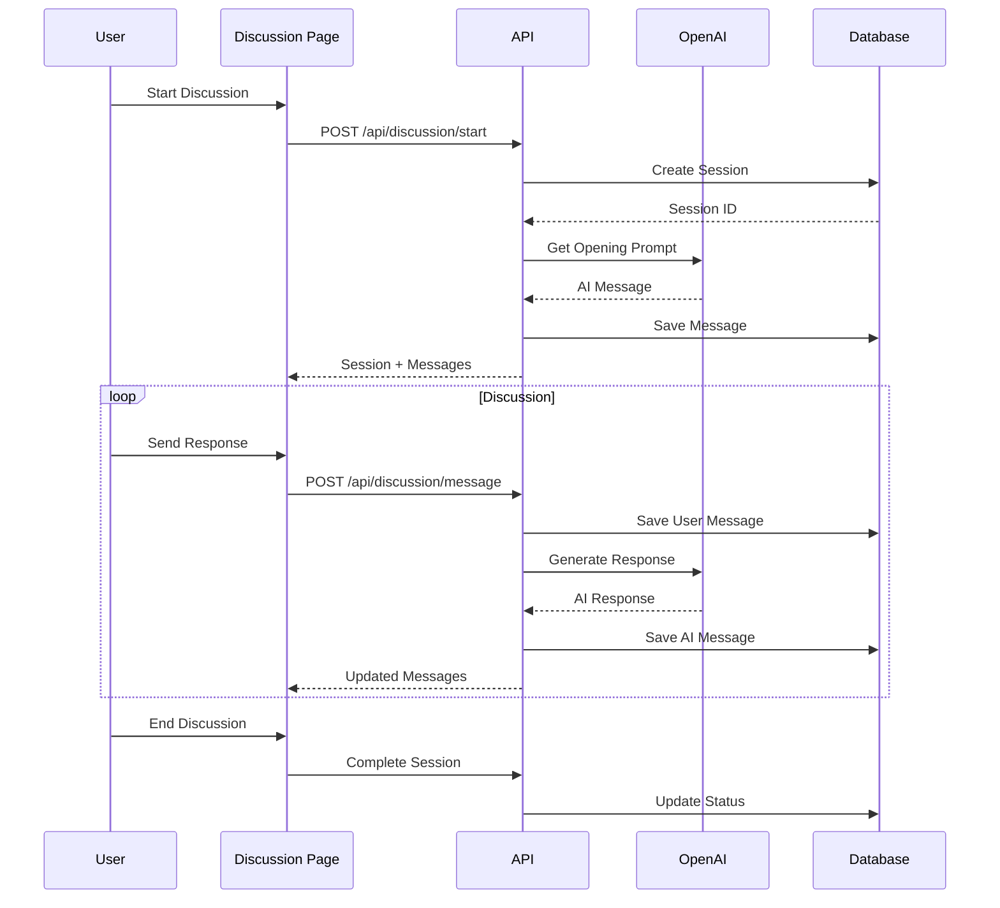
```mermaid
sequenceDiagram
    participant U as User
    participant P as Discussion Page
    participant A as API
    participant AI as OpenAI
    participant DB as Database

    U->>P: Start Discussion
    P->>A: POST /api/discussion/start
    A->>DB: Create Session
    DB-->>A: Session ID
    A->>AI: Get Opening Prompt
    AI-->>A: AI Message
    A->>DB: Save Message
    A-->>P: Session + Messages
    
    loop Discussion
        U->>P: Send Response
        P->>A: POST /api/discussion/message
        A->>DB: Save User Message
        A->>AI: Generate Response
        AI-->>A: AI Response
        A->>DB: Save AI Message
        A-->>P: Updated Messages
    end

    U->>P: End Discussion
    P->>A: Complete Session
    A->>DB: Update Status
```

---

## 👨‍💼 Admin Flow

### Admin Dashboard Flow

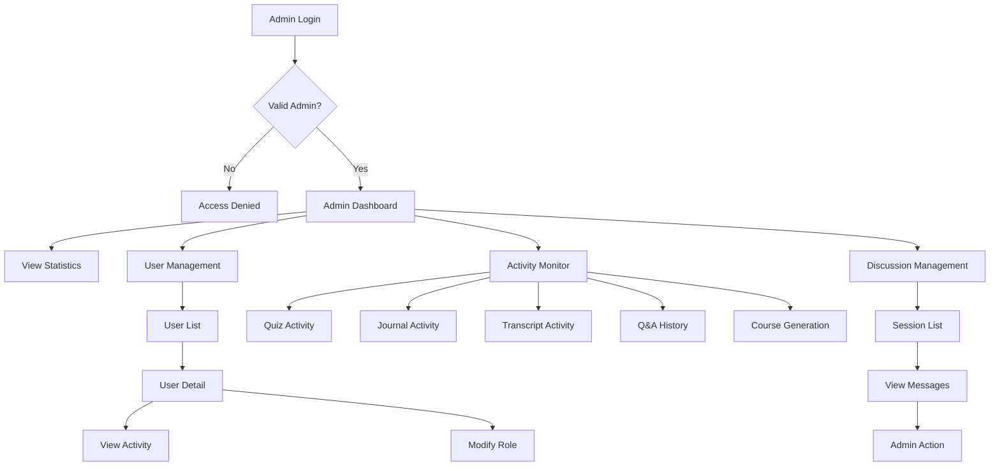
```mermaid
flowchart TD
    A[Admin Login] --> B{Valid Admin?}
    B -->|No| C[Access Denied]
    B -->|Yes| D[Admin Dashboard]
    
    D --> E[View Statistics]
    D --> F[User Management]
    D --> G[Activity Monitor]
    D --> H[Discussion Management]
    
    F --> I[User List]
    I --> J[User Detail]
    J --> K[View Activity]
    J --> L[Modify Role]
    
    G --> M[Quiz Activity]
    G --> N[Journal Activity]
    G --> O[Transcript Activity]
    G --> P[Q&A History]
    G --> Q[Course Generation]
    
    H --> R[Session List]
    R --> S[View Messages]
    S --> T[Admin Action]
```

### User Activity Monitoring

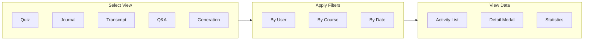
```mermaid
flowchart LR
    subgraph Selection["Select View"]
        Quiz[Quiz]
        Journal[Journal]
        Transcript[Transcript]
        QA[Q&A]
        Generation[Generation]
    end

    subgraph Filters["Apply Filters"]
        User[By User]
        Course[By Course]
        Date[By Date]
    end

    subgraph View["View Data"]
        List[Activity List]
        Detail[Detail Modal]
        Stats[Statistics]
    end

    Selection --> Filters
    Filters --> View
```

---

## 🔀 Navigation Patterns

### Breadcrumb Navigation

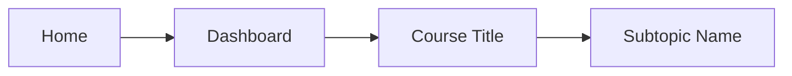
```mermaid
graph LR
    Home[Home] --> Dashboard[Dashboard]
    Dashboard --> Course[Course Title]
    Course --> Subtopic[Subtopic Name]
```

### Sidebar Navigation (Course View)

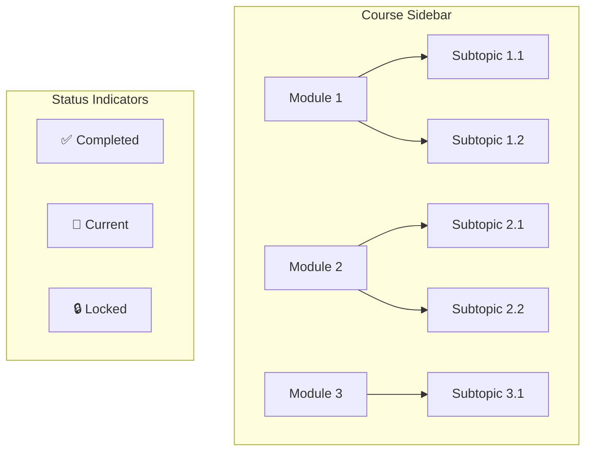
```mermaid
graph TD
    subgraph Sidebar["Course Sidebar"]
        Module1[Module 1]
        Module2[Module 2]
        Module3[Module 3]
        
        Module1 --> S1A[Subtopic 1.1]
        Module1 --> S1B[Subtopic 1.2]
        
        Module2 --> S2A[Subtopic 2.1]
        Module2 --> S2B[Subtopic 2.2]
        
        Module3 --> S3A[Subtopic 3.1]
    end

    subgraph Status["Status Indicators"]
        Completed[✅ Completed]
        Current[🔵 Current]
        Locked[🔒 Locked]
    end
```

---

## 🔄 State Transitions

### User Session States

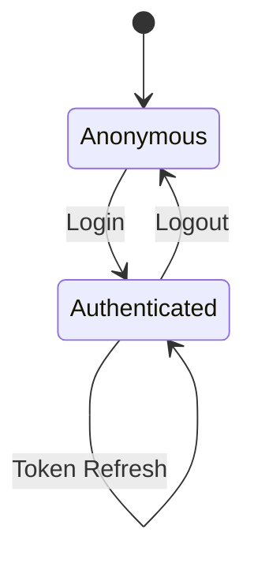
```mermaid
stateDiagram-v2
    [*] --> Anonymous
    
    Anonymous --> Authenticated: Login
    Authenticated --> Anonymous: Logout
    Authenticated --> Authenticated: Token Refresh
```

### Course Progress States

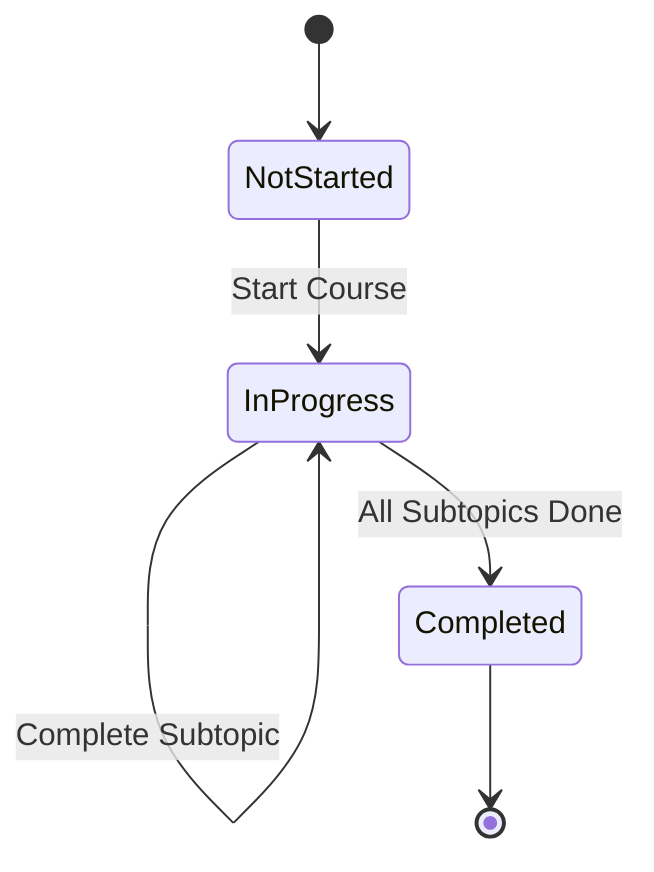
```mermaid
stateDiagram-v2
    [*] --> NotStarted
    
    NotStarted --> InProgress: Start Course
    InProgress --> InProgress: Complete Subtopic
    InProgress --> Completed: All Subtopics Done
    Completed --> [*]
```

---

## 📱 Mobile Navigation

### Mobile Menu Flow

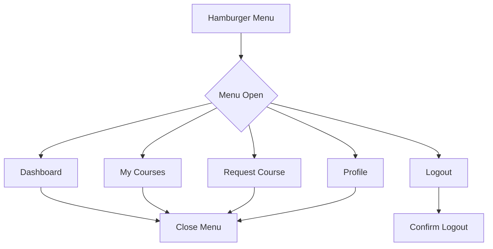
```mermaid
flowchart TD
    A[Hamburger Menu] --> B{Menu Open}
    B --> C[Dashboard]
    B --> D[My Courses]
    B --> E[Request Course]
    B --> F[Profile]
    B --> G[Logout]
    
    C --> H[Close Menu]
    D --> H
    E --> H
    F --> H
    G --> I[Confirm Logout]
```

---

## 🎯 Key User Actions

| Action | Start Point | End Point | Steps |
|--------|-------------|-----------|-------|
| Register | Homepage | Dashboard | 3 |
| Login | Homepage | Dashboard | 2 |
| Request Course | Dashboard | Course View | 5 |
| Complete Subtopic | Course View | Next Subtopic | 3-5 |
| Submit Quiz | Subtopic | Feedback | 2 |
| Ask Question | Subtopic | AI Answer | 2 |
| Write Journal | Course | Saved | 2 |

---

## 🚨 Error Handling Flows

### Authentication Error

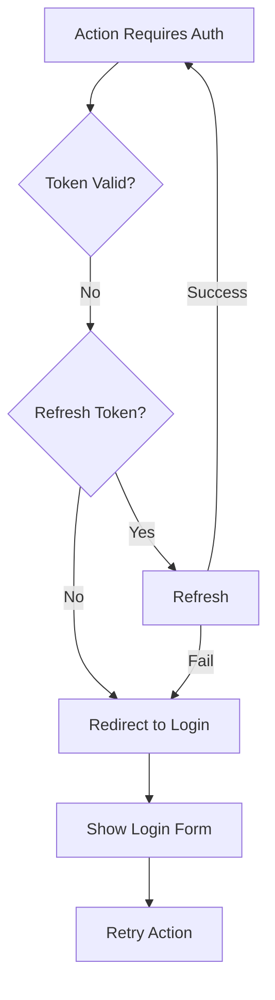
```mermaid
flowchart TD
    A[Action Requires Auth] --> B{Token Valid?}
    B -->|No| C{Refresh Token?}
    C -->|Yes| D[Refresh]
    C -->|No| E[Redirect to Login]
    D -->|Success| A
    D -->|Fail| E
    E --> F[Show Login Form]
    F --> G[Retry Action]
```

### API Error

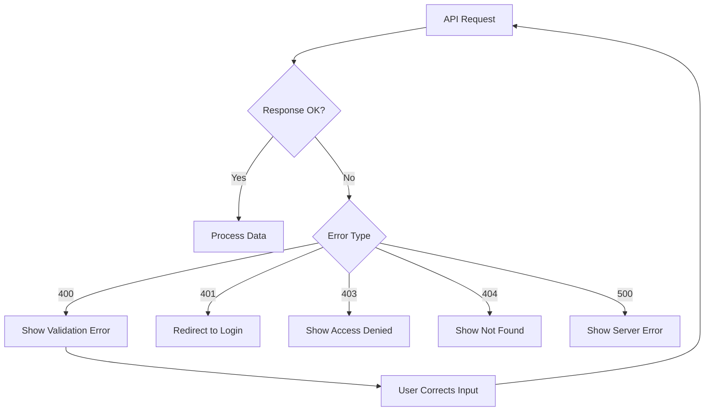
```mermaid
flowchart TD
    A[API Request] --> B{Response OK?}
    B -->|Yes| C[Process Data]
    B -->|No| D{Error Type}
    
    D -->|400| E[Show Validation Error]
    D -->|401| F[Redirect to Login]
    D -->|403| G[Show Access Denied]
    D -->|404| H[Show Not Found]
    D -->|500| I[Show Server Error]
    
    E --> J[User Corrects Input]
    J --> A
```

---

*Dokumentasi ini terakhir diperbarui: Februari 2026*
