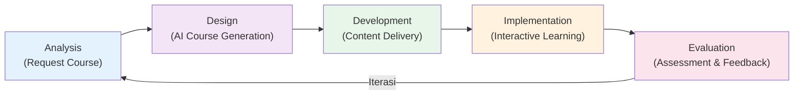
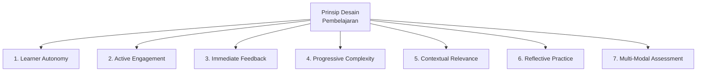
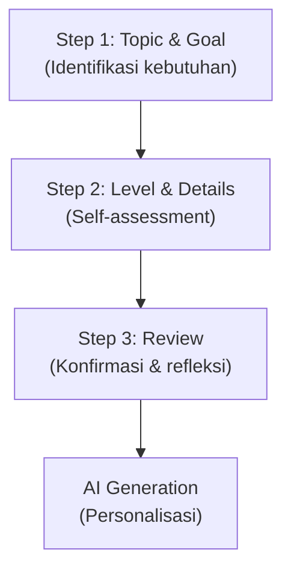
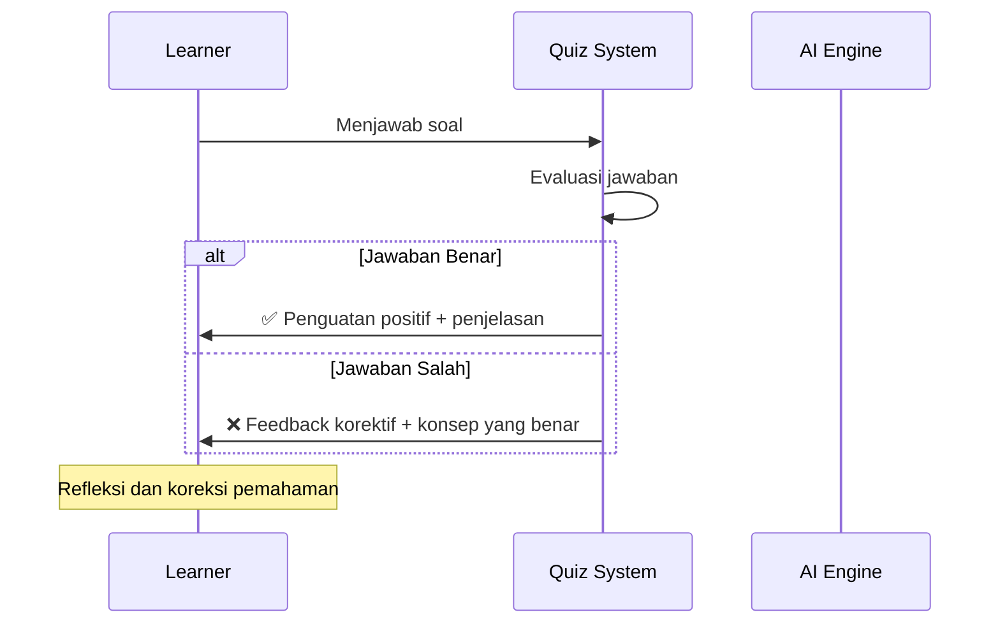
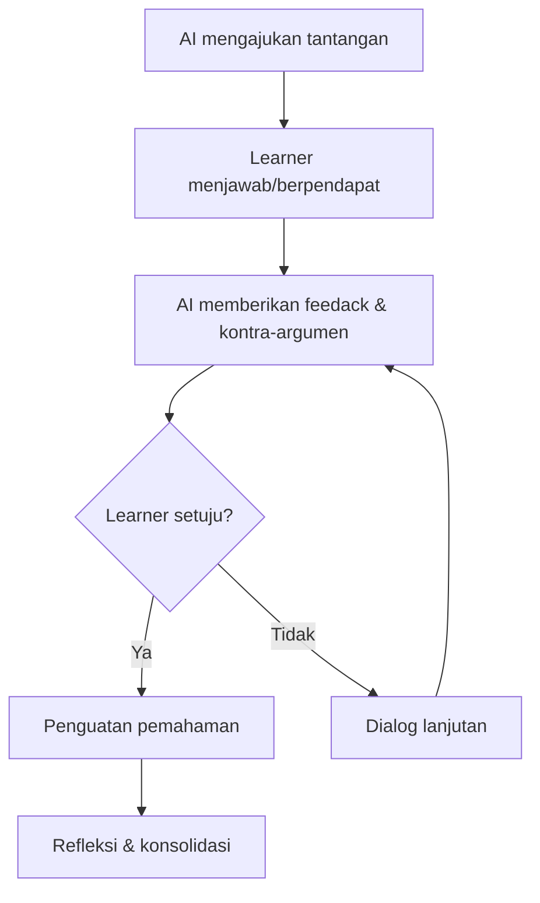
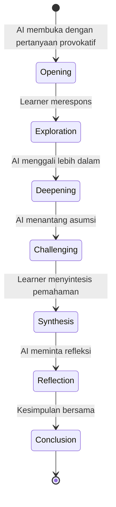
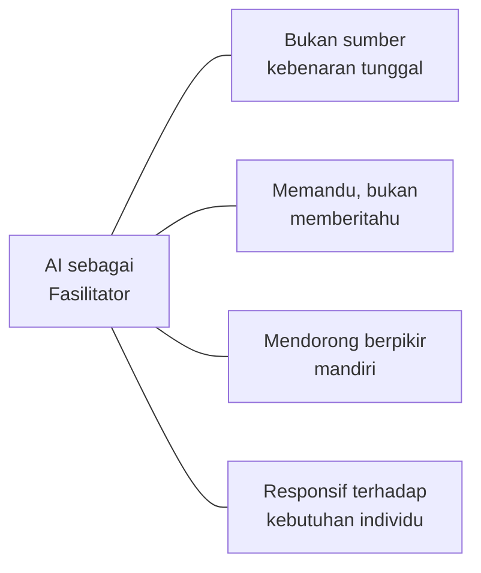
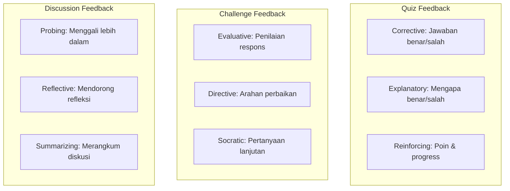

# Desain Instruksional (Pedagogy Design)

Dokumentasi desain instruksional yang mendasari perancangan fitur dan alur pembelajaran di PrincipleLearn V3.

---

## 📋 Daftar Isi
1. [Model Instruksional](#model-instruksional)
2. [Prinsip Desain Pembelajaran](#prinsip-desain-pembelajaran)
3. [Strategi Instruksional per Fitur](#strategi-instruksional-per-fitur)
4. [Desain Interaksi AI–Learner](#desain-interaksi-ailearner)
5. [Scaffolding Strategy](#scaffolding-strategy)
6. [Feedback Design](#feedback-design)
7. [Motivational Design (ARCS)](#motivational-design-arcs)

---

## 🏗️ Model Instruksional

### Model ADDIE yang Diadaptasi

PrincipleLearn V3 mengadopsi model **ADDIE** (Analysis, Design, Development, Implementation, Evaluation) yang telah diadaptasi untuk konteks AI-powered learning.



### Pemetaan ADDIE ke Alur Aplikasi

| Fase ADDIE | Aktivitas Tradisional | Implementasi di PrincipleLearn V3 |
|------------|----------------------|----------------------------------|
| **Analysis** | Analisis kebutuhan belajar oleh instruktur | User mengisi form Request Course (topic, goal, level, problem, assumption) |
| **Design** | Instruktur merancang silabus | AI menganalisis input dan merancang outline kursus |
| **Development** | Tim konten membuat materi | AI men-generate konten terstruktur (modul, subtopik, quiz) |
| **Implementation** | Mahasiswa mengakses kelas | Learner belajar melalui interactive features |
| **Evaluation** | Ujian akhir semester | Assessment kontinu (quiz, challenge, journal, feedback) |

### Keunggulan Adaptasi

> [!IMPORTANT]
> Perbedaan kunci dari ADDIE tradisional: semua fase terjadi **secara cepat dan personal** untuk setiap individu learner, bukan satu desain untuk satu kelas.

---

## 📐 Prinsip Desain Pembelajaran

### 7 Prinsip yang Diterapkan



| No | Prinsip | Deskripsi | Implementasi |
|----|---------|-----------|--------------|
| 1 | **Learner Autonomy** | Learner memiliki kendali atas proses belajar | Self-paced, topic selection, level choice |
| 2 | **Active Engagement** | Pembelajaran membutuhkan partisipasi aktif | Discussion, Challenge, Ask Question |
| 3 | **Immediate Feedback** | Umpan balik diberikan segera setelah aktivitas | Quiz instant feedback, Challenge feedback |
| 4 | **Progressive Complexity** | Materi meningkat secara bertahap | Modul berurutan, subtopik berjenjang |
| 5 | **Contextual Relevance** | Materi dikaitkan dengan konteks nyata learner | Problem-based & goal-based course generation |
| 6 | **Reflective Practice** | Refleksi memperkuat pemahaman | Learning Journal, end-of-discussion reflection |
| 7 | **Multi-Modal Assessment** | Penilaian dari berbagai sudut | Quiz + Challenge + Journal + Feedback |

---

## 🎓 Strategi Instruksional per Fitur

### 1. Request Course — *Needs Analysis Strategy*

**Tujuan Pedagogis**: Mengaktifkan prior knowledge dan membangun ownership atas proses belajar.



| Komponen Form | Fungsi Pedagogis |
|---------------|-----------------|
| **Topic** | Mengidentifikasi area pengetahuan yang ingin dikembangkan |
| **Goal** | Menetapkan tujuan belajar yang spesifik dan terukur |
| **Level** | Self-assessment terhadap kemampuan saat ini |
| **Problem** | Mengkontekstualisasikan pembelajaran dalam masalah nyata |
| **Assumption** | Mengeksplisitkan prior knowledge yang dimiliki |
| **Extra Topics** | Mengeksplorasi koneksi antar domain pengetahuan |

**Indikator CT/CPT yang distimulasi**:
- CT: Self-Regulation, Analysis
- CPT: Decomposition, Abstraction, Pattern Recognition

---

### 2. Content Delivery — *Structured Presentation Strategy*

**Tujuan Pedagogis**: Menyajikan informasi baru secara terstruktur dan mudah dicerna.

| Elemen Konten | Strategi Instruksional | Level Bloom |
|---------------|----------------------|-------------|
| Penjelasan konsep | Expository teaching dengan analogi | Remember, Understand |
| Contoh kasus | Case-based learning | Apply, Analyze |
| Key takeaways | Summarization technique | Understand |
| Visual aids | Dual coding theory (Paivio) | Remember |

---

### 3. Quiz Time — *Formative Assessment Strategy*

**Tujuan Pedagogis**: Menguji pemahaman secara real-time dan memberikan umpan balik korektif.



**Desain Soal berdasarkan Bloom**:
- **Remember**: Pilihan ganda fakta dasar
- **Understand**: Soal pemahaman konsep dan interpretasi
- **Apply**: Soal penerapan pada situasi baru
- **Analyze**: Soal analisis hubungan antar konsep

**Indikator CT/CPT yang distimulasi**:
- CT: Evaluation
- CPT: Pattern Recognition, Algorithmic Thinking, Debugging/Error Correction

---

### 4. Ask Question — *Inquiry-Based Strategy*

**Tujuan Pedagogis**: Mendorong curiosity dan kemampuan meformulasikan pertanyaan berkualitas.

| Jenis Pertanyaan | Contoh | Level Berpikir |
|-----------------|--------|----------------|
| **Klarifikasi** | "Apa maksud dari...?" | Understand |
| **Koneksi** | "Bagaimana hubungan X dengan Y?" | Analyze |
| **Aplikasi** | "Bagaimana menerapkan ini di...?" | Apply |
| **Evaluasi** | "Mengapa pendekatan A lebih baik dari B?" | Evaluate |

**Desain Respons AI**:
- Tidak langsung memberikan jawaban final
- Mendorong pemikiran lebih dalam melalui pertanyaan balik (Sokratik)
- Memberikan konteks dan contoh yang relevan

---

### 5. Challenge My Thinking — *Cognitive Conflict Strategy*

**Tujuan Pedagogis**: Menciptakan **disonansi kognitif** yang mendorong pemikiran kritis dan evaluasi ulang terhadap pemahaman.



**Strategi Challenge**:
1. **Assumption Testing**: Menguji asumsi yang dipegang learner
2. **Counter-Example**: Memberikan contoh yang menantang generalisasi
3. **What-If Scenario**: Mengeksplorasi konsekuensi dari pemikiran tertentu
4. **Perspective Shift**: Meminta learner melihat dari sudut pandang lain

**Indikator CT/CPT yang distimulasi**:
- CT: Evaluation, Inference, Self-Regulation
- CPT: Abstraction, Algorithmic Thinking

---

### 6. Socratic Discussion — *Guided Discovery Strategy*

**Tujuan Pedagogis**: Memfasilitasi penemuan pemahaman melalui dialog terstruktur yang dipandu AI.

**Alur Diskusi Sokratik**:



**Peran AI sebagai Fasilitator Sokratik**:

| Fase | Peran AI | Contoh Prompt |
|------|---------|---------------|
| **Opening** | Memunculkan curiosity | "Menurut Anda, mengapa X terjadi?" |
| **Exploration** | Menggali pemahaman awal | "Menarik! Bisa jelaskan lebih detail?" |
| **Deepening** | Mendorong analisis | "Bagaimana jika kondisinya berubah?" |
| **Challenging** | Menantang asumsi | "Tapi bukankah ada kasus di mana...?" |
| **Synthesis** | Membantu menyatukan konsep | "Jadi apa kesimpulan Anda sejauh ini?" |
| **Reflection** | Mendorong metakognisi | "Apa yang paling mengubah cara pandang Anda?" |

---

### 7. Learning Journal — *Reflective Writing Strategy*

**Tujuan Pedagogis**: Melatih kemampuan metakognitif melalui **reflective practice** (Schön, 1983).

| Aspek Refleksi | Pertanyaan Pemandu | Tujuan |
|---------------|-------------------|--------|
| **What** | Apa yang saya pelajari hari ini? | Recall & summarization |
| **So What** | Mengapa hal ini penting? | Meaning-making |
| **Now What** | Bagaimana saya akan menerapkannya? | Transfer & application |
| **Challenges** | Apa yang masih membingungkan? | Self-awareness |
| **Connections** | Bagaimana ini terkait dengan apa yang saya tahu? | Integration |

---

## 🤖 Desain Interaksi AI–Learner

### Prinsip Interaksi



### Spektrum Peran AI

| Fitur | Peran AI | Level Bantuan |
|-------|---------|---------------|
| Content Delivery | **Instructor** — Menyampaikan materi | Tinggi |
| Quiz Time | **Assessor** — Mengevaluasi pemahaman | Sedang |
| Ask Question | **Tutor** — Memandu pemahaman | Sedang |
| Challenge | **Provocateur** — Menantang pemikiran | Rendah |
| Discussion | **Socratic Guide** — Dialog terbimbing | Rendah |

### Prinsip "Fading Scaffold"

```
Awal Pembelajaran     →     Tengah     →     Akhir
━━━━━━━━━━━━━━━━━━━━━━━━━━━━━━━━━━━━━━━━━━━━━━━
Bantuan Tinggi              Sedang            Minimal
(Content + Quiz)     (Ask + Challenge)    (Discussion + Journal)
```

---

## 📊 Scaffolding Strategy

### Jenis dan Penerapan

| Jenis Scaffolding | Deskripsi | Fitur | Kapan Diberikan |
|-------------------|-----------|-------|-----------------|
| **Hard Scaffold** | Bantuan terstruktur yang sudah dirancang | Content delivery, quiz options | Selalu tersedia |
| **Soft Scaffold** | Bantuan responsif berdasarkan kebutuhan | AI responses, feedback | Saat user bertanya/salah |
| **Peer Scaffold** | Bantuan dari sesama learner | Discussion (future) | Saat interaksi peer |
| **Self-Scaffold** | Alat bantu untuk refleksi diri | Journal prompts, progress bar | Setiap sesi |

### Gradual Release of Responsibility

```
Level 1 (Beginner)     Level 2 (Intermediate)     Level 3 (Advanced)
───────────────────    ────────────────────────    ────────────────────
• Penjelasan detail    • Penjelasan konseptual    • Konsep ringkas
• Contoh lengkap       • Contoh parsial           • Tantangan langsung
• Quiz mudah           • Quiz sedang              • Quiz kompleks
• Banyak scaffolding   • Scaffolding selektif     • Minimal scaffolding
```

---

## 🎯 Feedback Design

### Prinsip Feedback Efektif

| Prinsip | Deskripsi | Implementasi |
|---------|-----------|--------------|
| **Timely** | Diberikan segera | Instant feedback pada quiz dan challenge |
| **Specific** | Fokus pada aspek tertentu | Penjelasan per soal, bukan hanya skor |
| **Constructive** | Berorientasi perbaikan | "Hampir benar! Pertimbangkan juga..." |
| **Actionable** | Memberikan arah tindakan | Saran langkah selanjutnya |
| **Encouraging** | Menjaga motivasi | Penguatan positif pada pencapaian |

### Tipe Feedback per Fitur



---

## 💪 Motivational Design (ARCS)

### Model ARCS (Keller, 2010)

Desain motivasi menggunakan model **ARCS** (Attention, Relevance, Confidence, Satisfaction):

| Komponen | Strategi | Implementasi |
|----------|---------|--------------|
| **Attention** | Menarik perhatian dan mempertahankan curiosity | UI menarik, interactive elements, challenge yang provokatif |
| **Relevance** | Menghubungkan dengan kebutuhan dan tujuan learner | Problem-based course, goal-oriented content |
| **Confidence** | Membangun keyakinan akan keberhasilan | Progressive difficulty, immediate positive feedback |
| **Satisfaction** | Memberikan rasa pencapaian | Progress tracking, completion status, quiz scores |

### Implementasi ARCS per Fase Pembelajaran

```
Fase Awal (Onboarding)
├── Attention: Landing page yang menarik, promise value jelas
├── Relevance: Custom course sesuai kebutuhan
├── Confidence: Level selection, "mulai dari yang Anda bisa"
└── Satisfaction: Course berhasil di-generate

Fase Tengah (Learning)
├── Attention: Interactive quiz, challenge, variasi konten
├── Relevance: Contoh kontekstual, problem-based
├── Confidence: Feedback positif, progress bar naik
└── Satisfaction: Sub-topik selesai, skor quiz bagus

Fase Akhir (Completion)
├── Attention: Summary yang comprehensive
├── Relevance: "Knowledge yang bisa diterapkan"
├── Confidence: Completion certificate
└── Satisfaction: Journal refleksi, overall achievement
```

---

## 📚 Referensi

| No | Referensi |
|----|-----------|
| 1 | Branch, R. M. (2009). *Instructional Design: The ADDIE Approach*. Springer. |
| 2 | Keller, J. M. (2010). *Motivational Design for Learning and Performance: The ARCS Model Approach*. Springer. |
| 3 | Merrill, M. D. (2002). First principles of instruction. *Educational Technology Research and Development*, 50(3), 43–59. |
| 4 | Schön, D. A. (1983). *The Reflective Practitioner*. Basic Books. |
| 5 | Paivio, A. (1986). *Mental Representations: A Dual Coding Approach*. Oxford University Press. |

---

*Dokumentasi ini terakhir diperbarui: Februari 2026*
