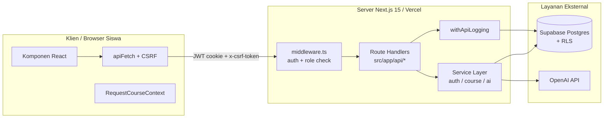
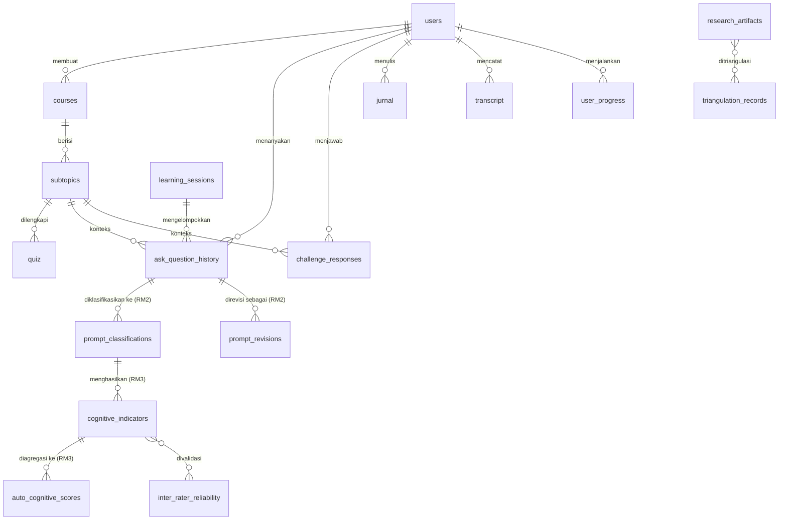
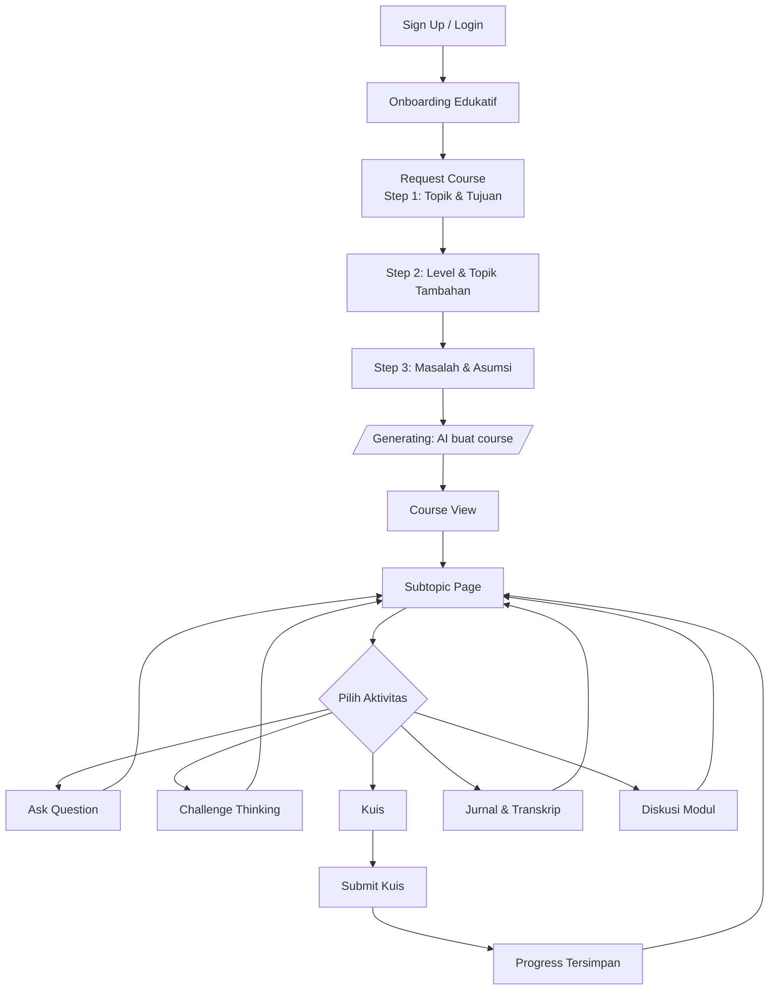
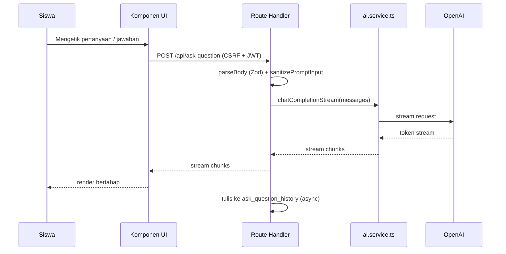

# DOKUMEN PROFIL PROYEK TESIS

**Judul Tesis:**
**Pengembangan Media Pembelajaran Algoritma Berbasis AI dengan Pendekatan *Personalized Learning* untuk Menganalisis Perkembangan Struktur Prompt dalam *Computational Thinking* dan *Critical Thinking* Siswa SMA Kelas 10**

**Institusi:** Universitas Pendidikan Ilmu Komputer
**Sifat Dokumen:** Privat — untuk dosen pembimbing dan penguji
**Versi:** 1.0
**Tanggal:** 26 April 2026

---

## Daftar Isi

1. Pendahuluan
2. Konteks Penelitian
3. Gambaran Umum Sistem
4. Arsitektur Teknis
5. Model Data
6. Alur Penggunaan
7. Metodologi Integrasi AI
8. Pipeline Pengukuran Riset (RM2 & RM3)
9. Keamanan dan Privasi
10. Status Implementasi dan Keterbatasan
11. Lampiran

---

## 1. Pendahuluan

### 1.1 Identitas Proyek

Proyek ini merupakan artefak penelitian tesis Magister yang berbentuk **aplikasi web pembelajaran berbasis kecerdasan buatan (AI)**. Aplikasi tidak ditujukan sebagai produk komersial, melainkan sebagai instrumen penelitian (*research instrument*) yang digunakan oleh sejumlah terbatas peserta penelitian untuk menghasilkan data primer yang akan dianalisis dalam tesis.

Repositori kode internal proyek dikenal dengan nama paket `principle-learn` versi 0.2.0. Selanjutnya dalam dokumen ini, aplikasi disebut sebagai **Media Pembelajaran** atau **sistem**.

### 1.2 Latar Belakang Singkat

Pembelajaran algoritma di tingkat Sekolah Menengah Atas (SMA) menuntut siswa membangun dua kemampuan kognitif tingkat tinggi: ***computational thinking*** (CT) — kemampuan menguraikan masalah, mengenali pola, melakukan abstraksi, dan menyusun algoritma; serta ***critical thinking*** (CrT) — kemampuan mengevaluasi argumen, menyaring asumsi, dan menalar secara reflektif. Kedua kemampuan ini selama ini diukur secara tidak langsung melalui asesmen tertulis konvensional yang sulit menangkap **proses berpikir** siswa.

Munculnya *Large Language Model* (LLM) seperti yang disediakan OpenAI membuka kemungkinan baru: ketika siswa berinteraksi dengan AI dalam proses belajar, **struktur dari pertanyaan / prompt yang mereka rumuskan** dapat menjadi jejak (*proxy*) bagi struktur berpikir mereka. Pertanyaan yang awalnya dangkal-deklaratif ("apa itu *for loop*?") berbeda secara fundamental dari pertanyaan yang reflektif-evaluatif ("kenapa kompleksitas algoritma X lebih buruk daripada Y untuk kasus Z?"). Perubahan struktur prompt antar-waktu dapat dijadikan indikator perkembangan kemampuan CT dan CrT.

### 1.3 Tujuan Proyek

Proyek ini memiliki dua lapis tujuan yang saling mendukung:

1. **Tujuan praktis** — membangun media pembelajaran algoritma berbasis AI yang melayani siswa SMA Kelas 10 dengan pendekatan *personalized learning*: course di-*generate* berdasarkan topik, tujuan, dan tingkat siswa; siswa difasilitasi belajar mandiri dengan bantuan AI (tanya-jawab, *challenge thinking*, kuis, jurnal refleksi).
2. **Tujuan riset** — mengumpulkan data interaksi siswa dengan AI sebagai bahan analisis perkembangan struktur prompt dan indikator CT / CrT, yang menjadi inti pembahasan tesis.

### 1.4 Ruang Lingkup

Ruang lingkup yang **termasuk** dalam dokumen ini:

- Arsitektur dan implementasi sistem yang sudah berjalan;
- Alur pengguna (siswa) dan administrator (peneliti);
- Skema basis data, termasuk tabel khusus riset;
- Metodologi integrasi AI dan rencana pipeline pengukuran;
- Aspek keamanan dan privasi data peserta penelitian.

Ruang lingkup yang **tidak termasuk**:

- Detail isi tesis (kerangka teori, kajian pustaka, metode analisis statistik);
- Hasil empiris dari peserta penelitian;
- Manual penggunaan langkah-demi-langkah;
- *Screenshot* antarmuka pengguna.

### 1.5 Sistematika Dokumen

Dokumen disusun bertahap dari konteks ke detail. Pembaca yang ingin gambaran umum cukup membaca Bab 1 sampai Bab 3. Pembaca yang menilai kelayakan implementasi dapat melanjutkan ke Bab 4 sampai Bab 6. Pembaca yang fokus pada metodologi riset dapat langsung ke Bab 7 dan Bab 8.

---

## 2. Konteks Penelitian

### 2.1 Rumusan Masalah

Tesis ini bertumpu pada tiga rumusan masalah (selanjutnya disingkat **RM**):

- **RM1 — Pengembangan Media.** Bagaimana proses dan hasil pengembangan media pembelajaran algoritma berbasis AI dengan pendekatan *personalized learning* pada pembelajaran Informatika Fase E?
- **RM2 — Perkembangan Struktur Prompt.** Bagaimana tahapan perkembangan struktur prompt siswa SMA dalam interaksi dengan AI pada pembelajaran algoritma?
- **RM3 — Manifestasi CT & *Critical Thinking*.** Bagaimana indikator *computational thinking* dan *critical thinking* termanifestasi dalam setiap tahapan perkembangan struktur prompt tersebut?

### 2.2 Pemetaan RM ke Metodologi Pengambilan Data

Sistem yang dijelaskan dokumen ini melayani ketiga RM secara berbeda — sebagai **artefak yang dievaluasi** untuk RM1, dan sebagai **alat pengumpul data** untuk RM2 dan RM3.

| RM | Sumber Data | Instrumen | Teknik Analisis | Luaran |
|---|---|---|---|---|
| **RM1** | Skor validitas pakar (LORI), skor praktikalitas pengguna (SUS), catatan revisi ahli, komentar pengguna | Lembar *expert appraisal*, LORI, SUS, rekap keputusan revisi | Analisis deskriptif LORI & SUS, integrasi hasil untuk keputusan revisi | Status kelayakan media (valid-praktis) + rekomendasi revisi |
| **RM2** | Log interaksi siswa–AI antar-sesi, *logbook* observasi kelas, wawancara pendalaman | Sistem *logging* digital, *logbook* observasi, **rubrik strategi prompting (SCP → SRP → MQP → Reflektif)** | *Inductive content analysis* untuk pembentukan kategori, lalu analisis longitudinal per sesi dan per partisipan | Peta lintasan perkembangan struktur prompt + identifikasi pola (naik, stagnan, fluktuatif, anomali) |
| **RM3** | Unit prompt terkode, artefak solusi, narasi klarifikasi dari wawancara | *Crosswalk* operasional RM3, matriks indikator CT, **matriks indikator CrT (Facione)**, lembar analisis artefak | *Directed content analysis* berbasis kerangka CT & Facione, diikuti triangulasi lintas sumber | Profil manifestasi CT & CrT pada setiap tahap prompt — dasar sintesis model konseptual akhir |

### 2.3 Posisi Sistem dalam Penelitian

Sistem berperan sebagai **alat pengumpul data sekaligus intervensi pembelajaran**. Untuk **RM1**, sistem adalah obyek yang dievaluasi (validitas oleh ahli, praktikalitas oleh siswa). Untuk **RM2 dan RM3**, sistem adalah instrumen pengumpul data: setiap interaksi siswa dengan AI yang berimplikasi kognitif (mengajukan pertanyaan, menjawab tantangan berpikir, mengisi jurnal refleksi, mengerjakan kuis) tercatat di basis data dan menjadi bahan analisis longitudinal.

### 2.4 Aktor / Pengguna

| Aktor | Jumlah | Peran dalam sistem | Peran dalam riset |
|---|---|---|---|
| **Siswa** | Terbatas (peserta riset) | Pengguna akhir media pembelajaran | Subjek penelitian; produsen data prompt |
| **Administrator** | 1 orang (peneliti) | Mengelola siswa & memantau aktivitas | Pengamat & analis data |
| **AI (OpenAI)** | — | Generator konten & penjawab pertanyaan | Stimulus interaksi |

Tidak ada peran lain (*reviewer*, *co-rater*, dosen pembimbing dalam aplikasi). Hierarki peran sengaja dibatasi pada `user` dan `ADMIN`.

---

## 3. Gambaran Umum Sistem

### 3.1 Deskripsi Sistem

Sistem adalah aplikasi web *single-page-feel* berbasis **Next.js 15 (App Router)** dengan basis data **Supabase PostgreSQL** dan integrasi **OpenAI API**. Siswa mengakses sistem melalui *browser*, masuk dengan akun, melalui *onboarding* edukatif, lalu meminta sebuah *course* algoritma yang akan di-*generate* secara otomatis oleh AI sesuai parameter mereka. Selama belajar, siswa dapat bertanya pada AI, ditantang berpikir oleh AI, mengerjakan kuis, dan mengisi jurnal refleksi. Setiap interaksi tercatat untuk keperluan riset.

### 3.2 Pendekatan *Personalized Learning*

Personalisasi pada sistem ini diwujudkan melalui tiga lapis:

1. **Personalisasi konten saat pembuatan course** — siswa mengisi *form* tiga langkah yang menyatakan: topik yang diinginkan, tujuan belajar, tingkat kemahiran (*Beginner / Intermediate / Advanced*), topik tambahan, masalah yang dihadapi, dan asumsi awal. AI menggunakan parameter ini untuk membentuk struktur kursus.
2. **Personalisasi *runtime*** — fitur *Ask Question* dan *Challenge Thinking* memberi respons yang spesifik terhadap konteks subtopik tempat siswa sedang berada, dengan *streaming* respons untuk pengalaman yang responsif.
3. **Personalisasi asesmen** — kuis dapat di-*regenerate* per subtopik; jurnal refleksi mengikuti progres tiap modul.

### 3.3 Fitur Utama

Berikut fitur yang **sudah diimplementasikan dan berjalan** di sistem:

- **Otentikasi siswa & administrator** dengan JWT, *refresh token*, dan proteksi CSRF.
- **Onboarding edukatif** (`/onboarding`, `/onboarding/intro`) untuk memperkenalkan paradigma belajar dengan AI sebelum siswa mulai meminta *course*.
- **Permintaan *course* tiga-langkah** (`/request-course/step1` → `step2` → `step3` → `generating`) yang menyimpan keadaan lintas langkah melalui `RequestCourseContext`.
- ***AI course generation*** (`/api/generate-course`, `/api/generate-subtopic`, `/api/generate-examples`) — pembentukan struktur modul → subtopik → halaman beserta contoh.
- **Belajar per-subtopik** (`/course/[courseId]/subtopic/[subIdx]/[pageIdx]`) dengan halaman bertahap.
- ***Ask Question*** (`/api/ask-question`, *streaming*) — siswa mengetikkan pertanyaan bebas, AI menjawab dengan referensi pada konteks subtopik.
- ***Challenge Thinking*** (`/api/challenge-thinking`, *streaming*) — sistem memberikan *prompt* tantangan berpikir yang menuntut siswa mengevaluasi, membandingkan, atau memutuskan sesuatu; respons siswa kemudian diberi umpan balik melalui `/api/challenge-feedback`.
- **Kuis interaktif** dengan submisi (`/api/quiz/submit`), pengecekan status (`/api/quiz/status`), dan kemampuan *regenerate* (`/api/quiz/regenerate`).
- **Jurnal refleksi** (`/api/jurnal/save`, `/api/jurnal/status`) dan **transkrip** catatan belajar.
- **Diskusi modul *user-facing*** (`/course/[courseId]/discussion/[moduleIdx]`, endpoint `/api/discussion/*`) sebagai bagian dari alur belajar.
- **Pelacakan progres belajar** (`/api/learning-progress`, `/api/user-progress`, `/api/learning-profile`, `/api/prompt-journey`).
- ***Admin panel*** untuk: dashboard ringkas (`/admin/dashboard`), manajemen siswa (`/admin/siswa`, `/admin/siswa/[id]`), pemantauan aktivitas (`/admin/aktivitas`), dan modul riset (`/admin/riset/*`).
- **Pencatatan log API** ke tabel `api_logs` melalui *middleware* `withApiLogging` untuk audit dan debugging.

### 3.4 Fitur di Luar Lingkup Riset

Beberapa modul tersedia di basis kode tetapi **tidak digunakan dalam riset tesis** dan tidak dipelihara aktif:

- **Modul Ekspor** (`/admin/ekspor` dan endpoint `*/export`).
- **Tab Kesehatan Sistem** pada *dashboard* admin (endpoint `/api/admin/monitoring/logging`).
- **Modul Diskusi sisi admin** (tab "Diskusi" pada `/admin/aktivitas` dan endpoint `/api/admin/discussions/*`). *Catatan:* fitur diskusi sisi siswa tetap aktif.

Penjelasan: keputusan ini diambil agar fokus tesis tertumpu pada perkembangan struktur prompt siswa, bukan pada operasionalisasi sistem.

---

## 4. Arsitektur Teknis

### 4.1 Stack Teknologi

| Lapis | Teknologi | Catatan |
|---|---|---|
| *Framework* | Next.js 15 *App Router* | Server Components + *route handlers* |
| Bahasa | TypeScript 5 (*strict*) | — |
| UI | React 19 + Sass *modules* | Komponen ber-*scope* per fitur |
| Basis data | Supabase PostgreSQL | RLS aktif, *service role* untuk operasi elevasi |
| Otentikasi | JWT *custom* (bukan Supabase Auth) | *Access* + *refresh token*, *cookie httpOnly* |
| Validasi | Zod | Lewat *helper* `parseBody()` |
| AI | OpenAI SDK v4 | Model standar dapat diatur via `OPENAI_MODEL` |
| *Logging* | Tabel `api_logs` + *middleware* | — |
| *Deployment* | Vercel | *Node 22.x* |

### 4.2 Diagram Arsitektur Tingkat Tinggi



### 4.3 Pola Komunikasi Klien-Server

- ***Cookie***-based JWT: *access token* berusia pendek + *refresh token* yang dirotasi tiap pemakaian.
- ***Double-submit cookie* CSRF**: nilai `csrf_token` dibaca oleh `apiFetch()` di sisi klien lalu dikirim ulang sebagai *header* `x-csrf-token`. *Middleware* `withProtection()` membandingkan keduanya.
- ***Streaming response*** untuk *Ask Question* dan *Challenge Thinking* menggunakan *Server-Sent style* via *Fetch streams*, memungkinkan siswa melihat jawaban AI ditulis bertahap.
- ***Auto-refresh* 401**: jika *access token* kedaluwarsa, klien otomatis memanggil `/api/auth/refresh` dan mencoba ulang permintaan sekali tanpa intervensi pengguna.

### 4.4 Lapisan Layanan (*Service Layer*)

Logika bisnis dipisahkan dari *route handler*:

- `auth.service.ts` — pencarian *user*, *hash* password (*bcrypt*), pembentukan JWT, *token* CSRF.
- `course.service.ts` — CRUD *course*, manajemen subtopik, kontrol akses berbasis kepemilikan.
- `ai.service.ts` — pemanggilan OpenAI dalam tiga mode: *single*, *retry*, dan *streaming*; sanitasi *prompt*; validasi *response*.

### 4.5 Struktur Direktori Inti

```
src/
├── app/                     # Next.js App Router (UI + API)
│   ├── api/                 # Route handler (RM1: produk; RM2/RM3: data riset)
│   ├── admin/               # Halaman administrator
│   ├── course/[courseId]/   # Pengalaman belajar
│   ├── request-course/      # Alur 3 langkah pembuatan course
│   ├── onboarding/          # Onboarding edukatif
│   └── dashboard/           # Dashboard siswa
├── components/              # Komponen UI per fitur
├── services/                # Logika bisnis (auth, course, ai)
├── hooks/                   # useAuth, useSessionStorage, dll.
├── lib/                     # Infrastruktur (database, jwt, csrf, schemas, ...)
├── context/                 # RequestCourseContext
└── types/                   # Definisi TypeScript
```

---

## 5. Model Data

### 5.1 Tabel Inti (Sudah Terisi & Aktif Dipakai)

| Tabel | Fungsi |
|---|---|
| `users` | Identitas pengguna (siswa & admin). Mendukung *soft delete* (`deleted_at`). |
| `courses` | *Course* yang di-*generate* AI berdasarkan permintaan siswa. |
| `subtopics` | Pecahan *course* per modul → subtopik → halaman. |
| `quiz` | Soal & submisi kuis per subtopik. |
| `jurnal` | Jurnal refleksi siswa per modul. |
| `transcript` | Transkrip / catatan belajar siswa. |
| `user_progress` | Status progres pembelajaran (subtopik mana yang sudah selesai). |
| `feedback` | Umpan balik bebas dari siswa. |
| `discussion_sessions` & `discussion_messages` | Mendukung diskusi sisi siswa pada `/course/[id]/discussion/[idx]`. |
| `ask_question_history` | **Sumber utama RM2/RM3** — riwayat pertanyaan siswa ke AI. |
| `challenge_responses` | Jawaban siswa terhadap *Challenge Thinking* (berikut umpan balik AI). |
| `api_logs` | Log permintaan API untuk audit & debugging. |

### 5.2 Tabel Pendukung Riset (Skema Sudah, Pipeline Belum)

Sembilan tabel berikut **sudah dibuat skemanya** namun belum terisi data karena pipeline pengisi otomatis belum dibangun (lihat Bab 8.5):

1. `prompt_classifications` — hasil klasifikasi struktur tiap prompt siswa (RM2).
2. `prompt_revisions` — riwayat revisi prompt yang sama oleh siswa.
3. `cognitive_indicators` — indikator CT/CrT yang teridentifikasi (RM3).
4. `auto_cognitive_scores` — skor kognitif otomatis turunan dari `cognitive_indicators`.
5. `learning_sessions` — agregasi sesi belajar siswa untuk konteks longitudinal.
6. `research_artifacts` — artefak riset (kutipan, *highlight*, anotasi).
7. `triangulation_records` — catatan triangulasi antar sumber data.
8. `inter_rater_reliability` — uji reliabilitas antar-penilai (rencana untuk validasi koding).
9. `discussion_admin_actions` — log tindakan admin pada modul diskusi (di luar lingkup riset).

### 5.3 Diagram Hubungan Tabel (Disederhanakan)



Hubungan di sisi tabel inti ↔ tabel riset adalah satu-arah: tabel inti menjadi **sumber bahan baku**, tabel riset menjadi **lapisan analisis turunan**.

---

## 6. Alur Penggunaan

### 6.1 Alur Tinggi-Tingkat Siswa



### 6.2 Permintaan Course Tiga-Langkah

Tiga halaman (`step1` → `step2` → `step3`) berbagi *state* lewat `RequestCourseContext`. Isi *state* divalidasi terhadap `GenerateCourseSchema` (Zod) sebelum dikirim ke `/api/generate-course`. Jenis kolom yang divalidasi:

- `topic` (wajib)
- `goal` (wajib)
- `level` ∈ {*Beginner*, *Intermediate*, *Advanced*}
- `extraTopics`, `problem`, `assumption` (opsional)

Skema `.strict()` mencegah penyusupan kolom asing seperti `userId`, sehingga identitas pemilik *course* selalu diambil dari JWT di server (mencegah celah IDOR).

### 6.3 Belajar per Subtopik

Halaman `/course/[courseId]/subtopic/[subIdx]/[pageIdx]` adalah unit terkecil pengalaman belajar. Dari halaman ini siswa dapat memicu fitur AI yang membaca konteks subtopik aktif sebagai bagian dari prompt.

### 6.4 Alur AI Streaming (*Ask Question* / *Challenge Thinking*)



### 6.5 Alur Administrator (Peneliti)

Setelah login melalui `/admin/login`, admin dapat mengakses:

- `/admin/dashboard` — ringkasan jumlah siswa, course, dan aktivitas.
- `/admin/siswa` & `/admin/siswa/[id]` — daftar dan detail siswa, termasuk tab "Evolusi" (`/api/admin/siswa/[id]/evolusi`) yang akan menampilkan perkembangan prompt siswa setelah pipeline RM2 aktif.
- `/admin/aktivitas` — log aktivitas (kuis, jurnal, transkrip, *ask question*, *challenge*, *examples*, *generate course*).
- `/admin/riset/*` — modul riset (lihat Bab 8): `prompt`, `kognitif`, `bukti`, `triangulasi`, `readiness`.

---

## 7. Metodologi Integrasi AI

### 7.1 Lapisan AI dalam Sistem

`ai.service.ts` menyediakan tiga gaya pemanggilan:

1. ***Single call*** — untuk *generate-course*, *generate-subtopic*, *generate-examples*, *challenge-feedback*, *quiz/regenerate*. Hasil dikembalikan sekaligus.
2. ***Retry call*** — pembungkus yang mencoba ulang ketika respons AI gagal validasi format JSON.
3. ***Streaming call*** — untuk *Ask Question* dan *Challenge Thinking* agar respons terasa interaktif.

### 7.2 Sanitasi Prompt

Setiap masukan siswa yang akan dimasukkan ke prompt AI dibersihkan oleh `sanitizePromptInput()`. Selain itu, masukan siswa dibungkus dalam **batas penanda XML** (mis. `<student_input>...</student_input>`) sehingga LLM dapat membedakan instruksi sistem dari konten siswa. Kombinasi keduanya menjadi pertahanan utama terhadap upaya *prompt injection*.

### 7.3 Validasi Output

Output AI yang seharusnya berbentuk struktur (mis. JSON struktur kursus, daftar pertanyaan kuis) divalidasi terhadap skema Zod. Jika gagal, lapisan *retry* mencoba ulang dengan instruksi tambahan; jika tetap gagal, *error* dikembalikan ke klien dalam format konsisten.

### 7.4 Konfigurasi Model

Model OpenAI yang dipakai di-*configure* lewat variabel lingkungan `OPENAI_MODEL` (*default*: `gpt-5-mini`). Ini memungkinkan eksperimen lintas model tanpa perubahan kode.

---

## 8. Pipeline Pengukuran Riset (RM2 & RM3)

### 8.1 Sumber Data Mentah

Data mentah berasal dari:

- `ask_question_history` — pertanyaan bebas siswa (sumber utama analisis struktur prompt).
- `challenge_responses` — jawaban terhadap tantangan berpikir.
- `jurnal` — refleksi naratif siswa.
- `quiz` — submisi kuis (skor + jawaban).
- `transcript` — catatan belajar mandiri.

### 8.2 Klasifikasi Struktur Prompt (RM2) — Rubrik SCP → SRP → MQP → Reflektif

Setiap *record* di `ask_question_history` direncanakan untuk diklasifikasikan ke `prompt_classifications` berdasarkan **rubrik strategi prompting** yang diadopsi tesis ini, yaitu empat tahap progresif:

1. ***Single-Concept Prompting* (SCP)** — pertanyaan dangkal-deklaratif yang menyasar satu konsep tunggal (mis. "apa itu *for loop*?"). Penanda: tidak ada konteks, tidak ada tujuan, tidak ada batasan.
2. ***Structured-Reasoning Prompting* (SRP)** — pertanyaan yang menyertakan konteks atau struktur logis (mis. "diberikan kasus X, langkah apa untuk …?"). Penanda: ada premis, ada permintaan urutan / struktur.
3. ***Multi-Question Prompting* (MQP)** — pertanyaan yang merangkai beberapa sub-pertanyaan untuk membangun pemahaman menyeluruh (mis. "apa, kenapa, dan kapan X dipakai dibanding Y?"). Penanda: pertanyaan majemuk dengan keterhubungan tematik.
4. ***Reflective Prompting* (Reflektif)** — pertanyaan evaluatif-meta yang merefleksikan asumsi atau strategi sendiri (mis. "apakah pendekatan saya untuk Z sudah optimal? alternatif apa yang lebih baik dan kenapa?"). Penanda: evaluasi diri, perbandingan, asumsi yang diperiksa.

Selain tahap utama tersebut, dimensi pelengkap yang dapat dikodekan:

- **Tingkat abstraksi** — konkret → konseptual → meta.
- **Indikator revisi** — apakah prompt merupakan revisi dari pertanyaan sebelumnya (terhubung ke `prompt_revisions`).
- **Pola lintasan** — naik (progresif), stagnan, fluktuatif, atau anomali.

Pendekatan analisis: ***inductive content analysis*** untuk memantapkan kategori, dilanjutkan analisis longitudinal per siswa. Klasifikasi dilakukan baik manual (oleh peneliti) maupun otomatis (oleh AI), kemudian divalidasi silang melalui *inter-rater reliability* (lihat 8.4).

Endpoint yang sudah disiapkan untuk klasifikasi:

- `/api/admin/research/classify` (`POST`) — memanggil OpenAI sebagai *classifier* atas batch *prompt*.
- `/api/admin/research/bulk` — heuristik *regex* sederhana untuk *backfill* manual.
- `/api/admin/research/auto-code` — *auto-coding* berbasis AI.
- `/api/admin/research/classifications` — CRUD klasifikasi.

### 8.3 Manifestasi CT & CrT (RM3) — Kerangka CT + Facione

Hasil `prompt_classifications` diturunkan menjadi `cognitive_indicators` dan diagregasi menjadi `auto_cognitive_scores` per siswa per kurun waktu. Pengkodean indikator kognitif menggunakan dua kerangka:

- ***Computational Thinking* (CT)** — empat komponen klasik: dekomposisi, pengenalan pola, abstraksi, dan perancangan algoritma. Manifestasi diidentifikasi dari struktur prompt dan artefak solusi.
- ***Critical Thinking* (CrT) — kerangka Facione** — enam keterampilan kognitif: interpretasi, analisis, evaluasi, inferensi, eksplanasi, dan regulasi diri (*self-regulation*).

Pendekatan analisis: ***directed content analysis*** dengan kerangka di atas sebagai daftar kode awal, lalu dilengkapi triangulasi lintas sumber (prompt + artefak + wawancara). Luaran akhir adalah **profil manifestasi CT & CrT pada setiap tahap prompt** yang menjadi dasar sintesis model konseptual akhir tesis.

Endpoint pendukung:

- `/api/admin/research/indicators` — CRUD indikator.
- `/api/admin/research/auto-scores` & `/auto-scores/summary` — skor kognitif dan ringkasannya.
- `/api/admin/research/sessions` — pengelompokan sesi belajar.

### 8.4 Triangulasi & Inter-Rater Reliability

Untuk meningkatkan validitas:

- `research_artifacts` & `triangulation_records` (`/api/admin/research/artifacts`, `/triangulation`) menyimpan kutipan / tanda dari sumber-sumber berbeda yang saling menguatkan satu temuan.
- `inter_rater_reliability` mendukung uji konsistensi antara koding manual peneliti dan koding otomatis AI.
- `/api/admin/research/evidence` & `/api/admin/research/reconcile` mendukung kerja rekonsiliasi data.
- `/api/admin/research/readiness` memantau kesiapan data riset secara keseluruhan.

### 8.5 Status Implementasi Pipeline

Status saat dokumen ditulis (26 April 2026): **antarmuka admin riset (`/admin/riset/*`) sudah ada**, **endpoint sudah tersedia**, namun **tabel-tabel pendukung riset masih kosong** karena pemicu otomatis belum dibangun. Ini berarti:

- Kartu RM2 dan RM3 di *dashboard* admin akan tampil kosong atau jatuh ke *fallback* heuristik;
- Tab "Evolusi" dan "Kognitif" di `/admin/siswa/[id]` belum menampilkan data nyata;
- Pengisian data dapat dilakukan secara manual lewat antarmuka CRUD pada `/admin/riset/prompt` dan `/admin/riset/kognitif`, atau melalui *backfill* semi-otomatis pada `/api/admin/research/bulk`.

Pembangunan pipeline otomatis adalah tahap pengembangan berikutnya yang **sengaja dipisahkan** dari konsolidasi sistem inti, agar implementasi sistem inti dapat distabilkan terlebih dahulu sebelum membangun pengukuran.

---

## 9. Keamanan dan Privasi

### 9.1 Otentikasi & CSRF

- JWT disimpan dalam *cookie* `httpOnly` `access_token` (tidak dapat dibaca JavaScript klien).
- *Refresh token* ikut dirotasi setiap pemakaian; *token* lama dianggap tidak berlaku.
- *Header* `x-csrf-token` wajib pada permintaan yang mengubah *state*.
- *Middleware* `middleware.ts` menolak akses terotentikasi ke rute yang tidak sesuai peran (`role !== 'ADMIN'` ditolak pada `/admin/*`).

### 9.2 Otorisasi & Row-Level Security

- Supabase *Row Level Security* (RLS) aktif pada tabel-tabel sensitif.
- Operasi yang membutuhkan elevasi memakai *service role* lewat klien `adminDb` (hanya di sisi server).
- Klien `publicDb` hanya untuk pembacaan tingkat anonim yang patuh RLS.

### 9.3 Soft Delete & Anonimisasi

- Penghapusan siswa adalah ***soft delete***: kolom `deleted_at` di tabel `users` ditandai, tabel anak tidak disentuh. Ini memenuhi persyaratan **auditabilitas data riset**.
- Anonimisasi yang diterapkan adalah **level ringan**: email / nama tidak ditampilkan pada konteks sensitif (mis. *screenshot* tesis). Pseudonimisasi kriptografis tidak digunakan karena tidak diperlukan oleh kebijakan etik.
- Dua akun **dilindungi dari penghapusan otomatis** saat migrasi destruktif: akun admin peneliti dan akun penguji (`sal@expandly.id`).

### 9.4 Pertahanan terhadap Prompt Injection

Lihat Bab 7.2 — `sanitizePromptInput()` + batas penanda XML diterapkan pada **semua** *endpoint* yang mengirim masukan siswa ke OpenAI (`ask-question`, `challenge-thinking`, `challenge-feedback`, `generate-course`, `generate-subtopic`, `generate-examples`).

### 9.5 Validasi Input

`parseBody()` di `src/lib/schemas.ts` mengaplikasikan 14 skema Zod terhadap *body* permintaan API. Ini mencegah masukan tak terduga mencapai lapisan layanan.

### 9.6 Pencatatan & Auditabilitas

Setiap permintaan API dicatat ke `api_logs` lewat `withApiLogging`, mencakup: jalur, status, durasi, *user* yang memicu (jika terotentikasi). Catatan ini mendukung audit ulang ketika analisis riset memerlukan rekonstruksi urutan kejadian.

---

## 10. Status Implementasi dan Keterbatasan

### 10.1 Sudah Diimplementasikan

- Otentikasi siswa & admin lengkap dengan CSRF dan rotasi *refresh token*.
- Onboarding edukatif yang menjelaskan paradigma belajar dengan AI sebelum siswa berinteraksi.
- Permintaan *course* tiga-langkah terhubung dengan AI generator.
- Antarmuka belajar per subtopik dengan AI tanya-jawab (*streaming*) dan *challenge thinking* (*streaming*).
- Kuis, jurnal refleksi, transkrip, dan pelacakan progres.
- Modul diskusi sisi siswa.
- Admin: *dashboard*, manajemen siswa (dengan *soft delete*), pemantauan aktivitas, antarmuka modul riset.
- Pencatatan log API.
- Pertahanan keamanan: JWT + CSRF, RLS, sanitasi prompt, validasi Zod, anonimisasi ringan.

### 10.2 Belum Diimplementasikan / Dipisahkan dari Lingkup

- **Pipeline otomatis pengisian tabel riset** (RM2/RM3) — endpoint sudah ada, pemicu belum dijalankan. Pengisian saat ini bersifat manual / heuristik *backfill*.
- Modul Ekspor data, Kesehatan Sistem, dan Diskusi sisi admin — sengaja tidak dipakai untuk tesis.
- Hierarki peran lain di luar `user` dan `ADMIN` — tidak diperlukan karena hanya satu peneliti.
- Pseudonimisasi kriptografis — tidak diperlukan oleh kebijakan etik internal.

### 10.3 Keterbatasan yang Diketahui

- **Skala pengguna terbatas** — sistem dirancang untuk sejumlah kecil peserta penelitian, bukan beban produksi besar.
- **Ketergantungan pada OpenAI** — kualitas hasil *course* dan klasifikasi prompt bergantung pada model yang dipilih dan ketersediaan layanan OpenAI.
- **Klasifikasi otomatis sebagai pengganti koder manusia** — perlu dipertanggungjawabkan validitasnya melalui uji *inter-rater reliability* sebelum dijadikan satu-satunya basis kesimpulan tesis. Skema `inter_rater_reliability` sudah disiapkan untuk keperluan ini.
- **Fast Refresh dimatikan** (`FAST_REFRESH=false`) untuk stabilitas pengembangan; tidak berdampak pada produksi.

---

## 11. Lampiran

### Lampiran A — Daftar Endpoint API (Inti)

**Otentikasi & Sesi**
`/api/auth/login`, `/api/auth/register`, `/api/auth/logout`, `/api/auth/refresh`, `/api/auth/me`
`/api/admin/login`, `/api/admin/register`, `/api/admin/logout`, `/api/admin/me`

**Pembelajaran (Siswa)**
`/api/generate-course`, `/api/generate-subtopic`, `/api/generate-examples`
`/api/ask-question` *(streaming)*, `/api/challenge-thinking` *(streaming)*, `/api/challenge-feedback`, `/api/challenge-response`
`/api/quiz/submit`, `/api/quiz/status`, `/api/quiz/regenerate`
`/api/jurnal/save`, `/api/jurnal/status`
`/api/discussion/start`, `/api/discussion/respond`, `/api/discussion/status`, `/api/discussion/history`, `/api/discussion/prepare`, `/api/discussion/module-status`
`/api/learning-progress`, `/api/learning-profile`, `/api/user-progress`, `/api/prompt-journey`, `/api/onboarding-state`
`/api/courses`, `/api/courses/[id]`

**Administrasi**
`/api/admin/dashboard`, `/api/admin/users`, `/api/admin/users/[id]`, `/api/admin/users/[id]/detail`, `/api/admin/users/[id]/subtopics`, `/api/admin/users/[id]/activity-summary`
`/api/admin/activity/*` (jurnal, transcript, quiz, ask-question, challenge, examples, courses, topics, generate-course, feedback, learning-profile, actions, search, analytics)
`/api/admin/insights`
`/api/admin/siswa/[id]/evolusi`

**Modul Riset (Skema siap, pipeline belum aktif)**
`/api/admin/research/classify`, `/api/admin/research/bulk`, `/api/admin/research/auto-code`
`/api/admin/research/classifications`, `/api/admin/research/indicators`, `/api/admin/research/sessions`
`/api/admin/research/auto-scores`, `/api/admin/research/auto-scores/summary`
`/api/admin/research/evidence`, `/api/admin/research/triangulation`, `/api/admin/research/artifacts`
`/api/admin/research/readiness`, `/api/admin/research/reconcile`, `/api/admin/research/analytics`

### Lampiran B — Daftar Halaman

**Halaman Publik**
`/`, `/login`, `/signup`, `/admin/login`, `/admin/register`

**Pengalaman Siswa**
`/dashboard`, `/onboarding`, `/onboarding/intro`
`/request-course/step1`, `/request-course/step2`, `/request-course/step3`, `/request-course/generating`
`/course/[courseId]`, `/course/[courseId]/subtopic/[subIdx]/[pageIdx]`, `/course/[courseId]/discussion/[moduleIdx]`

**Administrator**
`/admin/dashboard`, `/admin/aktivitas`
`/admin/siswa`, `/admin/siswa/[id]`
`/admin/riset`, `/admin/riset/prompt`, `/admin/riset/kognitif`, `/admin/riset/bukti`, `/admin/riset/triangulasi`, `/admin/riset/readiness`

### Lampiran C — Glosarium

| Istilah | Penjelasan |
|---|---|
| **CT** | *Computational Thinking* — kemampuan dekomposisi, pengenalan pola, abstraksi, dan penyusunan algoritma. |
| **CrT** | *Critical Thinking* — kemampuan menafsir, menganalisis, mengevaluasi, menalar, menjelaskan, dan meregulasi proses berpikir. |
| **Facione** | Kerangka enam keterampilan inti CrT: interpretasi, analisis, evaluasi, inferensi, eksplanasi, regulasi diri — basis pengkodean RM3. |
| **SCP / SRP / MQP / Reflektif** | Empat tahap rubrik strategi prompting: *Single-Concept*, *Structured-Reasoning*, *Multi-Question*, dan *Reflective Prompting* — basis pengkodean RM2. |
| **LORI** | *Learning Object Review Instrument* — instrumen penilaian validitas pakar untuk objek pembelajaran (RM1). |
| **SUS** | *System Usability Scale* — instrumen ukur praktikalitas pengguna (RM1). |
| **Subtopic** | Unit pembelajaran terkecil di bawah modul *course*; satu subtopik dapat memuat beberapa halaman. |
| **Challenge Thinking** | Fitur AI yang melontarkan tantangan reflektif kepada siswa, lalu memberi umpan balik atas jawaban siswa. |
| **Ask Question** | Fitur AI tanya-jawab bebas, dengan respons *streaming*. |
| **Fase E** | Fase Kurikulum Merdeka yang setara dengan SMA Kelas 10 — populasi target penelitian. |
| **RM1, RM2, RM3** | Tiga rumusan masalah tesis: pengembangan media, perkembangan struktur prompt, manifestasi CT & CrT. |
| **RLS** | *Row-Level Security* — kebijakan otorisasi tingkat baris di PostgreSQL/Supabase. |
| **CSRF** | *Cross-Site Request Forgery* — vektor serangan yang dicegah dengan pola *double-submit cookie*. |
| **JWT** | *JSON Web Token* — *token* terotentikasi yang dipakai untuk membawa identitas pengguna. |
| **Soft Delete** | Penghapusan logis dengan menandai `deleted_at`, tanpa menghapus baris fisik. |
| **Personalized Learning** | Pendekatan pembelajaran yang menyesuaikan konten dan asesmen dengan profil pembelajar. |

---

*— Akhir dokumen —*
