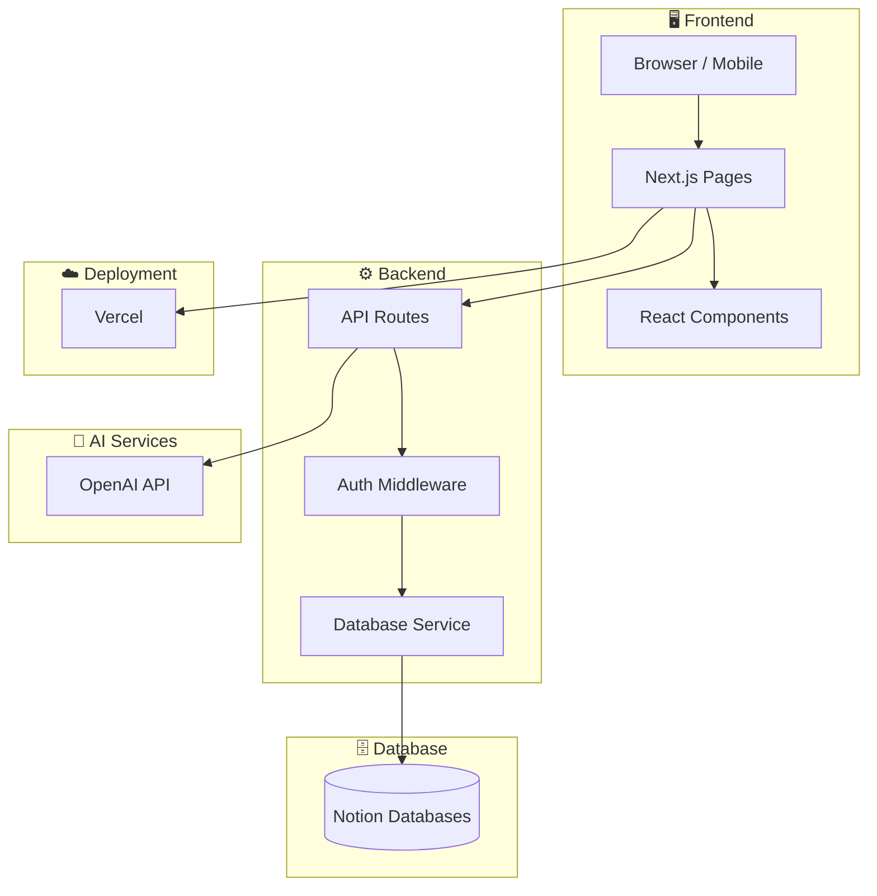

# PrincipleLearn V3 - Documentation

> 🎓 **AI-Powered Learning Management System** - Platform pembelajaran online yang mengintegrasikan teknologi AI untuk memberikan pengalaman belajar yang dipersonalisasi dan adaptif.

---

## 📋 Daftar Dokumentasi

### 🎯 Pengenalan & Teknis

| Dokumentasi | Deskripsi |
|-------------|-----------|
| [Getting Started](./GETTING_STARTED.md) | Panduan instalasi dan setup awal |
| [Application Overview](./APPLICATION_OVERVIEW.md) | Gambaran besar fitur dan konsep aplikasi |
| [Architecture](./ARCHITECTURE.md) | Arsitektur sistem dan diagram |
| [Database Schema](./DATABASE_SCHEMA.md) | Dokumentasi database dan ERD |
| [API Reference](./API_REFERENCE.md) | Dokumentasi lengkap API endpoints |

### 📚 Pedagogis & Pembelajaran

| Dokumentasi | Deskripsi |
|-------------|-----------|
| [Learning Theory](./LEARNING_THEORY.md) | Landasan teori pembelajaran (Konstruktivisme, Bloom, CT, CPT, Sokratik) |
| [Pedagogy Design](./PEDAGOGY_DESIGN.md) | Desain instruksional (ADDIE, strategi per fitur, ARCS) |
| [Thinking Skill](./THINKING_SKILL.md) | Indikator CT & CPT dan pemetaan ke fitur |
| [Question Framework](./QUESTION_FRAMEWORK.md) | Framework pertanyaan dan dialog Sokratik |
| [User Journey](./USER_JOURNEY.md) | Alur pengalaman belajar dari onboarding hingga refleksi |
| [Assessment Rubric](./ASSESSMENT_RUBRIC.md) | Rubrik penilaian CT & CPT (skala 4-level) |

### 👥 User & Navigasi

| Dokumentasi | Deskripsi |
|-------------|-----------|
| [User Roles](./USER_ROLES.md) | Sistem roles dan permissions |
| [Page Catalog](./PAGE_CATALOG.md) | Katalog halaman dan fitur |
| [Page Flow](./PAGE_FLOW.md) | Diagram alur navigasi user |

### 🔧 Operasional

| Dokumentasi | Deskripsi |
|-------------|-----------|
| [Development Guide](./DEVELOPMENT_GUIDE.md) | Panduan pengembangan dan coding standards |
| [Git Workflow](./GIT_WORKFLOW.md) | Konvensi Git dan workflow |
| [Deployment](./DEPLOYMENT.md) | Panduan deployment ke production |
| [Troubleshooting](./TROUBLESHOOTING.md) | Solusi masalah umum |
| [Milestone](./MILESTONE.md) | Progress dan roadmap pengembangan |

---

## 🚀 Quick Start

```bash
# 1. Clone repository
git clone https://github.com/GlennAyden/PrincipleLearnV2.git
cd PrincipleLearnV2

# 2. Install dependencies
npm install

# 3. Setup environment
cp env.example .env.local
# Edit .env.local dengan nilai yang sesuai (NOTION_TOKEN_1/2/3, OPENAI_API_KEY)

# 4. Run development server
npm run dev
```

Buka [http://localhost:3000](http://localhost:3000) untuk melihat aplikasi.

---

## 🏗️ Arsitektur Overview



---

## 🛠️ Tech Stack

| Layer | Technology |
|-------|------------|
| **Framework** | Next.js 15 (App Router) |
| **Frontend** | React 19, TypeScript, Sass |
| **Database** | Notion (via REST API) |
| **Authentication** | Custom JWT (access/refresh tokens) |
| **AI Integration** | OpenAI API (GPT) |
| **Deployment** | Vercel |
| **Styling** | Sass Modules |

---

## ✨ Fitur Utama

### 🤖 AI Course Generation
- Generasi course otomatis berdasarkan input user
- Adaptasi level kesulitan (Beginner, Intermediate, Advanced)
- Konten berkualitas tinggi dengan AI

### 📚 Interactive Learning
- Quiz interaktif dengan feedback langsung
- Progress tracking yang detail
- Learning journal untuk refleksi

### 💬 Discussion System
- Diskusi berbasis metode Socratic
- AI-powered response
- Template diskusi yang dapat dikustomisasi

### 👥 Admin Dashboard
- User management
- Activity monitoring
- Content moderation
- Analytics dashboard

---

## 📁 Struktur Project

```
PrincipleLearnV2/
├── docs/                    # 📖 Dokumentasi
├── public/                  # 📂 Static assets
├── src/
│   ├── app/                 # 📱 Next.js App Router
│   │   ├── api/            # 🔌 API routes
│   │   ├── admin/          # 👨‍💼 Admin pages
│   │   ├── course/         # 📚 Course pages
│   │   ├── dashboard/      # 📊 User dashboard
│   │   └── request-course/ # ➕ Course request flow
│   ├── components/         # 🧩 React components
│   ├── context/            # 🔄 React Context providers
│   ├── hooks/              # 🪝 Custom hooks
│   ├── lib/                # 📚 Utilities & services (incl. database.ts)
│   └── types/              # 📝 TypeScript definitions
└── scripts/                 # 🛠️ Setup & utility scripts
```

---

## 🔗 Links

- **Repository**: [github.com/GlennAyden/PrincipleLearnV2](https://github.com/GlennAyden/PrincipleLearnV2)
- **Notion Dashboard**: [notion.so](https://notion.so)
- **Vercel Dashboard**: [vercel.com](https://vercel.com)

---

## 📞 Support

Untuk bantuan atau pertanyaan:
1. Buka issue di GitHub repository
2. Lihat [Troubleshooting](./TROUBLESHOOTING.md) untuk solusi masalah umum
3. Hubungi tim development

---

*Dokumentasi ini terakhir diperbarui: Februari 2026*
