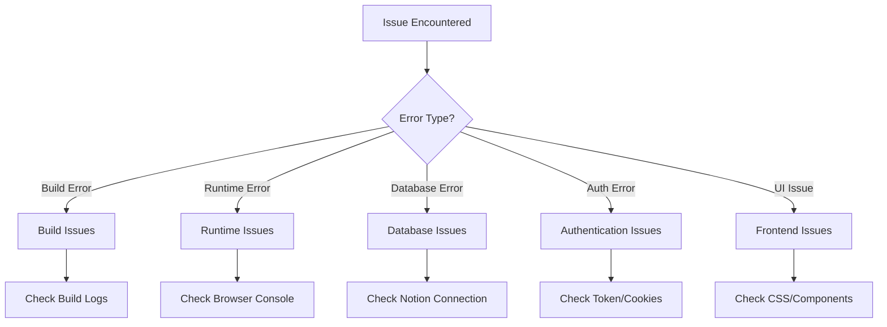
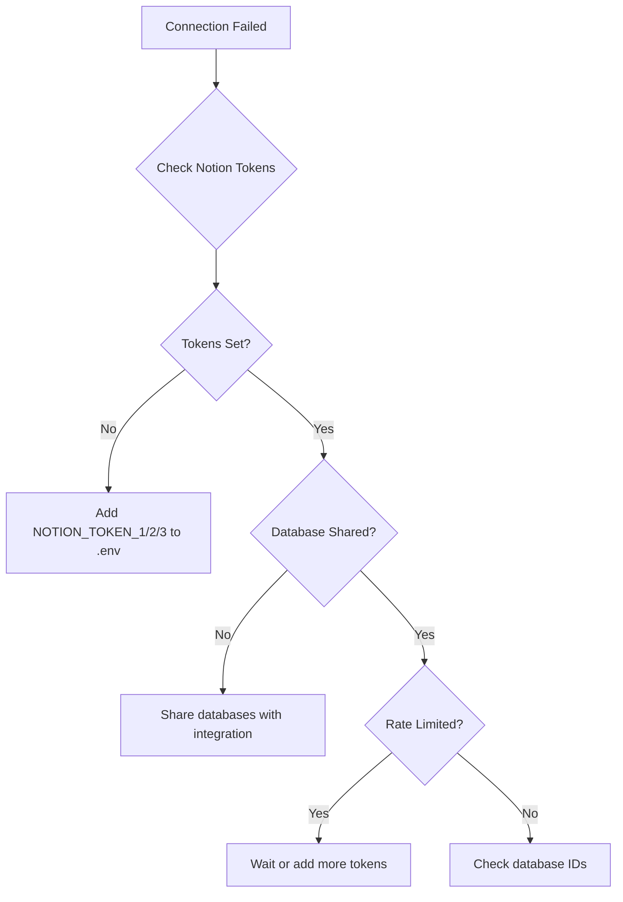
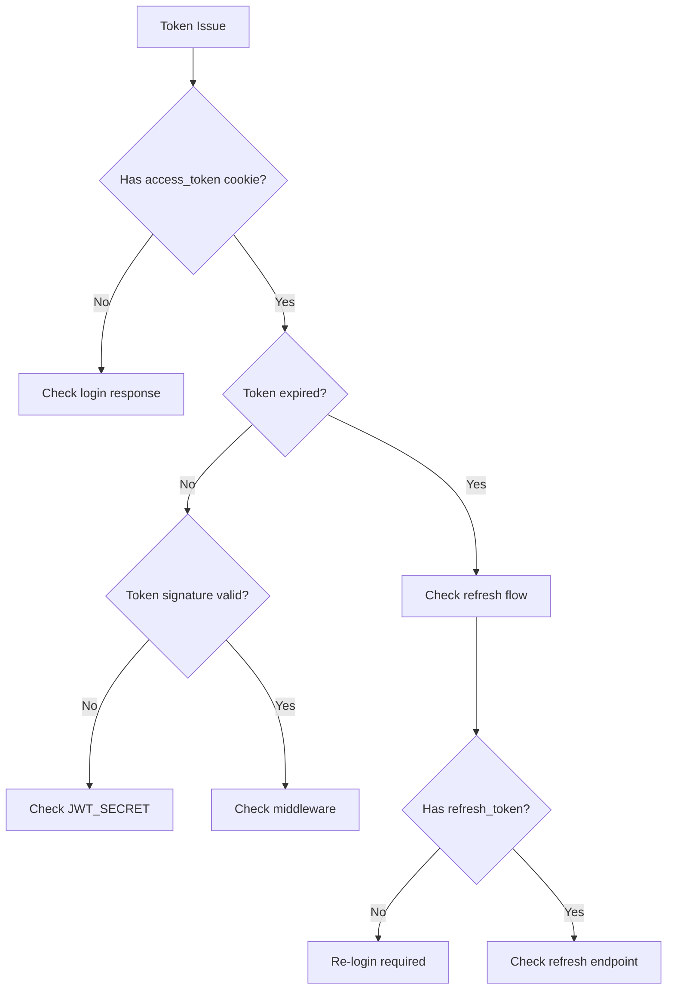

## Logging & Monitoring API (Admin)

- Endpoint: `GET /api/admin/monitoring/logging?days=7`
- Fungsi: ringkasan sukses vs gagal untuk route input user, daftar endpoint yang paling sering gagal, dan alert route kritis (`jurnal`, `transcript`, `quiz`, `discussion`).
- Sumber data: tabel `api_logs`.

# Troubleshooting Guide

Panduan untuk mengatasi masalah umum di PrincipleLearn V3.

---

## 📋 Quick Diagnosis



---

## 🔨 Build Errors

### "Module not found" Error

**Symptom**:
```
Error: Cannot find module '@/lib/database'
```

**Solution**:
```bash
# Clear node_modules and reinstall
rm -rf node_modules
rm package-lock.json
npm install
```

---

### "window is not defined" Error

**Symptom**:
```
ReferenceError: window is not defined
```

**Cause**: Accessing browser APIs during SSR.

**Solution**:
```typescript
// ❌ Bad
const token = localStorage.getItem('token');

// ✅ Good
const token = typeof window !== 'undefined' 
  ? localStorage.getItem('token') 
  : null;

// Or use useEffect
useEffect(() => {
  const token = localStorage.getItem('token');
  // ...
}, []);
```

---

### TypeScript Compilation Errors

**Symptom**:
```
Type 'X' is not assignable to type 'Y'
```

**Debug Steps**:
1. Run `npm run lint` untuk detail error
2. Check import statements
3. Verify type definitions
4. Clear TypeScript cache:
   ```bash
   rm -rf .next
   rm tsconfig.tsbuildinfo
   npm run build
   ```

---

### ESLint Errors

**Symptom**:
```
ESLint: 'variable' is defined but never used
```

**Solution**:
```bash
# Auto-fix what can be fixed
npm run lint -- --fix

# Or disable for specific line
// eslint-disable-next-line @typescript-eslint/no-unused-vars
const unusedVar = 'something';
```

---

## 🗄️ Database Issues

### Notion Connection Failed

**Symptom**:
```
Error: Database connection failed
```

**Debug Flowchart**:


**Quick Checks**:
```bash
# Test database connection
curl http://localhost:3000/api/test-db

# Check environment variables
echo $NOTION_TOKEN_1
```

---

### "Table not found" Error

**Symptom**:
```
Error: Database 'users' not found
```

**Solution**:
1. Run the database setup script:
   ```bash
   npx ts-node scripts/setup-notion-databases.ts
   ```
2. Ensure all databases are shared with your Notion integration
3. Verify `DATABASE_CONFIG` in `src/lib/database.ts` has correct database IDs

---

### Rate Limit Exceeded

**Symptom**:
```
Error: 429 Rate limit exceeded
```

**Solution**:
1. Add more Notion integration tokens to `.env`:
   ```
   NOTION_TOKEN_1=ntn_xxx
   NOTION_TOKEN_2=ntn_xxx
   NOTION_TOKEN_3=ntn_xxx
   ```
2. The system uses token rotation to manage rate limits (~3 req/s per token)

---

## 🔐 Authentication Issues

### Login Fails - Invalid Credentials

**Symptom**: Login returns 401 even with correct credentials.

**Debug Steps**:
1. Check user exists in database
2. Verify password hash is correct
3. Check bcrypt comparison:
   ```javascript
   const isValid = await bcrypt.compare(password, user.password_hash);
   console.log('Password valid:', isValid);
   ```

---

### Token Expired / Invalid

**Symptom**: Protected routes redirect to login.

**Debug Flowchart**:


**Check JWT Secret**:
```bash
# Ensure same secret in .env and Vercel
echo $JWT_SECRET
```

---

### Cookies Not Set

**Symptom**: Cookies not saved after login.

**Causes & Solutions**:
| Cause | Solution |
|-------|----------|
| SameSite restriction | Use `SameSite: 'Lax'` for cookies |
| HTTPS required | Use HTTPS in production |
| Domain mismatch | Check cookie domain setting |

---

## 🌐 Frontend Issues

### Hydration Mismatch

**Symptom**:
```
Error: Hydration failed because the initial UI does not match
```

**Common Causes**:
1. Server/client content difference
2. Date/time rendering
3. Random values

**Solution**:
```tsx
// ❌ Bad - Different on server vs client
<p>Current time: {new Date().toLocaleString()}</p>

// ✅ Good - Render only on client
const [time, setTime] = useState<string>('');

useEffect(() => {
  setTime(new Date().toLocaleString());
}, []);

<p>Current time: {time || 'Loading...'}</p>
```

---

### Styles Not Loading

**Symptom**: Page loads without CSS styles.

**Debug Steps**:
1. Check CSS import:
   ```tsx
   import styles from './Component.module.scss';
   ```
2. Verify file exists with correct name
3. Clear Next.js cache:
   ```bash
   rm -rf .next
   npm run dev
   ```

---

## 🔌 API Issues

### 404 Not Found

**Symptom**: API endpoint returns 404.

**Check**:
1. Route file location is correct: `src/app/api/endpoint/route.ts`
2. Function name is correct: `GET`, `POST`, etc.
3. Dynamic routes use correct syntax: `[id]`

---

### 500 Internal Server Error

**Symptom**: API returns 500.

**Debug Steps**:
```typescript
// Add detailed error logging
export async function GET(request: NextRequest) {
  try {
    // ... your code
  } catch (error) {
    console.error('API Error:', error);
    console.error('Stack:', error instanceof Error ? error.stack : 'No stack');
    
    return NextResponse.json({
      error: 'Internal server error',
      details: error instanceof Error ? error.message : 'Unknown error'
    }, { status: 500 });
  }
}
```

---

### CORS Errors

**Symptom**:
```
Access to fetch has been blocked by CORS policy
```

**Solution** (next.config.ts):
```typescript
const nextConfig = {
  async headers() {
    return [
      {
        source: '/api/:path*',
        headers: [
          { key: 'Access-Control-Allow-Origin', value: '*' },
          { key: 'Access-Control-Allow-Methods', value: 'GET,POST,PUT,DELETE' },
          { key: 'Access-Control-Allow-Headers', value: 'Content-Type' },
        ],
      },
    ];
  },
};
```

---

## 🤖 AI/OpenAI Issues

### API Key Invalid

**Symptom**:
```
Error: OpenAI API key is invalid
```

**Solution**:
1. Verify `OPENAI_API_KEY` is set correctly
2. Check key is not expired
3. Ensure key has correct permissions

---

### Rate Limited

**Symptom**:
```
Error: 429 Too Many Requests
```

**Solution**:
1. Implement request throttling
2. Add retry with exponential backoff:
   ```typescript
   async function callWithRetry(fn: () => Promise<any>, retries = 3) {
     for (let i = 0; i < retries; i++) {
       try {
         return await fn();
       } catch (error: any) {
         if (error.status === 429 && i < retries - 1) {
           await new Promise(r => setTimeout(r, 1000 * Math.pow(2, i)));
         } else {
           throw error;
         }
       }
     }
   }
   ```

---

### Response Timeout

**Symptom**: AI generation takes too long and times out.

**Solution** (vercel.json):
```json
{
  "functions": {
    "src/app/api/generate-*/*.ts": {
      "maxDuration": 60
    }
  }
}
```

---

## 🔄 Common Quick Fixes

### Reset Everything

```bash
# Nuclear option - reset all local state
rm -rf node_modules
rm -rf .next
rm package-lock.json

npm install
npm run dev
```

### Clear Caches

```bash
# Next.js cache
rm -rf .next

# npm cache
npm cache clean --force

# TypeScript cache
rm tsconfig.tsbuildinfo
```

### Check Environment

```bash
# Verify all required env vars
node -e "
  const required = [
    'NOTION_TOKEN_1',
    'NOTION_TOKEN_2',
    'NOTION_TOKEN_3',
    'JWT_SECRET'
  ];
  
  required.forEach(key => {
    console.log(key + ':', process.env[key] ? 'Set' : 'MISSING');
  });
"
```

---

## 📞 Getting Help

### Information to Include

When asking for help, include:
1. Error message (full text)
2. Steps to reproduce
3. Environment (local/production)
4. Recent changes
5. Related logs

### Resources

| Resource | Link |
|----------|------|
| Next.js Docs | [nextjs.org/docs](https://nextjs.org/docs) |
| Notion API Docs | [developers.notion.com](https://developers.notion.com) |
| Vercel Docs | [vercel.com/docs](https://vercel.com/docs) |

---

## 🔍 Debug Mode

### Enable Verbose Logging

```typescript
// Add to problematic API route
const DEBUG = process.env.NODE_ENV === 'development';

function log(...args: any[]) {
  if (DEBUG) {
    console.log('[DEBUG]', ...args);
  }
}

export async function GET(request: NextRequest) {
  log('Request received:', request.url);
  log('Headers:', Object.fromEntries(request.headers));
  
  // ... rest of handler
  
  log('Response:', result);
  return NextResponse.json(result);
}
```

### Check Network Requests

1. Open Browser DevTools (F12)
2. Go to Network tab
3. Filter by "Fetch/XHR"
4. Check request/response details

---

*Dokumentasi ini terakhir diperbarui: Februari 2026*
