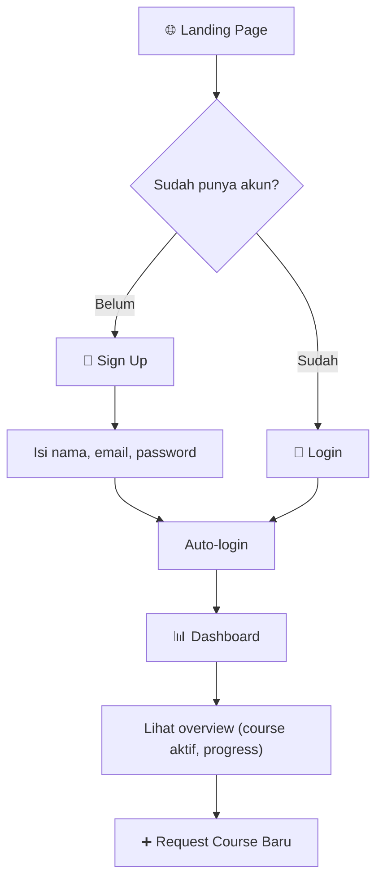
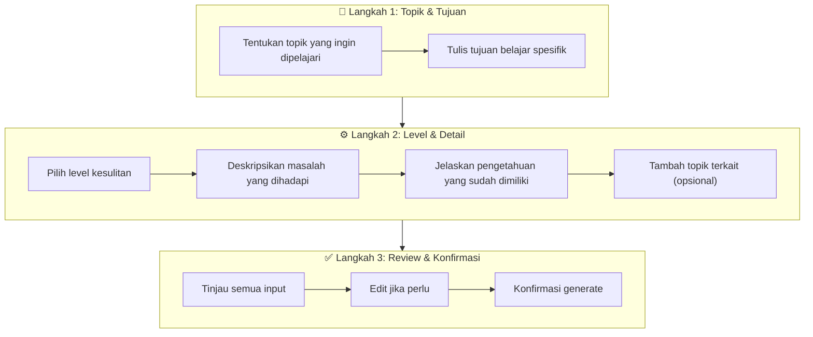
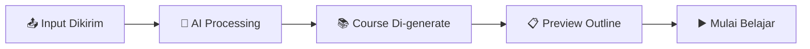
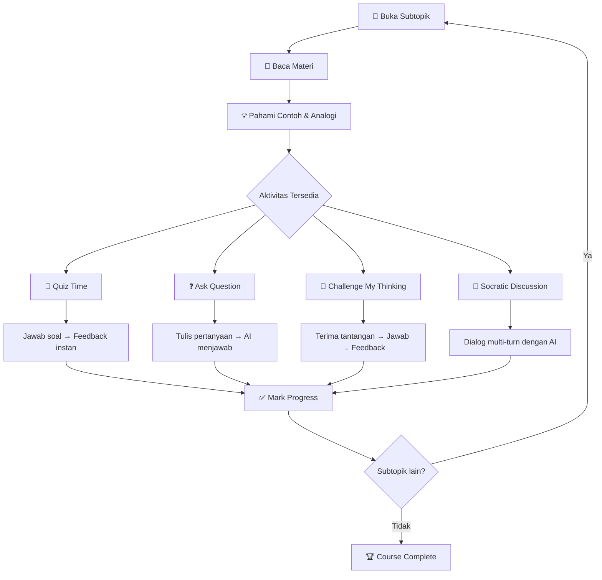
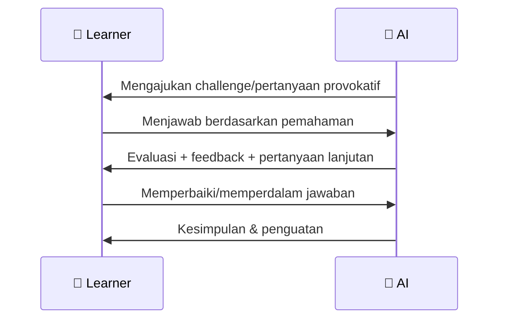
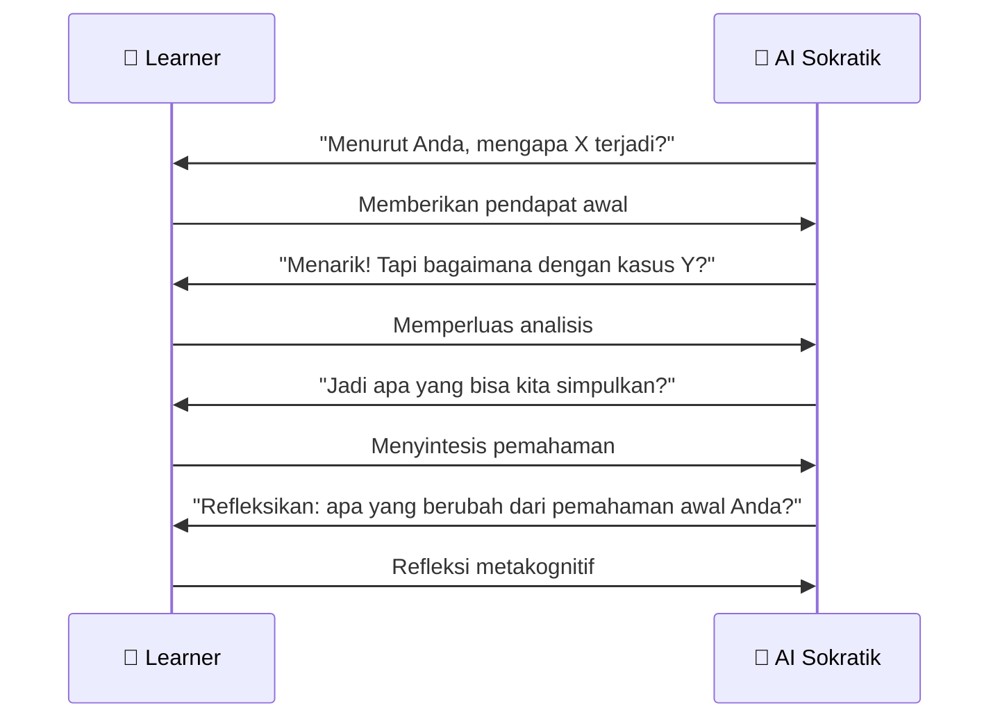
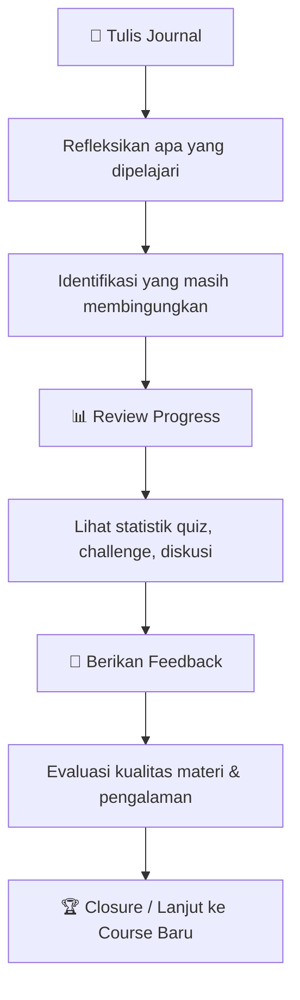
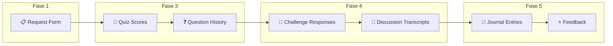

# User Journey — Alur Pengalaman Belajar

Dokumentasi perjalanan lengkap pengguna dalam proses pembelajaran di PrincipleLearn V3, dari perspektif pedagogis.

---

## 📋 Daftar Isi
1. [Overview Journey](#overview-journey)
2. [Fase 1: Onboarding & Needs Analysis](#fase-1-onboarding--needs-analysis)
3. [Fase 2: Course Generation & Orientation](#fase-2-course-generation--orientation)
4. [Fase 3: Active Learning](#fase-3-active-learning)
5. [Fase 4: Deep Engagement](#fase-4-deep-engagement)
6. [Fase 5: Reflection & Evaluation](#fase-5-reflection--evaluation)
7. [Touchpoint Evaluasi per Fase](#touchpoint-evaluasi-per-fase)
8. [Skenario Journey Lengkap](#skenario-journey-lengkap)

---

## 🗺️ Overview Journey

### Peta Perjalanan Belajar

```mermaid
journey
    title Perjalanan Belajar Mahasiswa di PrincipleLearn V3
    section Fase 1: Onboarding
      Mendaftar akun: 4: Learner
      Login pertama kali: 5: Learner
      Eksplor dashboard: 4: Learner
    section Fase 2: Course Setup
      Request course baru: 4: Learner
      Isi detail kebutuhan: 3: Learner
      Terima course dari AI: 5: AI
    section Fase 3: Active Learning
      Baca materi subtopik: 4: Learner
      Kerjakan quiz: 4: Learner
      Ajukan pertanyaan: 3: Learner
    section Fase 4: Deep Engagement
      Challenge My Thinking: 5: Learner, AI
      Socratic Discussion: 5: Learner, AI
    section Fase 5: Reflection
      Tulis jurnal: 3: Learner
      Beri feedback course: 4: Learner
      Review progress: 5: Learner
```

### 5 Fase Perjalanan Belajar

| Fase | Nama | Tujuan Pedagogis | Durasi Estimasi |
|------|------|-------------------|-----------------|
| 1 | **Onboarding & Needs Analysis** | Identifikasi kebutuhan belajar | 5–10 menit |
| 2 | **Course Generation & Orientation** | Menerima materi yang dipersonalisasi | 1–3 menit |
| 3 | **Active Learning** | Membangun pemahaman dasar | 30–60 menit/sesi |
| 4 | **Deep Engagement** | Memperdalam pemikiran kritis | 15–30 menit/sesi |
| 5 | **Reflection & Evaluation** | Konsolidasi & refleksi pemahaman | 10–20 menit |

---

## 1️⃣ Fase 1: Onboarding & Needs Analysis

### Alur Detail



### Aktivitas Learner

| Langkah | Aktivitas | Keterampilan yang Dilatih | Waktu |
|---------|-----------|--------------------------|-------|
| Sign Up | Membuat akun baru | - | 2 menit |
| Dashboard | Memahami layout & navigasi | - | 3 menit |
| Request Course | Merumuskan kebutuhan belajar | CT: Self-Regulation, Analysis | 5 menit |

### Detail Request Course (Needs Analysis)



**Mengapa fase ini penting secara pedagogis?**
> Proses merumuskan kebutuhan belajar sendiri melatih **self-regulation** (CT) dan **decomposition** (CPT). Learner menjadi sadar akan apa yang sudah ia ketahui dan apa yang belum, membentuk dasar untuk pembelajaran bermakna.

---

## 2️⃣ Fase 2: Course Generation & Orientation

### Alur Detail



### Apa yang Terjadi di Balik Layar

| Proses | Deskripsi | Output |
|--------|-----------|--------|
| **AI Analysis** | AI menganalisis topik, goal, level, problem | Learning objectives |
| **Outline Generation** | AI merancang struktur modul & subtopik | 5 modul, 20+ subtopik |
| **Content Generation** | AI menghasilkan konten per subtopik | Materi, contoh, analogi |
| **Quiz Generation** | AI membuat soal per subtopik | 3–5 soal per subtopik |

### Orientasi Learner

Setelah course di-generate, learner melihat:
- **Judul course** yang dipersonalisasi
- **Daftar modul** dan subtopik
- **Progress bar** (mulai dari 0%)
- **Navigasi sidebar** untuk akses cepat

---

## 3️⃣ Fase 3: Active Learning

### Alur per Subtopik



### Interaksi per Aktivitas

#### 📝 Membaca Materi (Content Consumption)
```
Waktu      : 5–10 menit per subtopik
Level Bloom: Remember, Understand
Scaffolding: Konten terstruktur, contoh bertahap, visualisasi
Output     : Pemahaman konseptual dasar
```

#### 📝 Quiz Time (Formative Assessment)
```
Waktu      : 3–5 menit per quiz
Level Bloom: Apply, Analyze
CT         : Evaluation
CPT        : Pattern Recognition, Algorithmic Thinking, Debugging
Output     : Skor + penjelasan per soal
```

#### ❓ Ask Question (Inquiry)
```
Waktu      : 2–5 menit per pertanyaan
Level Bloom: Understand, Analyze
CT         : Analysis, Explanation, Self-Regulation
CPT        : Abstraction
Output     : Jawaban kontekstual dari AI
```

---

## 4️⃣ Fase 4: Deep Engagement

### Challenge My Thinking



**Tujuan**: Menciptakan **cognitive conflict** → mendorong learner mengevaluasi ulang pemahaman → memperkuat konsep yang benar.

| Fase Challenge | Aktivitas Learner | CT/CPT |
|---------------|-------------------|--------|
| Menerima tantangan | Membaca & memahami konteks | CT: Analysis |
| Merespons | Menyusun argumen/jawaban | CPT: Algorithmic Thinking |
| Menerima feedback | Mengevaluasi respons sendiri | CT: Evaluation, Self-Regulation |
| Memperbaiki | Merevisi pemahaman | CT: Inference |

### Socratic Discussion



**Tujuan**: Memandu learner **menemukan pemahaman sendiri** melalui dialog terbimbing — bukan diberitahu jawaban.

| Fase Diskusi | Fungsi Pedagogis | CT/CPT |
|-------------|-----------------|--------|
| Opening | Activating curiosity | CT: Analysis |
| Exploration | Menggali prior knowledge | CT: Explanation |
| Deepening | Memperdalam analisis | CT: Inference |
| Challenging | Menguji asumsi | CT: Evaluation |
| Synthesis | Menyatukan pemahaman | CPT: Decomposition |
| Reflection | Metakognisi | CT: Self-Regulation |

---

## 5️⃣ Fase 5: Reflection & Evaluation

### Alur Refleksi



### Aktivitas Refleksi

| Aktivitas | Deskripsi | CT/CPT |
|-----------|-----------|--------|
| **Writing Journal** | Menulis refleksi pembelajaran dalam bahasa sendiri | CT: Self-Regulation, Explanation |
| **Reviewing Progress** | Memeriksa pencapaian, skor, dan area yang perlu diperbaiki | CT: Evaluation |
| **Giving Feedback** | Menilai efektivitas materi dan pengalaman belajar | CT: Evaluation, Self-Regulation |
| **Planning Next Steps** | Merencanakan langkah belajar berikutnya | CPT: Algorithmic Thinking |

---

## 📍 Touchpoint Evaluasi per Fase

### Matriks Evaluasi

Setiap fase memiliki **touchpoint** di mana data interaksi learner dapat dianalisis untuk mengukur keterampilan berpikir:

| Fase | Touchpoint Evaluasi | Data yang Dikumpulkan | Indikator CT/CPT |
|------|---------------------|----------------------|-------------------|
| **1. Onboarding** | Request Course form | Topic, goal, level, problem, assumption | Self-Regulation, Decomposition |
| **2. Generation** | Course preview | (Tidak ada interaksi evaluatif) | - |
| **3. Active Learning** | Quiz submission | Jawaban, skor, waktu pengerjaan | Evaluation, Pattern Recognition |
| | Ask Question | Isi pertanyaan, frekuensi | Analysis, Abstraction |
| **4. Deep Engagement** | Challenge response | Jawaban challenge, perubahan setelah feedback | Evaluation, Inference, Algorithmic Thinking |
| | Discussion messages | Isi pesan, jumlah turn, kedalaman dialog | Analysis, Explanation, Decomposition |
| **5. Reflection** | Journal entries | Isi refleksi, panjang, kedalaman | Self-Regulation, Explanation |
| | Course feedback | Rating, komentar | Evaluation |

### Visualisasi Touchpoint



---

## 📖 Skenario Journey Lengkap

### Skenario: Mahasiswa S2 Belajar Neural Networks

**Profil**: Rina, mahasiswa S2 Informatika, ingin memahami konsep Neural Network untuk thesis-nya.

---

#### Fase 1: Onboarding (5 menit)

| Waktu | Aktivitas | Detail |
|-------|-----------|--------|
| 0:00 | Sign up | Membuat akun dengan email kampus |
| 1:00 | Login | Masuk ke dashboard |
| 2:00 | Request Course | Mengisi form: |

```
Topic     : "Package nnet di R"
Goal      : "Memahami konsep dan implementasi neural network sederhana"
Level     : "Beginner"
Problem   : "Belum paham cara kerja neural network"
Assumption: "Tahu dasar R programming dan konsep regression"
```

**CT/CPT yang terstimulasi**: Self-Regulation (menyadari apa yang belum dipahami), Decomposition (memecah kebutuhan belajar)

---

#### Fase 2: Course Generation (2 menit)

| Waktu | Aktivitas | Detail |
|-------|-----------|--------|
| 5:00 | AI generates | 5 modul, 22 subtopik |
| 6:00 | Preview | Melihat outline course |
| 7:00 | Start | Mulai dari Modul 1, Subtopik 1 |

---

#### Fase 3: Active Learning (45 menit)

| Waktu | Aktivitas | Detail |
|-------|-----------|--------|
| 7:00 | Baca materi | Subtopik 1.1: "Apa itu Neural Network?" |
| 15:00 | Quiz | 3 soal → skor 2/3 → baca penjelasan |
| 20:00 | Ask Question | "Apa bedanya hidden layer dan output layer?" |
| 22:00 | AI menjawab | Penjelasan dengan analogi dan diagram |
| 25:00 | Baca materi | Subtopik 1.2: "Struktur Feed-Forward NN" |
| 35:00 | Quiz | 5 soal → skor 4/5 |
| 40:00 | Next subtopic | Lanjut ke Subtopik 1.3 |

---

#### Fase 4: Deep Engagement (20 menit)

| Waktu | Aktivitas | Detail |
|-------|-----------|--------|
| 50:00 | Challenge | AI: "Menurut Anda, apakah menambah neuron selalu meningkatkan akurasi? Jelaskan." |
| 52:00 | Rina menjawab | "Ya, karena lebih banyak neuron = lebih banyak pola yang bisa dipelajari" |
| 53:00 | AI feedback | "Tidak selalu benar. Pertimbangkan konsep overfitting..." |
| 55:00 | Rina memperbaiki | Merevisi jawaban dengan pemahaman baru |
| 57:00 | Discussion | Dialog Sokratik tentang trade-off bias vs variance |
| 70:00 | End discussion | 8 turn dialog, pemahaman mendalam tercapai |

---

#### Fase 5: Reflection (10 menit)

| Waktu | Aktivitas | Detail |
|-------|-----------|--------|
| 70:00 | Journal | "Hari ini saya belajar bahwa neural network tidak sekadar 'otak buatan', tapi lebih ke sistem matematika yang menyesuaikan bobot..." |
| 75:00 | Review progress | 3/22 subtopik selesai, rata-rata quiz 80% |
| 78:00 | Feedback | Rating 4/5, komentar: "Penjelasan sangat membantu, contoh analogi bagus" |
| 80:00 | Plan next | Lanjutkan ke Modul 2 besok |

---

## 📊 Metrik Keberhasilan Journey

| Metrik | Target | Cara Pengukuran |
|--------|--------|-----------------|
| **Completion Rate** | > 80% | Jumlah subtopik selesai / total |
| **Quiz Average** | > 70% | Rata-rata skor quiz |
| **Engagement Depth** | > 3 fitur/sesi | Jumlah fitur berbeda yang digunakan per sesi |
| **Reflection Quality** | Minimal 3 kalimat | Panjang dan kedalaman journal |
| **Discussion Turns** | > 4 turns | Jumlah interaksi dalam sesi diskusi |
| **Return Rate** | > 60% | Persentase user yang kembali dalam 7 hari |

---

*Dokumentasi ini terakhir diperbarui: Februari 2026*
