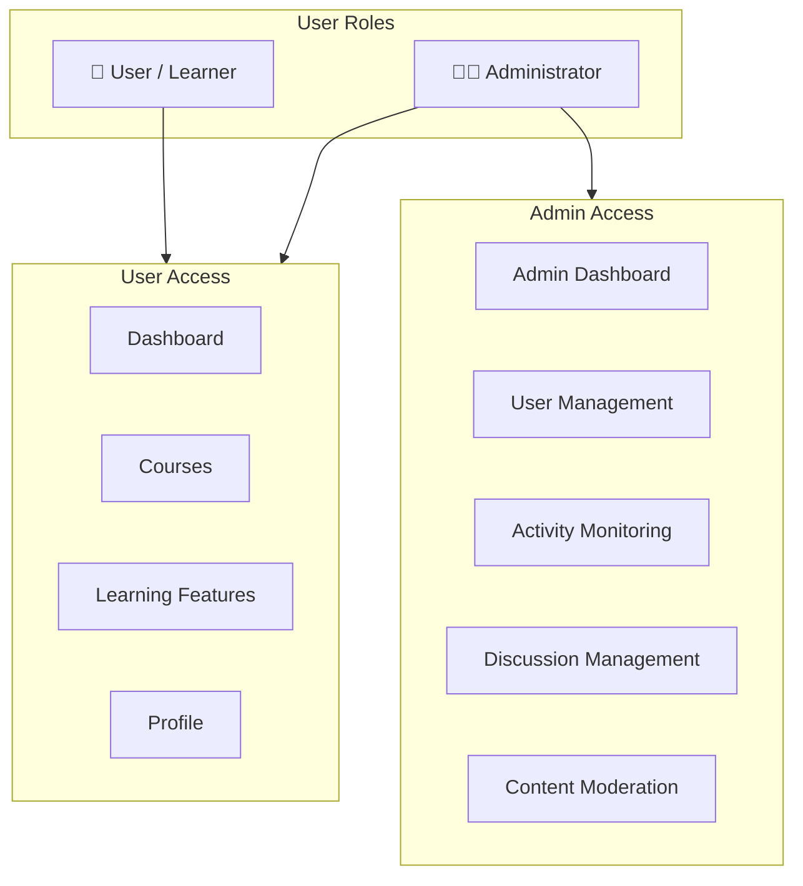
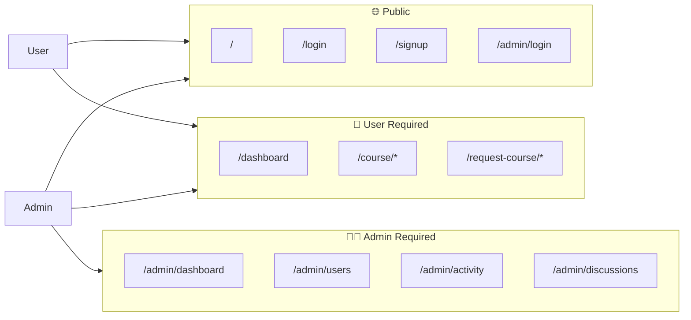
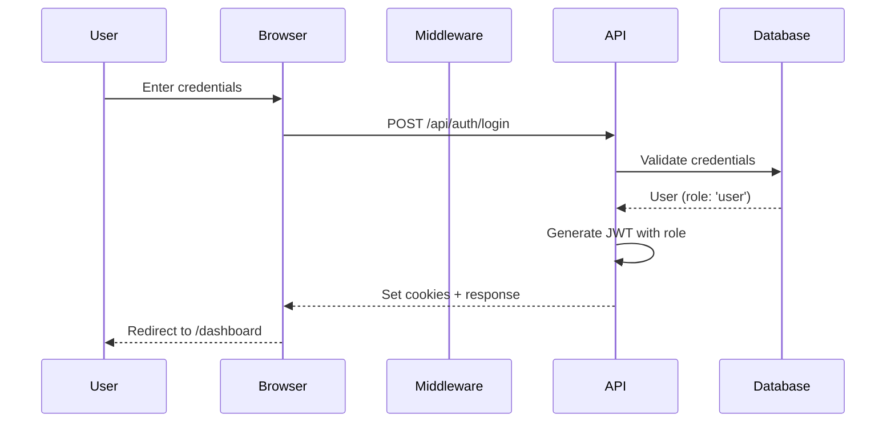
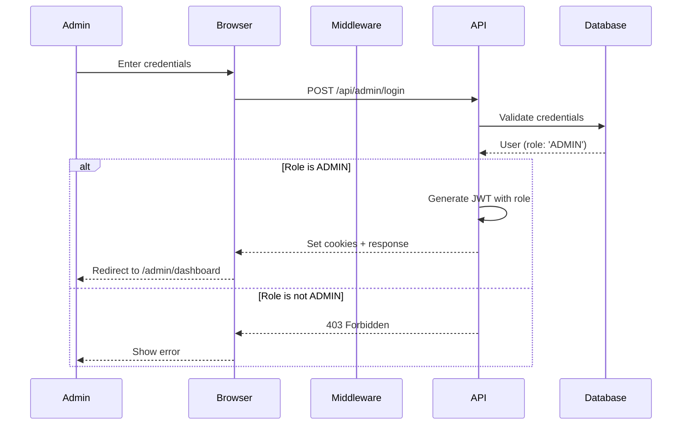
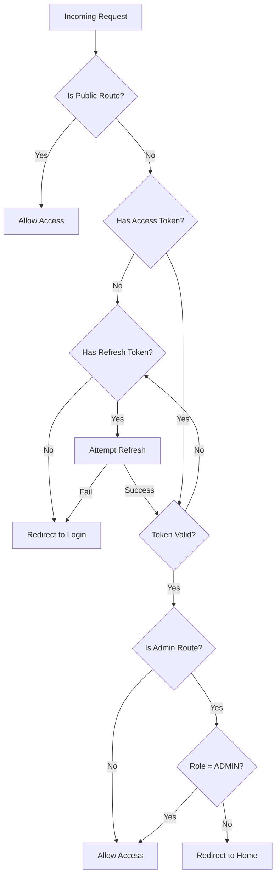
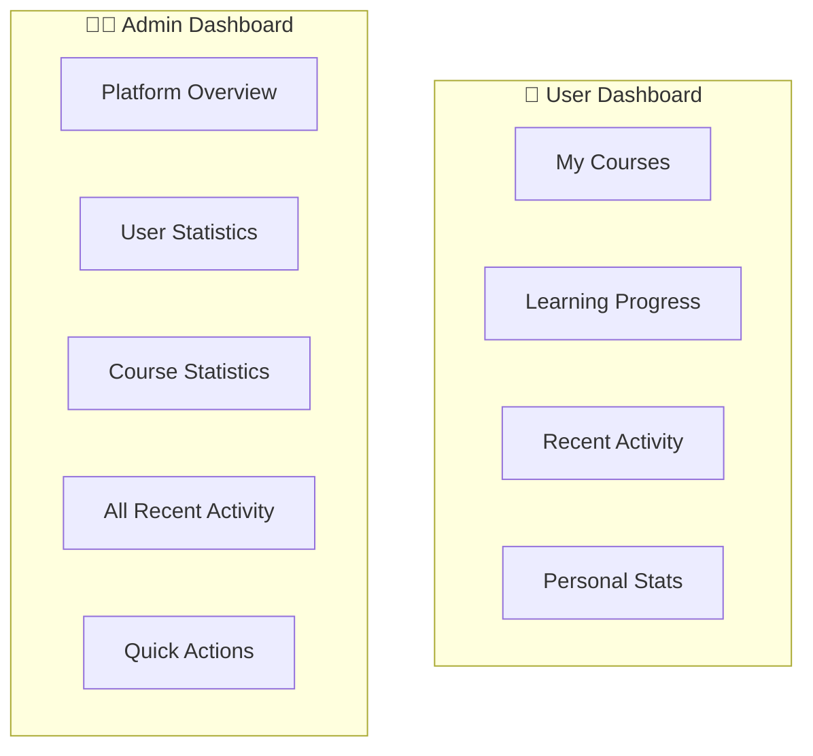
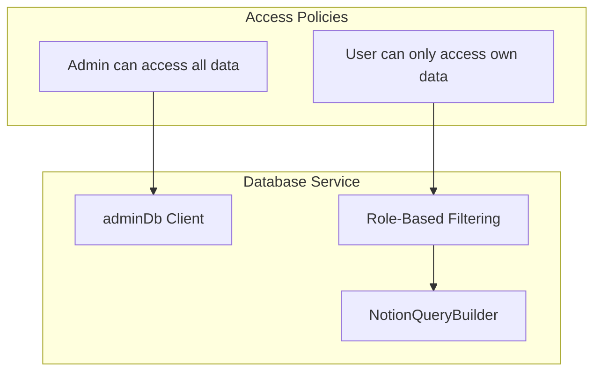

# User Roles & Permissions

Dokumentasi lengkap sistem roles dan permissions di PrincipleLearn V3.

---

## 🎭 Role Overview

PrincipleLearn V3 menggunakan sistem **Role-Based Access Control (RBAC)** dengan dua role utama:



---

## 👤 User (Learner)

### Definition
Role default untuk semua pengguna yang mendaftar. Fokus pada pembelajaran dan penggunaan fitur edukasi.

### Capabilities

| Feature | Create | Read | Update | Delete |
|---------|--------|------|--------|--------|
| **Own Profile** | - | ✅ | ✅ | - |
| **Courses** | ✅ (via AI) | ✅ (own) | - | - |
| **Subtopics** | - | ✅ | - | - |
| **Quiz** | - | ✅ | - | - |
| **Quiz Submissions** | ✅ | ✅ (own) | - | - |
| **Journal** | ✅ | ✅ (own) | ✅ | ✅ |
| **Transcript** | ✅ | ✅ (own) | ✅ | ✅ |
| **Progress** | ✅ | ✅ (own) | ✅ | - |
| **Feedback** | ✅ | ✅ (own) | - | - |
| **Discussions** | ✅ | ✅ (own) | - | - |
| **Ask Questions** | ✅ | ✅ (own) | - | - |
| **Challenge Responses** | ✅ | ✅ (own) | - | - |

### Accessible Routes

```
✅ /                     # Homepage
✅ /login                # Login page
✅ /signup               # Registration
✅ /dashboard            # User dashboard
✅ /course/[courseId]    # Course viewing
✅ /request-course/*     # Course request flow
```

---

## 👨‍💼 Administrator (ADMIN)

### Definition
Role dengan akses penuh untuk mengelola platform, users, dan konten. Diberikan secara manual atau melalui admin registration.

### Capabilities

| Feature | Create | Read | Update | Delete |
|---------|--------|------|--------|--------|
| **All Users** | ✅ | ✅ | ✅ | ✅ |
| **All Courses** | ✅ | ✅ | ✅ | ✅ |
| **All Subtopics** | ✅ | ✅ | ✅ | ✅ |
| **All Quiz** | ✅ | ✅ | ✅ | ✅ |
| **All Submissions** | - | ✅ | - | - |
| **All Journals** | - | ✅ | - | - |
| **All Transcripts** | - | ✅ | - | - |
| **All Progress** | - | ✅ | - | - |
| **All Feedback** | - | ✅ | - | - |
| **Discussions** | - | ✅ | ✅ | ✅ |
| **API Logs** | - | ✅ | - | ✅ |
| **System Settings** | - | ✅ | ✅ | - |

### Accessible Routes

```
✅ All User routes
✅ /admin/login          # Admin login
✅ /admin/register       # Admin registration
✅ /admin/dashboard      # Admin dashboard
✅ /admin/users          # User management
✅ /admin/activity       # Activity monitoring
✅ /admin/discussions    # Discussion management
```

---

## 🔐 Permission Matrix

### Page Access Matrix



### API Access Matrix

| Endpoint | Public | User | Admin |
|----------|--------|------|-------|
| `POST /api/auth/login` | ✅ | ✅ | ✅ |
| `POST /api/auth/register` | ✅ | ✅ | ✅ |
| `POST /api/auth/logout` | - | ✅ | ✅ |
| `GET /api/auth/me` | - | ✅ | ✅ |
| `GET /api/courses` | - | ✅ | ✅ |
| `POST /api/generate-course` | - | ✅ | ✅ |
| `POST /api/quiz/submit` | - | ✅ | ✅ |
| `POST /api/jurnal/save` | - | ✅ | ✅ |
| `GET /api/admin/dashboard` | - | - | ✅ |
| `GET /api/admin/users` | - | - | ✅ |
| `GET /api/admin/activity/*` | - | - | ✅ |

---

## 🔄 Authentication Flow

### User Login Flow



### Admin Login Flow



---

## 🛡️ Middleware Protection

### Implementation



### Protected Route Configuration

```typescript
// middleware.ts
const publicRoutes = [
  '/',
  '/login',
  '/signup',
  '/admin/login',
  '/admin/register'
];

const adminRoutes = [
  '/admin/dashboard',
  '/admin/users',
  '/admin/activity',
  '/admin/discussions'
];
```

---

## 🎨 Role-Based UI Differences

### Navigation Menu

| Menu Item | User | Admin |
|-----------|------|-------|
| Dashboard | ✅ | ✅ |
| My Courses | ✅ | ✅ |
| Request Course | ✅ | ✅ |
| Profile | ✅ | ✅ |
| Admin Panel | ❌ | ✅ |
| User Management | ❌ | ✅ |
| Activity Monitor | ❌ | ✅ |

### Dashboard Differences



---

## 🔑 JWT Token Structure

### Token Payload

```json
{
  "userId": "uuid-string",
  "email": "user@example.com",
  "role": "user",
  "iat": 1707040800,
  "exp": 1707041700
}
```

### Role Values

| Role | Value | Description |
|------|-------|-------------|
| Regular User | `"user"` | Default role |
| Administrator | `"ADMIN"` | Admin access |

---

## 📋 Role Assignment

### Default Registration
- Semua user yang register via `/signup` mendapat role `"user"`

### Admin Registration
- Admin dapat register via `/admin/register`
- Memerlukan invitation code atau approval (implementasi tergantung kebijakan)

### Manual Role Update

```sql
-- Update user role to ADMIN
UPDATE users 
SET role = 'ADMIN' 
WHERE email = 'user@example.com';
```

---

## 🔐 Access Control

### Notion-Based Access Control



### Example Access Control

```typescript
// API route with role-based access
const userRole = request.headers.get('x-user-role');
const userId = request.headers.get('x-user-id');

if (userRole === 'ADMIN') {
  // Admin can access all journals
  const { data } = await adminDb.from('jurnal').select('*');
} else {
  // Users can only see their own journals
  const { data } = await adminDb
    .from('jurnal')
    .select('*')
    .eq('user_id', userId);
}
```

---

## 🚨 Security Best Practices

### For Developers

1. **Always validate role in API routes**
   ```typescript
   const userRole = request.headers.get('x-user-role');
   if (userRole !== 'ADMIN') {
     return Response.json({ error: 'Forbidden' }, { status: 403 });
   }
   ```

2. **Use service role client untuk admin operations**
   ```typescript
   import { adminDb } from '@/lib/database';
   // adminDb bypasses RLS
   ```

3. **Never trust client-side role checks alone**
   - Always verify role di middleware dan API

### For Admins

1. Gunakan password yang kuat (min 12 karakter)
2. Enable 2FA jika tersedia
3. Regular audit admin accounts
4. Monitor admin activity logs

---

## 📊 Role Statistics Dashboard

Admin dapat melihat distribusi roles:

| Metric | Description |
|--------|-------------|
| Total Users | Jumlah semua user |
| Active Users | User yang login dalam 30 hari |
| Admin Count | Jumlah admin aktif |
| Role Distribution | Pie chart roles |

---

*Dokumentasi ini terakhir diperbarui: Februari 2026*
