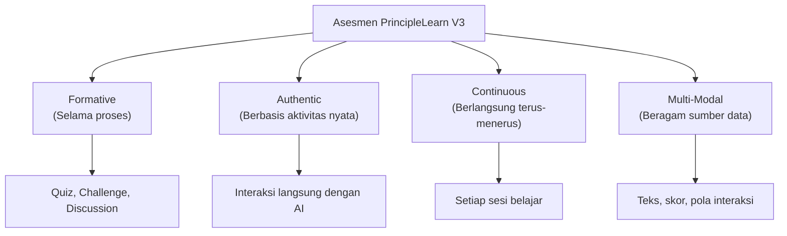
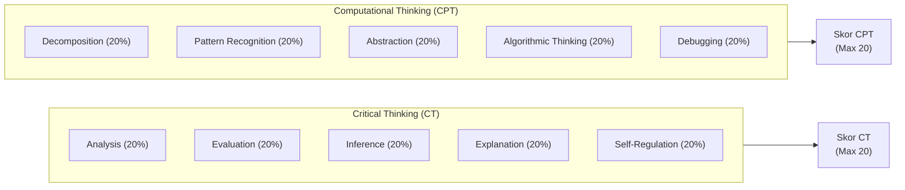

# Rubrik Penilaian & Evaluasi (Assessment Rubric)

Dokumentasi rubrik penilaian untuk mengukur keterampilan Critical Thinking (CT) dan Computational Thinking (CPT) melalui interaksi mahasiswa di PrincipleLearn V3.

---

## 📋 Daftar Isi
1. [Pendekatan Asesmen](#pendekatan-asesmen)
2. [Rubrik Critical Thinking](#rubrik-critical-thinking)
3. [Rubrik Computational Thinking](#rubrik-computational-thinking)
4. [Rubrik per Fitur Aplikasi](#rubrik-per-fitur-aplikasi)
5. [Skala Penilaian](#skala-penilaian)
6. [Instrumen Pengumpulan Data](#instrumen-pengumpulan-data)
7. [Contoh Penilaian](#contoh-penilaian)

---

## 🎯 Pendekatan Asesmen

### Prinsip Asesmen

PrincipleLearn V3 menggunakan pendekatan **asesmen autentik** yang mengukur keterampilan berpikir melalui interaksi nyata, bukan tes terpisah.



### Sumber Data Evaluasi

| Sumber Data | Jenis | Indikator yang Diukur |
|-------------|-------|----------------------|
| Quiz Submissions | Kuantitatif | Skor, pola jawaban benar/salah |
| Challenge Responses | Kualitatif | Isi respons, perubahan setelah feedback |
| Ask Question | Kualitatif | Tingkat pertanyaan, fokus |
| Structured Reflection (Journal) | Kualitatif | Kedalaman refleksi |
| Course Feedback | Mixed | Rating + komentar |
| Request Course Form | Kualitatif | Kejelasan kebutuhan belajar |
| Prompt Builder + Timeline | Kualitatif | Evolusi struktur prompt (RM2) |
| Reasoning Note | Kualitatif | Marker reflektif sebelum bertanya |

> Catatan: rubrik untuk **Discussion (Socratic)** masih dipertahankan di Bab di
> bawah sebagai referensi konseptual, tetapi modul Discussion **tidak digunakan**
> untuk pengumpulan data tesis pada periode 2026 (lihat
> [`ADMIN_RM2_RM3_DATA_COMPLETENESS.md`](./ADMIN_RM2_RM3_DATA_COMPLETENESS.md)
> bagian 2.6). Sumber data utama berpindah ke Ask Question, Challenge Thinking,
> dan Structured Reflection.

---

## 🧠 Rubrik Critical Thinking

### Indikator 1: Analysis

**Definisi**: Kemampuan memecah permasalahan atau meminta klarifikasi untuk memahami konsep lebih dalam.

| Skor | Level | Deskripsi | Contoh Aktivitas |
|------|-------|-----------|------------------|
| 4 | **Exemplary** | Mengidentifikasi komponen masalah secara sistematis dan menghubungkannya | "Jika X mempengaruhi Y, dan Y terkait dengan Z, maka bagaimana hubungan X dan Z?" |
| 3 | **Proficient** | Memecah masalah menjadi sub-bagian yang relevan | "Bisa jelaskan bagian tentang hidden layer lebih detail? Khususnya tentang cara weight diupdate" |
| 2 | **Developing** | Mengajukan pertanyaan klarifikasi sederhana | "Apa itu hidden layer?" |
| 1 | **Beginning** | Tidak menunjukkan upaya analisis; pertanyaan sangat umum | "Saya tidak mengerti" |

---

### Indikator 2: Evaluation

**Definisi**: Kemampuan menilai efektivitas atau ketepatan solusi.

| Skor | Level | Deskripsi | Contoh Aktivitas |
|------|-------|-----------|------------------|
| 4 | **Exemplary** | Memberikan kritik konstruktif dengan alternatif yang disertai alasan | "Pendekatan ini efektif untuk kasus linear, tapi untuk non-linear mungkin perlu pendekatan lain karena..." |
| 3 | **Proficient** | Menilai kekuatan dan kelemahan suatu solusi | "Solusi ini bagus tapi mungkin tidak efisien untuk dataset besar" |
| 2 | **Developing** | Menilai secara umum tanpa spesifik | "Sepertinya jawaban ini benar" |
| 1 | **Beginning** | Menerima semua informasi tanpa evaluasi | (Tidak ada respons evaluatif) |

---

### Indikator 3: Inference

**Definisi**: Kemampuan membuat prediksi atau kesimpulan logis dari hasil pembelajaran.

| Skor | Level | Deskripsi | Contoh Aktivitas |
|------|-------|-----------|------------------|
| 4 | **Exemplary** | Menarik kesimpulan valid dan mengidentifikasi implikasi lebih luas | "Berdasarkan konsep ini, saya menyimpulkan bahwa situasi X juga akan terpengaruh karena..." |
| 3 | **Proficient** | Menarik kesimpulan yang logis dan didukung bukti | "Jadi dapat disimpulkan bahwa semakin banyak data, bobot akan semakin akurat" |
| 2 | **Developing** | Menarik kesimpulan tapi tanpa dukungan yang memadai | "Jadi intinya neural network itu pintar" |
| 1 | **Beginning** | Kesimpulan tidak terkait atau tidak ada | (Tidak membuat kesimpulan) |

---

### Indikator 4: Explanation

**Definisi**: Kemampuan menjelaskan kembali konsep dengan kata-kata sendiri atau memberikan contoh baru.

| Skor | Level | Deskripsi | Contoh Aktivitas |
|------|-------|-----------|------------------|
| 4 | **Exemplary** | Menjelaskan dengan analogi original dan contoh baru yang relevan | "Neural network itu seperti sistem GPS yang terus memperbaiki rute berdasarkan traffic baru" |
| 3 | **Proficient** | Menjelaskan ulang dengan tepat menggunakan bahasa sendiri | "Jadi weight itu seperti pengaturan volume di mixer audio, menentukan seberapa penting setiap input" |
| 2 | **Developing** | Mengulangi penjelasan dengan sedikit modifikasi | "Weight itu angka yang berubah saat training" |
| 1 | **Beginning** | Hanya mengulang/copy jawaban tanpa pemrosesan | (Menyalin ulang penjelasan AI) |

---

### Indikator 5: Self-Regulation

**Definisi**: Kemampuan merefleksikan pemahaman, kesulitan, atau keterbatasan pengetahuan sendiri.

| Skor | Level | Deskripsi | Contoh Aktivitas |
|------|-------|-----------|------------------|
| 4 | **Exemplary** | Mengidentifikasi kelemahan pemahaman secara spesifik dan merencanakan langkah perbaikan | "Saya masih lemah di konsep backpropagation. Saya perlu berlatih lebih banyak soal optimisasi" |
| 3 | **Proficient** | Menyadari area yang perlu diperbaiki | "Saya sudah paham konsep weight, tapi masih bingung bagaimana proses training berjalan" |
| 2 | **Developing** | Mengekspresikan kebingungan tanpa identifikasi spesifik | "Ada beberapa hal yang masih membingungkan" |
| 1 | **Beginning** | Tidak menunjukkan kesadaran diri | (Tidak ada refleksi) |

---

## 💻 Rubrik Computational Thinking

### Indikator 1: Decomposition

**Definisi**: Kemampuan membagi masalah kompleks menjadi langkah-langkah kecil yang lebih mudah dipahami.

| Skor | Level | Deskripsi | Contoh Aktivitas |
|------|-------|-----------|------------------|
| 4 | **Exemplary** | Memecah masalah menjadi sub-masalah yang terorganisir dan terurut logis | "Untuk memahami neural network, saya perlu: (1) pahami input data, (2) pahami weight, (3) pahami hidden layer, (4) pahami output" |
| 3 | **Proficient** | Memecah masalah menjadi beberapa komponen relevan | "Pertama saya perlu mengerti apa itu weight, baru kemudian training" |
| 2 | **Developing** | Memecah masalah tapi belum terstruktur | "Saya mau belajar input dan output neural network" |
| 1 | **Beginning** | Tidak menunjukkan upaya dekomposisi | (Langsung bertanya tanpa memecah masalah) |

---

### Indikator 2: Pattern Recognition

**Definisi**: Kemampuan mengenali kesamaan atau pola antar masalah untuk menemukan solusi umum.

| Skor | Level | Deskripsi | Contoh Aktivitas |
|------|-------|-----------|------------------|
| 4 | **Exemplary** | Mengenali pola lintas domain dan membuat generalisasi valid | "Proses training di neural network mirip dengan cara decision tree memilih split terbaik — keduanya mencari parameter optimal" |
| 3 | **Proficient** | Mengenali pola dalam satu domain | "Saya perhatikan soal tentang overfitting selalu melibatkan data yang terlalu sedikit" |
| 2 | **Developing** | Mengenali kesamaan sederhana | "Soal ini mirip soal sebelumnya" |
| 1 | **Beginning** | Tidak mengenali pola | (Memperlakukan setiap soal sebagai kasus baru) |

---

### Indikator 3: Abstraction

**Definisi**: Kemampuan memfokuskan perhatian pada inti konsep dengan mengabaikan detail yang tidak relevan.

| Skor | Level | Deskripsi | Contoh Aktivitas |
|------|-------|-----------|------------------|
| 4 | **Exemplary** | Mengekstrak prinsip inti dan menerapkannya pada konteks baru | "Inti dari nnet adalah optimisasi fungsi melalui penyesuaian parameter — prinsip yang sama berlaku untuk semua ML model" |
| 3 | **Proficient** | Mengidentifikasi konsep kunci tanpa terjebak detail | "Yang terpenting dari neural network adalah proses belajar melalui bobot, bukan jumlah neuron-nya" |
| 2 | **Developing** | Fokus pada beberapa aspek tapi masih terdistraksi detail | "Neural network itu punya layer, neuron, weight, bias, activation function, loss function..." |
| 1 | **Beginning** | Tidak dapat membedakan inti dari detail | (Mengulang semua informasi tanpa prioritas) |

---

### Indikator 4: Algorithmic Thinking

**Definisi**: Kemampuan menyusun urutan langkah penyelesaian masalah secara logis dan sistematis.

| Skor | Level | Deskripsi | Contoh Aktivitas |
|------|-------|-----------|------------------|
| 4 | **Exemplary** | Menyusun langkah yang komprehensif, mempertimbangkan edge cases | "Langkah implementasi: (1) siapkan data, (2) cek missing values, (3) normalisasi, (4) bagi train/test, (5) training, (6) evaluasi, (7) tuning hyperparameter" |
| 3 | **Proficient** | Menyusun langkah yang logis dan berurutan | "Untuk membuat model: siapkan data → training model → evaluasi hasil" |
| 2 | **Developing** | Menyebutkan langkah tapi tidak terurut | "Perlu training model dan juga evaluasi, oh dan data juga" |
| 1 | **Beginning** | Tidak menunjukkan pemikiran algoritmik | (Langsung memberikan jawaban tanpa proses) |

---

### Indikator 5: Debugging / Error Correction

**Definisi**: Kemampuan menemukan dan memperbaiki kesalahan dalam pemahaman atau prosedur.

| Skor | Level | Deskripsi | Contoh Aktivitas |
|------|-------|-----------|------------------|
| 4 | **Exemplary** | Mengidentifikasi root cause kesalahan dan memperbaiki secara sistematis | "Jawaban saya salah karena saya keliru memahami fungsi hidden layer. Yang benar adalah... karena..." |
| 3 | **Proficient** | Mengenali kesalahan dan memperbaikinya | "Oh, saya salah. Ternyata weight yang berubah, bukan jumlah neuron-nya" |
| 2 | **Developing** | Mengenali ada kesalahan tapi koreksi belum tepat | "Sepertinya jawaban saya kurang tepat" |
| 1 | **Beginning** | Tidak menyadari atau mengabaikan kesalahan | (Menerima feedback tanpa koreksi) |

---

## 📊 Rubrik per Fitur Aplikasi

### Ask Question

| Aspek | Skor 1 (Beginning) | Skor 2 (Developing) | Skor 3 (Proficient) | Skor 4 (Exemplary) |
|-------|---------------------|---------------------|----------------------|---------------------|
| **Kedalaman pertanyaan** | Pertanyaan ya/tidak | Pertanyaan klarifikasi dasar | Pertanyaan analitis | Pertanyaan yang menghubungkan konsep |
| **Fokus** | Tidak terfokus | Terfokus tapi umum | Terfokus dan spesifik | Terfokus, spesifik, dan kontekstual |
| **CT: Analysis** | Tidak ada | Klarifikasi dasar | Analisis komponen | Analisis sistematis |
| **CPT: Abstraction** | Tidak terarah | Terlalu luas | Fokus pada inti | Inti + koneksi |

### Challenge My Thinking

| Aspek | Skor 1 | Skor 2 | Skor 3 | Skor 4 |
|-------|--------|--------|--------|--------|
| **Kualitas respons awal** | Tidak merespons / sangat singkat | Respons singkat tanpa justifikasi | Respons dengan alasan | Respons terstruktur dengan argumen kuat |
| **Respons terhadap feedback** | Mengabaikan | Menerima tanpa diskusi | Mendiskusikan dan merevisi | Mengevaluasi, merevisi, dan memberikan insight baru |
| **CT: Evaluation** | Tidak ada | Evaluasi umum | Evaluasi berdasar bukti | Evaluasi kritis multi-perspektif |
| **CT: Inference** | Tidak ada | Kesimpulan sepotong | Kesimpulan logis | Kesimpulan + implikasi |
| **CPT: Algorithmic** | Tidak terstruktur | Sebagian terstruktur | Terstruktur | Terstruktur + mempertimbangkan alternatif |

### Quiz Time

| Aspek | Skor 1 | Skor 2 | Skor 3 | Skor 4 |
|-------|--------|--------|--------|--------|
| **Akurasi** | 0–25% | 26–50% | 51–75% | 76–100% |
| **Pola perbaikan** | Tidak ada perbaikan | Perbaikan tidak konsisten | Perbaikan bertahap | Perbaikan konsisten + generalisasi |
| **CPT: Pattern Recognition** | Tidak mengenali pola | Pola sederhana | Pola multi-variabel | Pola lintas konsep |
| **CPT: Debugging** | Tidak merevisi | Merevisi tanpa alasan | Merevisi dengan alasan | Merevisi + identifikasi penyebab |

### Discussion (Socratic)

| Aspek | Skor 1 | Skor 2 | Skor 3 | Skor 4 |
|-------|--------|--------|--------|--------|
| **Kedalaman dialog** | 1–2 turns, very shallow | 3–4 turns, surface level | 5–6 turns, analytical | 7+ turns, deep & reflective |
| **Kualitas argumen** | Opini tanpa dasar | Opini dengan contoh sederhana | Argumen logis dengan bukti | Argumen multi-perspektif |
| **CT: Analysis** | Tidak memecah masalah | Pemecahan sederhana | Pemecahan sistematis | Pemecahan berlapis |
| **CT: Explanation** | Mengulang | Parafrase sederhana | Penjelasan akurat | Penjelasan + analogi original |
| **CPT: Decomposition** | Tidak ada | Bagian-bagian sederhana | Sub-masalah terstruktur | Hierarki sub-masalah |

### Learning Journal

| Aspek | Skor 1 | Skor 2 | Skor 3 | Skor 4 |
|-------|--------|--------|--------|--------|
| **Kedalaman refleksi** | Hanya fakta (< 1 kalimat) | Deskripsi singkat | Refleksi bermakna | Refleksi mendalam + action plan |
| **Self-awareness** | Tidak ada | Kesadaran umum | Identifikasi spesifik | Identifikasi + strategi |
| **CT: Self-Regulation** | Tidak ada metakognisi | Kesadaran dasar | Refleksi terstruktur | Refleksi + monitoring + penyesuaian |

### Course Feedback

| Aspek | Skor 1 | Skor 2 | Skor 3 | Skor 4 |
|-------|--------|--------|--------|--------|
| **Rating** | Tanpa penjelasan | Penjelasan singkat | Penjelasan spesifik | Penjelasan + saran konstruktif |
| **CT: Evaluation** | Tidak ada evaluasi | Evaluasi umum | Evaluasi berdasar pengalaman | Evaluasi kritis + rekomendasi |

---

## 📏 Skala Penilaian

### Skala 4-Level

| Skor | Level | Deskripsi Umum | Persentase |
|------|-------|----------------|------------|
| **4** | Exemplary | Menunjukkan pemahaman mendalam dan kemampuan menerapkan secara kreatif | 90–100% |
| **3** | Proficient | Menunjukkan pemahaman yang baik dan konsisten | 70–89% |
| **2** | Developing | Menunjukkan pemahaman dasar tapi perlu pengembangan | 50–69% |
| **1** | Beginning | Belum menunjukkan pemahaman yang memadai | 0–49% |

### Konversi ke Skor Akhir



### Formula Perhitungan

```
Skor CT  = (Analysis + Evaluation + Inference + Explanation + Self-Regulation) / 5 × 100
Skor CPT = (Decomposition + Pattern Recognition + Abstraction + Algorithmic + Debugging) / 5 × 100

Skor Total = (Skor CT × 50%) + (Skor CPT × 50%)
```

### Kategori Pencapaian

| Range Skor | Kategori | Deskripsi |
|------------|----------|-----------|
| 90–100 | **Sangat Baik** | Menunjukkan keterampilan berpikir tingkat tinggi secara konsisten |
| 70–89 | **Baik** | Keterampilan berpikir berkembang dengan baik |
| 50–69 | **Cukup** | Keterampilan berpikir dasar sudah terbentuk |
| 0–49 | **Perlu Perbaikan** | Memerlukan dukungan lebih untuk mengembangkan keterampilan berpikir |

---

## 🔧 Instrumen Pengumpulan Data

### Mapping Fitur ke Data yang Dikumpulkan

| Fitur | Data Kuantitatif | Data Kualitatif | Metadata |
|-------|-----------------|-----------------|----------|
| **Quiz** | Skor, jawaban per soal | - | Waktu pengerjaan, jumlah attempt |
| **Challenge** | - | Teks respons awal, teks respons setelah feedback | Jumlah revisi, waktu respons |
| **Discussion** | Jumlah turns | Teks setiap pesan | Durasi sesi, waktu antar respons |
| **Ask Question** | Jumlah pertanyaan | Teks pertanyaan | Subtopik terkait, waktu |
| **Journal** | Panjang teks | Isi refleksi | Frekuensi penulisan |
| **Feedback** | Rating (1–5) | Komentar teks | Course terkait |
| **Request Course** | - | Topic, goal, problem, assumption | Level yang dipilih |

### Potensi Tag Thinking Skill

Setiap data interaksi dapat ditandai dengan tag `thinking_skill_tags` untuk analisis otomatis:

```json
{
  "interaction_type": "challenge_response",
  "thinking_skill_tags": ["CT-Evaluation", "CT-Inference", "CPT-Abstraction"],
  "score": {
    "CT-Evaluation": 3,
    "CT-Inference": 3,
    "CPT-Abstraction": 2
  }
}
```

---

## 📝 Contoh Penilaian

### Contoh: Challenge My Thinking tentang Neural Network

**Challenge dari AI**: *"Menurut Anda, apakah model dengan 1 hidden layer selalu lebih lemah dari model dengan banyak hidden layer? Jelaskan."*

---

#### Contoh Respons Skor 4 (Exemplary)

> "Tidak selalu. Model 1 hidden layer seperti nnet cocok untuk masalah yang relatif sederhana dan linear, seperti klasifikasi gender dari tinggi/berat badan. Karena pola datanya langsung, 1 layer sudah cukup menangkap hubungan tersebut. Sebaliknya, untuk masalah kompleks seperti image recognition yang memerlukan deteksi fitur bertingkat (garis → bentuk → objek), maka deep learning dengan banyak layer jelas lebih sesuai. Analoginya: menggunakan pisau kecil untuk memotong buah sudah tepat, tapi untuk menebang pohon butuh gergaji. Masing-masing alat punya kegunaannya."

| Indikator | Skor | Justifikasi |
|-----------|------|-------------|
| CT: Evaluation | 4 | Menilai kelebihan/kekurangan kedua pendekatan dengan spesifik |
| CT: Inference | 4 | Menarik kesimpulan logis dengan contoh konkret |  
| CPT: Abstraction | 4 | Mengekstrak prinsip inti (kesesuaian alat & masalah) |
| CPT: Algorithmic | 3 | Menyusun argumen secara terstruktur |

---

#### Contoh Respons Skor 2 (Developing)

> "Menurut saya 1 hidden layer lebih lemah karena kalau lebih banyak layer pasti lebih kuat."

| Indikator | Skor | Justifikasi |
|-----------|------|-------------|
| CT: Evaluation | 2 | Menilai secara umum tanpa bukti |
| CT: Inference | 2 | Kesimpulan sederhana tanpa nuansa |
| CPT: Abstraction | 1 | Tidak mengekstrak prinsip, generalisasi terlalu luas |
| CPT: Algorithmic | 1 | Tidak ada struktur argumen |

---

## 📚 Referensi

| No | Referensi |
|----|-----------|
| 1 | Facione, P. A. (2011). *Critical Thinking: What It Is and Why It Counts*. Insight Assessment. |
| 2 | Grover, S., & Pea, R. (2013). Computational thinking in K–12. *Educational Researcher*, 42(1), 38–43. |
| 3 | Brookhart, S. M. (2013). *How to Create and Use Rubrics for Formative Assessment and Grading*. ASCD. |
| 4 | Wiggins, G. (1998). *Educative Assessment: Designing Assessments to Inform and Improve Student Performance*. Jossey-Bass. |

---

*Dokumentasi ini terakhir diperbarui: Februari 2026*
