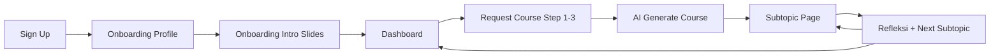
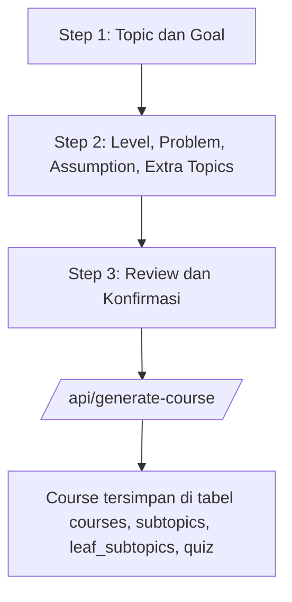
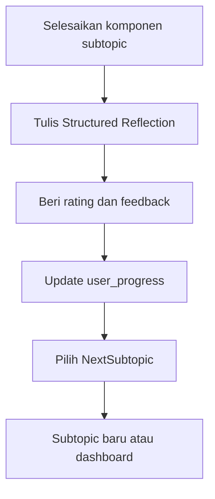

# User Journey — Alur Pengalaman Belajar Siswa SMA

Dokumentasi perjalanan lengkap mahasiswa peserta riset di PrincipleLearn V3, dari
sudut pandang pedagogis dan pengumpulan data tesis. Dokumen ini menggantikan versi
lama yang belum mencakup onboarding dua tahap dan komponen subtopic terbaru.

> Tanggal pembaruan: 2026-04-26
> Cakupan: jalur produksi yang aktif untuk pengumpulan data tesis (RM2 dan RM3).
> Modul Discussion tidak diuraikan karena tidak dipakai pada periode pengumpulan.
> Lihat [`APPLICATION_OVERVIEW.md`](./APPLICATION_OVERVIEW.md) untuk konteks modul.

Referensi pelengkap:

- [`docs/feature-flows.md`](../feature-flows.md) — flow per fitur pada level UI
- [`docs/DATABASE_SCHEMA.md`](../DATABASE_SCHEMA.md) — definisi tabel data riset
- [`ADMIN_RM2_RM3_DATA_COMPLETENESS.md`](./ADMIN_RM2_RM3_DATA_COMPLETENESS.md) —
  status kelengkapan data per tabel

---

## Daftar Isi

1. [Overview Journey](#overview-journey)
2. [Fase 1: Sign Up dan Onboarding Dua Tahap](#fase-1-sign-up-dan-onboarding-dua-tahap)
3. [Fase 2: Request Course dan Generation](#fase-2-request-course-dan-generation)
4. [Fase 3: Active Learning per Subtopic](#fase-3-active-learning-per-subtopic)
5. [Fase 4: Refleksi dan Lanjut Subtopic](#fase-4-refleksi-dan-lanjut-subtopic)
6. [Touchpoint Data Riset per Fase](#touchpoint-data-riset-per-fase)
7. [Persona Singkat](#persona-singkat)
8. [Skenario Journey Lengkap](#skenario-journey-lengkap)

---

## Overview Journey

### Lima Fase Aktual

| Fase | Nama | Tujuan Pedagogis | Estimasi Waktu | Tabel Riset Utama |
| --- | --- | --- | --- | --- |
| 1 | Sign Up + Onboarding Dua Tahap | Baseline profil dan orientasi cara belajar | 8–12 menit | `users`, `learning_profiles` |
| 2 | Request Course + Generation | Personalisasi dan rumusan kebutuhan | 5–8 menit | `courses`, `subtopics`, `course_generation_activity` |
| 3 | Active Learning per Subtopic | Konstruksi pemahaman + jejak prompt | 30–60 menit / sesi | `ask_question_history`, `challenge_responses`, `quiz_submissions`, `prompt_classifications` |
| 4 | Refleksi + Lanjut Subtopic | Konsolidasi metakognitif | 5–15 menit | `jurnal`, `feedback`, `user_progress` |
| 5 | Sesi Lanjutan (longitudinal) | Perkembangan multi-sesi | berulang | `learning_sessions`, `auto_cognitive_scores` |

### Diagram Tinggi

---

## Fase 1: Sign Up dan Onboarding Dua Tahap

Setelah sign up, siswa wajib menyelesaikan dua tahap onboarding sebelum boleh
mengakses dashboard. Middleware enforces urutan ini supaya baseline data tersedia
bagi analisis longitudinal.

### Tahap 1A — Profile Wizard

- Halaman: [`/onboarding`](../../src/app/onboarding/page.tsx)
- Tujuan: menggali prior knowledge, learning goal, dan preferensi gaya belajar.
- Output data: satu baris di `learning_profiles` (saat ini 6 baris aktif).
- Indikator yang distimulasi:
  - CTh Self-Regulation (mahasiswa menyadari apa yang sudah dan belum diketahui).
  - CT Decomposition (memecah kebutuhan belajar menjadi item terstruktur).

### Tahap 1B — Intro Slides Edukatif

- Halaman: [`/onboarding/intro`](../../src/app/onboarding/intro/page.tsx)
- Tujuan: orientasi cara berinteraksi reflektif dengan AI; penjelasan bahwa AI
  bukan oracle, melainkan partner berpikir.
- Output data: flag `intro_slides_completed` di `learning_profiles` plus cookie
  gate (lihat commit `9d772a8`).
- Tidak menghasilkan data berpikir, tetapi menjadi syarat metodologis agar
  semua partisipan menerima pengantar yang sama.

### Mengapa wajib dua tahap?

> Profile wizard menetapkan baseline kognitif yang menjadi pembanding untuk
> analisis longitudinal RM2. Intro slides memastikan kontaminasi instruksi
> awal terkendali — jadi variasi gaya prompt antar siswa berasal dari
> perbedaan individual, bukan perbedaan paparan tutorial.

---

## Fase 2: Request Course dan Generation

### Alur Tiga Langkah

State antar-langkah dipegang oleh `RequestCourseContext`. Hasil generasi:

| Tabel | Yang ditulis |
| --- | --- |
| `courses` | satu baris per course (33 baris total per 2026-04-26) |
| `subtopics` | umumnya 4–6 modul per course (157 baris total) |
| `leaf_subtopics` | unit terkecil yang dipakai siswa (106 baris total) |
| `quiz` | 3–6 soal per leaf subtopic (685 baris total) |
| `course_generation_activity` | satu baris audit per generasi (38 baris total) |

### Indikator yang Distimulasi pada Fase 2

- CT: Self-Regulation, Analysis (form Step 1–2).
- CTh: Decomposition, Abstraction, Pattern Recognition (problem statement dan
  extra topics).

---

## Fase 3: Active Learning per Subtopic

Halaman [`/course/[courseId]/subtopic`](../../src/app/course/[courseId]/subtopic/)
menampilkan satu leaf subtopic sekaligus dengan komponen-komponen berikut. Setiap
komponen mencatat data ke tabel riset yang berbeda.

### Komponen Subtopic dan Touchpoint Data

| Urutan tampilan | Komponen | Aksi siswa | Data yang direkam |
| --- | --- | --- | --- |
| 1 | Konten subtopic | Membaca materi, scroll | (telemetri ringan, `subtopic_cache`) |
| 2 | `Examples` | Memilih atau request contoh tambahan | `example_usage_events` (18 baris) |
| 3 | `AskQuestion` | Menulis pertanyaan, AI streaming jawaban | `ask_question_history` (17 baris) + `prompt_classifications` (143 baris) |
| 4 | `ChallengeThinking` | Menerima tantangan, menjawab, mendapat feedback | `challenge_responses` (15 baris) |
| 5 | `Quiz` | Menjawab 3–6 soal, lihat skor instan | `quiz_submissions` (255 baris) |
| 6 | `StructuredReflection` | Menulis refleksi terstruktur | `jurnal` (43 baris), `feedback` (40 baris) |
| 7 | `KeyTakeaways` | Membaca/menyalin ringkasan | dari `subtopic_cache` (109 baris) |
| 8 | `PromptBuilder` + `PromptTimeline` | Membangun prompt yang lebih baik, melihat evolusi tahap | input ke classifier; visualisasi dari `prompt_classifications` |
| 9 | `ReasoningNote` | Catatan alur penalaran sebelum bertanya | metadata pada `ask_question_history` |
| 10 | `WhatNext` | Menyimpulkan dan call-to-action | — |
| 11 | `NextSubtopics` | Memilih subtopic lanjutan | `user_progress` (13 baris) |

Komponen `AILoadingIndicator`, `HelpDrawer`, dan `ProductTour` mendukung UX dan
tidak menghasilkan data analitis.

### Endpoint AI yang Aktif

| Endpoint | Stream? | Tabel Tujuan |
| --- | --- | --- |
| `/api/generate-course` | tidak | `courses`, `subtopics`, `leaf_subtopics`, `quiz` |
| `/api/generate-subtopic` | tidak | `subtopic_cache` |
| `/api/generate-examples` | tidak | `example_usage_events` |
| `/api/ask-question` | ya | `ask_question_history` (+ classifier) |
| `/api/challenge-thinking` | ya | `challenge_responses` |
| `/api/challenge-feedback` | tidak | metadata pada `challenge_responses` |
| `/api/discussion/start`, `/api/discussion/respond` | ya | tidak dipakai untuk tesis |

### Indikator yang Distimulasi pada Fase 3

- CTh Analysis, Explanation, Self-Regulation: `AskQuestion`, `ReasoningNote`.
- CTh Evaluation, Inference: `ChallengeThinking`, `Quiz` (item evaluasi pasca-skor).
- CT Pattern Recognition, Algorithmic Thinking, Debugging: `Quiz`, `Examples`.
- CT Abstraction, Decomposition: `PromptBuilder`, `PromptTimeline`,
  `KeyTakeaways`.

Lihat [`THINKING_SKILL.md`](./THINKING_SKILL.md) dan
[`ASSESSMENT_RUBRIC.md`](./ASSESSMENT_RUBRIC.md) untuk detail rubrik per
indikator.

---

## Fase 4: Refleksi dan Lanjut Subtopic

Refleksi diarahkan oleh prompt terstruktur (`StructuredReflection`) yang memandu
siswa pada pertanyaan What — So What — Now What. Ini menghasilkan teks refleksi
yang dapat dianalisis untuk indikator Self-Regulation dan Explanation.

---

## Touchpoint Data Riset per Fase

Tabel ini meringkas dari titik mana di journey peneliti dapat menarik bukti
untuk setiap RM. Status data ringkasan per 2026-04-26 ditampilkan di
[`ADMIN_RM2_RM3_DATA_COMPLETENESS.md`](./ADMIN_RM2_RM3_DATA_COMPLETENESS.md).

| Fase | Touchpoint | Tabel | Untuk RM | Status |
| --- | --- | --- | --- | --- |
| 1 | Profile wizard submit | `learning_profiles` | RM1 (baseline), RM2 | aktif (6 baris) |
| 2 | Request Course form | `course_generation_activity` | RM2 (baseline rumusan) | aktif (38) |
| 3 | Ask Question | `ask_question_history` + `prompt_classifications` | RM2, RM3 | aktif (17 / 143) |
| 3 | Challenge Response | `challenge_responses` | RM3 | aktif (15) |
| 3 | Quiz Submit | `quiz_submissions` | RM3 | aktif (255) |
| 3 | Examples used | `example_usage_events` | RM3 | aktif (18) |
| 4 | Refleksi disimpan | `jurnal` | RM3 | aktif (43) |
| 4 | Feedback subtopic | `feedback` | RM3 | aktif (40) |
| 4 | Progress update | `user_progress` | RM2 longitudinal | aktif (13) |
| 5 | Sesi belajar terbentuk | `learning_sessions` | RM2 longitudinal | aktif (22) |
| 5 | Auto-coded indicator | `auto_cognitive_scores` | RM3 | aktif (12) |
| 5 | Bukti kode terkurasi | `research_evidence_items` | RM2, RM3 | aktif (261) |
| 5 | Triangulasi | `triangulation_records` | RM2, RM3 | aktif (64) |
| — | Inter-rater reliability | `inter_rater_reliability` | kualitas coding | kosong (perlu dijalankan) |
| — | Transcript | `transcript` | tidak dipakai | kosong |

---

## Persona Singkat

Persona dirumuskan dari karakteristik partisipan riset yang sebenarnya
(siswa SMA Fase E, n = 29 per 2026-04-26).

### Persona A: Pemula Eksploratif

- Latar: belum pernah ngoding, baru kenal konsep algoritma.
- Pola prompt awal: SCP (single concept prompt), pertanyaan ya/tidak.
- Kebutuhan scaffolding: tinggi pada `Examples` dan `KeyTakeaways`.
- Hipotesis lintasan RM2: SCP → SRP setelah 2–3 sesi jika diberi `PromptBuilder`.

### Persona B: Pengulang Reflektif

- Latar: sudah pernah belajar dasar Informatika; ingin memperdalam algoritma.
- Pola prompt awal: SRP (re-formulated prompt), kadang langsung MQP.
- Kebutuhan scaffolding: sedang; intensif pada `ChallengeThinking`.
- Hipotesis lintasan RM2: SRP → MQP → Reflective dalam 4–5 sesi.

### Persona C: Cepat Stagnan

- Latar: rajin bertanya tetapi prompt tidak berkembang strukturnya.
- Pola prompt awal dan akhir: tetap SCP.
- Kebutuhan scaffolding: pendampingan eksplisit + intervensi `ReasoningNote`.
- Hipotesis lintasan RM2: kandidat key case untuk wawancara pendalaman.

---

## Skenario Journey Lengkap

### Skenario: Siswa SMA Belajar Algoritma Sederhana

**Profil**: Rina, kelas X SMA, mengikuti riset selama empat sesi.

#### Sesi 1 (Hari ke-1, 70 menit)

| Waktu | Aktivitas | Detail |
| --- | --- | --- |
| 0:00 | Sign up | Email kampus |
| 1:00 | Onboarding Profile | Mengisi prior knowledge: "tahu konsep loop dasar" |
| 5:00 | Onboarding Intro | Membaca 4 slide tentang cara berdialog dengan AI |
| 8:00 | Request Course | Topic "Algoritma Pencarian", Goal "paham linear search", Level Beginner |
| 12:00 | Course di-generate | 5 modul, 22 leaf subtopic |
| 13:00 | Subtopic 1.1 | Membaca konten, lihat 2 contoh |
| 20:00 | AskQuestion | "Apa beda linear dan binary search?" → tercatat sebagai SCP |
| 25:00 | ChallengeThinking | "Linear search selalu lebih lambat?" → menjawab → revisi pemahaman |
| 35:00 | Quiz | 4 soal → skor 3/4 |
| 45:00 | StructuredReflection | "Saya baru sadar binary search butuh data terurut" |
| 55:00 | Feedback | Rating 4/5, "contoh sangat membantu" |
| 60:00 | NextSubtopic | Pilih 1.2 |

#### Sesi 4 (Hari ke-7, 50 menit)

| Waktu | Aktivitas | Detail |
| --- | --- | --- |
| 0:00 | Resume di subtopic 2.3 | |
| 5:00 | AskQuestion | Tiga pertanyaan berlapis tentang sorting → tercatat sebagai MQP |
| 15:00 | PromptBuilder | Memakai builder, hasilnya prompt reflektif tentang trade-off |
| 20:00 | ChallengeThinking | Menjawab dengan analogi original |
| 30:00 | Quiz | 5 soal → skor 5/5 |
| 35:00 | StructuredReflection | Refleksi 4 paragraf tentang strategi belajar pribadi |
| 45:00 | Feedback | Rating 5/5 |

**Lintasan RM2 yang teramati**: SCP (sesi 1) → SRP (sesi 2) → MQP (sesi 3) →
Reflective (sesi 4). Pola ini menjadi salah satu data input bagi
`prompt_classifications` dan `triangulation_records`.

---

## Metrik Keberhasilan Journey untuk Tesis

| Metrik | Cara Pengukuran | Sumber Data |
| --- | --- | --- |
| Kelengkapan onboarding | Persen siswa dengan `intro_slides_completed = true` | `learning_profiles` |
| Kelengkapan sesi belajar | Jumlah `learning_sessions` per siswa per minggu | `learning_sessions` |
| Kekayaan prompt | Distribusi `prompt_stage` lintas sesi per siswa | `prompt_classifications` |
| Manifestasi CT/CTh | Skor 0/1/2 per indikator | `cognitive_indicators`, `auto_cognitive_scores` |
| Kualitas refleksi | Panjang dan kedalaman jurnal | `jurnal` |
| Konsistensi triangulasi | Rasio finding dengan bukti dari ≥2 sumber | `triangulation_records`, `research_evidence_items` |
